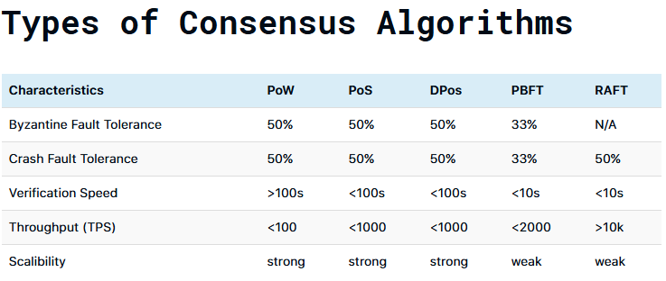
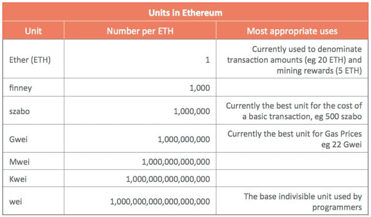
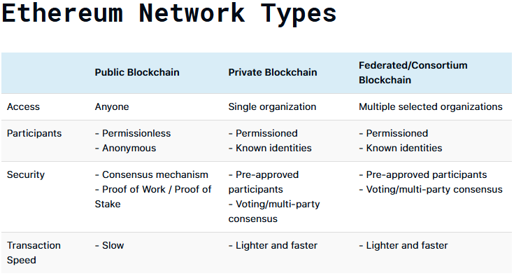
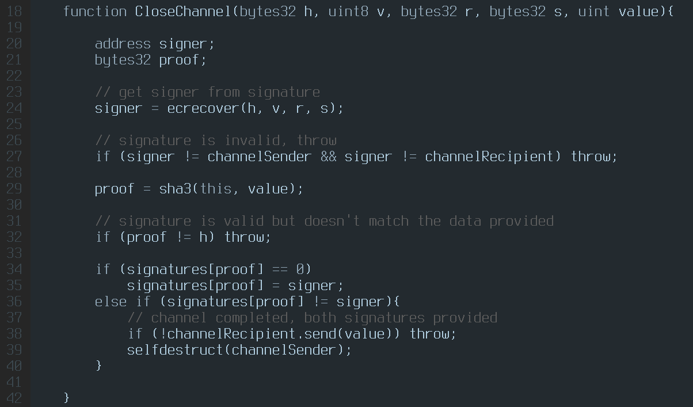
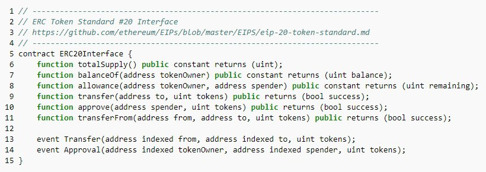
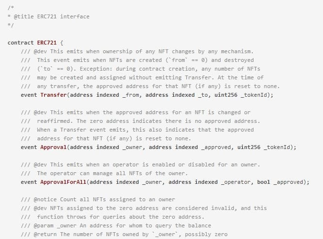
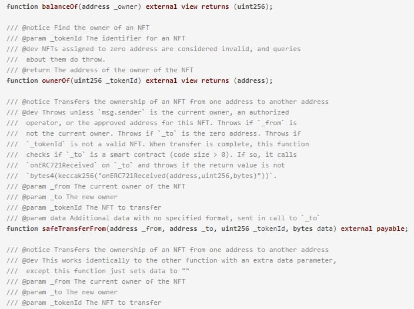
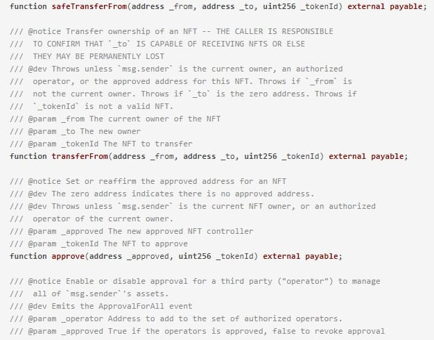
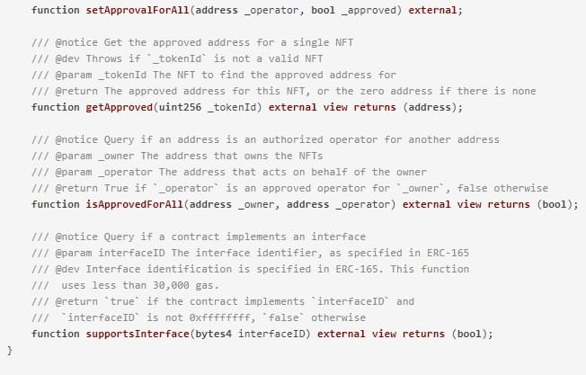
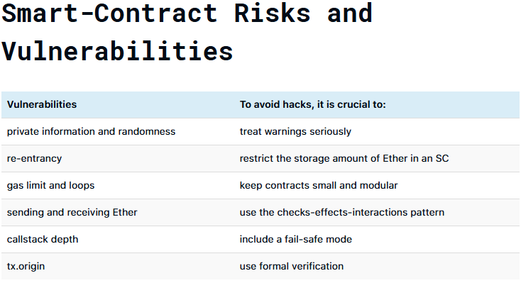

# Golang Interview Questions & Answers

### Questions

| No. | Questions                                                                                                                                                                                                                        |
| --- | -------------------------------------------------------------------------------------------------------------------------------------------------------------------------------------------------------------------------------- |
|     | **Behavioural Questions**                                                                                                                                                                                                                   
| 1   | [What is GoLang?](#What-is-GoLang)
| 2   | [Mention a few benefits of GoLang over other programming languages.](#Mention-a-few-benefits-of-GoLang-over-other-programming-languages)
| 3   | [What data types does GoLang offers?](#What-data-types-does-GoLang-offers)
| 4   | [How will you describe the scope of variables in GoLang?](#How-will-you-describe-the-scope-of-variables-in-GoLang)
| 5   | [Write the output of the following code.](#Write-the-output-of-the-following-code)
| 6   | [Is GoLang a case-sensitive language?](#Is-GoLang-a-case-sensitive-language)
| 7   | [Can you declare variables of different types in a single line of GoLang code?](#Can-you-declare-variables-of-different-types-in-a-single-line-of-GoLang-code)
| 8   | [Suppose that you have developed a GoLang program on Windows. Now you want to compile that program on any other operating system. Will it run?](#Suppose-that-you-have-developed-a-GoLang-program-on-Windows-Now-you-want-to-compile-that-program-on-any-other-operating-system-Will-it-run)
| 9   | [Is it possible to change any particular character in a String of a GoLang program?](#Is-it-possible-to-change-any-particular-character-in-a-String-of-a-GoLang-program)
| 10   | [Write the output of the following GoLang code.](#Write-the-output-of-the-following-GoLang-code)
| 11   | [Give the value of slice_example of the below code.](#Give-the-value-of-slice_example-of-the-below-code)
| 12   | [How arrays in GoLang are different from other programming languages?](#How-arrays-in-GoLang-are-different-from-other-programming-languages)
| 13   | [What is GoLang Workspace?](#What-is-GoLang-Workspace)
| 14   | [Are packages in GoLang same as other languages? Please explain.](#Are-packages-in-GoLang-same-as-other-languages-Please-explain)
| 15   | [Briefly explain Goroutines.](#Briefly-explain-Goroutines)
| 16   | [How does ‘Slice’ work in GoLang?](#How-does-Slice-work-in-GoLang)
| 17   | [Explain various aspects of Go Interfaces.](#Explain-various-aspects-of-Go-Interfaces)
| 18   | [Give the syntax of the ‘for’ loop in GoLang?](#Give-the-syntax-of-the-for-loop-in-GoLang)
| 19   | [Describe the CGo keyword in GoLang.](#Describe-the-CGo-keyword-in-GoLang)
| 20   | [Which data type would you use for concurrent data access? Why?](#Which-data-type-would-you-use-for-concurrent-data-access-Why)
| 21   | [How would you explain GoLang Methods?](#How-would-you-explain-GoLang-Methods)
| 22   | [Explain GoLang pointers in detail. Give its advantages.](#Explain-GoLang-pointers-in-detail-Give-its-advantages)
| 23   | [Write a GoLang code to compare two slices.](#Write-a-GoLang-code-to-compare-two-slices)
| 24   | [Explain Shadowing using an example.](#Explain-Shadowing-using-an-example)
| 25   | [Write a GoLang program to print the xth Fibonacci series.](#Write-a-GoLang-program-to-print-the-xth-Fibonacci-series)
| 26   | [How do you copy the value of the Map variable in GoLang?](#How-do-you-copy-the-value-of-the-Map-variable-in-GoLang)
| 27   | [Give a function that reverses a slice of integers.](#Give-a-function-that-reverses-a-slice-of-integers)
| 28   | [What is constants? Explain its types.](#What-is-constants-Explain-its-types)
| 29   | [Do you have the option to return multiple values from a function in GoLang?](#Do-you-have-the-option-to-return-multiple-values-from-a-function-in-GoLang)
| 30   | [How are errors handled in GoLang?](#How-are-errors-handled-in-GoLang)
| 31   | [How will you copy the values of a slice in GoLang?](#How-will-you-copy-the-values-of-a-slice-in-GoLang)
| 32   | [Write a Golang program to check if a number is prime.](#Write-a-Golang-program-to-check-if-a-number-is-prime)
| 33   | [Write a Golang program to find the factorial of a number.](#Write-a-Golang-program-to-find-the-factorial-of-a-number)
| 34   | [Write a Golang program to reverse a string.](#Write-a-Golang-program-to-reverse-a-string)
| 35   | [Write a Golang program to find the largest element in an array.](#Write-a-Golang-program-to-find-the-largest-element-in-an-array)
| 36   | [Write a Golang program to find the sum of digits of a number.](#Write-a-Golang-program-to-find-the-sum-of-digits-of-a-number)
| 37   | [Write a Golang program to generate the Fibonacci series up to n terms.](#Write-a-Golang-program-to-generate-the-Fibonacci-series-up-to-n-terms)
| 38   | [Write a Golang program to check if a number is an Armstrong number.](#Write-a-Golang-program-to-check-if-a-number-is-an-Armstrong-number)
| 39   | [Write a Golang program to check if a string is a palindrome.](#Write-a-Golang-program-to-check-if-a-string-is-a-palindrome)
| 40   | [Write a Golang program to swap two numbers without using a temporary variable.](#Write-a-Golang-program-to-swap-two-numbers-without-using-a-temporary-variable)
| 41   | [What is Golang used for?](#What-is-Golang-used-for)
| 42   | [What are the several built in support in go?](#What-are-the-several-built-in-support-in-go)
| 43   | [Why is go often called a post oop language?](#Why-is-go-often-called-a-post-oop-language)
| 44   | [What is Golang, and why is it used?](#What-is-Golang-and-why-is-it-used)
| 45   | [Can you explain the syntax of a basic Go program?](#Can-you-explain-the-syntax-of-a-basic-Go-program)
| 46   | [What are Slices in Go?](#What-are-Slices-in-Go)
| 47   | [How does Go handle variable declaration and initialization?](#How-does-Go-handle-variable-declaration-and-initialization)
| 48   | [What is a goroutine in Go?](#What-is-a-goroutine-in-Go)
| 49   | [Can you explain the concept of channels in Go?](#Can-you-explain-the-concept-of-channels-in-Go)
| 50  | [What are packages in Go, and how are they used?](#What-are-packages-in-Go-and-how-are-they-used)
| 51  | [How does Go handle error reporting and handling?](#How-does-Go-handle-error-reporting-and-handling)
| 52  | [What are the key differences between Go and other programming languages like Java or Python?](#What-are-the-key-differences-between-Go-and-other-programming-languages-like-Java-or-Python)
| 53  | [Can you describe the garbage collection process in Go?](#Can-you-describe-the-garbage-collection-process-in-Go)
| 54  | [What are maps in Go?](#What-are-maps-in-Go)
| 55  | [How does Go achieve concurrency?](#How-does-Go-achieve-concurrency)
| 56  | [Can you explain the use of interfaces in Go?](#Can-you-explain-the-use-of-interfaces-in-Go)
| 57  | [What is a pointer in Go, and how is it used?](#What-is-a-pointer-in-Go-and-how-is-it-used)
| 58  | [Describe the scope rules in Go.](#Describe-the-scope-rules-in-Go)
| 59  | [What is Golang and why is it preferred for certain applications?](#What-is-Golang-and-why-is-it-preferred-for-certain-applications)
| 60  | [How does Golang's syntax differ from Java's?](#How-does-Golangs-syntax-differ-from-Javas)
| 61  | [Can you explain the concept of Goroutines in Golang?](#Can-you-explain-the-concept-of-Goroutines-in-Golang)
| 62  | [What are the advantages of using Golang for web development?](#What-are-the-advantages-of-using-Golang-for-web-development)
| 63  | [How does Golang handle type inheritance?](#How-does-Golang-handle-type-inheritance)
| 64  | [What is a slice in Golang and how is it different from an array?](#What-is-a-slice-in-Golang-and-how-is-it-different-from-an-array)
| 65  | [Can you describe Golang's garbage collection mechanism?](#Can-you-describe-Golangs-garbage-collection-mechanism)
| 66  | [How do you manage dependencies in a Golang project?](#How-do-you-manage-dependencies-in-a-Golang-project)
| 67  | [What are channels in Golang and how do they work?](#What-are-channels-in-Golang-and-how-do-they-work)
| 68  | [How does Golang implement interfaces and how does it differ from Java?](#How-does-Golang-implement-interfaces-and-how-does-it-differ-from-Java)
| 69  | [What is the purpose of the defer statement in Golang?](#What-is-the-purpose-of-the-defer-statement-in-Golang)
| 70  | [Can you explain the concept of 'zero values' in Golang?](#Can-you-explain-the-concept-of-zero-values-in-Golang)
| 71  | [How do you write unit tests in Golang?](#How-do-you-write-unit-tests-in-Golang)
| 72  | [What is a map in Golang and how do you use it?](#What-is-a-map-in-Golang-and-how-do-you-use-it)
| 73  | [How do you handle errors in Golang?](#How-do-you-handle-errors-in-Golang)
| 74  | [Can you explain the package management system in Golang?](#Can-you-explain-the-package-management-system-in-Golang)
| 75  | [How does Golang achieve concurrency and how is it different from parallelism?](#How-does-Golang-achieve-concurrency-and-how-is-it-different-from-parallelism)
| 76  | [What are structs in Golang and how do you use them?](#What-are-structs-in-Golang-and-how-do-you-use-them)
| 77  | [How do you implement custom types in Golang?](#How-do-you-implement-custom-types-in-Golang)
| 78  | [What are the common tools used for profiling and debugging Golang applications?](#What-are-the-common-tools-used-for-profiling-and-debugging-Golang-applications)
| 79  | [How do you format code in Golang?](#How-do-you-format-code-in-Golang)
| 80  | [What is the significance of the main function in Golang?](#What-is-the-significance-of-the-main-function-in-Golang)
| 81  | [How does Golang handle memory allocation?](#How-does-Golang-handle-memory-allocation)
| 82  | [Can you explain the concept of pointers in Golang?](#Can-you-explain-the-concept-of-pointers-in-Golang)
| 83  | [How does interface polymorphism work in Golang?](#How-does-interface-polymorphism-work-in-Golang)
| 84  | [How does Golang's concurrency model differ from Java's threading model?](#How-does-Golangs-concurrency-model-differ-from-Javas-threading-model)
| 85  | [Can you explain how to implement microservices in Golang?](#Can-you-explain-how-to-implement-microservices-in-Golang)
| 86  | [What are the best practices for error handling in Golang for large-scale applications?](#What-are-the-best-practices-for-error-handling-in-Golang-for-large-scale-applications)
| 87  | [How does Golang's interface embedding differ from Java's interface inheritance?](#How-does-Golangs-interface-embedding-differ-from-Javas-interface-inheritance)
| 88  | [What are the challenges of garbage collection in Golang and how does it manage them?](#What-are-the-challenges-of-garbage-collection-in-Golang-and-how-does-it-manage-them)
| 89  | [Can you discuss the performance implications of using reflection in Golang?](#Can-you-discuss-the-performance-implications-of-using-reflection-in-Golang)
| 90  | [How does Golang optimize for low-latency network programming?](#How-does-Golang-optimize-for-low-latency-network-programming)
| 91  | [What are the strategies for effective memory management in high-performance Golang applications?](#What-are-the-strategies-for-effective-memory-management-in-high-performance-Golang-applications)
| 92  | [How do you implement design patterns in Golang, such as the singleton or factory pattern?](#How-do-you-implement-design-patterns-in-Golang-such-as-the-singleton-or-factory-pattern)
| 93  | [Can you explain Golang's approach to concurrency with real-world examples?](#Can-you-explain-Golangs-approach-to-concurrency-with-real-world-examples)
| 94  | [How do you manage database connections effectively in Golang?](#How-do-you-manage-database-connections-effectively-in-Golang)
| 95  | [What are the common pitfalls in Golang's concurrency mechanisms like Goroutines and channels?](#What-are-the-common-pitfalls-in-Golangs-concurrency-mechanisms-like-Goroutines-and-channels)
| 96  | [How do you ensure type safety in Golang without generics?](#How-do-you-ensure-type-safety-in-Golang-without-generics)
| 97  | [What are the best practices for structuring a large-scale Golang codebase?](#What-are-the-best-practices-for-structuring-a-large-scale-Golang-codebase)
| 98  | [How do you optimize Golang code for CPU and memory efficiency?](#How-do-you-optimize-Golang-code-for-CPU-and-memory-efficiency)
| 99  | [Can you discuss advanced features in Golang's standard library that are not commonly known?](#Can-you-discuss-advanced-features-in-Golangs-standard-library-that-are-not-commonly-known)
| 100  | [How do you integrate Golang with other languages, such as Java or Python?](#How-do-you-integrate-Golang-with-other-languages-such-as-Java-or-Python)
| 101  | [What are the techniques for effective logging and monitoring in Golang applications?](#What-are-the-techniques-for-effective-logging-and-monitoring-in-Golang-applications)
| 102  | [How does Golang manage cross-platform compatibility and deployment?](#How-does-Golang-manage-cross-platform-compatibility-and-deployment)
| 103  | [Can you explain advanced testing techniques in Golang, like benchmarking and fuzz testing?](#Can-you-explain-advanced-testing-techniques-in-Golang-like-benchmarking-and-fuzz-testing)
| 104  | [How do you handle high-throughput, low-latency networking in Golang?](#How-do-you-handle-high-throughput-low-latency-networking-in-Golang)
| 105  | [What are the advanced features of Golang's garbage collector?](#What-are-the-advanced-features-of-Golangs-garbage-collector)
| 106  | [How do you implement secure coding practices in Golang?](#How-do-you-implement-secure-coding-practices-in-Golang)
| 107  | [Can you discuss Golang's approach to dependency management and versioning?](#Can-you-discuss-Golangs-approach-to-dependency-management-and-versioning)
| 108  | [How does Golang handle parallelism differently from concurrency, and what are the implications for application design?](#How-does-Golang-handle-parallelism-differently-from-concurrency-and-what-are-the-implications-for-application-design)
| 109  | [What is the Go programming language?](#What-is-the-Go-programming-language)
| 110  | [Why should you use the Go programming language?](#Why-should-you-use-the-Go-programming-language)
| 111  | [Who is known as the father of the Go programming language?](#Who-is-known-as-the-father-of-the-Go-programming-language)
| 112  | [What are packages in a Go program?](#What-are-packages-in-a-Go-program)
| 113  | [Does Go support general-purpose programming?](#Does-Go-support-general-purpose-programming)
| 114  | [Is Go case sensitive?](#Is-Go-case-sensitive)
| 115  | [What is a string literal in Go programming?](#What-is-a-string-literal-in-Go-programming)
| 116  | [What is a workspace in Go?](#What-is-a-workspace-in-Go)
| 117  | [What is the GOPATH environment variable in Go programming?](#What-is-the-GOPATH-environment-variable-in-Go-programming)
| 118  | [What are the advantages / benefits of the Go programming language?](#What-are-the-advantages--benefits-of-the-Go-programming-language)
| 119  | [What is the built-in support for Go?](#What-is-the-built-in-support-for-Go)
| 120  | [What is a goroutine in the Go programming language?](#What-is-a-goroutine-in-the-Go-programming-language)
| 121  | [How to write multiple lines in Go programming?](#How-to-write-multiple-lines-in-Go-programming)
| 122  | [How is the break statement used in the Go programming language?](#How-is-the-break-statement-used-in-the-Go-programming-language)
| 123  | [How is the continue statement used in the Go programming language?](#How-is-the-continue-statement-used-in-the-Go-programming-language)
| 124  | [How is the goto statement used in the Go programming language?](#How-is-the-goto-statement-used-in-the-Go-programming-language)
| 125  | [Explain the syntax of the for loop.](#Explain-the-syntax-of-the-for-loop)
| 126  | [Write a syntax for creating a function in the Go programming language?](#Write-a-syntax-for-creating-a-function-in-the-Go-programming-language)
| 127  | [Explain the static type declaration of a variable in the Go programming language?](#Explain-the-static-type-declaration-of-a-variable-in-the-Go-programming-language)
| 128  | [How to swap two values? Give some examples.](#How-to-swap-two-values-Give-some-examples)
| 129  | [How to copy a fragment, map and interface?](#How-to-copy-a-fragment-map-and-interface)
| 130  | [How do the two structures compare? What about two interfaces? Give examples.](#How-do-the-two-structures-compare-What-about-two-interfaces-Give-examples)
| 131  | [What is syntax in the Go programming language?](#What-is-syntax-in-the-Go-programming-language)
| 132  | [What are Go interfaces?](#What-are-Go-interfaces)
| 133  | [What is a type assertion in Go? What does it do?](#What-is-a-type-assertion-in-Go-What-does-it-do)
| 134  | [What methods are there in the Go programming language?](#What-methods-are-there-in-the-Go-programming-language)
| 135  | [How can you check the type of a variable at runtime in the Go programming language?](#How-can-you-check-the-type-of-a-variable-at-runtime-in-the-Go-programming-language)
| 136  | [Is it recommended to use global variables in a program that implements go routines?](#Is-it-recommended-to-use-global-variables-in-a-program-that-implements-go-routines)
| 137  | [What do you know about modular programming?](#What-do-you-know-about-modular-programming)
| 138  | [What is Go?](#What-is-Go)
| 139  | [What are the key features of the Go language?](#What-are-the-key-features-of-the-Go-language)
| 140  | [What is dynamic type variable declaration in Golang?](#What-is-dynamic-type-variable-declaration-in-Golang)
| 141  | [What are packages in Golang?](#What-are-packages-in-Golang)
| 142  | [What is static type variable declaration in Go?](#What-is-static-type-variable-declaration-in-Go)
| 143  | [What are the two crucial operators used in Golang?](#What-are-the-two-crucial-operators-used-in-Golang)
| 144  | [What are the constants in Golang?](#What-are-the-constants-in-Golang)
| 145  | [What are pointers in Go?](#What-are-pointers-in-Go)
| 146  | [Name the different Golang operators.](#Name-the-different-Golang-operators)
| 147  | [What are the various data types used in Golang?](#What-are-the-various-data-types-used-in-Golang)
| 148  | [What is the scope of a variable in Golang?](#What-is-the-scope-of-a-variable-in-Golang)
| 149  | [What are the methods in Golang?](#What-are-the-methods-in-Golang)
| 150  | [Is Go language case-sensitive?](#Is-Go-language-case-sensitive)
| 151  | [What are the three directories of Go Workspace?](#What-are-the-three-directories-of-Go-Workspace)
| 152  | [What are the advantages of Golang?](#What-are-the-advantages-of-Golang)
| 153  | [Why is Golang so popular?](#Why-is-Golang-so-popular)
| 154  | [What is the use of the ‘init’ function Golang?](#What-is-the-use-of-the-init-function-Golang)
| 155  | [What are Golang's different decision-making statements?](#What-are-Golangs-different-decision-making-statements)
| 156  | [What is the role of a slice in Golang?](#What-is-the-role-of-a-slice-in-Golang)
| 157  | [What is the use of the GOROOT variable in Golang?](#What-is-the-use-of-the-GOROOT-variable-in-Golang)
| 158  | [What are goroutines?](#What-are-goroutines)
| 159  | [What is the latest version of the Go language?](#What-is-the-latest-version-of-the-Go-language)
| 160  | [What are the new features of the latest version of Golang?](#What-are-the-new-features-of-the-latest-version-of-Golang)
| 161  | [What is CI/CD workflow?](#What-is-CICD-workflow)
| 162  | [What is the procedure involved in developing a RESTful API using Golang?](#What-is-the-procedure-involved-in-developing-a-RESTful-API-using-Golang)
| 163  | [What are Bootstrap and material design?](#What-are-Bootstrap-and-material-design)
| 164  | [Name some crucial packages in Golang.](#Name-some-crucial-packages-in-Golang)
| 165  | [Explain concurrency in Golang.](#Explain-concurrency-in-Golang)
| 166  | [Explain Structures in Golang.](#Explain-Structures-in-Golang)
| 167  | [Why do you use the Goto statement in Golang?](#Why-do-you-use-the-Goto-statement-in-Golang)
| 168  | [Why do you use break statements in Golang?](#Why-do-you-use-break-statements-in-Golang)
| 169  | [What is the channel in Golang?](#What-is-the-channel-in-Golang)
| 170  | [What type of conversion is supported by Golang?](#What-type-of-conversion-is-supported-by-Golang)
| 171  | [What is the use of select statements in Golang?](#What-is-the-use-of-select-statements-in-Golang)
| 172  | [Does Golang support inheritance property?](#Does-Golang-support-inheritance-property)
| 173  | [How will you perform testing in Golang?](#How-will-you-perform-testing-in-Golang)
| 174  | [How do you check the variable type at runtime in Golang?](#How-do-you-check-the-variable-type-at-runtime-in-Golang)
| 175  | [What is the use of CGo in Golang?](#What-is-the-use-of-CGo-in-Golang)
| 176  | [How will you compare two structures in Go?](#How-will-you-compare-two-structures-in-Go)
| 177  | [Does Go support optional parameters?](#Does-Go-support-optional-parameters)
| 178  | [Does Golang have exceptions?](#Does-Golang-have-exceptions)
| 179  | [Compare buffered and unbuffered channels in Golang.](#Compare-buffered-and-unbuffered-channels-in-Golang)
| 180  | [What are rvalue and lvalue in Golang?](#What-are-rvalue-and-lvalue-in-Golang)
| 181  | [What are function closures in Golang?](#What-are-function-closures-in-Golang)
| 182  | [Why do you use the Rune data type in Golang?](#Why-do-you-use-the-Rune-data-type-in-Golang)
| 183  | [Why don’t maps allow slices as keys?](#Why-dont-maps-allow-slices-as-keys)
| 184  | [How can you increase the performance of Golang programs?](#How-can-you-increase-the-performance-of-Golang-programs)
| 185  | [Explain: Microservices architecture](#Explain-Microservices-architecture)
| 186  | [Can you perform demand-driven design with Go?](#Can-you-perform-demand-driven-design-with-Go)
| 187  | [Why do you build microservices with event sourcing or CQRS in Golng?](#Why-do-you-build-microservices-with-event-sourcing-or-CQRS-in-Golng)
| 188  | [How would you model a set in Golang?](#How-would-you-model-a-set-in-Golang)
| 189  | [How will you manage logs in Go?](#How-will-you-manage-logs-in-Go)
| 190  | [Explain the switch statement in Golang.](#Explain-the-switch-statement-in-Golang)
| 191  | [Golang or Go – which one is the correct name of the language?](#Golang-or-Go--which-one-is-the-correct-name-of-the-language)
| 192  | [Does Go have a runtime?](#Does-Go-have-a-runtime)
| 193  | [Can you link the Go and C/C++ codes?](#Can-you-link-the-Go-and-CC-codes)
| 194  | [What is so great about Go?](#What-is-so-great-about-Go)
| 195  | [Is Go an object-oriented language?](#Is-Go-an-object-oriented-language)
| 196  | [Why should you learn Golang? What are the benefits of Golang over other programming languages?](#Why-should-you-learn-Golang-What-are-the-benefits-of-Golang-over-other-programming-languages)
| 197  | [Why is Golang reliable?](#Why-is-Golang-reliable)
| 198  | [What are Golang packages?](#What-are-Golang-packages)
| 199  | [Does Golang take ‘cases’ into account?](#Does-Golang-take-cases-into-account)
| 200  | [What are pointers in Golang?](#What-are-pointers-in-Golang)
| 201  | [What does the Golang goroutine mean?](#What-does-the-Golang-goroutine-mean)
| 202  | [What are string literals?](#What-are-string-literals)
| 203  | [What is a string in GoLang?](#What-is-a-string-in-GoLang)
| 204  | [What is a Go variable's static type declaration?](#What-is-a-Go-variables-static-type-declaration)
| 205  | [Why was the Go language developed?](#Why-was-the-Go-language-developed)
| 206  | [How are channels used in Golang, and what are Go channels?](#How-are-channels-used-in-Golang-and-what-are-Go-channels)
| 207  | [What are variadic functions in Go?](#What-are-variadic-functions-in-Go)
| 208  | [What is the constant variable in Go?](#What-is-the-constant-variable-in-Go)
| 209  | [What are the different types of operators available in Go?](#What-are-the-different-types-of-operators-available-in-Go)
| 210  | [Differentiate between const and read-only keywords.](#Differentiate-between-const-and-read-only-keywords)
| 211  | [What is garbage collection in Go?](#What-is-garbage-collection-in-Go)
| 212  | [What is heap memory?](#What-is-heap-memory)
| 213  | [What are the data types in Go?](#What-are-the-data-types-in-Go)
| 214  | [Declare multiple variables in a single line in Go.](#Declare-multiple-variables-in-a-single-line-in-Go)
| 215  | [Write a program to remove non-alphanumeric characters from a string.](#Write-a-program-to-remove-non-alphanumeric-characters-from-a-string)
| 216  | [Write a simple text on the console in Go.](#Write-a-simple-text-on-the-console-in-Go)
| 217  | [What is a structure in Go?](#What-is-a-structure-in-Go)
| 218  | [What are timers and tickers in Go?](#What-are-timers-and-tickers-in-Go)
| 219  | [What is Regex?](#What-is-Regex)
| 220  | [What is the goto statement in Golang?](#What-is-the-goto-statement-in-Golang)
| 221  | [What are design patterns?](#What-are-design-patterns)
| 222  | [What is the switch statement?](#What-is-the-switch-statement)
| 223  | [Does Go support automatic type conversion?](#Does-Go-support-automatic-type-conversion)
| 224  | [What is the scope of a variable?](#What-is-the-scope-of-a-variable)
| 225  | [Explain the distinction between methods and functions in Golang.](#Explain-the-distinction-between-methods-and-functions-in-Golang)
| 226  | [What are Golang's built-in supports?](#What-are-Golangs-built-in-supports)
| 227  | [Why do we use the break statement in Golang?](#Why-do-we-use-the-break-statement-in-Golang)
| 228  | [Why do we use the continue statement in Golang?](#Why-do-we-use-the-continue-statement-in-Golang)
| 229  | [How do you conduct testing in Golang?](#How-do-you-conduct-testing-in-Golang)
| 230  | [Can we compare two structures in Go?](#Can-we-compare-two-structures-in-Go)
| 231  | [What is a select statement in Golang?](#What-is-a-select-statement-in-Golang)
| 232  | [Who developed Golang?](#Who-developed-Golang)
| 233  | [Does Golang support inheritance?](#Does-Golang-support-inheritance)
| 234  | [Do exceptions exist in Go?](#Do-exceptions-exist-in-Go)
| 235  | [Do optional parameters exist for Go?](#Do-optional-parameters-exist-for-Go)
| 236  | [What is a rune in Golang?](#What-is-a-rune-in-Golang)
| 237  | [What are closures for functions?](#What-are-closures-for-functions)
| 238  | [How does CGo look in Golang?](#How-does-CGo-look-in-Golang)
| 239  | [What are ‘lvalue’ and ‘rvalue’ in Go?](#What-are-lvalue-and-rvalue-in-Go)
| 240  | [Is Golang quick?](#Is-Golang-quick)
| 241  | [Is Golang Object-Oriented?](#Is-Golang-Object-Oriented)
| 242  | [What are some advantages of using Golang over other programming languages?](#What-are-some-advantages-of-using-Golang-over-other-programming-languages)
| 243  | [Explain the differences between Go packages and Go modules](#Explain-the-differences-between-Go-packages-and-Go-modules)
| 244  | [How does Go manage memory?](#How-does-Go-manage-memory)
| 245  | [Why does Go have a fast execution speed?](#Why-does-Go-have-a-fast-execution-speed)
| 246  | [What's the difference between GOPATH and GOROOT?](#Whats-the-difference-between-GOPATH-and-GOROOT)
| 247  | [What's a structure in Go?](#Whats-a-structure-in-Go)
| 248  | [What's a Go for and what are the different forms?](#Whats-a-Go-for-and-what-are-the-different-forms)
| 249  | [What is a switch in Go, and what are the different forms?](#What-is-a-switch-in-Go-and-what-are-the-different-forms)
| 250  | [What is the purpose of using Go's range keyword in a for loop?](#What-is-the-purpose-of-using-Gos-range-keyword-in-a-for-loop)
| 251  | [How are errors handled in Go?](#How-are-errors-handled-in-Go)
| 252  | [How can you return multiple values from a function in Go?](#How-can-you-return-multiple-values-from-a-function-in-Go)
| 253  | [Why would you want to return multiple values from a function?](#Why-would-you-want-to-return-multiple-values-from-a-function)
| 254  | [How do you declare multiple variables in a single line of Go code?](#How-do-you-declare-multiple-variables-in-a-single-line-of-Go-code)
| 255  | [In Go, what's the Rune datatype?](#In-Go-whats-the-Rune-datatype)
| 256  | [Explain Go's map data type](#Explain-Gos-map-data-type)
| 257  | [What operations are available to perform on a Go map? What's the syntax for each?](#What-operations-are-available-to-perform-on-a-Go-map-Whats-the-syntax-for-each)
| 258  | [What's an array and how do you use arrays in Go?](#Whats-an-array-and-how-do-you-use-arrays-in-Go)
| 259  | [Is it possible to resize a Go array?](#Is-it-possible-to-resize-a-Go-array)
| 260  | [What's a slice in Go?](#Whats-a-slice-in-Go)
| 261  | [In Go, how can you convert between numeric types?](#In-Go-how-can-you-convert-between-numeric-types)
| 262  | [What are function literals in Go?](#What-are-function-literals-in-Go)
| 263  | [Does Go have variadic functions? What are they?](#Does-Go-have-variadic-functions-What-are-they)
| 264  | [When would you use a variadic function in Go?](#When-would-you-use-a-variadic-function-in-Go)
| 265  | [What does the iota Go keyword do, and why would you use it?](#What-does-the-iota-Go-keyword-do-and-why-would-you-use-it)
| 266  | [What is a receiver function in Go?](#What-is-a-receiver-function-in-Go)
| 267  | [What's a pointer?](#Whats-a-pointer)
| 268  | [What happens when a pointer in Go gets dereferenced?](#What-happens-when-a-pointer-in-Go-gets-dereferenced)
| 269  | [Does Go support pointer arithmetic?](#Does-Go-support-pointer-arithmetic)
| 270  | [What is a goroutine?](#What-is-a-goroutine)
| 271  | [How do you spawn a goroutine?](#How-do-you-spawn-a-goroutine)
| 272  | [What is a mutex?](#What-is-a-mutex)
| 273  | [How can you stop a goroutine after spawning it?](#How-can-you-stop-a-goroutine-after-spawning-it)
| 274  | [Can your program terminate if there are still goroutines running?](#Can-your-program-terminate-if-there-are-still-goroutines-running)
| 275  | [What happens to goroutines when the program ends?](#What-happens-to-goroutines-when-the-program-ends)
| 276  | [What's a Go interface?](#Whats-a-Go-interface)
| 277  | [What's a channel in Go?](#Whats-a-channel-in-Go)
| 278  | [Provide an example using Go to read and write data to a channel](#Provide-an-example-using-Go-to-read-and-write-data-to-a-channel)
| 279  | [What's the difference between Go's buffered and unbuffered channels?](#Whats-the-difference-between-Gos-buffered-and-unbuffered-channels)
| 280  | [Can you read data from a closed channel in Go? Why or why not?](#Can-you-read-data-from-a-closed-channel-in-Go-Why-or-why-not)
| 281  | [What's a type assertion in Go? When would you need to use it?](#Whats-a-type-assertion-in-Go-When-would-you-need-to-use-it)
| 282  | [Provide an example of Go's type switch. When would you use one?](#Provide-an-example-of-Gos-type-switch-When-would-you-use-one)
| 283  | [What are some uses for an empty struct in a Go program?](#What-are-some-uses-for-an-empty-struct-in-a-Go-program)
| 284  | [In Go, can nil get assigned to variables?](#In-Go-can-nil-get-assigned-to-variables)
| 285  | [How can you copy a slice using Go?](#How-can-you-copy-a-slice-using-Go)
| 286  | [How can you copy a map with Go?](#How-can-you-copy-a-map-with-Go)
| 287  | [Explain Go's "type embedding" feature](#Explain-Gos-type-embedding-feature)
| 288  | [How would you access embedded fields or methods in Go?](#How-would-you-access-embedded-fields-or-methods-in-Go)
| 289  | [To create a test in Go, what do you need to do?](#To-create-a-test-in-Go-what-do-you-need-to-do)
| 290  | [What is Go's init() function and why would you use it?](#What-is-Gos-init-function-and-why-would-you-use-it)
| 291  | [In Go, how would you design a thread-safe map?](#In-Go-how-would-you-design-a-thread-safe-map)
| 292  | [How can you gracefully shutdown a Go program that is using goroutines for job processing?](#How-can-you-gracefully-shutdown-a-Go-program-that-is-using-goroutines-for-job-processing)
| 293  | [How would you write a Go program to serialize multiple event sources for writing to a single file?](#How-would-you-write-a-Go-program-to-serialize-multiple-event-sources-for-writing-to-a-single-file)
| 294  | [How can you fix a Go program using WaitGroup that won't terminate?](#How-can-you-fix-a-Go-program-using-WaitGroup-that-wont-terminate)
| 295  | [Can you use a loop initialization variable in a goroutine? Why or why not?](#Can-you-use-a-loop-initialization-variable-in-a-goroutine-Why-or-why-not)
| 296  | [When would you use Go's recover function?](#When-would-you-use-Gos-recover-function)
| 297  | [Why can't you write to data in a goroutine while another is reading that data?](#Why-cant-you-write-to-data-in-a-goroutine-while-another-is-reading-that-data)
| 298  | [Can you read data from a single variable using goroutines? Why or why not?](#Can-you-read-data-from-a-single-variable-using-goroutines-Why-or-why-not)
| 299  | [---------------------------------vvvvvvvvvvv-----------------](#---------------------------------vvvvvvvvvvv-----------------)
| 300  | [How do you manage the upgradability of a smart contract? How do you mitigate the risks associated with it?](#How-do-you-manage-the-upgradability-of-a-smart-contract-How-do-you-mitigate-the-risks-associated-with-it)
| 301  | [What is an ERC-20 token and how would you create one using Solidity?](#What-is-an-ERC-20-token-and-how-would-you-create-one-using-Solidity)
| 302  | [What is the function and importance of the fallback function in Solidity?](#What-is-the-function-and-importance-of-the-fallback-function-in-Solidity)
| 303  | [How would you prevent overflows and underflows in Solidity?](#How-would-you-prevent-overflows-and-underflows-in-Solidity)
| 304  | [What is the difference between external, public, internal, and private function visibility specifiers in Solidity?](#What-is-the-difference-between-external-public-internal-and-private-function-visibility-specifiers-in-Solidity)
| 305  | [Could you clarify the privacy status of private variables in Solidity and discuss whether they are absolutely private?](#Could-you-clarify-the-privacy-status-of-private-variables-in-Solidity-and-discuss-whether-they-are-absolutely-private)
| 306  | [Can you describe what an Application Binary Interface (ABI) is in the context of a smart contract and elaborate on its role and significance?](#Can-you-describe-what-an-Application-Binary-Interface-ABI-is-in-the-context-of-a-smart-contract-and-elaborate-on-its-role-and-significance)
| 307  | [How do you accomplish the equivalent of a console.log operation for debugging purposes in Solidity, akin to its usage in JavaScript?](#How-do-you-accomplish-the-equivalent-of-a-consolelog-operation-for-debugging-purposes-in-Solidity-akin-to-its-usage-in-JavaScript)
| 308  | [In terms of Solidity and smart contract development, what strategies can you adopt to safeguard your contracts from re-entrancy attacks?](#In-terms-of-Solidity-and-smart-contract-development-what-strategies-can-you-adopt-to-safeguard-your-contracts-from-re-entrancy-attacks)
| 309  | [Can you identify the two APIs utilized by a smart contract for interaction and elaborate on their roles?](#Can-you-identify-the-two-APIs-utilized-by-a-smart-contract-for-interaction-and-elaborate-on-their-roles)
| 310  | [What is the mechanism employed to pay for gas in the Ethereum network, and can you discuss its relevance in the context of Solidity development?](#What-is-the-mechanism-employed-to-pay-for-gas-in-the-Ethereum-network-and-can-you-discuss-its-relevance-in-the-context-of-Solidity-development)
| 311  | [Could you enumerate the prerequisites for deploying a smart contract onto the Ethereum network, and discuss any challenges that might arise during the process?](#Could-you-enumerate-the-prerequisites-for-deploying-a-smart-contract-onto-the-Ethereum-network-and-discuss-any-challenges-that-might-arise-during-the-process)
| 312  | [Would you explain what EVM bytecode is, and describe its role and significance in the Ethereum network?](#Would-you-explain-what-EVM-bytecode-is-and-describe-its-role-and-significance-in-the-Ethereum-network)
| 313  | [Is it plausible to execute a transaction in such a manner that gas fees are not levied on the user? Could you elaborate on any strategies or methods to achieve this?](#Is-it-plausible-to-execute-a-transaction-in-such-a-manner-that-gas-fees-are-not-levied-on-the-user-Could-you-elaborate-on-any-strategies-or-methods-to-achieve-this)
| 314  | [Simple Storage Contract](#Simple-Storage-Contract)
| 315  | [Creating an ERC20 Token](#Creating-an-ERC20-Token)
| 316  | [Decentralized Voting System](#Decentralized-Voting-System)
| 317  | [Escrow Contract](#Escrow-Contract)
| 318  | [Decentralized Token Exchange](#Decentralized-Token-Exchange)
| 319  | [Multi-Signature Wallet](#Multi-Signature-Wallet)
| 320  | [How did you get into smart contract (SC) development?](#How-did-you-get-into-smart-contract-SC-development)
| 321  | [Can you describe the main steps of Smart Contract development?](#Can-you-describe-the-main-steps-of-Smart-Contract-development)
| 322  | [What is the blockchain consensus algo?](#What-is-the-blockchain-consensus-algo)
| 323  | [What is Wei, and how does it differ from Ether?](#What-is-Wei-and-how-does-it-differ-from-Ether)
| 324  | [What is Web3.js?](#What-is-Web3js)
| 325  | [How do gas limit and gas price influence the mining of transactions?](#How-do-gas-limit-and-gas-price-influence-the-mining-of-transactions)
| 326  | [What are the existing access modifiers, and how are they different?](#What-are-the-existing-access-modifiers-and-how-are-they-different)
| 327  | [What is a fallback method?](#What-is-a-fallback-method)
| 328  | [What are the Ethereum network types? What are the differences between them?](#What-are-the-Ethereum-network-types-What-are-the-differences-between-them)
| 329  | [How are libraries different from contracts?](#How-are-libraries-different-from-contracts)
| 330  | [Please describe specific contract interaction features: DELEGATECALL, STATICCALL, library differences, use cases, and gas costs.](#Please-describe-specific-contract-interaction-features-DELEGATECALL-STATICCALL-library-differences-use-cases-and-gas-costs)
| 331  | [What is the Ecrecover function? Provide an example, please.](#What-is-the-Ecrecover-function-Provide-an-example-please)
| 332  | [Talk about storage vs memory.](#Talk-about-storage-vs-memory)
| 333  | [What is the ERC20 interface?](#What-is-the-ERC20-interface)
| 334  | [What is the ERC721 interface?](#What-is-the-ERC721-interface)
| 335  | [What are the most common Smart Contract vulnerabilities?](#What-are-the-most-common-Smart-Contract-vulnerabilities)
| 336  | [How would you introduce Solidity?](#How-would-you-introduce-Solidity)
| 337  | [What role do smart contracts play in Ethereum?](#What-role-do-smart-contracts-play-in-Ethereum)
| 338  | [What are Solidity’s key characteristics?](#What-are-Soliditys-key-characteristics)
| 339  | [How does Solidity relate to use cases in the actual world?](#How-does-Solidity-relate-to-use-cases-in-the-actual-world)
| 340  | [In Solidity, what is machine code?](#In-Solidity-what-is-machine-code)
| 341  | [What distinguishes Solidity from Python, C++, and Java?](#What-distinguishes-Solidity-from-Python-C-and-Java)
| 342  | [Which compiler does Solidity use?](#Which-compiler-does-Solidity-use)
| 343  | [In Solidity, what is the Pragma directive?](#In-Solidity-what-is-the-Pragma-directive)
| 344  | [What exactly is a Solidity Contract?](#What-exactly-is-a-Solidity-Contract)
| 345  | [What keywords in Solidity are reserved?](#What-keywords-in-Solidity-are-reserved)
| 346  | [What are the differences between Ethereum blockchain and Bitcoin?](#What-are-the-differences-between-Ethereum-blockchain-and-Bitcoin)
| 347  | [How do you establish a connection to a node?](#How-do-you-establish-a-connection-to-a-node)
| 348  | [Can users hide a transaction?](#Can-users-hide-a-transaction)
| 349  | [What is the consensus algorithm’s function?](#What-is-the-consensus-algorithms-function)
| 350  | [Explain how PoW consensus works in detail.](#Explain-how-PoW-consensus-works-in-detail)
| 351  | [In the Ethereum platform, what is the significance of the account nonce?](#In-the-Ethereum-platform-what-is-the-significance-of-the-account-nonce)
| 352  | [What is the best way to get Ethers?](#What-is-the-best-way-to-get-Ethers)
| 353  | [What programming language is best for creating smart contracts and decentralized applications?](#What-programming-language-is-best-for-creating-smart-contracts-and-decentralized-applications)
| 354  | [What is the meaning of dApps?](#What-is-the-meaning-of-dApps)
| 355  | [Which consensus does the Ethereum platform use?](#Which-consensus-does-the-Ethereum-platform-use)
| 356  | [Describe the truffle.](#Describe-the-truffle)
| 357  | [Explain what is PoS.](#Explain-what-is-PoS)
| 358  | [What are Ethereum blockchain wallets, and how do I get one?](#What-are-Ethereum-blockchain-wallets-and-how-do-I-get-one)
| 359  | [Can you name any known wallet to hold ETH?](#Can-you-name-any-known-wallet-to-hold-ETH)
| 360  | [How well versed are you in Ethereum blockchain hardware wallets?](#How-well-versed-are-you-in-Ethereum-blockchain-hardware-wallets)
| 361  | [How to classify Ethereum networks?](#How-to-classify-Ethereum-networks)
| 362  | [What are some of the Blockchain-based smart contracts?](#What-are-some-of-the-Blockchain-based-smart-contracts)
| 363  | [When creating a Solidity file, name the first thing you need to define?](#When-creating-a-Solidity-file-name-the-first-thing-you-need-to-define)
| 364  | [What is the relation between wei and Ether?](#What-is-the-relation-between-wei-and-Ether)
| 365  | [What variables influence the amount of gas in use during a transaction?](#What-variables-influence-the-amount-of-gas-in-use-during-a-transaction)
| 366  | [What is the difference between public, private, internal, and external visibility in Solidity?](#What-is-the-difference-between-public-private-internal-and-external-visibility-in-Solidity)
| 367  | [What are events in Solidity, and why are they important?](#What-are-events-in-Solidity-and-why-are-they-important)
| 368  | [What is the difference between view and pure functions in Solidity?](#What-is-the-difference-between-view-and-pure-functions-in-Solidity)
| 369  | [What is a fallback function in Solidity, and when is it triggered?](#What-is-a-fallback-function-in-Solidity-and-when-is-it-triggered)
| 370  | [How does inheritance work in Solidity?](#How-does-inheritance-work-in-Solidity)
| 371  | [What is a constructor in Solidity, and how is it used?](#What-is-a-constructor-in-Solidity-and-how-is-it-used)
| 372  | [What is Gas in Solidity, and how does it impact smart contract execution?](#What-is-Gas-in-Solidity-and-how-does-it-impact-smart-contract-execution)
| 373  | [What is the purpose of require, assert, and revert statements in Solidity?](#What-is-the-purpose-of-require-assert-and-revert-statements-in-Solidity)
| 374  | [What is the difference between delegatecall and call?](#What-is-the-difference-between-delegatecall-and-call)
| 375  | [What are modifiers in Solidity, and how do you use them?](#What-are-modifiers-in-Solidity-and-how-do-you-use-them)
| 376  | [What is the purpose of the selfdestruct function in Solidity?](#What-is-the-purpose-of-the-selfdestruct-function-in-Solidity)
| 377  | [How does Solidity handle function overloading?](#How-does-Solidity-handle-function-overloading)
| 378  | [How would you implement a contract upgrade in Solidity?](#How-would-you-implement-a-contract-upgrade-in-Solidity)
| 379  | [What are libraries in Solidity, and how do they differ from contracts?](#What-are-libraries-in-Solidity-and-how-do-they-differ-from-contracts)
| 380  | [What are interfaces in Solidity, and why are they used?](#What-are-interfaces-in-Solidity-and-why-are-they-used)
| 381  | [What are structs in Solidity, and how are they used?](#What-are-structs-in-Solidity-and-how-are-they-used)
| 382  | [What is a re-entrancy attack, and how can it be mitigated in Solidity?](#What-is-a-re-entrancy-attack-and-how-can-it-be-mitigated-in-Solidity)
| 383  | [What is the Checks-Effects-Interactions pattern, and why is it important?](#What-is-the-Checks-Effects-Interactions-pattern-and-why-is-it-important)
| 384  | [What is a front-running attack in Ethereum, and how can it be prevented in Solidity?](#What-is-a-front-running-attack-in-Ethereum-and-how-can-it-be-prevented-in-Solidity)
| 385  | [What are integer overflows/underflows, and how can you prevent them?](#What-are-integer-overflowsunderflows-and-how-can-you-prevent-them)
| 386  | [How can you protect smart contracts against Denial of Service (DoS) attacks?](#How-can-you-protect-smart-contracts-against-Denial-of-Service-DoS-attacks)
| 387  | [What are some best practices for ensuring the security of Solidity smart contracts?](#What-are-some-best-practices-for-ensuring-the-security-of-Solidity-smart-contracts)
| 388  | [What are ERC-20 tokens, and what are the key functions in an ERC-20 contract?](#What-are-ERC-20-tokens-and-what-are-the-key-functions-in-an-ERC-20-contract)
| 389  | [What is the difference between ERC-20 and ERC-721?](#What-is-the-difference-between-ERC-20-and-ERC-721)
| 390  | [How do you test Solidity smart contracts?](#How-do-you-test-Solidity-smart-contracts)
| 391  | [What is OpenZeppelin, and why is it important in Solidity development?](#What-is-OpenZeppelin-and-why-is-it-important-in-Solidity-development)
| 392  | [What is the CREATE2 opcode, and how does it differ from CREATE?](#What-is-the-CREATE2-opcode-and-how-does-it-differ-from-CREATE)
| 393  | [How does abi.encode, abi.encodePacked, abi.encodeWithSelector and abi.encodeWithSignature differ in Solidity, and when would you use each?](#How-does-abiencode-abiencodePacked-abiencodeWithSelector-and-abiencodeWithSignature-differ-in-Solidity-and-when-would-you-use-each)
| 394  | [What is the difference between keccak256 and sha256 in Solidity, and when would you use each?](#What-is-the-difference-between-keccak256-and-sha256-in-Solidity-and-when-would-you-use-each)
| 395  | [How would you create a minimal proxy contract using the CREATE2 opcode in Solidity?](#How-would-you-create-a-minimal-proxy-contract-using-the-CREATE2-opcode-in-Solidity)
| 396  | [How does Solidity handle fixed-size and dynamic-size arrays differently in terms of gas usage and storage?](#How-does-Solidity-handle-fixed-size-and-dynamic-size-arrays-differently-in-terms-of-gas-usage-and-storage)
| 397  | [What is extcodesize, and how can it be used to check if a contract has been deployed?](#What-is-extcodesize-and-how-can-it-be-used-to-check-if-a-contract-has-been-deployed)
| 398  | [What is the log opcode, and how are Solidity events translated into EVM logs?](#What-is-the-log-opcode-and-how-are-Solidity-events-translated-into-EVM-logs)
| 399  | [What are low-level call, delegatecall, and staticcall, and when should you use each?](#What-are-low-level-call-delegatecall-and-staticcall-and-when-should-you-use-each)
| 400  | [How does the Solidity receive function differ from the fallback function, and when would you implement each?](#How-does-the-Solidity-receive-function-differ-from-the-fallback-function-and-when-would-you-implement-each)
| 401  | [What is assembly in Solidity, and when would you use inline assembly (Yul)?](#What-is-assembly-in-Solidity-and-when-would-you-use-inline-assembly-Yul)
| 402  | [What are the gas optimizations you would apply when writing Solidity code, and what trade-offs do they introduce?](#What-are-the-gas-optimizations-you-would-apply-when-writing-Solidity-code-and-what-trade-offs-do-they-introduce)
| 403  | [What are the challenges of using the selfdestruct function for contract upgrades or termination?](#What-are-the-challenges-of-using-the-selfdestruct-function-for-contract-upgrades-or-termination)
| 404  | [What are storage collision attacks, and how do you prevent them when using delegatecall in Solidity?](#What-are-storage-collision-attacks-and-how-do-you-prevent-them-when-using-delegatecall-in-Solidity)
| 405  | [How would you implement a time-lock mechanism in a smart contract, and what are its potential pitfalls?](#How-would-you-implement-a-time-lock-mechanism-in-a-smart-contract-and-what-are-its-potential-pitfalls)
| 406  | [What is Solidity’s immutable keyword, and how does it compare with constant?](#What-is-Soliditys-immutable-keyword-and-how-does-it-compare-with-constant)
| 407  | [How do you secure a multi-signature contract, and what are the potential vulnerabilities?](#How-do-you-secure-a-multi-signature-contract-and-what-are-the-potential-vulnerabilities)
| 408  | [Why prefer Use call over send, transfer?](#Why-prefer-Use-call-over-send-transfer)
| 409  | [Explain the purpose of ERC-2612 and how it enhances the ERC-20 standard.](#Explain-the-purpose-of-ERC-2612-and-how-it-enhances-the-ERC-20-standard)
| 410  | [How does the permit function work in ERC-2612, and what are its key parameters?](#How-does-the-permit-function-work-in-ERC-2612-and-what-are-its-key-parameters)
| 411  | [What is EIP-712, and why is it important for structured data hashing and signing in Solidity?](#What-is-EIP-712-and-why-is-it-important-for-structured-data-hashing-and-signing-in-Solidity)
| 412  | [Describe the steps involved in generating an EIP-712 compliant signature in Solidity.](#Describe-the-steps-involved-in-generating-an-EIP-712-compliant-signature-in-Solidity)
| 413  | [What is the DOMAIN_SEPARATOR in EIP-712, and how is it constructed?](#What-is-the-DOMAIN_SEPARATOR-in-EIP-712-and-how-is-it-constructed)
| 414  | [Why is the DOMAIN_SEPARATOR necessary in contracts using EIP-712?](#Why-is-the-DOMAIN_SEPARATOR-necessary-in-contracts-using-EIP-712)
| 415  | [How do nonces and deadlines protect against replay attacks in smart contracts?](#How-do-nonces-and-deadlines-protect-against-replay-attacks-in-smart-contracts)
| 416  | [Write a Solidity snippet that verifies a permit using a nonce and deadline. Explain each step.](#Write-a-Solidity-snippet-that-verifies-a-permit-using-a-nonce-and-deadline-Explain-each-step)
| 417  | [What is calldata in Solidity, and when should it be used over memory or storage?](#What-is-calldata-in-Solidity-and-when-should-it-be-used-over-memory-or-storage)
| 418  | [What are the trade-offs of using calldata for function parameters in Solidity?](#What-are-the-trade-offs-of-using-calldata-for-function-parameters-in-Solidity)
| 419  | [Explain the process of recovering a signer’s address from a hashed message and signature in Solidity.](#Explain-the-process-of-recovering-a-signers-address-from-a-hashed-message-and-signature-in-Solidity)
| 420  | [What are the potential security pitfalls of using ecrecover in Solidity? How can these be mitigated?](#What-are-the-potential-security-pitfalls-of-using-ecrecover-in-Solidity-How-can-these-be-mitigated)

## Answers
1. ### What is GoLang?
   
GoLang is an open-source programming language. Google launched it to help create dependable and systematic software. It is comparatively simple when compared to a few existing programming languages. It is a fast-growing enterprise programming language with immense career opportunities.
You can get an efficient performance like C and C++, good concurrency handling like Java, and a fun coding experience like Python in only one programming language- GoLang. To know more about GoLang, you can refer to our blogs in Coding Ninjas Studio.
    **[⬆ Back to Top](#questions)**
    
2.  ### Mention a few benefits of GoLang over other programming languages.

A few benefits of GoLang over other programming languages are listed below.

- Every syntax and feature is designed to make the programmer's life easier. It was not an academic experiment.
- GoLang is more readable because of its standard code format.
- It has more efficient automatic garbage collection than other programming languages.
- GoLang is optimally designed for concurrent programming and scales well.
    **[⬆ Back to Top](#questions)**

3. ### What data types does GoLang offers?
   
Datatypes offered by GoLang are Boolean, Method, Numeric, Array, String, Slice, Struct, Map, Channel, Interface, Function, and Pointer.
    **[⬆ Back to Top](#questions)**

4. ### How will you describe the scope of variables in GoLang?

The scope of any variable is defined as the part of the code where that variable is accessible. Every variable’s scope is identified at the compile time.

There are two types of variable scopes:

- Local Variables
- Global Variables
    **[⬆ Back to Top](#questions)**

5. ### Write the output of the following code.
```
package main
import “fmt”
const(
         a = 1
         b
         c
)
func main(){
     fmt.Println(a, b, c)
}
```

Output:

111
    **[⬆ Back to Top](#questions)**

6. ### Is GoLang a case-sensitive language?

Yes, GoLang is a case-sensitive programming language.
    **[⬆ Back to Top](#questions)**
    
7. ### Can you declare variables of different types in a single line of GoLang code?

Yes, you can declare variables of different types in a single line of GoLang code.

You can use the below example for your reference.
```
var x, y, z= 9.6, 10, “codingninjas”
```
.
    **[⬆ Back to Top](#questions)**
    
8. ### Suppose that you have developed a GoLang program on Windows. Now you want to compile that program on any other operating system. Will it run?

It is possible to compile and run an already-developed GoLang program in any other operating system without difficulty.
    **[⬆ Back to Top](#questions)**
    
9. ### Is it possible to change any particular character in a String of a GoLang program?

It is impossible to change any particular character in a String of a GoLang program. This is because the strings are immutable data types. If you try to alter any specific character in a String, you will get a runtime error.
    **[⬆ Back to Top](#questions)**

10. ### Write the output of the following GoLang code.
```
package main
import “fmt”
func main(){
     x := []int{2, 4, 6, 8, 10}
     x = append(x, 12)
     fmt.Println(len(x))
}
```

Output:

6
    **[⬆ Back to Top](#questions)**
    
11. ### Give the value of slice_example of the below code.
```
OddNums := [8]{1, 3, 5, 7, 9, 11, 13, 15}
slice_example := OddNums[2:6]
```

Output:

5 7 9 11
    **[⬆ Back to Top](#questions)**

12. ### How arrays in GoLang are different from other programming languages?

Arrays in GoLang are different from other languages in the following ways.

- In GoLang, the size of an array influences the type of Array, unlike other languages. For example, [5]int and [7]int are not identical arrays.
- You will get a copy of the array if you pass an array to a function. In other languages, you get a pointer to that array.
    **[⬆ Back to Top](#questions)**

13. ### What is GoLang Workspace?

The GoLang Workspace involves the following three root directories, which play an important role in the successful execution of any program.

- The Src directory
It is the source file contained in the packages.

- The Pkg directory
It contains the package objects that are stored in the directory.

- The Bin directory
It consists of all the executable commands of the directory.
    **[⬆ Back to Top](#questions)**

14. ### Are packages in GoLang same as other languages? Please explain.

Yes, packages in GoLang are similar to packages in other languages.

Go packages are directories in the Go workspace comprising Go sources or other packages. Every GoLang code is saved and stored in a linked package. This makes it compulsory for a source file to belong to a package.

The package is declared at the start of the Go source file with the syntax-
```
package package_name
```

For Example,

package Main
    **[⬆ Back to Top](#questions)**

15. ### Briefly explain Goroutines.

Goroutine can be a function or method that runs parallel or concurrently with other functions. It is a lighter version of a thread, so the cost of creating it is also less. It has independent execution and can be managed entirely by Go Runtime. 

The main function of the main package is the primary goroutine. You can start with a goroutine by mentioning the ‘go’ keyword before any method call.

For Example,

go example_routine()
    **[⬆ Back to Top](#questions)**

16. ### How does ‘Slice’ work in GoLang?

Slice is one data type in GoLang. It is a simple and lightweight data structure used for storing homogeneous data of variable length. There are three components of Slice:

- Pointer
It points to the first element of the array accessible using Slice.

- Length
It is the count of the total number of elements in the slice. Length can be equal to or less than the capacity.

- Capacity
It gives the maximum number of elements present in a Slice. It can be equal to or more than the capacity.
    **[⬆ Back to Top](#questions)**

17. ### Explain various aspects of Go Interfaces.

Go Interfaces are a little different from other languages’ interfaces. They have a pre-defined set of method signatures. They are abstract; therefore, we cannot find an instance of any of them.

An interface acts as two things:

- Custom Types
- Collection of Method Signatures
    **[⬆ Back to Top](#questions)**
    
18. ### Give the syntax of the ‘for’ loop in GoLang?

The syntax of the ‘for’ loop in GoLang is given below.
```
for [condition | (init; condition; increment) | Range]
{
     statements;
}
```
For Example,
```
package main
import “fmt”
func main(){
     for i := 2; i <= 10; i+=2 {
          fmt.Print(i)
     }
}
```
Output:

1 2 3 4 5 6 7 8 9 10
    **[⬆ Back to Top](#questions)**
    
19. ### Describe the CGo keyword in GoLang.

The CGo keyword of GoLang permits Go packages to invite C code. Suppose you have a C file with really impressive and unique features. You want to use this file in your Go code. So, CGo allows you to merge C and Go files into a new Go package. 
    **[⬆ Back to Top](#questions)**
    
20. ### Which data type would you use for concurrent data access? Why?

Channels are considered safer for concurrent data access. This is because they have a blocking and locking mechanism that doesn’t permit the goroutine to share its memory. In the presence of several threads, its blocking and locking mechanism becomes even more robust.
    **[⬆ Back to Top](#questions)**

21. ### How would you explain GoLang Methods?

We already know that GoLang works with methods but not classes. These methods are similar to the functions in other languages. The difference is that the Go Methods contain a receiver argument. The GoLang methods also determine the properties of the receiver.

GoLang Methods are also known as receiver functions. These methods present a real-world and better concept.
    **[⬆ Back to Top](#questions)**

22. ### Explain GoLang pointers in detail. Give its advantages.

Go Pointers are special variables used to store addresses of other variables. There are two types of operators that Pointer supports.

- * operator
The dereferencing or * operator is used to access the address’s value of the variable stored in the pointer.

- & operator
The address or & operator is used to return the address’s value of the variable stored in the pointer.

Some of its advantages are listed below.

- Increases the edge cases’ success rate.
- Permits functions to directly mutate the passed values.
- Helps mention the lack of values.
    **[⬆ Back to Top](#questions)**

23. ### Write a GoLang code to compare two slices.

The GoLang code to compare the two slices is given below.
```
package main
import 
(
"bytes"
"fmt"
)

func main(){
    x1 := []byte{'C', 'O', 'D', 'I', 'N', 'G'}
    x2 := []byte{'N', 'I', 'N', 'J', 'A', 'S'}
    output := bytes.Compare(x1, x2)
    if output == 0 {
        fmt.Println("Equal")
    }
    else {
        fmt.Println("Not Equal")
    }
}
```
Output:
Not Equal
    **[⬆ Back to Top](#questions)**

24. ### Explain Shadowing using an example.

Shadowing is when a variable overrides another variable in a particular scope. This situation usually occurs when a variable with the same name and data type is declared in an inner and outer scope.

You can use the example below for your reference.
```
var brands = 2
type chocolate struct{
    name string
    flavor string
}
chocolates := [{
                  name : “DairyMilk”,
                  flavor : “Oreo”
               },
               {
                  name : “DairyMilk”,
                  flavor : “RedVelvet”
               }]
func countchocolate(){
      for i := 0; i < brands; i++{
            if chocolate[i].flavour == “Oreo” {
                  brands += 1
                  fmt.Println(brands)
        }
    }
} 
```

In this example variable ‘name’ in the outer scope shadows the variable ‘name’ in the inner scope.
    **[⬆ Back to Top](#questions)**

25. ### Write a GoLang program to print the xth Fibonacci series.

Use the following GoLang code to print the xth Fibonacci series.
```
package main
import "fmt"
func Fib(x int) int {
        if x < 2 {
            return x
        }
        return Fib(x-1) + Fib(x-2)
}
func main() {
    fmt.Println(Fib(10))
}
```

Output:

55
    **[⬆ Back to Top](#questions)**

26. ### How do you copy the value of the Map variable in GoLang?

You can copy the values of a Map variable in GoLang by traversing its keys. The simplest way to copy a map in GoLang is given below.
```
x := map[string]int{“A” : 1, “B” : 2}
y := make(map[string]int)
for key, value := range a{
      b[key] = value
}
```
.
    **[⬆ Back to Top](#questions)**

27. ### Give a function that reverses a slice of integers.

Use the GoLang function code to reverse a slice of integers.
```
func reverse(sl []int){
    for x, y := 0, len(sl)-1; x < y; x, y = x+1, y+1{
            sl[x], sl[y] = sl[y], sl[x]
    }
}
func main(){
      i := []int{10, 20, 30, 40, 50}
      reverse(i)
      fmt.Println(i)
}
```
Output:

50 40 30 20 10
    **[⬆ Back to Top](#questions)**

28. ### What is constants? Explain its types.

By their name, it is somewhere clear that constants are some constant values given to a variable. These variables do not change their values in a defined scope. There are two types of constants.

- Untyped Constants
A constant is said to be untyped till it is given a type ‘typed’ explicitly. to avoid GoLang’s strong type system temporarily.

For Example,
```
const x=0
var myFloat32 f=7.5
```

- Typed Constants
A constant is said to be typed when you mention the keyword ‘typed’ along with the variable. That is, you declare its type explicitly. This type strips off the flexibility that comes with untyped constants.
```
const typedInt x=0
```
.    **[⬆ Back to Top](#questions)**

29. ### Do you have the option to return multiple values from a function in GoLang?

Yes, a developer can return multiple values from any GoLang function. You must use comma-separated values with the return statement and assign them to multiple variables.

Use the following GoLang code for your reference.
```
package main
import (
      “fmt”
)
func reverseV(x,y string)(string, string){
      return y,x
}
func main(){
      v1, v2 := reverseV(“coding”,”ninjas”)
      fmt.Println(v1,v2)
}
```
Output:

ninjas coding
    **[⬆ Back to Top](#questions)**

30. ### How are errors handled in GoLang?

In GoLang, errors are any interface type implementing the Error() method. Here, you do not have try or catch methods as in other languages. Errors are returned as normal values. 

The syntax to create an error interface is given below.
```
type name interface{
      Error() int
}
```
.    **[⬆ Back to Top](#questions)**

31. ### How will you copy the values of a slice in GoLang?

Copying a slice in GoLang is very easy. You can use the built-in method ‘copy()’.

Use the example below for your reference.
```
s1 := []int{10, 20, 30}
s2 := []int{40, 50, 60}
s3 := s1
copy(s1, s2)
fmt.Println(s1, s2, s3)
```
Output:

[40 50 60] [40 50 60] [40 50 60]
    **[⬆ Back to Top](#questions)**
    
32. ### Write a Golang program to check if a number is prime.

```
package main

import (
	"fmt"
	"math"
)

func isPrime(n int) bool {
	if n <= 1 {
		return false
	}
	for i := 2; i <= int(math.Sqrt(float64(n))); i++ {
		if n%i == 0 {
			return false
		}
	}
	return true
}

func main() {
	var num int
	fmt.Print("Enter number: ")
	fmt.Scan(&num)
	if isPrime(num) {
		fmt.Println(num, "is prime number.")
	} else {
		fmt.Println(num, "is not prime number.")
	}
}
```
Output:
```
Enter number: 7
9 is prime number.
```
.    **[⬆ Back to Top](#questions)**
    
33. ### Write a Golang program to find the factorial of a number.

```
package main

import "fmt"

func facto(n int) int {
	if n == 0 {
		return 1
	}
	return n * factorial(n-1)
}

func main() {
	var n int
	fmt.Print("Enter number: ")
	fmt.Scan(&n)
	fmt.Println("Factorial of", n, "is", facto(n))
}
```

Output:

Enter number: 5
Factorial of 5 is 120
    **[⬆ Back to Top](#questions)**
    
34. ### Write a Golang program to reverse a string.

```
package main

import "fmt"

func rvrseString(s string) string {
	runes := []rune(s)
	for i, j := 0, len(runes)-1; i < j; i, j = i+1, j-1 {
		runes[i], runes[j] = runes[j], runes[i]
	}
	return string(runes)
}

func main() {
	var s string
	fmt.Print("Enter string: ")
	fmt.Scan(&s)
	fmt.Println("Reversed string is:", rvrseString(s))
}
```

Output:

Enter string: Rohit
Reversed string is: tihor
    **[⬆ Back to Top](#questions)**

35. ### Write a Golang program to find the largest element in an array.

```
package main

import "fmt"

func largestElmnt(a []int) int {
	largest := a[0]
	for _, value := range a {
		if value > largest {
			largest = value
		}
	}
	return largest
}

func main() {
	a := []int{10, 24, 99, 12, 25, 56, 89}
	fmt.Println("Largest element in the array is:", largestElmnt(a))
}
```

Output:

Largest element in the array is: 99
    **[⬆ Back to Top](#questions)**

36. ### Write a Golang program to find the sum of digits of a number.

```
package main

import "fmt"

func sumDigit(n int) int {
	sum := 0
	for n != 0 {
		sum += n % 10
		n /= 10
	}
	return sum
}

func main() {
	var n int
	fmt.Print("Enter number: ")
	fmt.Scan(&n)
	fmt.Println("Sum of digits:", sumDigit(n))
}
```

Output:

Enter number: 1235
Sum of digits: 11
    **[⬆ Back to Top](#questions)**

37. ### Write a Golang program to generate the Fibonacci series up to n terms.

```
package main

import "fmt"

func fibo(n int) {
	a, b := 0, 1
	for i := 0; i < n; i++ {
		fmt.Print(a, " ")
		a, b = b, a+b
	}
}

func main() {
	var n int
	fmt.Print("Enter the number: ")
	fmt.Scan(&n)
	fmt.Println("Fibonacci series:")
	fibo(n)
}
```

Output:

Enter the number: 7
Fibonacci series:
0 1 1 2 3 5 8 
    **[⬆ Back to Top](#questions)**

38. ### Write a Golang program to check if a number is an Armstrong number.

```
package main

import (
	"fmt"
	"math"
)

func armstrongNum(n int) bool {
	sum, temp := 0, n
	numDigits := len(fmt.Sprintf("%d", n))
	for temp != 0 {
		digit := temp % 10
		sum += int(math.Pow(float64(digit), float64(numDigits)))
		temp /= 10
	}
	return sum == n
}

func main() {
	var n int
	fmt.Print("Enter a number: ")
	fmt.Scan(&n)
	if armstrongNum(n) {
		fmt.Println(n, "is an Armstrong number.")
	} else {
		fmt.Println(n, "is not an Armstrong number.")
	}
}
```

Output:

Enter a number: 153
153 is an Armstrong number.
    **[⬆ Back to Top](#questions)**

39. ### Write a Golang program to check if a string is a palindrome.

```
package main

import "fmt"

func palindromeString(s string) bool {
	for i := 0; i < len(s)/2; i++ {
		if s[i] != s[len(s)-1-i] {
			return false
		}
	}
	return true
}

func main() {
	var s string
	fmt.Print("Enter a string: ")
	fmt.Scan(&s)
	if palindromeString(s) {
		fmt.Println(s, "is a palindrome.")
	} else {
		fmt.Println(s, "is not a palindrome.")
	}
}
```

Output:

Enter a string: rohit
rohit is not a palindrome.
    **[⬆ Back to Top](#questions)**

40. ### Write a Golang program to swap two numbers without using a temporary variable.

```
package main

import "fmt"

func main() {
	var a, b int
	fmt.Print("Enter two numbers: ")
	fmt.Scan(&a, &b)
	fmt.Println("Before swapping: a =", a, "b =", b)
	a, b = b, a
	fmt.Println("After swapping: a =", a, "b =", b)
}
```

Output:

Enter two numbers: 5 10
Before swapping: a = 5 b = 10
After swapping: a = 10 b = 5
    **[⬆ Back to Top](#questions)**

41. ### What is Golang used for?

Golang is used for building scalable, concurrent systems. It's efficient for web development, networking tools, distributed systems, and cloud-based applications due to its simplicity and performance.
    **[⬆ Back to Top](#questions)**
    
42. ### What are the several built in support in go?

Go boasts built-in support for concurrency with goroutines and channels, efficient garbage collection, a robust standard library, and features like slices and maps for streamlined data manipulation.
    **[⬆ Back to Top](#questions)**
    
43. ### Why is go often called a post oop language?

Go is considered post-OOP because it minimizes reliance on classical object-oriented programming (OOP) principles, favoring composition over inheritance and emphasizing simplicity and efficiency in code design.
Golang is a post-OOP programming language that takes structure cues from the Algol/Pascal/Modula language family (packages, types, functions). Nevertheless, object-oriented principles are still helpful in Go for providing a clean and intelligible program structure.
    **[⬆ Back to Top](#questions)**
    
44. ### What is Golang, and why is it used?

Golang, also known as Go, is a statically typed and compiled programming language created by Google. It finds widespread usage in the development of efficient and scalable software, with particular applications in systems programming, web development, and the construction of cloud-based applications.
    **[⬆ Back to Top](#questions)**

45. ### Can you explain the syntax of a basic Go program?

A basic Go program starts with the `package main` declaration, followed by an `import` section and a `func main()` function. Go uses semicolons for statement termination.
    **[⬆ Back to Top](#questions)**

46. ### What are Slices in Go?

Slices in Go are a fundamental and flexible data structure used to work with data sequences, typically with arrays or other slices. They provide a more versatile alternative to arrays with a fixed size. Here are some key points about slices: Dynamic Size, Reference Type, Syntax, Slicing, Appending, and Length and Capacity.
    **[⬆ Back to Top](#questions)**

47. ### How does Go handle variable declaration and initialization?

In Go, you have the flexibility to declare and initialize variables using the `var` keyword. Additionally, variables can be initialized using short variable declarations (`:=`) right within functions.
    **[⬆ Back to Top](#questions)**

48. ### What is a goroutine in Go?

A Goroutine in Go is a lightweight, concurrent thread of execution that allows for efficient concurrent programming. Goroutines are a fundamental feature of Go's concurrency model and are managed by the Go runtime. Here are some key points about Goroutines: Lightweight, Concurrency, Syntax, Independence, Communication, and Scalability.
    **[⬆ Back to Top](#questions)**

49. ### Can you explain the concept of channels in Go?

Channels serve as a means of facilitating communication and synchronization among Goroutines, enabling the secure exchange of data between concurrently executing processes.
    **[⬆ Back to Top](#questions)**

50. ### What are packages in Go, and how are they used?

Packages are a way to organize and reuse Go code. They provide modularity and encapsulation, making managing and sharing code easier.
    **[⬆ Back to Top](#questions)**

51. ### How does Go handle error reporting and handling?

Go uses a simple approach of returning error values along with function results. Error handling is explicit, and developers can use `if` statements or defer the error check.
    **[⬆ Back to Top](#questions)**

52. ### What are the key differences between Go and other programming languages like Java or Python?

Go emphasizes simplicity, performance, and concurrency support. It has a unique approach to dependency management and a smaller standard library than Java or Python.
    **[⬆ Back to Top](#questions)**

53. ### Can you describe the garbage collection process in Go?

In Go, an automatic garbage collector is employed to manage memory efficiently. It detects and reclaims memory that is no longer in use, mitigating the potential for memory leaks.
    **[⬆ Back to Top](#questions)**

54. ### What are maps in Go?

Maps in Go are key-value data structures. They allow efficient retrieval and storage of values based on unique keys.
    **[⬆ Back to Top](#questions)**

55. ### How does Go achieve concurrency?

Go uses Goroutines and channels to achieve concurrency. Goroutines are lightweight threads of execution, and channels facilitate communication between them.
    **[⬆ Back to Top](#questions)**

56. ### Can you explain the use of interfaces in Go?

Interfaces specify a collection of method signatures that a type must adhere to in order to fulfill the interface's contract. They facilitate polymorphism and promote loose coupling in code.
    **[⬆ Back to Top](#questions)**
    
57. ### What is a pointer in Go, and how is it used?

A pointer in Go holds the memory address of a value. Pointers are used to reference and modify data indirectly, improving performance in some cases.
    **[⬆ Back to Top](#questions)**
    
58. ### Describe the scope rules in Go.

Go has a block-level scope, and variables declared within a block are only visible within that block. However, package-level variables have a global scope.
    **[⬆ Back to Top](#questions)**
    
59. ### What is Golang and why is it preferred for certain applications?

Golang, also known as Go, is a statically typed programming language developed by Google. It is preferred for certain applications due to its efficient concurrency model, strong performance, and simplicity. Go's compiled nature enables fast execution, making it suitable for building scalable and concurrent systems. Its clean syntax and garbage collection contribute to enhanced developer productivity. 

Golang's focus on simplicity and readability facilitates easy maintenance of codebases, making it a popular choice for building backend services, networked applications, and cloud-based solutions.
    **[⬆ Back to Top](#questions)**

60. ### How does Golang's syntax differ from Java's?

Golang's syntax differs from Java's in several key aspects. Golang lacks classes and inheritance, opting for structs and composition. Golang uses goroutines for concurrency, whereas Java relies on threads. Golang emphasizes simplicity with minimalistic syntax, contrasting Java's verbosity.

Golang employs slices instead of Java's arrays, enhancing flexibility. Error handling in Golang is explicit, contrasting Java's checked exceptions. Golang's switch statement is more expressive and versatile than Java’s switch statement. Overall, Golang prioritizes efficiency and simplicity over Java's object-oriented paradigm.
    **[⬆ Back to Top](#questions)**

61. ### Can you explain the concept of Goroutines in Golang?

Goroutines in Golang are lightweight threads managed by the Go runtime. They enable concurrent execution of functions, allowing tasks to run independently. Goroutines are created using the go keyword, and their execution is managed efficiently, making them suitable for concurrent programming. They provide a scalable and efficient way to handle concurrent tasks, promoting simplicity and responsiveness in Go programs.
    **[⬆ Back to Top](#questions)**

62. ### What are the advantages of using Golang for web development?

Golang offers efficient concurrency support, aiding seamless handling of multiple tasks concurrently in web development. Its statically typed nature ensures robust code, minimizing runtime errors. 

The built-in garbage collection simplifies memory management, enhancing overall performance. Golang's simplicity and readability accelerate development, fostering a productive coding environment. The language's strong standard library further streamlines web development tasks, reducing the need for external dependencies. 

Also, Golang's cross-platform compatibility facilitates deployment across various environments, ensuring flexibility. Fast compilation speeds in Golang expedite development cycles, contributing to quicker project delivery. The language's focus on simplicity and minimalism reduces the learning curve for developers, promoting rapid adoption in web development projects.
    **[⬆ Back to Top](#questions)**

63. ### How does Golang handle type inheritance?

Golang does not support traditional type inheritance. It employs composition through struct embedding to achieve code reuse and polymorphism. This approach fosters simplicity, readability, and avoids the complexities associated with classical inheritance models.

Interfaces in Golang play a crucial role, allowing types to implicitly satisfy interface contracts, facilitating a flexible and efficient method of achieving polymorphism.
    **[⬆ Back to Top](#questions)**

64. ### What is a slice in Golang and how is it different from an array?

A slice in Golang is a dynamically-sized, flexible view of elements from an array. Slices, unlike arrays, can change in size, allowing for more dynamic and efficient memory usage. Slices reference an underlying array, providing a window into its elements without copying the data. This allows for easy modification and sharing of data among different parts of a program.
    **[⬆ Back to Top](#questions)**

65. ### Can you describe Golang's garbage collection mechanism?

Golang employs a concurrent garbage collection mechanism to automatically manage memory. The runtime utilizes a tri-color marking algorithm, distinguishing objects into white, black, and grey sets. Concurrently, the garbage collector identifies unreachable objects marked as white and reclaims their memory. This approach minimizes pause times, ensuring efficient memory management in Golang applications.
    **[⬆ Back to Top](#questions)**

66. ### How do you manage dependencies in a Golang project?

Use the built-in tool called "go modules" to manage dependencies in a Golang project. Initiate the project with "go mod init," and then import packages with specific versions using "go get." Dependencies are automatically managed in the go.mod file, ensuring reproducibility. Update dependencies with "go get -u" and maintain project integrity by using a consistent versioning approach.
    **[⬆ Back to Top](#questions)**
    
67. ### What are channels in Golang and how do they work?

Channels in Golang are communication conduits between goroutines, facilitating safe data exchange. They ensure synchronized access to shared resources and enable coordination in concurrent programs. 

Channels utilize the "send" and "receive" operations, allowing goroutines to communicate efficiently and avoid race conditions. They operate on a principle of first-in, first-out (FIFO) order, ensuring fairness in data transmission. Channels play a pivotal role in Golang's concurrency model, enhancing the efficiency and reliability of concurrent code execution.
    **[⬆ Back to Top](#questions)**
    
68. ### How does Golang implement interfaces and how does it differ from Java?

Golang implements interfaces through implicit satisfaction, allowing types to fulfill interfaces without explicitly declaring their intent. Golang, unlike Java, does not use explicit "implements" declarations. Instead, it automatically satisfies the interface if a type includes methods matching that interface's signature. This design promotes flexibility and conciseness, emphasizing on what a type can do rather than explicitly stating its adherence to an interface. Golang's approach simplifies code, encourages composition over inheritance, and reduces boilerplate.
    **[⬆ Back to Top](#questions)**
    
69. ### What is the purpose of the defer statement in Golang?

The purpose of the defer statement in Golang is to ensure that a function call is performed later in a program's execution, for tasks like resource cleanup or finalizing operations. Defer statements are executed in a last-in, first-out (LIFO) order, making them useful for managing the execution flow in a concise and organized manner. This feature is handy for handling tasks like closing files, releasing locks, or other cleanup activities, enhancing code readability and maintainability.
    **[⬆ Back to Top](#questions)**

70. ### Can you explain the concept of 'zero values' in Golang?

'Zero values' in Golang refer to default values assigned to variables if no explicit value is provided during declaration. Every data type in Golang has a predefined zero value. For example, the zero value for integers is 0, for strings is an empty string, and for pointers is nil.
    **[⬆ Back to Top](#questions)**

71. ### How do you write unit tests in Golang?

Follow the steps below to write unit tests in Golang.

1. Utilize the built-in testing package by creating test functions with the "Test" prefix and utilizing assertions from the "testing" package. 
2. Employ the "go test" command to execute the tests and ensure proper naming conventions for test files. 
3. Utilize testing functions like "t.Errorf" to signal test failures, and leverage tools like "testing.T" for test-related functionalities. 
4. Employ table-driven tests for multiple input scenarios, and utilize subtests to enhance test organization. 
5. Leverage the "testing.C" type for context-aware tests, and use coverage analysis with "go test -cover" to gauge test coverage.
    **[⬆ Back to Top](#questions)**

72. ### What is a map in Golang and how do you use it?

A map in Golang is a built-in data structure used for storing key-value pairs. It provides fast retrieval of values based on unique keys.
Declare a map using the make function, assign values with the key as an index, and retrieve values using the key. Maps are mutable, allowing for easy modification of key-value pairs. Be cautious of nil maps, and use the delete function to remove entries.
    **[⬆ Back to Top](#questions)**

73. ### How do you handle errors in Golang?

Errors in Golang are explicitly handled through the use of the "error" type. Functions return an error as a second return value, and it's common practice to check this value to identify and manage errors. 

The idiomatic approach is to handle errors immediately upon their occurrence, ensuring a clear and concise error flow. The "defer" statement is employed for clean resource cleanup in error scenarios. Additionally, Golang provides the "panic" and "recover" mechanisms for handling exceptional situations, though their use is reserved for truly exceptional cases.
    **[⬆ Back to Top](#questions)**

74. ### Can you explain the package management system in Golang?

The package management system in Golang is facilitated by the "go get" command, allowing developers to retrieve and install packages from remote repositories. The central repository for Go packages is the Go Module, which maintains version information and dependencies.
Go Modules support semantic versioning and enable reproducible builds by recording dependency versions in the go.mod file. The "go mod" commands help manage dependencies, and the go.sum file ensures the integrity of downloaded packages. This system enhances code portability and collaboration by providing a reliable and efficient way to handle dependencies in Golang projects.
    **[⬆ Back to Top](#questions)**

75. ### How does Golang achieve concurrency and how is it different from parallelism?

Golang achieves concurrency through goroutines and channels, allowing independent threads of execution. Golang focuses on concurrent execution, enabling efficient handling of multiple tasks through its lightweight goroutines unlike parallelism, which involves simultaneous execution of tasks. The distinction lies in concurrency's emphasis on managing tasks independently, while parallelism involves simultaneous execution of tasks. Goroutines facilitate concurrency, enhancing efficiency in handling concurrent operations without the complexity of traditional parallelism.
    **[⬆ Back to Top](#questions)**

76. ### What are structs in Golang and how do you use them?

Structs in Golang are composite data types that group together variables under a single name. They facilitate the creation of custom data structures by combining different data types.
Use the type keyword followed by the struct's name and its fields to define a struct. Fields are of various data types, allowing the struct to hold diverse information.
Structs enhance code organization and readability by encapsulating related data. Access struct fields using dot notation. Initialization involves creating an instance of the struct and assigning values to its fields. Structs are commonly used in Golang for modeling complex data and organizing code efficiently.
    **[⬆ Back to Top](#questions)**
    
77. ### How do you implement custom types in Golang?

Use the type keyword followed by the desired name and the underlying type to implement custom types in Golang. This creates a new type alias. For example:
```
type Celsius float64
```
Additionally, you can define a struct to create a composite type:
```
type Person struct {

Name string

Age  int

}
```
Interfaces are used for defining custom types by specifying a set of method signatures:
```
type Logger interface {

Log(message string)

}
```
Type aliases, structs, and interfaces provide flexibility for creating custom types in Golang.
    **[⬆ Back to Top](#questions)**
    
78. ### What are the common tools used for profiling and debugging Golang applications?

Profiling and debugging Golang applications involve the use of tools such as pprof for profiling and Delve for debugging. The pprof tool provides insights into application performance, and Delve enables developers to step through code, set breakpoints, and examine variables during runtime. These tools play a crucial role in identifying bottlenecks and resolving issues in Golang applications efficiently.
    **[⬆ Back to Top](#questions)**
    
79. ### How do you format code in Golang?

Use the "gofmt" tool, a command-line utility that automatically formats Go source code. It enforces a standard code style, ensuring consistency across projects.
Run "gofmt" followed by the file name to format a file. Additionally, many IDEs and text editors offer built-in support for formatting Go code, making it convenient for developers to maintain a clean and uniform codebase.
    **[⬆ Back to Top](#questions)**

80. ### What is the significance of the main function in Golang?

The main function in Golang holds significance as the entry point for program execution. It serves as the starting point, where the program begins its execution, ensuring a clear and structured flow. This function initializes key components and orchestrates the overall execution of the Golang program. Its role is pivotal in coordinating various functions, facilitating seamless program startup, and enabling proper termination upon completion.
    **[⬆ Back to Top](#questions)**

81. ### How does Golang handle memory allocation?

Golang handles memory allocation through an automatic garbage collection mechanism. The runtime environment employs a concurrent garbage collector to efficiently reclaim unused memory. It uses a combination of a tri-color garbage collection algorithm and a mark-and-sweep approach. Memory is allocated on the heap, and the runtime handles the deallocation of objects that are no longer referenced. Golang's approach simplifies memory management for developers, ensuring efficient resource utilization in concurrent environments.
    **[⬆ Back to Top](#questions)**

82. ### Can you explain the concept of pointers in Golang?

Pointers in Golang are variables that store the memory address of another variable. They enable direct manipulation of memory, enhancing efficiency. Pointers, by referencing and dereferencing, facilitate dynamic memory allocation and manipulation of data structures. They play a crucial role in optimizing performance, especially in scenarios involving large datasets or complex data structures.
    **[⬆ Back to Top](#questions)**

83. ### How does interface polymorphism work in Golang?

Interface polymorphism in Golang is achieved through method implementation. An interface defines a set of methods, and a type is considered to implement an interface if it provides the exact methods specified by that interface. This enables multiple types to be treated interchangeably if they satisfy the same set of methods.
Polymorphism in Golang is compile-time, and any type that implements the methods of an interface is implicitly considered to be of that interface type. This flexibility allows for concise and modular code design, promoting code reuse and adaptability.
    **[⬆ Back to Top](#questions)**

84. ### How does Golang's concurrency model differ from Java's threading model?

Golang's concurrency model differs from Java's threading model through goroutines and channels. Golang employs lightweight goroutines, unlike Java's heavy reliance on threads, allowing for concurrent execution without the overhead of traditional threads.
Goroutines are efficiently managed by the Go scheduler, while channels provide a synchronized means of communication between goroutines. This contrasts with Java's thread-based approach, where managing threads is resource-intensive and error-prone. Golang's simplicity and efficiency in handling concurrent tasks make it a distinctive and effective choice for concurrent programming compared to Java.
    **[⬆ Back to Top](#questions)**

85. ### Can you explain how to implement microservices in Golang?

Follow the key guidelines below to implement microservices in Golang.

1. Leverage Golang’s concurrent and scalable features. 
2. Begin by structuring each microservice as a separate Go package, encapsulating specific functionalities. Use the built-in "net/http" package for handling HTTP requests and responses.
3. Employ a lightweight framework like Gin or Echo for building RESTful APIs. Emphasize modularization to ensure each microservice focuses on a defined business capability. 
4. Utilize Go's native support for protocol buffers (protobuf) or JSON for efficient communication between microservices.
5. Implement containerization using Docker to isolate each microservice. Leverage orchestration tools like Kubernetes for seamless deployment, scaling, and management. 
6. Adopt a service discovery mechanism for dynamic service registration and discovery within the microservices architecture.
7. Embrace asynchronous communication patterns, such as message queues (e.g., RabbitMQ or Kafka), to enhance responsiveness and decouple components. 
8. Implement circuit breakers and retries to handle potential failures gracefully. Monitor and trace microservices using tools like Prometheus and Jaeger for efficient troubleshooting.
9. Ensure secure communication between microservices using technologies like TLS and implement proper authentication and authorization mechanisms. 
10. Adopt a robust logging strategy for effective debugging and auditing in a distributed environment.
    **[⬆ Back to Top](#questions)**

86. ### What are the best practices for error handling in Golang for large-scale applications?

Follow the best practices discussed below to handle errors in Golang for large-scale applications.

1. Begin by utilizing the idiomatic Go approach of returning errors explicitly, allowing for clear identification and handling. 
2. Employ named custom error types to provide additional context and enhance error traceability. 
3. Leverage defer statements for resource cleanup to ensure proper handling even in the presence of errors. 
4. Utilize the "errors" package for error creation and manipulation, enabling standardized error handling across the codebase. 
5. Implement error wrapping using the "fmt.Errorf" function to preserve the original error context. Consider logging errors at appropriate levels to facilitate effective debugging and monitoring. 
6. Implement error propagation judiciously, distinguishing between recoverable and unrecoverable errors. Strive for consistency in error messages and formats to simplify troubleshooting and diagnostics. 
7. Encourage the use of error variables to minimize repetitive error checks and enhance code readability. Prioritize error prevention over excessive error handling, emphasizing robust input validation and defensive programming practices.
    **[⬆ Back to Top](#questions)**
    
87. ### How does Golang's interface embedding differ from Java's interface inheritance?

Golang's interface embedding differs from Java's interface inheritance in that Go allows implicit interface implementation through type embedding, while Java enforces explicit interface declaration in each implementing class. 

Embedding a type in Golang automatically satisfies its embedded interfaces, providing a more flexible and concise approach to interface composition. Java, in contrast, requires explicit interface implementation in each class, leading to a more rigid and verbose coding style. Golang's interface embedding promotes code simplicity and adaptability, distinguishing it from Java's more explicit and ceremony-heavy interface inheritance.
    **[⬆ Back to Top](#questions)**
    
88. ### What are the challenges of garbage collection in Golang and how does it manage them?

The challenges of garbage collection in Golang revolve around minimizing pause times and efficiently managing memory. Go addresses these issues through its concurrent garbage collector, which runs concurrently with the application, minimizing interruptions. This helps maintain low-latency performance, especially in real-time applications.
Additionally, Golang employs techniques like generational garbage collection and a tri-color marking algorithm to optimize memory management, ensuring effective and timely resource reclamation.
    **[⬆ Back to Top](#questions)**
    
89. ### Can you discuss the performance implications of using reflection in Golang?

The use of reflection in Golang has notable performance implications. Reflection involves dynamic type checking and accessing struct fields or methods at runtime. This introduces overhead as compared to statically-typed languages. The runtime cost of reflection leads to slower execution and increased memory consumption. It is advisable to use reflection judiciously, especially in performance-critical code, and consider alternative approaches when possible.
    **[⬆ Back to Top](#questions)**

90. ### How does Golang optimize for low-latency network programming?

Golang optimizes for low-latency network programming through its concurrency model and efficient runtime. Golang, with goroutines and channels, enables concurrent execution, reducing wait times and enhancing responsiveness. The net package provides a scalable and performant networking foundation.

Golang's standard library employs techniques like connection reuse and efficient memory handling, further minimizing latency. Additionally, its garbage collector ensures minimal pause times, contributing to overall low-latency performance in network programming.
    **[⬆ Back to Top](#questions)**

91. ### What are the strategies for effective memory management in high-performance Golang applications?

Efficient memory management in high-performance Golang applications is crucial for optimal functionality. Employing strategies such as garbage collection optimization, careful use of memory pools, and minimizing unnecessary allocations are key. Leveraging the built-in concurrency model and channels aids in reducing memory footprint.
Profiling tools like pprof is instrumental in identifying and resolving memory bottlenecks. Additionally, adopting best practices like proper error handling and releasing resources promptly contributes to effective memory management in Golang applications.
    **[⬆ Back to Top](#questions)**

92. ### How do you implement design patterns in Golang, such as the singleton or factory pattern?

Follow the key approaches below to implement design patterns - Singleton and Factory in Golang.

Singleton Pattern:

Create a private package-level variable for the singleton instance, and use sync.Once to ensure thread safety. Provide a public function to access the singleton instance.

Factory Pattern:

Define an interface representing the product and create concrete implementations. Utilize a factory function that returns instances of the interface based on input parameters, allowing dynamic object creation.
    **[⬆ Back to Top](#questions)**

93. ### Can you explain Golang's approach to concurrency with real-world examples?

Golang adopts a concurrent programming model, emphasizing simplicity and efficiency. Goroutines, lightweight threads, enable concurrent execution.

For instance, consider a web server handling multiple requests simultaneously using goroutines. Each request runs independently, enhancing overall system responsiveness.

Golang's channels facilitate communication between goroutines. In a real-world scenario, a producer-consumer relationship is implemented through channels, ensuring efficient data sharing and synchronization.

Mutexes are employed for exclusive access to shared resources. In a banking application, a mutex safeguards a critical section of code handling transactions, preventing data inconsistencies.

Golang's approach to concurrency, through goroutines and channels, promotes scalable and efficient solutions for parallel processing, distinguishing it in the programming landscape.
    **[⬆ Back to Top](#questions)**

94. ### How do you manage database connections effectively in Golang?

Follow the key steps below to manage database connections effectively in Golang.

1. Utilize the "database/sql" package for a standardized interface. 
2. Employ connection pooling to efficiently reuse and manage database connections, preventing resource exhaustion. 
3. Implement context-based timeouts to avoid blocking operations and enhance responsiveness. 
4. Leverage third-party packages like "sqlx" for enhanced features and convenience, simplifying common database tasks in Golang. 
5. Regularly monitor and handle errors in database operations to ensure robustness and reliability.
    **[⬆ Back to Top](#questions)**

95. ### What are the common pitfalls in Golang's concurrency mechanisms like Goroutines and channels?

Common pitfalls in Golang's concurrency mechanisms, such as Goroutines and channels, are discussed below.

- Race Conditions: Goroutines sharing data concurrently leads to race conditions, where the outcome depends on the timing of execution.
- Deadlocks: Inadequate synchronization or incorrect use of channels results in deadlocks, causing Goroutines to be stuck indefinitely.
- Misuse of Shared Variables: Improper handling of shared variables among Goroutines leads to unexpected behavior and data corruption.
- Channel Leaks: Failing to close channels properly causes resource leaks and may lead to Goroutines waiting indefinitely.
- Unbounded Goroutines: Creating too many Goroutines without proper control can overwhelm the system, impacting performance.
- Blocking Channel Send/Receive: Blocking situations arise if there's no mechanism to handle scenarios where channels are unable to send or receive data.
- Inefficient Channel Use: Overusing channels for communication between Goroutines, when direct communication or other synchronization mechanisms would be more efficient.
- Lack of Error Handling: Neglecting error handling in Goroutines makes it challenging to identify and debug issues in concurrent code.
- Not Utilizing 'select' Statement: Failing to leverage the 'select' statement for handling multiple channel operations leads to suboptimal concurrency control.
- Premature Optimization: Attempting to optimize Goroutine concurrency prematurely can introduce complexity and hinder code readability without substantial performance gains.
    **[⬆ Back to Top](#questions)**

96. ### How do you ensure type safety in Golang without generics?

Developers leverage interfaces and rely on static typing to ensure type safety in Golang without generics. Interfaces enable abstraction without sacrificing type checking, allowing for flexible code while maintaining strong typing throughout the program. This approach fosters code reliability by enforcing the correct use of types without the need for generics.
    **[⬆ Back to Top](#questions)**
    
97. ### What are the best practices for structuring a large-scale Golang codebase?

Adhere to the following best practices when structuring a large-scale Golang codebase.

- Modular Design: Organize code into modular packages for clear separation of concerns.
- Package Naming: Choose meaningful and concise names for packages that reflect their purpose.
- Dependency Management: Use Go modules for effective dependency management and version control.
- Code Documentation: Employ clear and concise documentation using comments to enhance code readability.
- Interface Usage: Utilize interfaces to define contracts and facilitate code extensibility.
- Error Handling: Implement robust error handling to ensure graceful failure and easier debugging.
- Testing: Prioritize unit testing to validate the functionality of individual components.
- Code Linters: Enforce code consistency using linters to catch potential issues and ensure uniformity.
- Avoid Global State: Minimize the use of global variables to maintain code predictability.
- Concurrency: Leverage Goroutines and channels for efficient and scalable concurrent operations.
    **[⬆ Back to Top](#questions)**
    
98. ### How do you optimize Golang code for CPU and memory efficiency?

Follow the practices discussed below to optimize Golang code for CPU and memory efficiency,

1. Employ efficient algorithms, minimize memory allocations, utilize concurrency, leverage the sync package for synchronization, and profile code using tools like pprof. 
2. Employ the "sync.Pool" for reusing objects, optimize loops, and prefer value types over pointers for better memory locality. 
3. Utilize the "context" package for managing timeouts and cancellations. Regularly inspect and optimize critical sections of the code using profiling tools.
    **[⬆ Back to Top](#questions)**
    
99. ### Can you discuss advanced features in Golang's standard library that are not commonly known?

Lesser-known advanced features in Golang’s standard library include the "context" package for handling deadlines and cancellations in a clean and controlled manner. Additionally, the "sync" package offers powerful synchronization primitives like the "Once" and "WaitGroup," aiding in concurrent programming.
The "reflect" package enables runtime type introspection, allowing dynamic inspection of data types. Leveraging the "http" package's "httptest" subpackage facilitates unit testing of HTTP handlers. Golang's "crypto" package supports advanced cryptographic operations, while the "text/template" package provides a robust templating engine for text-based code generation. Lastly, the "os/exec" package empowers the execution of external commands, enhancing the language's versatility.
    **[⬆ Back to Top](#questions)**

100. ### How do you integrate Golang with other languages, such as Java or Python?

Interoperability is achieved through the use of language bindings and RPC (Remote Procedure Call) mechanisms to integrate Golang with other languages like Java or Python.
Golang supports cgo for linking with C libraries, allowing seamless integration with languages like Java that can interact with C.
The cffi or ctypes modules for Python are employed to call Golang functions. Additionally, the gRPC framework facilitates communication between Golang and various languages, enabling efficient cross-language integration in distributed systems.
    **[⬆ Back to Top](#questions)**

101. ### What are the techniques for effective logging and monitoring in Golang applications?

Effective logging and monitoring in Golang applications can be achieved through the implementation of structured logging, which involves logging key information in a structured format such as JSON.
Utilizing the standard library's "log" package and third-party logging libraries like Logrus enhances log management. Additionally, integrating with monitoring tools like Prometheus enables real-time performance tracking and alerting. 

Leveraging context packages for request-scoped logging aids in tracing and understanding the flow of execution. Regularly analyzing logs and metrics helps identify issues promptly and ensures the overall health of the Golang application.
    **[⬆ Back to Top](#questions)**

102. ### How does Golang manage cross-platform compatibility and deployment?

Golang manages cross-platform compatibility through its compilation process, producing native binaries for each target platform. The language's static typing and dependency management contribute to consistent behavior across systems.
Deployment is simplified as Golang binaries are standalone, eliminating external dependencies and easing the distribution process. Additionally, Golang's runtime support for concurrent programming enhances scalability, making it well-suited for various deployment environments.
    **[⬆ Back to Top](#questions)**

103. ### Can you explain advanced testing techniques in Golang, like benchmarking and fuzz testing?

Advanced testing techniques in Golang like benchmarking and fuzz testing enhance code reliability. Benchmarking measures performance, identifying bottlenecks. Write benchmarks, utilizing the "testing" package, prefixed with "Benchmark" and use "go test -bench."
Fuzz testing, facilitated by the "testing/fuzz" package, involves injecting random inputs to discover vulnerabilities. Employ the "go test -fuzz" command to initiate fuzz testing.
Both techniques contribute to robust code by ensuring optimal performance and uncovering potential security flaws.
    **[⬆ Back to Top](#questions)**

104. ### How do you handle high-throughput, low-latency networking in Golang?

Follow the key guidelines discussed below to handle high-throughput, low-latency networking in Golang.

1. Leverage Golang’s native concurrency model through goroutines and channels. 
2. Implement non-blocking I/O operations to efficiently handle multiple connections concurrently. 
3. Utilize the standard library's net package for networking tasks and context package for deadline propagation. 
4. Employ the sync package for synchronization when necessary. 
5. Optimize performance using tools like the pprof package for profiling and identifying bottlenecks. 
6. Consider using third-party libraries like gnet or fasthttp for further performance enhancements. 
7. Efficiently manage resources, minimize allocations, and adhere to best practices for optimal networking performance in Golang.
    **[⬆ Back to Top](#questions)**

105. ### What are the advanced features of Golang's garbage collector?

The advanced features of Golang's garbage collector include concurrent garbage collection, which allows it to run concurrently with application code, minimizing pause times. Golang's garbage collector also employs a tri-color marking algorithm for efficient and parallel marking of live objects. Additionally, it utilizes a write barrier to keep track of object mutations, aiding in identifying and collecting garbage. The garbage collector in Golang is designed to be efficient for both small and large heaps, ensuring optimal performance across a variety of applications.
    **[⬆ Back to Top](#questions)**

106. ### How do you implement secure coding practices in Golang?

Follow the steps listed below to implement secure coding practices in Golang.

1. Begin by validating and sanitizing user inputs to prevent injection attacks. 
2. Utilize the secure package from the standard library to handle sensitive data, employ strong encryption algorithms, and regularly update dependencies to patch vulnerabilities. 
3. Implement proper access controls and authentication mechanisms, conduct regular code reviews, and follow the principle of least privilege. 
4. Leverage context-aware security measures and employ security-focused coding patterns, such as constant-time comparisons, to mitigate common threats. 
5. Additionally, stay informed about the latest security best practices and adhere to the guidelines provided by the Go language community.
    **[⬆ Back to Top](#questions)**
    
107. ### Can you discuss Golang's approach to dependency management and versioning?

Golang adopts a module-based approach for dependency management, utilizing a file named go.mod to specify dependencies and their versions. The go get command is employed to fetch modules, automatically updating the go.mod file. The versioning system is based on semantic versioning, allowing developers to define compatible version ranges and ensuring reproducibility. 

The Go toolchain facilitates easy dependency retrieval, making the process streamlined and efficient. Additionally, Golang provides tools like go list and go mod tidy for managing dependencies and maintaining a clean module structure.
    **[⬆ Back to Top](#questions)**
    
108. ### How does Golang handle parallelism differently from concurrency, and what are the implications for application design?

Concurrency in Golang is about managing multiple independent tasks, while parallelism is the simultaneous execution of these tasks. The goroutine and channel model enables concurrency, allowing tasks to proceed concurrently. However, Golang's runtime system handles parallelism by efficiently managing multiple OS threads. This dual approach offers simplicity in concurrent programming and efficient execution in parallel tasks.
The implications for application design involve leveraging goroutines for concurrency, using channels for communication, and allowing the runtime to handle parallelism seamlessly, resulting in scalable and performant applications.
    **[⬆ Back to Top](#questions)**
    
109. ### What is the Go programming language?

Go is an open source programming language developed by Google. It is also known as Golang. This language is primarily intended for systems programming.
    **[⬆ Back to Top](#questions)**

110. ### Why should you use the Go programming language?

Since Go is an open source programming language, it is very easy to create simple, reliable, and efficient software.
    **[⬆ Back to Top](#questions)**

111. ### Who is known as the father of the Go programming language?

The Go programming language was developed by Robert Griesemer, Rob Pike, and Ken Thompson. It was developed by Google Inc. in 2009.
    **[⬆ Back to Top](#questions)**

112. ### What are packages in a Go program?

Go programs are made up of packages. The program runs in the main package. This program uses packages with import paths "fmt" and "math / rand".
    **[⬆ Back to Top](#questions)**

113. ### Does Go support general-purpose programming?

The Go programming language does support universal programming.
    **[⬆ Back to Top](#questions)**

114. ### Is Go case sensitive?

Yes! Go is a case sensitive programming language.
    **[⬆ Back to Top](#questions)**

115. ### What is a string literal in Go programming?

String literals specify a string constant obtained by concatenating a sequence of characters.

There are two types of string literals:

- Raw string literals: The value of raw string literals is a sequence of characters between back quotes. "Its value is specified as a string literal consisting of a continuous character between quotes.
- Interpreted string literals: Displayed in double quotes "". The literal value is specified as text between double quotes and cannot contain newlines.
    **[⬆ Back to Top](#questions)**

116. ### What is a workspace in Go?

The workspace contains Go code. The workspace is a directory hierarchy with three directories at the root.

- The "src" directory contains GO source files organized into packages.
- The "pkg" directory contains the package objects.
- The "bin" directory contains executable commands
    **[⬆ Back to Top](#questions)**
    
117. ### What is the GOPATH environment variable in Go programming?

The GOPATH environment variable specifies the location of the work area. You must set this environment variable when developing your Go code.
    **[⬆ Back to Top](#questions)**
    
118. ### What are the advantages / benefits of the Go programming language?

Go programming language advantages / benefits:

- Go is fast and compiles very quickly.
- It maintains concurrency at the language level.
- It has garbage collection.
- It supports various security features and CSP style parallel programming features.
- Strings and maps are embedded in the language.
- In this language, functions are first class objects.
    **[⬆ Back to Top](#questions)**
    
119. ### What is the built-in support for Go?

List of built-in Go support:

- Container: container / list, container / heap
- Web server: net / http
- Cryptography: Crypto / md5, crypto / sha1
- Compression: compression / gzip
- Database: database / sql
    **[⬆ Back to Top](#questions)**

120. ### What is a goroutine in the Go programming language?

A goroutine is a function that usually runs concurrently with other functions. If you want to stop the goroutine, you pass the signal channel to the goroutine, which sends a value when you want the goroutine to stop.

The goroutine regularly polls this channel as soon as it detects a signal and exits.
```
Quit : = make (chan bool)  

go func ( ) {  

for  {  

select {  

case <- quit:  

return  

default  

// do other stuff  

}  

}  

}()  

// Do stuff  

// Quit goroutine  

Quit <- true  
```
.
    **[⬆ Back to Top](#questions)**

121. ### How to write multiple lines in Go programming?

To write multiple strings in Go, you must use a raw string literal where the string is separated by back quotes.
    **[⬆ Back to Top](#questions)**

122. ### How is the break statement used in the Go programming language?

The break statement is used to terminate a for loop or switch statement and transfer execution to the statement immediately following the for loop or switch.
    **[⬆ Back to Top](#questions)**

123. ### How is the continue statement used in the Go programming language?

The continue statement allows the loop to loop through the rest of its body and immediately re-check its condition before repeating.
    **[⬆ Back to Top](#questions)**

124. ### How is the goto statement used in the Go programming language?

The goto statement is used to transfer control to the tagged statement.
    **[⬆ Back to Top](#questions)**

125. ### Explain the syntax of the for loop.

The syntax for a for loop in the Go programming language is:

for [condition |  ( init; condition; increment ) | Range]  

{  

   statement(s);  

} 
    **[⬆ Back to Top](#questions)**

126. ### Write a syntax for creating a function in the Go programming language?

The syntax for creating a function in Go is:

func function_name( [parameter list] ) [return_types]  

{  

   body of the function  

}  
    **[⬆ Back to Top](#questions)**
    
127. ### Explain the static type declaration of a variable in the Go programming language?

A variable declaration of a static type is used to ensure that the compiler has one variable with a given type and name, so that the compiler does not need to know all the details about the variable for further processing. The variable declaration is only meaningful at compile time, the compiler needs the actual variable declaration at the time of linking the program.
    **[⬆ Back to Top](#questions)**
    
128. ### How to swap two values? Give some examples.
The two values ​​are swapped so simply:

a, b = b, a

To swap three values, we have to write:

a, b, c = b, c, a

Go's swap operation is guaranteed against side effects. The assigned values ​​are guaranteed to be stored in temporary variables before the actual assignment begins, so the order of assignment does not matter. The result of the following operation: a: = 1; b: = 2; a, b, a = b, a, b are still equal to a = 2 and b = 1, without the risk of changing the value of a to the new reassigned value. It is useful to rely on this in many implementations of the algorithms.

For example, a function that swaps a slice of integers:
```
func reverse(s []int) {

    for i, j := 0, len(s)-1; i < j; i, j = i+1, j-1 {

        s[i], s[j] = s[j], s[i]

    }

}

func main() {

    a := []int{1, 2, 3}

    reverse(a)

    fmt.Println(a)

    // Output: [3 2 1]

}
```
.
    **[⬆ Back to Top](#questions)**
    
129. ### How to copy a fragment, map and interface?

You copy the snippet using the built-in copy () function:

a := []int{1, 2}; b := []int{3, 4}; check := a;  copy(a, b); fmt.Println(a, b, check)

// Output: [3 4] [3 4] [3 4]

Here, a check variable is used to store a reference to the original slice description to ensure that it was indeed copied.

In the following example, on the other hand, the operation does not copy the contents of the slice, but only its description:

a := []int{1, 2}; b := []int{3, 4}; check := a;  a = b; fmt.Println(a, b, check)

// Output: [3 4] [3 4] [1 2]

You copy the map by navigating through its keys. Yes, unfortunately, this is the easiest way to copy a map in Go:

a := map[string]bool{"A": true, "B": true};  b := make(map[string]bool)

for key, value := range a { b[key] = value }

In the following example, only the map description is copied:

a := map[string]bool{"A": true, "B": true}; b := map[string]bool{"C": true, "D": true}; check := a

a = b; fmt.Println(a, b, check)

// Output: map[C:true D:true] map[C:true D:true] map[A:true B:true]

Go doesn't have a built-in facility for copying an interface. No, the reflect.DeepCopy() function does not exist.
    **[⬆ Back to Top](#questions)**

130. ### How do the two structures compare? What about two interfaces? Give examples.

You can compare the two structures using the == operator, as with other simple types. Just make sure they don't contain slices, maps, or functions, in which case the code won't compile.

type Foo struct { A int

B string

C interface{} }

a := Foo{A: 1, B: "one", C: "two"}

b := Foo{A: 1, B: "one", C: "two"}

println(a == b)

// Output: true

type Bar struct { A []int }

a := Bar{A: []int{1}}; b := Bar{A: []int{1}}

println(a == b)

// Output: invalid operation: a == b (struct containing []int cannot be compared)

You can compare two interfaces using the == operator if the underlying types are "simple" and identical. Otherwise, the code will panic at runtime:

var a interface{};  var b interface{}

a = 10;  b = 10

println(a == b)

// Output: true

a = []int{1};  b = []int{2}

println(a == b)

// Output: panic: runtime error: comparing uncomparable type []int

Both structures and interfaces that contain maps, slices (but not functions) can be compared to the reflect.DeepEqual() function:

var a interface{}; var b interface{}

a = []int{1}; b = []int{1}

println(reflect.DeepEqual(a, b))

// Output: true

a = map[string]string{"A": "B"}

b = map[string]string{"A": "B"}
    **[⬆ Back to Top](#questions)**

131. ### What is syntax in the Go programming language?

The syntax of the GO programming language is specified using the Extended Backus-Naur Form (EBNF):

1. Production = production_name "=" [Expression]
2. Expression = Alternative {"l" Alternative}
3. Alternative = Term {Term}
4. Term = Production_name l token [token "?"] L Group l Option l Repeat
5. Group = "(" "Expression") "
6. Option = "[" Expression ""] "
7. Repetition = "{" Expression "}"
    **[⬆ Back to Top](#questions)**

132. ### What are Go interfaces?

Go interfaces have a predetermined set of method signatures. These methods are implemented in a special type with the ability to take values. We can’t make an instance of the interfaces since they are abstract. However, we can construct a variable of type interface and then assign that variable to a concrete value with the interface’s methods.

You can implement dynamic binding or polymorphism using interfaces. A set of methods is defined in an interface class. These properties must be included in the concrete class that implements this interface.

When constructing a large system or library, interfaces bring value. References to interfaces rather than classes reduce future modifications because the user of an interface reference need not be concerned with changes to the underlying concrete implementation.
    **[⬆ Back to Top](#questions)**

133. ### What is a type assertion in Go? What does it do?

A type assertion takes the value of an interface and retrieves the value of the specified explicit type from it.

Type conversion is used to convert dissimilar types in Golang.
    **[⬆ Back to Top](#questions)**

134. ### What methods are there in the Go programming language?

In the Go programming language, there are several different types of functions called methods. In the method declaration syntax, "getter" is used to represent the container of the function. This receiver can be used to call a function using "." operator.
    **[⬆ Back to Top](#questions)**

135. ### How can you check the type of a variable at runtime in the Go programming language?

The Go programming language has a special type of switch for checking the type of a variable at runtime. This switch is called a switch type.
    **[⬆ Back to Top](#questions)**

136. ### Is it recommended to use global variables in a program that implements go routines?

Global variables are not recommended because they can be accessed by multiple goroutines (threads) at the same time, and this can easily lead to unexpected behavior causing arbitrary results.
    **[⬆ Back to Top](#questions)**
    
137. ### What do you know about modular programming?

Modular programming is a way to divide a program into subroutines (modules / functions) for maximum efficiency.

Defining more general functions makes it easier to reuse functions, such as built-in library functions.
    **[⬆ Back to Top](#questions)**
    
138. ### What is Go?

Go is also known as GoLang, it is a general-purpose programming language designed at Google and developed by Robert Griesemer, ken Thomson and Rob Pike. It is a statistically typed programming language used for building fast and reliable applications.
Golang comes with a standard library and a built-in concurrency mechanism. The great thing about the language is that it has a large community of developers and a rich set of tools. We can build fast Command Line Interfaces (CLI) using the open source packages and standard library.
    **[⬆ Back to Top](#questions)**
    
139. ### What are the key features of the Go language?

Go is the short form of Golang. It is an open-source as well as general-purpose programming language. Go is an easy-to-learn language with a built-in concurrency and standard library. It is also a statistically-typed language that helps to build reliable applications. It is the best language that we can use to develop scalable web applications, network services, and command-line tools.
    **[⬆ Back to Top](#questions)**

140. ### What is dynamic type variable declaration in Golang?

Regarding dynamic variable declaration, the compiler interprets the variable type. The interpretation is usually done based on the value passed to the compiler.

In the below example, we declare the variable ‘y’ without any type. After the execution, we will get the following result.

Code: 
```
package main
import "fmt"
func main() {
   var x float64 = 20.0
    y = 42
     fmt.Println(x)
    fmt.Println(y)
   fmt.Printf("x is of type %T\n", x)
   fmt.Printf("y is of type %T\n", y)
}
```
Output:

go run /tmp/uFSFVdmdBN.go
20
42
x is of type float64
y is of type int
    **[⬆ Back to Top](#questions)**

141. ### What are packages in Golang?

Managing a large number of codes takes a lot of work. That's why we split a large program into multiple packages. Each package contains a set of related codes. So it is easier to manage and use the codes.
Go programs are usually made up of packages. A package is a group of files stored and compiled together. A file may have functions, variables, and constants.

Go programs start running with the main package. They use packages with import paths like 'fmt’ and ‘math/rand’. Generally, the package name is the last element of the import path. For example, the ‘math/rand’ is the package name of a Golang package that consists of files starting with the ‘package rand’ statement.

Below is an example Go program that uses the Golang package.                                       
```
package main
 import (
"fmt"
"math/rand"
)
func main() {
       fmt.Println("My favorite number is rand. Intn(15))
}
```
.
    **[⬆ Back to Top](#questions)**

142. ### What is static type variable declaration in Go?

Static variable declaration ensures the compiler has a variable available for the given type and name. This type of declaration allows the compiler to continue with the compilation without requiring the variable details.

Know that static type variable declaration works only at the time of compilation. The following is the Go program that shows the static type variable declaration in Golang.

Code:
```
package main
import "fmt"
func main() {
var x float64
X = 10.0
fmt.Println(x)
fmt.Printf("x is of type %T\n", x)
}
```
Output:

go run /tmp/zxZUGTZFql.go
10
x is of type float64
    **[⬆ Back to Top](#questions)**

143. ### What are the two crucial operators used in Golang?

The asterisk '*' and ampersand '&’ are the crucial operators used in Golang.  Asterisk is the dereferencing operator that we can use to declare pointer variables. Also, we use this operator to access the value stored at the address. For example, var ptr *int declares a pointer variable pointer. This pointer holds the memory address of an integer value.

The '&' operator is known as the address operator. We use this operator to get the memory address of a variable. For example, if the variable is x, then ‘&x’ will return the memory address of the variable x.
Overall, these operators support accurate and efficient memory management and handling of data structures.
    **[⬆ Back to Top](#questions)**

144. ### What are the constants in Golang?

Constants are declared using the ‘const’ keyword in the go programming. A constant can be a character, string, Boolean, or numeric value. A numeric constant is an untyped constant that consists of high-precision values.
We cannot declare a constant using the: = syntax. The following is the Go program that uses constants.
Code:
```
package main
import "fmt"
const Pi = 3.14
func main() {
const World = "MindMajix"
fmt.Println("Hello", World)
fmt.Println("Happy", Pi, "Day")
const Truth = true
fmt.Println("Go rules?", Truth)
}
```
Output:

Hello MindMajix
Happy 3.14 Day
Go rules? true
    **[⬆ Back to Top](#questions)**

145. ### What are pointers in Go?

Pointers are typically variables that store the memory addresses of objects. In a way, pointers are the special variables. Pointers can have different data types like ‘int' and 'string'. Note that we use hexadecimal formats to store memory addresses in pointers.

As shown below, the ampersand operator '&' creates a pointer for its operand.

Similarly, the asterisk '*' symbol marks the pointer's underlying value.
    **[⬆ Back to Top](#questions)**

146. ### Name the different Golang operators.

Jotted down are the different Golang operators.
Arithmetic operators: They perform addition, subtraction, multiplication, division operations and more.
Relational operators: They perform the equal to, not equal to, greater than, less than, greater than equal to, less than equal to operations and more.
Bitwise operators: They perform bitwise AND, bitwise OR, bitwise XOR, left shift, right shift, AND NOT operations.
Assignment operators: They perform simple assignments, add assignments, subtract assignments, multiply assignment operations and more.
Logical operators: They perform logical AND, logical OR, logical NOT operations and more.
Miscellaneous operators: They include the Ampersand and Asterisk operators.
    **[⬆ Back to Top](#questions)**
    
147. ### What are the various data types used in Golang?

There are four data types in Golang.

- Integer data type – We use this data type to declare integer numbers
- String data type – It represents a sequence of characters
- Float data type – We use this data type to declare decimal numbers
- Boolean data type – This data type has either true or false value.
    **[⬆ Back to Top](#questions)**
    
148. ### What is the scope of a variable in Golang?

The scope of a variable in Golang is a part of the code. That’s the place where we can access and modify variables. We define a Golang variable in a class, loop, method, etc. 
There are variable scope categories, such as local variables and global variables. Local variables are usually declared inside a function or block of the code, whereas we declare global variables outside the code.    
The code below shows the use of local variables in a Go program.
Code:
```
package main
import "fmt"
func main() {
var myvariable1, myvariable2 int = 25, 50
fmt.Printf("The value of myvariable1 is: %d\n",
   myvariable1)
fmt.Printf("The value of myvariable2 is: %d\n",
             myvariable2)
}
```
Output:
```
go run /tmp/DLQojZzapk.go
The value of myvariable1 is: 25
The value of myvariable2 is: 50
```
The code below shows the use of global variables in a Go program
Code: 
```
package main
import "fmt"
var myvariable1 int = 10
func main() { // from here local level scope starts
var myvariable2 int = 20
fmt.Printf("The value of Global myvariable1 is %d\n",
myvariable1)
fmt Drintf("The value of local myvariable? is %d\n"
```
Output:
```
go run /tmp/2000]SSEzd.go
The value of Global myvariable1 is : 10
The value of Local myvariable2 is : 20
The value of Global myvariable1 is : 10
```
.
    **[⬆ Back to Top](#questions)**
    
149. ### What are the methods in Golang?

A Golang method is typically a function but has a receiver argument. The receiver argument appears from the argument list between the method name and the 'func' keyword. A Golang method receives the properties of a receiver using the receiver argument. Note that the Golang receiver can be either a ‘struct’ type or a ‘non-struct’ type.

For example, this ‘area’ method has a receiver type of ‘rect’. Here, we defined the method with a value receiver type.
Code:
```
package main
import "fmt"
type rect struct {
width, height int
}
func (r *rect) area() int {
return r.width *r.height
}
```
Output:

go run /tmp/rzcd8ce3no.go
area: 25
perim: 20
area: 25
perim: 20
    **[⬆ Back to Top](#questions)**

150. ### Is Go language case-sensitive?

Yes. Golang is a case-sensitive language.
    **[⬆ Back to Top](#questions)**

151. ### What are the three directories of Go Workspace?

Golang workspace is a directory hierarchy of Go programs. A typical Go workspace consists of three subdirectories, as listed below.
src – This directory has source files as packages.
bin – This directory has the executable programs.
pkg – we can store Go package objects in this directory
    **[⬆ Back to Top](#questions)**

152. ### What are the advantages of Golang?

Following are the key advantages of Golang.

- allows quick coding and compiling
- offers increased availability and reliability
- provides a garbage collector
- supports large-scale projects
- delivers high performance
- supports multi-core processors and concurrency
- Provides a low learning curve
    **[⬆ Back to Top](#questions)**

153. ### Why is Golang so popular?

Here are the reasons why Golang is so popular among developers community.

- Open-source and easy-to-learn language
- Interpreted and statically typed language
- Simple and compact syntax
- Quick compilation of codes
- Supports cross-platform application development
- Comes with a robust ecosystem of tools and APIs
- Enhanced memory performance and supports multiple IDEs
- Supports DevOps and site reliability engineering with the Automatic Formatter and doc generator
- It helps to build reliable, scalable web applications, network services, and command-line tools.
    **[⬆ Back to Top](#questions)**

154. ### What is the use of the ‘init’ function Golang?

The ‘init’ function is usually called at the beginning of the execution time. We use the ‘init’ method to add initialization logic into the package.
    **[⬆ Back to Top](#questions)**

155. ### What are Golang's different decision-making statements?

Below are Golang's different decision-making statements.

- If statement – It is a simple decision-making statement. A set of statements will be run if the given condition is true. Otherwise, no statement is run.
- If..else statement - A set of codes will be run if the given condition is true. Otherwise, another set of codes will be run.
- Nested if statement – When an If statement consists of another if statement inside of it, then it is known as the nested if statement.
- If…else…if ladder – We use this statement when there are many conditions. The program execution starts from the first if statement to the last statement one by one. A set of codes will be run when the condition in a particular if statement is true. Otherwise, the program execution continues to the next if statement. The final 'else' statement will be executed when no condition is satisfied.
    **[⬆ Back to Top](#questions)**

156. ### What is the role of a slice in Golang?

Slices are more like arrays but support variable lengths of elements. In other words, slices are dynamically sized and flexible. Further, the slice is a lightweight data structure, so developers use slices more extensively than arrays.
A slice in Golang has two indices - a lower and higher bound. The indices are separated by a colon, as shown below
a [low: high]
The following example shows the use of slices in a Golang program.
Code:
```
package main
import "fmt"
func main() {
primes = [6]int{2, 3, 5, 7, 11, 13}
var s []int = primes[1:5]
fmt.Println(s)
}
```
 Output:

[3 5 7 11]
    **[⬆ Back to Top](#questions)**
    
157. ### What is the use of the GOROOT variable in Golang?

We use the GOROOT variable to find standard libraries. We also use this variable to locate the Go SDK. We also use this variable to determine the root of a workspace.
    **[⬆ Back to Top](#questions)**
    
158. ### What are goroutines?

Goroutines are lightweight threads widely used in Go concurrent programming. A thread is a function that executes in parallel with the rest of the program. We use the ‘go’ keyword to invoke a function as a Goroutine.
Moreover, Gorountines are managed by the Go runtime. They run in the same address space. So, we need to synchronise the access to the shared memory.
The below example shows the use of Goroutine.
Code:
```
package main
import (
"fmt"
"time"
)
func say (s string) {
for i = 0; i < 5; i++ {
time.Sleep(100
fmt.Println(s)
  }
}
func main() {
}
go say ("Mind")
say("Majix")
```
Output:

Majix
Mind
Mind
Majix
Majix
    **[⬆ Back to Top](#questions)**
    
159. ### What is the latest version of the Go language?

Go 1.23.4 is the latest version of the Go language. It was released on December 3, 2024.
    **[⬆ Back to Top](#questions)**

160. ### What are the new features of the latest version of Golang?

- Below are some of the critical features of the newest version of Golang - version 1.22.3.
- Security fixes included in the net package
- Bug fixes included in the compiler, the runtime, and the net/http package
- Changes are included in the ‘for’ loop of Golang. Each iteration in the loop creates new variables, which helps to avoid accidental sharing bugs
- The global functions in the math/rand package can be seeded to functions like int32. The random generator helps to achieve that.
- The vet tool is changed to match the new semantics of loop variables    
- The web UI of the trace tool has been refreshed, improving the readability of various subpages.
- We can set HTTP methods in the net/http package while declaring a pattern for handlers
- The latest version includes the new version of wildcards.
    **[⬆ Back to Top](#questions)**

161. ### What is CI/CD workflow?

CI/CD is the short form of Continuous Integration and Conditions Deployment. This methodology accelerates the software development lifecycle.

Continuous Integration supports integrating code changes into the repository automatically. Continuous integration supports integration, testing, and delivery of code changes in the repository.
What’s more! CI/CD avoids bugs, reduces code failures, streamlines workflows, decreases complexity, and increases efficiency.
    **[⬆ Back to Top](#questions)**

162. ### What is the procedure involved in developing a RESTful API using Golang?

We can use the following procedure to develop a RESTful API in Golang.

- First, design API endpoints, which will help clients to get and add records,
- Create a folder to store codes,
- Design a data structure to manage data
- Write a handler to return all items. So when the client makes a GET request, it will return all records as JSON.
- Write a handler to include a new item. So when the client makes a POST request, we will add a record to the existing record.
- Finally, write a handler to return a specific item.
    **[⬆ Back to Top](#questions)**

163. ### What are Bootstrap and material design?

Bootstrap and material design are popular front-end frameworks we use to develop web applications.
Bootstrap is a CSS framework that provides many pre-built components and styles. Similarly, material design is a design language that offers a set of guidelines to build user interfaces.
    **[⬆ Back to Top](#questions)**

164. ### Name some crucial packages in Golang.

Jotted down are the crucial packages in Golang.

- main
- net/http
- log
- fmt
- Time
Super! We hope the Go interview questions have provided you with a solid foundational knowledge of the Go language. You are ready to explore advanced Go concepts in the following section. 
    **[⬆ Back to Top](#questions)**

165. ### Explain concurrency in Golang.

Golang supports concurrency using channels and Goroutines. A Goroutine is typically a function that can run concurrently with other functions. We use the go keyword to create a Goroutine. Goroutines are usually lightweight, so we can create numerous Goroutines. 

Regarding channels, they allow Goroutines to communicate with each other and synchronise their execution.
    **[⬆ Back to Top](#questions)**

166. ### Explain Structures in Golang.

A Golang structure or 'struct' is a collection of fields. We use the Golang struct to store several values of different data types into a single variable. Simply put, we use a 'struct' to group data to create records.
To store a player's details, we must create two variables with the player's name and age. If we store the details of an entire team, we can create a ‘struct’ to store the details of the whole team. Below is an example of a Golang structure.
```
type person sruct {
     name string
     age int
        height int
}
```
.
    **[⬆ Back to Top](#questions)**
    
167. ### Why do you use the Goto statement in Golang?

We use the ‘goto’ statement to assign control to the labeled statement. In other words, this statement makes an unconditional jump from the goto to a labeled statement.
The labelled statement must be a valid Go statement. It shouldn't be a keyword. The label is visible only inside a function where it is declared.
Below is the syntax for the goto statement:
```
goto label;
label: statement;
```
.
    **[⬆ Back to Top](#questions)**

168. ### Why do you use break statements in Golang?

The break statement breaks a loop immediately after it is executed and continues to execute the statement next to the break statement. A break statement is also used to terminate a case in a switch statement.  

The syntax for a break statement in Go is defined as below:

break;
    **[⬆ Back to Top](#questions)**
    
169. ### What is the channel in Golang?

A channel is a medium through which a Goroutine effectively communicates with others. In other words, it is a pipeline through which Goroutines share values. Channels are usually bidirectional, allowing for the sending and receiving of values in the same channel. The important thing is that Goroutines can send and receive values only when the opposite end is ready.
    **[⬆ Back to Top](#questions)**

170. ### What type of conversion is supported by Golang?

Golang supports only explicit type conversion. So, we need to specify the target data type explicitly.
Golang doesn’t support implicit conversion since Golang has a robust type system. For example, assigning an 'int' variable to a 'float' variable will throw errors.
    **[⬆ Back to Top](#questions)**

171. ### What is the use of select statements in Golang?

In a way, the select statement in Golang is similar to the switch statement. This statement allows a Goroutine to wait on many communication operations.
The Golang's select statement is identical to the standard switch statement. However, the case statement in the select statement refers to communication.
    **[⬆ Back to Top](#questions)**

172. ### Does Golang support inheritance property?

Golang doesn’t support inheritance property. At the same time, it provides embedding, composition, and interfaces to support code reuse and polymorphism.
    **[⬆ Back to Top](#questions)**

173. ### How will you perform testing in Golang?

We use the ‘go test’ command to perform testing in Golang.
    **[⬆ Back to Top](#questions)**

174. ### How do you check the variable type at runtime in Golang?

We use the type switch statement to check the variable type at runtime in Golang.
    **[⬆ Back to Top](#questions)**

175. ### What is the use of CGo in Golang?

CGo enables the creation of Go packages that can call C language codes.
    **[⬆ Back to Top](#questions)**

176. ### How will you compare two structures in Go?

We use the ‘==’ operator to compare two structures in the go language. The main thing is that they shouldn’t contain any functions, maps, or slices.
    **[⬆ Back to Top](#questions)**
    
177. ### Does Go support optional parameters?

Go doesn’t support optional parameters.
    **[⬆ Back to Top](#questions)**
    
178. ### Does Golang have exceptions?

No. Golang doesn’t have exceptions. We use error-values to indicate the abnormal states in Golang.
    **[⬆ Back to Top](#questions)**
    
179. ### Compare buffered and unbuffered channels in Golang.

- Buffered Channels
They make asynchronous communication
We cannot use these channels to send or receive data.
- Unbuffered Channels
They support synchronous communication.
We can use these channels to send and receive data.
    **[⬆ Back to Top](#questions)**

180. ### What are rvalue and lvalue in Golang?

rvalue – This value appears on the right side of the assignment operator. It represents a value stored at some address in memory.
lvalue –  This value appears on either the right-hand or left-hand side of the assignment operator. 
    **[⬆ Back to Top](#questions)**

181. ### What are function closures in Golang?

 Anonymous functions are called function closures in Golang. We use them in dynamic programming.
    **[⬆ Back to Top](#questions)**

182. ### Why do you use the Rune data type in Golang?

The Rune data type is also called a codepoint. It is an integer type that aliases for the int32 type. The Rune data type represents a single Unicode character. Rune literals can be represented by enclosing in single quotes.
    **[⬆ Back to Top](#questions)**

183. ### Why don’t maps allow slices as keys?

Map lookup needs an equality operator that slices don’t use. Moreover, equality is not well-defined on slices.
    **[⬆ Back to Top](#questions)**

184. ### How can you increase the performance of Golang programs?

We can increase the performance of Golang programs

- Managing goroutines using different cores
- Making input/output operations asynchronous
- Using predefined variables and sync pool
- Optimizing maps using integers instead of strings
    **[⬆ Back to Top](#questions)**

185. ### Explain: Microservices architecture

In the Microservices architectural style, we develop applications as a collection of services. So it is easy to deploy and maintain the different applications' services. Each Microservice communicates with other services through interfaces. The main thing is that this architecture speeds up the development of applications.

With Microservices architecture, we can perform the following operations.

- migrating a complex website from a monolithic platform into a cloud-based microservices platform
- separating invoices and payment processing as independent units of services
- storing images and videos in a scalable object storage system
- providing cloud support to existing modular data processing services
    **[⬆ Back to Top](#questions)**

186. ### Can you perform demand-driven design with Go?

We can perform Demand-Driven Design (DDD) with the Go language. DDD is a practical approach to modelling complex business domains as entities and their interactions. For instance, we can implement a customer service platform using the DDD principles in the Go language.

We can create maintainable and scalable Go applications by applying DDD principles in the Go programming. It helps to improve communication between developers, business stakeholders, and users.
    **[⬆ Back to Top](#questions)**
    
187. ### Why do you build microservices with event sourcing or CQRS in Golng?

CQRS and Event sourcing are the two architectural designs. We leverage the architectural designs to rectify the challenges while dealing with transactions and data in the Microservices-based distribution systems.
    **[⬆ Back to Top](#questions)**
    
188. ### How would you model a set in Golang?

We can model a set by using a map or struct. A map is a data structure that stores keys and values. Conversely, a struct is also a data structure that stores fields.

Selecting a map or 'struct' depends on the project requirements. Using maps is a good choice if we need a model set for adding and removing elements. On the other hand, if we need to model a set for iterating over elements, then using a struct is the best choice.
    **[⬆ Back to Top](#questions)**
    
189. ### How will you manage logs in Go?

We can perform log management by using the following:

- Structured logging formats such as JSON or YAML
- Contextual information such as the User ID, request ID, and TimeStamp
- Log levels such as INFO, ERROR, DEBUG, etc.
- Centralised logs that support easy management and analysis
- The log management tool helps collect, store, and analyse logs.
Well done! You have completed learning the critical Go interview questions. We hope you have mastered Go concepts in the best way. Indeed, you will face your Go interviews confidently and stay ahead in the game.
    **[⬆ Back to Top](#questions)**

190. ### Explain the switch statement in Golang.

The switch statement is essentially a multiway branch record. This statement helps to assign the execution to various parts of code based on the use of the expression. There are two types of switch statements: expression switch and type switch.

We apply an expression switch to dispatch execution to different parts of codes based on the phrase's value. We apply a type switch when match types are required.
    **[⬆ Back to Top](#questions)**

191. ### Golang or Go – which one is the correct name of the language?

Go and Golang are used interchangeably. However, the Go is the commonly used name of the language.
    **[⬆ Back to Top](#questions)**

192. ### Does Go have a runtime?

Yes! Go has a runtime system. Go’s runtime package supports interacting with Go’s runtime system and controlling its behaviour. For example, the package has functions to control Gortoutines, run garbage collection, and so on.
    **[⬆ Back to Top](#questions)**

193. ### Can you link the Go and C/C++ codes?

Yes, we can link Go and C++ codes. However, linking is not advisable since it affects memory safety and stack management.
    **[⬆ Back to Top](#questions)**

194. ### What is so great about Go?

Go language has a simple syntax. It has built-in support for concurrency through Goroutines. Besides, Go has a smaller standard library.
    **[⬆ Back to Top](#questions)**

195. ### Is Go an object-oriented language?

Yes and no. Although Go has types and methods and allows an object-oriented style of programming, there is no type hierarchy.
    **[⬆ Back to Top](#questions)**

196. ### Why should you learn Golang? What are the benefits of Golang over other programming languages?

Go provides the best way to handle server-side interaction. Node is quick, but because it only uses one thread, it can't handle demanding jobs like Golang.
Here are some more Golang advantages: 

- Quick compilation and operation
- No requirement to work with many subsets of languages for a single project
- Improved documentation and code readability
- Easier versioning process
- Easier dependency maintenance
    **[⬆ Back to Top](#questions)**
    
197. ### Why is Golang reliable?

Golang is reliable because it’s type-safe, making it harder to crash the program. Additionally, it’s impossible to misinterpret any type on Golang. 
    **[⬆ Back to Top](#questions)**
    
198. ### What are Golang packages?

A Golang package is a folder-like file organization that includes all Go content. In a code repository, packages are typically directories but Go code-containing folders. External packages can access exported structs, functions, and variables but not unexported entities.

A package may include zero or more structs, functions, or variables. In fact, a package can just be included to execute its own unit function.

A Go package is pretty similar to a single Java class, except it can be spread across multiple files in Go. Additionally, each executable Go project or module includes a package named main with a function that serves as the executable build's entry point. 
    **[⬆ Back to Top](#questions)**
    
199. ### Does Golang take ‘cases’ into account?

Go is one of the only languages that truly incorporates the case of identifiers into its fundamental syntax and is case-sensitive. An object's type, method, etc., is "exported" (visible to other packages) if its name begins with an uppercase letter but not if it begins with a lowercase letter.
    **[⬆ Back to Top](#questions)**

200. ### What are pointers in Golang?

Pointers are a memory-efficient method of passing around objects. When giving objects to functions or assigning them to variables, Go typically copies the objects it sends to functions.
    **[⬆ Back to Top](#questions)**

201. ### What does the Golang goroutine mean?

A goroutine is the name for any continuously running activity in the go programming language. It’s a unique function or method that runs concurrently and independently with any present goroutines.
    **[⬆ Back to Top](#questions)**

202. ### What are string literals?

A string literal is a constant representation created by joining a group of characters.

The two types are:

- Raw string literals: Character sequences enclosed in back quotes ('). A string literal value is a string made up of characters not broken up by quotes.
- Translated string literals: Enclosed in double quotations ("). The value of the literal is the text enclosed in double-quotes, which may or may not have newlines.
    **[⬆ Back to Top](#questions)**

203. ### What is a string in GoLang?

A Golang string is a sequence of characters with various lengths, where each character is encoded as one or more bytes using the UTF-8 encoding. Strings are an immutable chain of any number of bytes, including those with a value of 0. You can also view them as a read-only slice of bytes, and their bytes can be represented in Unicode text using the UTF-8 encoding. 

In many languages, like Java and Python, strings are immutable. For non-composite "data" types like numbers and strings, immutability is advantageous since it ensures other programs' side effects won’t alter a variable's contents. 

Additionally, strings and numbers are permitted as keys in maps in the Go programming language, and the contents of the string determine the equality of strings. 
    **[⬆ Back to Top](#questions)**

204. ### What is a Go variable's static type declaration?

Static type declarations help compilers continue their function under the notion that there’s one variable, even if it lacks variable information. The variable declaration is only significant at the compilation time; the compiler needs an actual variable declaration when the program is linked.
    **[⬆ Back to Top](#questions)**

205. ### Why was the Go language developed?

Go was developed as a result of unhappiness with other systems' programming languages’ speed. 

Golang aims to be:

- Dynamically typed and interpreted 
- Effectively and securely, statically typed
- Prepared with networked and multicore computing support
- Quick at compiling
    **[⬆ Back to Top](#questions)**

206. ### How are channels used in Golang, and what are Go channels?

A go channel allows goroutines to exchange and transfer data values. One channel allows the same type of data to be transferred. The channel's data flow is bidirectional, so goroutines can transmit and receive data over the same channel.
    **[⬆ Back to Top](#questions)**
    
207. ### What are variadic functions in Go?

A variadic function accepts various numbers of arguments. Golang allows a variable number of parameters of the same type as those listed in the function signature.
    **[⬆ Back to Top](#questions)**
    
208. ### What is the constant variable in Go?

A constant variable is assigned a certain value, without the ability to be reassigned another value. 
    **[⬆ Back to Top](#questions)**
    
209. ### What are the different types of operators available in Go?

Golang supports the following operators:

- Arithmetic operators
- Bitwise operators
- Assignment operators
- Sign operators
- Boolean 
- Comparison
- Increment & decrement 
- Logical operators 
- Relational operators
    **[⬆ Back to Top](#questions)**

210. ### Differentiate between const and read-only keywords.

const:

- These variables are evaluated at compile time
- They are only for value types
read-only:

- These variables are evaluated at runtime
- They can hold reference type variables
    **[⬆ Back to Top](#questions)**

211. ### What is garbage collection in Go?

Garbage collection recycles storage dynamically assigned to a program to be used by other objects. The term typically refers to automated regeneration for routine storage by the waste collector rather than explicit code (written by a programmer) to release specific memory blocks. 

When the amount of free RAM falls below a predetermined level or after a predetermined number of allocations, automatic garbage collection is often initiated. The term "garbage collection" refers to the removal of items that the software no longer requires to make room in memory for other dynamic objects.
    **[⬆ Back to Top](#questions)**

212. ### What is heap memory?

We store objects and variables created dynamically in heap memory. When we no longer need an item, we frequently erase the memory it used up on the heap.
    **[⬆ Back to Top](#questions)**

213. ### What are the data types in Go?

Here are Go’s available data types:

- Numbers, strings, and booleans
- Reference type slices, pointers, maps, channels, and functions
- Interface type
- Aggregate type structures and arrays
    **[⬆ Back to Top](#questions)**

214. ### Declare multiple variables in a single line in Go.

You can declare multiple variables in a single line in Go:

var x, y, z = 1, 2, 3
    **[⬆ Back to Top](#questions)**

215. ### Write a program to remove non-alphanumeric characters from a string.

```
package main
 import (
    "fmt"
    "regexp"
)
 
var nonAlphanumericRegex = regexp.MustCompile(`[^a-zA-Z0-9 ]+`)
 
func clearString(str string) string {
    return nonAlphanumericRegex.ReplaceAllString(str, "")
}
 
func main() {
    str := "abcd$123*"
    fmt.Println(clearString(str))
}
```
Output

abcd123
    **[⬆ Back to Top](#questions)**

216. ### Write a simple text on the console in Go.

```
package main
 
import "fmt"
 
func main()
 
{
 
fmt.println("Hello World")
 
}
```
.
    **[⬆ Back to Top](#questions)**
    
217. ### What is a structure in Go?

A structure is a user-defined data type that allows you to hold different types of elements. We refer to each element of a structure as a member. All structure members are always public.
```
type person struct {
    name string
    age  int
    height int
}
```
.
    **[⬆ Back to Top](#questions)**
    
218. ### What are timers and tickers in Go?

Timers stand for a single future event. They schedule one-time future actions. Tickers schedule recurring actions at regular intervals.
    **[⬆ Back to Top](#questions)**
    
219. ### What is Regex?

Regex is the abbreviation for a regular expression. It provides instructions on how to format a pattern for text searches. 

"abc?" would be compatible with "abcd," "abce," "abcf," or any other four-letter combination starting with "abc." 

For our use cases, we can employ more rules, specifically those that deal with character groups, string position, etc. The REGEX syntax is practically the same for all computer languages.
    **[⬆ Back to Top](#questions)**

220. ### What is the goto statement in Golang?

In Golang, the goto statement serves as a jump statement. Goto is accustomed to giving program control to a predetermined label. It can be used to repeat some part of program code for a particular condition or even skip some part of code and jump on required statements.
    **[⬆ Back to Top](#questions)**

221. ### What are design patterns?

Design patterns are reusable pieces of code you can repeatedly use to solve common software problems. Your projects will produce more modular, scalable, and optimized software if you employ design patterns. Design patterns help you expand your apps and collaborate with a team. The Factory Method, Singleton, Facade, and Decorator are common design patterns examples.
    **[⬆ Back to Top](#questions)**

222. ### What is the switch statement?

Using a switch statement, you can compare a variable’s value to a range of potential values. Each switch case determines whether the variable is turned on, and each value is referred to as a case. Control is transferred from the switch statement to a statement in its body.
    **[⬆ Back to Top](#questions)**

223. ### Does Go support automatic type conversion?

No, automatic type conversion doesn’t exist in Go. Instead, a variable of one type must be designated as another through explicit type conversion.
    **[⬆ Back to Top](#questions)**

224. ### What is the scope of a variable?

The scope of a variable is where you can access that particular variable. Every variable in the Go programming language is statically scoped, meaning it’s decided what it will be used for during compilation.
    **[⬆ Back to Top](#questions)**

225. ### Explain the distinction between methods and functions in Golang.

The main distinction between Go functions and Go methods is that Golang methods have receiver arguments. With the receiver argument's participation, the procedure can acquire the receiver's attributes.
    **[⬆ Back to Top](#questions)**

226. ### What are Golang's built-in supports?

The following are Golang’s built-in supports: 

- Web server: http/net 
- Container: heap/container list/ container
- Cryptography: crypto md5/ crypto
- Database: sql/database
- Compression: gzip/compress
    **[⬆ Back to Top](#questions)**
    
227. ### Why do we use the break statement in Golang?

The break statement terminates the for loop or switch statement, immediately transferring control to the statement that comes next.
    **[⬆ Back to Top](#questions)**
    
228. ### Why do we use the continue statement in Golang?

We can use the continue statement to rerun the iteration inside a loop. The statement skips the rest part of the loop and executes it from the next iteration.
    **[⬆ Back to Top](#questions)**
    
229. ### How do you conduct testing in Golang?

Golang’s package testing supports automated testing. The "go test" command automates the function execution of any form. That command should be used in conjunction with this tool.
    **[⬆ Back to Top](#questions)**

230. ### Can we compare two structures in Go?

Yes, we can compare two structures in Go using a simple ‘==’ operator.
    **[⬆ Back to Top](#questions)**

231. ### What is a select statement in Golang?

A switch statement and a select statement are very similar in Go. However, the case statement indicates any progress on the channel in the select statement.
    **[⬆ Back to Top](#questions)**

232. ### Who developed Golang?

Robert Griesemer, Rob Pike, and Ken Thompson created Golang and released it on November 10, 2009.
    **[⬆ Back to Top](#questions)**

233. ### Does Golang support inheritance?

One of the key ideas in object-oriented programming is inheritance, which refers to passing on the properties of the superclass to the base class. As Golang doesn’t support classes, inheritance occurs through struct embedding. Since we cannot directly extend structs, we must use the idea of composition to create new objects using the struct.
    **[⬆ Back to Top](#questions)**

234. ### Do exceptions exist in Go?

No, exceptions don’t exist in Go. Error reporting in Golang is simple and doesn't require overloading the return value for simple error management. In Go, error values denote an abnormal condition.
    **[⬆ Back to Top](#questions)**

235. ### Do optional parameters exist for Go?

Go doesn’t support optional parameters or method overloading.
    **[⬆ Back to Top](#questions)**

236. ### What is a rune in Golang?

A rune is a built-in type alias for int32 (not a string). It is a Unicode CodePoint representation. A rune can represent any code point, regardless of how many positions it appears. 
    **[⬆ Back to Top](#questions)**
    
237. ### What are closures for functions?

Function closures are anonymous functions in Golang. 
    **[⬆ Back to Top](#questions)**
    
238. ### How does CGo look in Golang?

cGo produces Go and C files that you can combine into a distinct Go package from a Go source file with special features. C refers to a "pseudo-package," a distinct name established by cGo as a reference to C's namespace.
    **[⬆ Back to Top](#questions)**
    
239. ### What are ‘lvalue’ and ‘rvalue’ in Go?

‘lvalue’ expressions represent memory locations. You can find them either on an assignment operator’s right or left side.

‘rvalue’ describes a data value kept in memory at a certain address. There is no way to value it. Thus, the term "rvalues" is always shown to the right of the assignment operator.
    **[⬆ Back to Top](#questions)**

240. ### Is Golang quick?

Golang is a fast programming language thanks to its concurrency model and simple syntax. Golang compilation is also quick, and connects all required libraries into a single binary file to reduce the need for servers.
    **[⬆ Back to Top](#questions)**

241. ### Is Golang Object-Oriented?

Golang is not functional or object-oriented either. These programming paradigms do not conflict with one another. Golang is a procedural and imperative language that is analogous to C.
    **[⬆ Back to Top](#questions)**

242. ### What are some advantages of using Golang over other programming languages?

Go has multiple advantages:

- Go compiles to machine code, making Go programs run faster than interpreted languages
- It has a garbage collector, so memory doesn't need management by the developer. This makes development faster since it frees the developer from having to track down memory-related bugs
- The simplicity of the language makes it easy to learn. This enables developers to become productive much quicker than other programming languages
- The builtin concurrency provided by Go makes development of concurrent systems easier
- Go uses static linking when compiling a program. This enables shipping a program using a single file instead of needing to package extra runtime files
    **[⬆ Back to Top](#questions)**

243. ### Explain the differences between Go packages and Go modules

A Go package is a collection of source files contained within a single directory, and all Go code exists within a package. Whereas a Go module is a collection of packages.

An example of a package named P would be a directory P containing a.go and b.go.

An example of a module would be a directory containing at least one package, and a go.mod file must exist in the root module directory to delineate the directory as a module. The go.mod file contains extra module information such as the dependencies in use and the name of the module.
    **[⬆ Back to Top](#questions)**

244. ### How does Go manage memory?

Go has a garbage collector which periodically deletes allocated objects when they are no longer needed. This happens automatically without any input from the developer.
    **[⬆ Back to Top](#questions)**

245. ### Why does Go have a fast execution speed?

Go compiles to native machine code and does not require interpretation while running.

Since native machine code gets executed by the CPU directly without any translation layer, it executes faster than interpreted code.
    **[⬆ Back to Top](#questions)**

246. ### What's the difference between GOPATH and GOROOT?

They are both environment variables which serve different purposes:

GOROOT is the path to the location of the Go tools.

GOPATH is the path to the Go workspace where Go code gets stored.

Go modules are superseding GOPATH usage and modern Go projects should use modules instead of relying on GOPATH. Although GOPATH is still used for storing code downloaded as dependencies.
    **[⬆ Back to Top](#questions)**
    
247. ### What's a structure in Go?

A structure is a way to group data into a single unit. Structures have fields, and each field has a data type. Here is some sample code to define a new structure:
```
type Person struct {
 age  int
 name string
}
```
A structure can get instantiated like this:
```
person := Person{}
```
This will create a new instance of Person having default values. To set the initial values during creation, include them within the curly braces:
```
person := Person{
  age:  22,
  name: "Mike",
}
```
.
    **[⬆ Back to Top](#questions)**
    
248. ### What's a Go for and what are the different forms?

A for loop is the standard way to perform repetitive operations in Go.

It has three components:

1. an initialization component which allows creation of a variable to control the loop count,
2. a condition component which gets ran on each iteration of the loop to determine if the loop should continue,
3. and a post statement which gets evaluated at the end of each iteration.
Combining these three components allows for fine-grained control over how the loop executes.

The first form uses all three components similar to a C-style loop:
```
for i := 0; i < 10; i++ {
  //...
}
```
This loop starts at 0, loops as long as i is less than 10, and increments the value of i at the end of each iteration.

The second form of a for loop forgoes the initialization statement and post statement, instead making exclusive use of the condition component. The developer needs to manage loop control manually to ensure that the condition will cause loop termination at some point during iteration:
```
for i < 10 {
  // ...
}
```
The third form of a for loop is an infinite loop and doesn't use any components. It solely uses the for keyword and the loop body:
```
for {
    // ...
}
```
Since the loop is infinite, terminating the loop requires using the break or return keywords (or a program crash).
    **[⬆ Back to Top](#questions)**
    
249. ### What is a switch in Go, and what are the different forms?

A switch is like a list of if..else if blocks that instead uses case statements where each case is a possible value of a variable.

This makes it easy to check a variable against different values. Switches in Go can also evaluate a condition instead of checking for variable equality.

The basic form of a switch checks to see if a variable is equal to some value:
```
switch n {
case 1:
  // ...
case 2:
  // ...
case 3, 4, 5:
  // ...
default:
  // ...
}
```
The "conditional" form of a switch will evaluate an expression for each case:
```
switch n := someFunc() {
case n < 10:
  // ...
case n == 10:
  // ...
case n > 10:
  // ...
}
```
    **[⬆ Back to Top](#questions)**

250. ### What is the purpose of using Go's range keyword in a for loop?

Using range in a for loop allows iterating through a collection without the need to check the length of the collection.

range can also provide copies of elements in the collection which allows the developer to access data without needing to use an index.

Prefer using range because it makes improperly accessing a collection with an out-of-bounds index more difficult.
    **[⬆ Back to Top](#questions)**

251. ### How are errors handled in Go?

Errors are value types in Go and they get returned from functions using multiple return values.

The caller of the function should check the error returned from a function to determine if an error occurred. If an error occurred, then the developer should write code to handle this situation.

Go has the "comma,ok" idiom which gets used for error checking:
```
val, err := someFunc()
if err != nil {
    // error occurred
}
```
    **[⬆ Back to Top](#questions)**

252. ### How can you return multiple values from a function in Go?

Go supports multiple return values from functions using this syntax:
```
func multi() (int, int) {
 return 1, 2
}

a, b := multi()
```
    **[⬆ Back to Top](#questions)**

253. ### Why would you want to return multiple values from a function?

Since Go doesn't have exceptions, returning multiple values from a function allows Go to return an error if one occurs. This makes working with fallible functions easier.

For example

Instead of returning nil from a function and having it mean "some ambiguous error occurred", we can instead return nil, error and gain access to extra error information.
    **[⬆ Back to Top](#questions)**

254. ### How do you declare multiple variables in a single line of Go code?

Using commas between variable names allow the declaration of more than one variable in a single line of code.

Taking advantage of shorthand syntax allows more than one variable declaration in a single line of code:
```
a, b := 1, 2
```
Declaring multiple variables using optional initialization is possible in one line as well:
```
var a, b, c int
```
.
    **[⬆ Back to Top](#questions)**

255. ### In Go, what's the Rune datatype?

A rune is an alias for int32 that contains a single Unicode code point.

Runes are useful when working with text. An important thing to remember with runes is that they get presented as int32 in code. This means that attempting to display a rune will show a number instead of the expected Unicode character.

To get the visual representation of a rune, the %c formatting token gets used.
    **[⬆ Back to Top](#questions)**

256. ### Explain Go's map data type

A map is a data structure that stores data in a key/value pair.

Accessing a value in the map requires knowing the key associated with the value you wish to access. Maps use random ordering so they are not appropriate to use when the order of the data is important.
    **[⬆ Back to Top](#questions)**
    
257. ### What operations are available to perform on a Go map? What's the syntax for each?

Creating maps requires knowing the types of both the key and value.

Creating a map uses the var keyword and then a function call to make must follow to make the map usable:
```
var m map[string]int
m = make(map[string]int)
```
Using shorthand initialization syntax rolls this into a single line:
```
m := make(map[string]int)
```
We can also create a new map and then populate it with some initial values:
```
m := map[string]int{
  "a": 1,
  "b": 2,
  "c": 3,
}
```
To write data to a map, we need to provide the key and the value:
```
m["key"] = 1
```
To read data from a map, we need to provide the key:
```
value := m["key"]
```
If you aren't sure if the key exists in the map, you can check by attempting to read it:
```
value, exists := m["key"]
```
If exists is true, then the key is present in the map, and if exists is false, then the key was not present in the map. It's important to check this boolean value because Go will return a default value if the key doesn't exist.

Using the delete function will delete a key from a map:
```
delete(m, "key")
```
delete doesn't have any return value and doesn't provide the status of deletion.

If you want to ensure that you delete a key that already exists, you'll need to check if the key exists first by trying to read it, and then run the delete function.
    **[⬆ Back to Top](#questions)**
    
258. ### What's an array and how do you use arrays in Go?

An array is a contiguous chunk of memory.

It can contain a specified number of elements and accessing each element uses an offset to a memory location. Go handles the addressing automatically, so the offset (index) gets used.

To create an uninitialized array in Go with the capacity for 2 elements:
```
var names [2]string
```
To create an array with initial values:
```
names := [2]string{"Alice", "Bob"}
```
Reading data from an array and writing data to an array both use indexing:
```
names := [2]string{"Alice", "Bob"}

alice := names[0]

// replace "Bob" with "Carol"
names[1] = "Carol"

fmt.Println(names[1])  // prints "Carol"
fmt.Println(alice)     // prints "Alice"
```
.
    **[⬆ Back to Top](#questions)**
    
259. ### Is it possible to resize a Go array?

Arrays are a fixed size and cannot get resized once created. Using a slice provides a way to "resize" an array by copying the data to an array of different size.
    **[⬆ Back to Top](#questions)**

260. ### What's a slice in Go?

A slice is a view into a backing array.

Slices make it more convenient to work with arrays, such as providing the option to resize the slice or perform common operations such as append or pop in an efficient way.
    **[⬆ Back to Top](#questions)**

261. ### In Go, how can you convert between numeric types?

Go has type casting functions to convert between numeric types. For example, to convert an int to a float:
```
i := 99
var f float32
f = float32(i)
```
.
    **[⬆ Back to Top](#questions)**

262. ### What are function literals in Go?

Function literals are also known as anonymous functions, or closures.

Function literals allow you to write a function within a function, or to assign a function to a variable.
    **[⬆ Back to Top](#questions)**

263. ### Does Go have variadic functions? What are they?

Variadic functions are functions which accept a variable number of arguments.

When a variadic function processes the arguments to the function, it does so using a slice. Each argument is an element in the slice, and iterating the slice will produce all arguments passed to the function.

To create a variadic function, use three dots in the function parameters:
```
func sum(nums ...int) int {
  fmt.Println(nums)
  total := 0
  for _, n := range nums {
    total += n
  }
  return total
}

func main() {
  fmt.Println(sum(1, 2, 3))  // 6
}
```
.
    **[⬆ Back to Top](#questions)**

264. ### When would you use a variadic function in Go?

Variadic functions are useful when you don't know the number of inputs that will get provided to the function, or if you want to offer a more convenient API where the developer provides any amount of arguments they want.
    **[⬆ Back to Top](#questions)**

265. ### What does the iota Go keyword do, and why would you use it?

The iota keyword offers a way to increment a value when creating constants.

Instead of assigning each constant a value, using the iota keyword will take care of this automatically. Using iota instead of entering numbers by hand allows the developer to update or add constants without having to worry about what values get assigned to them.
    **[⬆ Back to Top](#questions)**

266. ### What is a receiver function in Go?

Receiver functions are functions defined on a specified data type. They enable the use of dot notation when calling functions and provide a way to organize functionality per type.

Receiver functions are also required when implementing an interface.
    **[⬆ Back to Top](#questions)**
    
267. ### What's a pointer?

A pointer is a variable that contains a memory address. The data at the memory address is what the pointer "points" to.

Pointers increase the efficiency of the program. Instead of making multiple copies of data, a pointer instead points to a single copy of the data. The pointer itself can then get copied using minimal resources while still maintaining the ability to access the data it points to.
    **[⬆ Back to Top](#questions)**
    
268. ### What happens when a pointer in Go gets dereferenced?

When a pointer gets dereferenced, the data which exists at the memory address stored in the pointer will get accessed. This allows developers to access data using an indirection: First the pointer gets accessed to discover the memory address where the data exists, and then the data gets accessed using that address.
    **[⬆ Back to Top](#questions)**
    
269. ### Does Go support pointer arithmetic?

No, Go does not support pointer arithmetic. Go guarantees memory safety and allowing pointer arithmetic would break this guarantee because manipulating pointers can result in pointing to invalid data. This has the possibility of causing security issues.
    **[⬆ Back to Top](#questions)**

270. ### What is a goroutine?

A goroutine is a lightweight thread of execution managed by the Go runtime. They execute concurrently with the main thread and their purpose is to enable simplified development of efficient concurrent systems.
    **[⬆ Back to Top](#questions)**

271. ### How do you spawn a goroutine?

Goroutines get spawned using the go keyword followed by a function call.
    **[⬆ Back to Top](#questions)**

272. ### What is a mutex?

A mutex is a mutually exclusive lock.

It provides a way to synchronize access to a piece of data by ensuring that data gets accessed by one goroutine at a time. This prevents undefined behavior because whenever a goroutine writes data, other goroutines have to wait until the write completes before they can read.

A mutex works using a locking system where the lock is either "locked" or "unlocked". When setting a mutex to "locked", no other goroutine can lock it again. If they try to, the operation will block until the first goroutine unlocks it. This locking system prevents any two goroutines from obtaining the lock at the same time.
    **[⬆ Back to Top](#questions)**

273. ### How can you stop a goroutine after spawning it?

There are two ways to stop a goroutine:

1. Terminate the entire program. Since goroutines get managed by the main program, terminating the program also stops all goroutines
2. Send a message to the goroutine requesting it to stop. Goroutines are independent and their instructions get executed by the CPU without going through an intermediary. Because of this, there must be code present in the goroutine to accept requests such as stop and resume
    **[⬆ Back to Top](#questions)**

274. ### Can your program terminate if there are still goroutines running?

Yes, a Go program can terminate at any time, and any goroutine may also terminate the entire program.
    **[⬆ Back to Top](#questions)**

275. ### What happens to goroutines when the program ends?

When the program ends, any goroutines still running will also end.

Since goroutines are independent, there is nothing stopping the main program from doing whatever it needs to do, and then ending. This means the programmer must track the status of goroutines and design a way to end the program while also allowing goroutines to finish their work (or abandon it, if acceptable).
    **[⬆ Back to Top](#questions)**

276. ### What's a Go interface?

An interface is a way to declare that some group of behaviors (functions) exist. A type can then implement the interface and provide the implementation for the behaviors expected by the interface. This enables functions to operate on the interface instead of a specified type.

When a function uses an interface as a parameter, the compiler will check all calls to this function and ensure that each type passed to the function implements the interface. This makes it impossible to call functions that weren't implemented on the type, increasing the reliability of Go programs.
    **[⬆ Back to Top](#questions)**
    
277. ### What's a channel in Go?

A channel is a bidirectional communication pipe. Channel permit data access through "reading" and "writing", or "sending" and "receiving".
    **[⬆ Back to Top](#questions)**
    
278. ### Provide an example using Go to read and write data to a channel

Writing data to a channel uses the arrow operator.

The arrow operator "points" to the direction of data flow. So when the channel is in the left operand, data flows from the right operand into the channel:
```
ch := make(chan int, 1)
ch <- 1
```
Reading from a channel uses the arrow operator as well. This time, the channel is the right operand:
```
ch := make(chan int, 1)
ch <- 1
one := <-ch
```
.
    **[⬆ Back to Top](#questions)**
    
279. ### What's the difference between Go's buffered and unbuffered channels?

Channels come in two forms: buffered and unbuffered.

A buffered channel has space for a specified amount of data and as long as the buffer is not full, more data can get written to the channel. Once the buffer fills, then write operations to the channel will block until space becomes available.

An unbuffered channel has space for one piece of data. When the data gets written to an unbuffered channel, the operation will block until the data gets read out of the channel by some other code (such as code running in a goroutine).
    **[⬆ Back to Top](#questions)**

280. ### Can you read data from a closed channel in Go? Why or why not?

Yes, it's possible to read data from a channel after it closes. Channels act as a message queue and preserve all data that exists in the channel as long as the channel is still in scope in some part of the program.

After closing a channel, the remaining messages will stay in the channel until either they get read out or the channel gets dropped.
    **[⬆ Back to Top](#questions)**

281. ### What's a type assertion in Go? When would you need to use it?

Type assertions get used when working with interfaces.

An interface hides the underlying type behind an interface, but a type assertion allows the developer to determine what this underlying type is. This is useful in situations where you need access to the original type that implemented an interface.

Here is an example of a type assertion that checks if a variable is a string:
```
var msg interface{} = "hi"

if s, ok := msg.(string); ok {
  fmt.Printf("msg is a string: %s\n", s)
}
```
.
    **[⬆ Back to Top](#questions)**

282. ### Provide an example of Go's type switch. When would you use one?

A type switch is a type assertion that uses a switch statement. Since it uses switch, multiple cases can check for different types:
```
var msg interface{} = "hi"

switch msg.(type) {
case string:
  fmt.Println("msg is a string")
case int:
  fmt.Println("msg is an int")
default:
  fmt.Println("msg is something else")
}
```
Type switches are useful when you are working with an interface and there are more than one possible concrete types that you need to access.
    **[⬆ Back to Top](#questions)**

283. ### What are some uses for an empty struct in a Go program?

An empty struct is useful if you need to change a map into a set. If you use the key of a map as the critical piece of information, then you can to ignore the value by using an empty struct.

Channels don't always need to transmit useful data. Sometimes, the act of transmitting empty data is enough to trigger an outcome. Empty structs are perfect for this situation because we can write them to the channel and then read them from the other end without worrying about what data should get sent.
    **[⬆ Back to Top](#questions)**

284. ### In Go, can nil get assigned to variables?

nil can get assigned to variables when the variable's type is a pointer.

Since pointers can be nil, this is OK, but nil cannot get assigned to a variable that stores a value.
    **[⬆ Back to Top](#questions)**

285. ### How can you copy a slice using Go?

Copying slices uses the copy function:
```
a := []int{1, 2, 3}
b := make([]int, 3)
copy(b, a)
```
.
    **[⬆ Back to Top](#questions)**

286. ### How can you copy a map with Go?

To copy a map, a loop can iterate the entire map and copy the values from one map to the other:
```
a := map[string]int{
  "a": 1,
  "b": 2,
  "c": 3,
}

b := make(map[string]int)

for k, v := range a {
  b[k] = v
}
```
.
    **[⬆ Back to Top](#questions)**
    
287. ### Explain Go's "type embedding" feature

Embedding is a technique that allows one type to exist within another type.

All the methods and fields in the embedded type become accessible at the root of the parent type. More than one type can get embedded into another type, granting access to all the fields and methods of the initial type and the embedded types.
    **[⬆ Back to Top](#questions)**
    
288. ### How would you access embedded fields or methods in Go?

Embedded fields and methods exist at the root level of the type in which they get embedded. They can get accessed using parent.embeddedField or parent.embeddedTypeName.field.
    **[⬆ Back to Top](#questions)**
    
289. ### To create a test in Go, what do you need to do?

To create a test in Go, a test file must get created having the same name as the file under test and appended with _test. For example, to create a test file for sample.go, the test file must have the name sample_test.go.

The testing package must get imported in the test file to access the Go testing framework. Here is an example:
```
package main

import "testing"

func testSample(t *testing.T) {
  t.Errorf("test failed")
}
```
.
    **[⬆ Back to Top](#questions)**

290. ### What is Go's init() function and why would you use it?

init() is a special function that gets ran the first time a package gets imported and is for situations when the package needs some sort of initialization.
    **[⬆ Back to Top](#questions)**

291. ### In Go, how would you design a thread-safe map?

Creating a structure that contains both a mutex and map can serve as a starting point for creating a thread-safe map. Receiver functions created on the map can expose read, write, and delete operations. Each operation must take out a lock on the mutex, which will provide thread-safety.
    **[⬆ Back to Top](#questions)**

292. ### How can you gracefully shutdown a Go program that is using goroutines for job processing?

To gracefully shutdown a program which is processing multiple jobs, there needs to be a way to communicate with the job processors or the goroutine managing the jobs.

To implement this, we will need:

- A goroutine responsible to spawning extra goroutines for job processing. We'll refer to this goroutine as manager
- A channel connecting the main thread to manager. This channel gets used to communicate shutdown status. We'll refer to this channel as term
- Any method for manager to receive jobs, where manager is able to stop receiving jobs on demand, such as closing a channel
The main thread would spawn manager and connect term to it. The main thread would also need to intercept termination signals.

When a termination signal gets received, the main thread sends a message (it can be an empty struct) on term. When manager receives this message, it stops accepting new jobs.

Once all the jobs complete, manager then sends another signal back on term. The main thread will block attempting to read from term while it waits for the signal from manager. Once received, the main thread can end the program.
    **[⬆ Back to Top](#questions)**

293. ### How would you write a Go program to serialize multiple event sources for writing to a single file?

Since it isn't safe to have multiple goroutines writing to a single file, the log ingestion process will need to serialize all the events by using a channel.

A single goroutine responsible for reading data from the channel can then write the data serially to the log file.
    **[⬆ Back to Top](#questions)**

294. ### How can you fix a Go program using WaitGroup that won't terminate?

WaitGroup operates using a counter.

When the counter is greater than zero, calls to .Wait() will block, and when the counter is zero, .Wait() will stop blocking.

When used with goroutines, each goroutine spawned should have a corresponding .Add() which increments the counter. Each goroutine should call .Done() when they complete, causing the WaitGroup counter to decrement by one.

The .Done() call should use defer at the beginning of the goroutine, ensuring that it gets called regardless of how the goroutine ends.
    **[⬆ Back to Top](#questions)**

295. ### Can you use a loop initialization variable in a goroutine? Why or why not?

Loop initialization variables should never get used directly in a goroutine.

When using the loop initialization variable within the loop, it points to the value. This means that using it in a goroutine will cause the value within the goroutine to change. This happens because the variable in the goroutine is pointing to the value that exists in the for loop outside the goroutine.

If a goroutine requires the value of the loop initialization variable, then make a copy before sending it to a goroutine:
```
for i := 0; i < 10; i++ {
  value := i
  go func() {
    // use `value` here.
    // `i` will change as the loop iterates
  }()
}
```
.
    **[⬆ Back to Top](#questions)**

296. ### When would you use Go's recover function?

The recover function prevents a panic from terminating the program.

It's useful when building high-availability servers with minimal crashes. Using recover allows the developer to stop the propagation of program termination and can allow the server to continue running.
    **[⬆ Back to Top](#questions)**
    
297. ### Why can't you write to data in a goroutine while another is reading that data?

Reading data with one goroutine while another is writing to the same memory location results in undefined behavior.

When a goroutine writes to the same memory that another goroutine is reading from, the write may be in any part of memory. This means the reading goroutine might read the first half of the data in one state, and the second half of the data in another state (altered by the goroutine performing the write).

This would lead to data corruption.
    **[⬆ Back to Top](#questions)**
    
298. ### Can you read data from a single variable using goroutines? Why or why not?

Yes, it's possible to read data from a single variable using goroutines.

If any goroutine needs to write data, then the data should get protected with a mutex. If the goroutines solely read data, then a mutex isn't required.
    **[⬆ Back to Top](#questions)**
    
299. ### ---------------------------------vvvvvvvvvvv-----------------

Data on the Ethereum blockchain is stored in a large, globally accessible data structure known as the "state". In Solidity, this data is accessed using state variables, which are permanently stored in contract storage. There are also more temporary ways to store data, such as in memory or on the stack. The data type, how frequently the data is accessed or modified, and the structure of the data can impact where and how it should be stored.
    **[⬆ Back to Top](#questions)**

300. ### How do you manage the upgradability of a smart contract? How do you mitigate the risks associated with it?

Smart contracts on the blockchain are immutable by nature, but there are methods to introduce upgradability, mostly by using a proxy pattern. The basic idea is to separate the contract logic and the data storage, allowing the logic to be replaced while the data remains untouched. However, upgradeability introduces its own risks, such as increased complexity, potential for admin abuse, and risks of errors during upgrade. These risks can be mitigated by good governance mechanisms, thorough testing, clear documentation, and careful access control.
    **[⬆ Back to Top](#questions)**

301. ### What is an ERC-20 token and how would you create one using Solidity?

ERC-20 is a standard interface for tokens on the Ethereum blockchain. It includes a predefined set of functions that the token contract must implement, allowing them to be easily interoperable with other contracts and wallets. Creating an ERC-20 token in Solidity involves writing a smart contract that implements these functions, including transfer, balanceOf, allowance, approve, and transferFrom, along with a couple of events.
    **[⬆ Back to Top](#questions)**

302. ### What is the function and importance of the fallback function in Solidity?

The fallback function is a special function in Solidity that is executed when a contract is called with no other function matching the function identifier, or if no data is supplied at all. This function is important as it allows a smart contract to react when it receives Ether directly (without a function being called). However, it's important to handle this function with care due to potential security vulnerabilities, such as re-entrancy attacks.
    **[⬆ Back to Top](#questions)**

303. ### How would you prevent overflows and underflows in Solidity?

Preventing integer overflows and underflows in Solidity is crucial because such issues could potentially be exploited, leading to unexpected behavior and security vulnerabilities. Solidity doesn't automatically handle these, so you must implement checks manually. A common way is to use the SafeMath library, which is a set of functions designed to throw errors when conditions for overflows or underflows are met. The functions in SafeMath perform arithmetic operations with checks for overflow, and if such a condition is met, they revert the transaction. Starting from Solidity 0.8.0, these checks are built into the language by default, causing a revert if an overflow or underflow occurs.
    **[⬆ Back to Top](#questions)**

304. ### What is the difference between external, public, internal, and private function visibility specifiers in Solidity?

In Solidity, function visibility is specified using one of external, public, internal, or private. These specifiers determine where the function can be called from.


External functions can only be called from outside the current contract and cannot be called internally (except with this.functionName()). They can also receive data directly from the call data, which can be more efficient when dealing with large arrays.


Public functions can be called from anywhere, both from within the contract and from other contracts.


Internal functions can only be called from within the contract where they are defined or from contracts that inherit from that contract. They cannot be accessed from unrelated contracts.


Private functions, like internal functions, can only be called from the contract they are defined in, but they are not accessible from derived contracts.


Understanding these specifiers is important for contract security and efficient use of gas.
    **[⬆ Back to Top](#questions)**

305. ### Could you clarify the privacy status of private variables in Solidity and discuss whether they are absolutely private?

In Solidity, private variables are private in the sense that they can only be accessed directly from within the same contract or contracts derived from it. However, it's crucial to understand that the concept of privacy is not absolute in the context of a public blockchain. All data on the Ethereum blockchain, including the state of all contracts, is public. This means that while a contract cannot read a private variable from another contract, any data stored in the blockchain can be viewed by anyone who examines the blockchain data directly.
    **[⬆ Back to Top](#questions)**

306. ### Can you describe what an Application Binary Interface (ABI) is in the context of a smart contract and elaborate on its role and significance?

The Application Binary Interface (ABI) is essentially a specification detailing how to interact with a contract. It describes the contract's functions, their input and output parameters, the types of these parameters, and event declarations. ABIs are fundamental in the interaction between contracts and the outside world, including other contracts and off-chain services. For example, when a DApp interacts with a smart contract, it will use the ABI to encode the function call and its data before it's sent and then decode the data returned.
    **[⬆ Back to Top](#questions)**
    
307. ### How do you accomplish the equivalent of a console.log operation for debugging purposes in Solidity, akin to its usage in JavaScript?

In Solidity, direct console logging like in JavaScript is not available due to the deterministic and resource-constrained nature of the Ethereum Virtual Machine (EVM). However, developers often use "Events" for a similar purpose. Events allow you to log information that gets stored with the transaction logs. This logged information can then be accessed off-chain for debugging purposes. Therefore, events are the closest equivalent to console.log in Solidity.
    **[⬆ Back to Top](#questions)**
    
308. ### In terms of Solidity and smart contract development, what strategies can you adopt to safeguard your contracts from re-entrancy attacks?

To safeguard contracts from re-entrancy attacks, the "checks-effects-interactions" pattern should be followed, which recommends performing any interactions with external contracts last, after making any changes to the state. Using a re-entrancy guard is another common practice, which helps to prevent recursive calls by locking a contract while a function is being executed. It's also good practice to minimize the number of external function calls whenever possible.
    **[⬆ Back to Top](#questions)**
    
309. ### Can you identify the two APIs utilized by a smart contract for interaction and elaborate on their roles?

Smart contracts mainly interact with the external world through two APIs: the blockchain data API and the smart contract ABI. The blockchain data API allows contracts to access data from the blockchain, such as the timestamp of the latest block (block.timestamp), the sender of the current transaction (msg.sender), and the amount of Ether sent with the transaction (msg.value). The smart contract ABI, as mentioned earlier, is the interface that allows a contract to interact with other contracts and with off-chain applications.
    **[⬆ Back to Top](#questions)**

310. ### What is the mechanism employed to pay for gas in the Ethereum network, and can you discuss its relevance in the context of Solidity development?

The mechanism employed to pay for gas in the Ethereum network is Ether, the native cryptocurrency of Ethereum. When a transaction is executed, the total gas used by the computation is multiplied by the gas price specified by the sender. The result is the amount of Ether that the sender must pay to the miner for executing the transaction. Understanding gas costs is essential in Solidity development because inefficient code can lead to higher gas costs, making your smart contracts expensive to interact with.
    **[⬆ Back to Top](#questions)**

311. ### Could you enumerate the prerequisites for deploying a smart contract onto the Ethereum network, and discuss any challenges that might arise during the process?

To deploy a smart contract onto the Ethereum network, you need the compiled bytecode of the contract, the ABI of the contract, a funded Ethereum account to deploy the contract from, and a connection to the Ethereum network through a node. You must also set an appropriate gas price for the deployment transaction. Challenges during deployment can include insufficient funds for the deployment account, improperly compiled bytecode, or network congestion that leads to slow transaction confirmation times.
    **[⬆ Back to Top](#questions)**

312. ### Would you explain what EVM bytecode is, and describe its role and significance in the Ethereum network?

Ethereum Virtual Machine (EVM) bytecode is the compiled version of a Solidity smart contract. This bytecode is what gets executed on the Ethereum blockchain. The EVM interprets and executes this bytecode in a sandboxed environment, isolated from the network, filesystem, and other processes of the host computer. The role and significance of the EVM bytecode are paramount, as it ensures that smart contracts run exactly as programmed without any possibility of censorship, downtime, fraud, or third-party interference.
    **[⬆ Back to Top](#questions)**

313. ### Is it plausible to execute a transaction in such a manner that gas fees are not levied on the user? Could you elaborate on any strategies or methods to achieve this?

Yes, it is plausible to execute transactions without the end user paying for gas through a pattern called a "gas station" or "meta transaction". In this pattern, a user signs a transaction but does not broadcast it to the Ethereum network. Instead, they send it to a third party called a relayer. The relayer then submits the transaction to the network, paying the gas fee. The transaction is crafted in such a way that it can reimburse the relayer in some form, such as tokens within the system, or it could be free as part of a system incentive. This allows users to interact with contracts without needing to hold Ether for gas.
    **[⬆ Back to Top](#questions)**

314. ### Simple Storage Contract

Problem: Write a simple smart contract in Solidity that can store and retrieve an unsigned integer. The contract should have two functions: one for setting the integer and one for getting the integer.
Solution:


// SPDX-License-Identifier: MIT
pragma solidity ^0.8.0;

contract SimpleStorage {
    uint private data;

    function set(uint x) public {
        data = x;
    }

    function get() public view returns (uint) {
        return data;
    }
}
Explanation: This is a basic contract in Solidity that stores an unsigned integer in the data state variable. The set function allows a user to set this value, and the get function allows anyone to read this value.
    **[⬆ Back to Top](#questions)**

315. ### Creating an ERC20 Token

Problem: Create a basic implementation of an ERC20 token. The contract should include a way to mint tokens, check the balance of an account, and transfer tokens from one account to another.
Solution:


// SPDX-License-Identifier: MIT
pragma solidity ^0.8.0;

contract MyToken {
    mapping (address => uint256) private _balances;
    uint256 private _totalSupply;
    string private _name;
    string private _symbol;

    constructor(string memory name_, string memory symbol_) {
        _name = name_;
        _symbol = symbol_;
    }

    function name() public view returns (string memory) {
        return _name;
    }

    function symbol() public view returns (string memory) {
        return _symbol;
    }

    function totalSupply() public view returns (uint256) {
        return _totalSupply;
    }

    function balanceOf(address account) public view returns (uint256) {
        return _balances[account];
    }

    function mint(address to, uint256 amount) public {
        _balances[to] += amount;
        _totalSupply += amount;
    }

    function transfer(address from, address to, uint256 amount) public {
        require(_balances[from] >= amount, "Insufficient balance");
        _balances[from] -= amount;
        _balances[to] += amount;
    }
}
Explanation: This contract implements the basic functionality of an ERC20 token. It includes a name, a symbol, and a total supply count. It allows minting new tokens to an address, checking the balance of an address, and transferring tokens from one address to another. Note that this code is quite simplified and does not include all features of a complete ERC20 token, such as allowances and events.
    **[⬆ Back to Top](#questions)**

316. ### Decentralized Voting System

Problem: Implement a smart contract in Solidity for a decentralized voting system. The contract should allow users to register as voters, submit their votes, and retrieve the vote count for each candidate.

Solution:


pragma solidity ^0.8.0;

contract VotingSystem {
    mapping(address => bool) private _voters;
    mapping(string => uint256) private _voteCount;

    function registerVoter() public {
        require(!_voters[msg.sender], "Already registered as a voter");
        _voters[msg.sender] = true;
    }

    function vote(string memory candidate) public {
        require(_voters[msg.sender], "Not registered as a voter");
        _voteCount[candidate] += 1;
    }

    function getVoteCount(string memory candidate) public view returns (uint256) {
        return _voteCount[candidate];
    }
}
This contract enables users to register as voters using the registerVoter function. Once registered, they can submit their votes for a specific candidate using the vote function. The vote count for each candidate is stored in the _voteCount mapping and can be retrieved using the getVoteCount function.
    **[⬆ Back to Top](#questions)**
    
317. ### Escrow Contract

Problem: Implement an escrow contract in Solidity that holds funds until certain conditions are met. The contract should allow a buyer to deposit funds, a seller to confirm the delivery of goods or services, and the release of funds to the seller once the conditions are met.

Solution:


pragma solidity ^0.8.0;

contract Escrow {
    address private _buyer;
    address private _seller;
    uint256 private _amount;
    bool private _delivered;

    constructor(address buyer, address seller, uint256 amount) {
        _buyer = buyer;
        _seller = seller;
        _amount = amount;
    }

    function confirmDelivery() public {
        require(msg.sender == _seller, "Only the seller can confirm delivery");
        _delivered = true;
    }

    function releaseFunds() public {
        require(msg.sender == _buyer, "Only the buyer can release funds");
        require(_delivered, "Goods or services not delivered yet");
        payable(_seller).transfer(_amount);
    }
}
This contract serves as an escrow system where a buyer can deposit funds by creating an instance of the contract with the buyer's address, seller's address, and the amount of funds. The seller can then confirm the delivery of goods or services using the confirmDelivery function.

Once confirmed, the buyer can release the funds to the seller using the releaseFunds function, which transfers the funds to the seller's address.
    **[⬆ Back to Top](#questions)**
    
318. ### Decentralized Token Exchange

Problem: Develop a decentralized token exchange smart contract in Solidity. The contract should enable users to deposit, withdraw, and trade ERC20 tokens with each other.

Solution:


pragma solidity ^0.8.0;

import "./IERC20.sol";

contract TokenExchange {
    mapping(address => mapping(address => uint256)) private _balances;

    function deposit(address token, uint256 amount) public {
        IERC20(token).transferFrom(msg.sender, address(this), amount);
        _balances[token][msg.sender] += amount;
    }

    function withdraw(address token, uint256 amount) public {
        require(_balances[token][msg.sender] >= amount, "Insufficient balance");
        _balances[token][msg.sender] -= amount;
        IERC20(token).transfer(msg.sender, amount);
    }

    function trade(address tokenA, uint256 amountA, address tokenB, uint256 amountB) public {
        require(_balances[tokenA][msg.sender] >= amountA, "Insufficient balance of Token A");
        require(_balances[tokenB][msg.sender] >= amountB, "Insufficient balance of Token B");
        _balances[tokenA][msg.sender] -= amountA;
        _balances[tokenB][msg.sender] -= amountB;
        _balances[tokenA][msg.sender] += amountB;
        _balances[tokenB][msg.sender] += amountA;
    }

    function getBalance(address token, address user) public view returns (uint256) {
        return _balances[token][user];
    }
}
This contract allows users to deposit ERC20 tokens using the deposit function. The tokens are stored in the contract and can be later withdrawn using the withdraw function. The trade function enables users to exchange one token for another by swapping the specified amounts. The getBalance function retrieves the balance of a specific token for a given user.
    **[⬆ Back to Top](#questions)**
    
319. ### Multi-Signature Wallet

Problem: Implement a multi-signature wallet contract in Solidity that requires multiple signatures to approve a transaction before it can be executed.

Solution:


pragma solidity ^0.8.0;

contract MultiSigWallet {
    uint256 private _transactionCount;
    mapping(uint256 => Transaction) private _transactions;
    mapping(uint256 => mapping(address => bool)) private _approvals;

    struct Transaction {
        address payable to;
        uint256 value;
        bool executed;
        uint256 approvals;
    }

    modifier onlyValidTransaction(uint256 transactionId) {
        require(transactionId <= _transactionCount, "Invalid transaction ID");
        require(!_transactions[transactionId].executed, "Transaction already executed");
        _;
    }

    function submitTransaction(address payable to, uint256 value) public returns (uint256) {
        uint256 transactionId = _transactionCount + 1;
        _transactions[transactionId] = Transaction(to, value, false, 0);
        _transactionCount++;
        return transactionId;
    }

    function approveTransaction(uint256 transactionId) public {
        require(!_approvals[transactionId][msg.sender], "Already approved");
        require(!_transactions[transactionId].executed, "Transaction already executed");
        _approvals[transactionId][msg.sender] = true;
        _transactions[transactionId].approvals++;

        if (_transactions[transactionId].approvals >= 2) {
            executeTransaction(transactionId);
        }
    }

    function executeTransaction(uint256 transactionId) public onlyValidTransaction(transactionId) {
        require(_transactions[transactionId].approvals >= 2, "Insufficient approvals");
        Transaction storage transaction = _transactions[transactionId];
        transaction.executed = true;
        transaction.to.transfer(transaction.value);
    }

    function getTransactionStatus(uint256 transactionId) public view returns (bool) {
        return _transactions[transactionId].executed;
    }
}
Explanation: This contract allows users to submit transactions using the submitTransaction function. Each transaction requires approval from two different addresses before it can be executed. The approveTransaction function is used to approve a transaction. Once a transaction receives the required number of approvals, it can be executed using the executeTransaction function. The getTransactionStatus function retrieves the status of a transaction.
    **[⬆ Back to Top](#questions)**

320. ### How did you get into smart contract (SC) development?

With the extreme hype around blockchain technologies, the demand for smart-contract and blockchain developers is rising. With knowledge and experience in IT technologies and computer language coding, it is possible to learn the Solidity programming language for smart-contract development in a pretty short amount of time. In addition, from a technical point of view, blockchain developer requirements aren’t more complicated or challenging than other coding languages. Of course, this isn’t an easy task, but considering the major blockchain benefits and interest in innovation, I decided to commit myself to learning SС development.
    **[⬆ Back to Top](#questions)**

321. ### Can you describe the main steps of Smart Contract development?

When all the requirements are clearly set, like ERC standards and patterns, coding can be started. First of all, one should choose the language (Solidity being the most popular).

The next step is to write or reuse the contract in some of the IDE. It is good practice to use a framework (Truffle) as a development environment.

Testing is one of the most important steps in SC development. There are several types of testing: functional, integration, manual. Also, there are some packages that help check code style, small security issues, and test coverage (Solhint, Solium, Solidity coverage).

The contract can be deployed to the Ethereum main network when all of these steps have been finished.
    **[⬆ Back to Top](#questions)**

322. ### What is the blockchain consensus algo?

Consensus algorithms are processes in computing that reach agreements on single-data value in blockchain processes. The algorithms are meant to provide network reliability involving numerous unreliable nodes for double-spending prevention.

There are different types of algorithms, like PoW, PoS, DPoS, PoA, PoWeight, BFT or DAGs. Here are some examples and their characteristics:

    **[⬆ Back to Top](#questions)**

323. ### What is Wei, and how does it differ from Ether?

Wei is considered to be an Ether unit or the lowest denomination of Ether, like pennies to pounds or cents to dollars, for instance. Here is the chart of unit values:

    **[⬆ Back to Top](#questions)**

324. ### What is Web3.js?

Web3 for Javascript is a collection of libraries that allow interaction with local/remote nodes on the Ethereum blockchain where HTTP/IPC connection can be used.

These libraries provide Web3 objects that allow applications to run on Ethereum and conduct blockchain interactions. Web3 provides a large number of functions to keep track of block data, see transaction number/balance, and additional features. Read insights on Solidity #3 meetup to find out more about the peculiarities of Web3.js functions.
    **[⬆ Back to Top](#questions)**

325. ### How do gas limit and gas price influence the mining of transactions?

As Ethereum transactions run on gas instead of Ethers, the execution of certain commands and transactions costs gas. This type of execution is presented by the amount of gas you send (gas price) and a total block gas limit. The gas limit is modified by the user who sends the transaction; it is the amount of gas sent along. The gas price is the actual transaction cost, which combines the cost of the transaction and the cost of execution. The transaction price equals gas used multiplied by gas price.

The gas limit of a transaction can put the time of mining into a block. Transactions with high gas limits can be less prioritized and take more time to get into the block.
    **[⬆ Back to Top](#questions)**

326. ### What are the existing access modifiers, and how are they different?

There are a number of Solidity function modifiers that are used to change the behaviour of various functions. They can check function conditions automatically, before the execution. Access modifiers are contract inheritable properties. Functions can be divided into:

- external
- private
- public
- internal
These functions differ one from another according to call method, either externally, from other contracts, or publicly, via messages. They may provide only internal, private access.
    **[⬆ Back to Top](#questions)**
    
327. ### What is a fallback method?

It is a process of triggering fallback functions when the function signature does not match any other function specified in the identifier, or if specific data isn’t supplied. Functions can also be executed when plain Ether is received (without any data provided).
    **[⬆ Back to Top](#questions)**
    
328. ### What are the Ethereum network types? What are the differences between them?

As of today, most Ethereum projects are run on the Ethereum public blockchain, which provides access to a number of participants, nodes, currencies, and markets. Depending on permitted access, there are three main types of Ethereum network: public, private, and consortium blockchains.

    **[⬆ Back to Top](#questions)**
    
329. ### How are libraries different from contracts?

Though libraries and contracts are somewhat similar, libraries can be deployed once at a particular address. Thus, the library code can be reused via the DELEGATECALL EVM feature. When one calls library functions, the code executes itself in the contract. Visually, library call functions are the same as base-contract call functions, but libraries won’t be visible in the hierarchy of inheritance. Compared to contracts, library restrictions include: no state variables, the inability to inherit or be inherited, and the inability to receive the Ether.
    **[⬆ Back to Top](#questions)**

330. ### Please describe specific contract interaction features: DELEGATECALL, STATICCALL, library differences, use cases, and gas costs.

DELEGATECALL allows the user (delegates the right) to perform various actions with storage. It is a security risk that provides trust in the sending and receiving of contracts, and ensures the storage safety.

STATICCALL is a new opcode used to increase security in smart contracts. It can also call another contract, but disables any modifications or state changes during the call.

Libraries act as key players. They don’t have a storage option, and don’t hold an Ether. That is why libraries have to undergo an audit before being put into production (with DELEGATECALL, for instance).

Library types include the following:

- static
- dynamic
- shared
- remote
A library is defined as static when its code can be accessed during the invoking program process. A dynamic library is distinctive, as it can be loaded at run time and linked by a dynamic linker when the program is prepared for execution. A shared library (object) is a file that is possible to share by further executable/shared files. Remote libraries are used to separate executables over the web to another computer.
    **[⬆ Back to Top](#questions)**

331. ### What is the Ecrecover function? Provide an example, please.

Ecrecover recovers public key addresses from an elliptic curved signature, and returns zero errors.
Here is an example of a function:

    **[⬆ Back to Top](#questions)**

332. ### Talk about storage vs memory.

Storage and memory are keywords used in coding to store or save certain types of data, like arrays or structs. They are two of three areas where EVM stores items.

Storage resides in contract-state variables. Each of these contracts has an individual storage that is persistent, but a bit expensive to use. Storage can map up to 256-bit words within itself, but can’t read or write to any other storage.

Memory, on the other hand, holds temporary items and can be erased between function calls. It is linear, and has the ability to address at the byte level, also limited to 256 bit-width. In addition, memory is more expensive, depending upon expansion size and quadratic scalability.
    **[⬆ Back to Top](#questions)**

333. ### What is the ERC20 interface?

ERC20 is a token standard that describes different functions and events that must be implemented in an Ethereum token contract. In order to meet ERC20 standards, an interface contract declares a set of necessary functions and events. Here is an interface example:

    **[⬆ Back to Top](#questions)**

334. ### What is the ERC721 interface?

ERC721 is an open, free standard describing how to build tokens on Ethereum. Its main distinctive feature is that all ERC721 tokens are unique. An interface has to allow these tokens to be managed/owned/traded. Here is an interface example:




    **[⬆ Back to Top](#questions)**

335. ### What are the most common Smart Contract vulnerabilities?

Given that smart contracts are immutable, it is extremely important to deploy intelligent code without any pitfalls. It has to be secure and resistant to possible attacks. This is why the developer has to evaluate the principal risks and vulnerabilities that are likely to occur. Among the major ones:

    **[⬆ Back to Top](#questions)**

336. ### How would you introduce Solidity?

The Ethereum Foundation developed Solidity, a high-level contract-oriented programming language, to be used in the creation of smart contracts. In the Ethereum blockchain ecosystem, it is the most popular programming language for deploying smart contracts. To further target EVM-based development, the Solidity programming language integrates aspects from well-known languages like C++, JavaScript, and Python.
    **[⬆ Back to Top](#questions)**
    
337. ### What role do smart contracts play in Ethereum?

Smart contracts are digital representations of two-party physical contracts. Smart contracts in the case of Ethereum can provide the foundation for autonomous transaction completion on the network without middlemen. For the examination of your fundamental understanding of Solidity use cases, you can anticipate inquiries on such essential principles in Solidity engineer interview questions. Ethereum needs smart contracts because of the advantages of quick, immutable, and inexpensive transactions. In fact, smart contracts are fundamental building pieces of the web3 ecosystem, which is continuously growing.
    **[⬆ Back to Top](#questions)**
    
338. ### What are Solidity’s key characteristics?

Solidity’s support for contracts, libraries, and inheritance are some of its key features. To test your understanding of the fundamentals of Solidity, you can find Solidity developer interview questions that are centred on Solidity’s capabilities. The ability to create custom data types is another crucial Solidity feature that plays a crucial part in the creation of smart contracts.
    **[⬆ Back to Top](#questions)**
    
339. ### How does Solidity relate to use cases in the actual world?

Solidity’s smart contract construction capabilities strongly indicate its applicability to real-world use cases. The ability to understand use cases is a prerequisite for all Solidity responsibilities. Smart contracts using Solidity wouldn’t be susceptible to fraud or outside meddling. You may create a variety of apps with the programming language, from straightforward smart contracts to intricate decentralised applications or dApps. Solidity could have notable applications in things like voting systems and crowdfunding websites. Solidity, on the other side, can support the creation of decentralised exchanges, lending platforms, and token systems.
    **[⬆ Back to Top](#questions)**

340. ### In Solidity, what is machine code?

The essential exam of your knowledge includes some crucial questions about fundamental Solidity programming. Only those who have a working knowledge of machine code and its capabilities can understand Solidity contracts. The smart contract code running on the processor is referred to as machine code. The EVM cannot understand Solidity smart contracts since they are written in the human-readable language and must be converted into machine code. EVM bytecode is the popular name for machine code in Solidity. It lacks abstract grammar, and its straightforward commands make execution simpler.
    **[⬆ Back to Top](#questions)**

341. ### What distinguishes Solidity from Python, C++, and Java?

The differences between Solidity and other programming languages would also be a major topic of interview questions. The application method is one of the key distinctions between Solidity and other programming languages. Python, C++, and Java have been designed specifically for creating centralised applications. On the other hand, Solidity uses the Ethereum Virtual Machine to create and use smart contracts.
    **[⬆ Back to Top](#questions)**

342. ### Which compiler does Solidity use?

References to the selection of compiler for Solidity smart contracts would be included in the collection of fundamental Solidity interview questions. Solidity does not currently have a formal reference compiler and is not yet fully standardised. However, Solidity code can be compiled by smart contract developers using the Ethereum Foundation’s Solidity Compiler. Developers have access to Solidity Compiler via a command-line tool and a web-based compiler. Backward compatibility with earlier Solidity versions is not a feature of the Solidity Compiler.
    **[⬆ Back to Top](#questions)**

343. ### In Solidity, what is the Pragma directive?

The first line of the Solidity code is the Pragma directive, which specifies the version for which the source code is being produced. For instance, it would state that the new versions of Solidity, which are functionally equivalent to version 0.4.0, have been developed alongside the old versions. Such Solidity engineer interview questions can be answered by mentioning that the pragma directive is local to a certain source file. The pragma directive of the incoming file would not apply to the importing file if another file were to be imported.
    **[⬆ Back to Top](#questions)**

344. ### What exactly is a Solidity Contract?

The Solidity language is built around contracts. It is the group of files and information stored at a specific Ethereum blockchain address. The data and the code in the Solidity contract correspond to the smart contract’s functionalities and state, respectively. The declaration of a state variable depends heavily on the various smart contract components. Function modifiers are another feature of the contract components that aid in retrieving variable values.
    **[⬆ Back to Top](#questions)**

345. ### What keywords in Solidity are reserved?

The core Solidity programming questions also clarified reserved keywords in the smart contract programming language. Reserved keywords are crucial tools for beginners to employ while they learn how to use Solidity. The reserved keywords can be used to precisely and correctly identify the conditions that are necessary for creating Solidity code. Abstract, apply, after, auto, switch, typedef, macro, inline, sizeof, unchecked, and many other words are instances of reserved keywords.
    **[⬆ Back to Top](#questions)**

346. ### What are the differences between Ethereum blockchain and Bitcoin?

The goal of Bitcoin’s creation was to provide a national currency alternative. The Ethereum platform, on the other hand, was introduced to promote programmatic, immutable contracts and applications through the use of its very own currency, ETH. Furthermore, Ethereum transactions are completed in seconds, but Bitcoin transactions take minutes. Also, the Ethereum platform is a ledger technology that corporations are using to construct new programs and decentralized apps, while Bitcoin is just a cryptocurrency. Hence, the Ethereum blockchain is also the more durable of the two technologies.
    **[⬆ Back to Top](#questions)**
    
347. ### How do you establish a connection to a node?

Nodes are computers that are part of a network and are in charge of carrying out transactional tasks. Hence, a node may be accessed via WS-RPC, JSON-RPC, or IPC-RPC. 
    **[⬆ Back to Top](#questions)**
    
348. ### Can users hide a transaction?

No. Users can not hide a transaction, in fact all transactions are publicly viewable.
    **[⬆ Back to Top](#questions)**
    
349. ### What is the consensus algorithm’s function?

The consensus mechanism of a blockchain guarantees that the numerous parties agree upon credibility of provided transactional data and decides who may add new blocks of transactions. Also, it prevents any unauthorized changes by users. 
    **[⬆ Back to Top](#questions)**

350. ### Explain how PoW consensus works in detail.

PoW consensus focuses on solving complicated mathematical problems and making as many predictions at the earliest. Hence, this requires a large amount of computing power, and a miner may increase profitability by adopting more efficient mining equipment. Furthermore, mining pools compete with each other to see who can estimate the maximum number of possible hashes for a given block first using this form of the consensus process. Hence, when a miner discovers a solution, they share it with the rest of the network and receives rewards with cryptocurrency. 
    **[⬆ Back to Top](#questions)**

351. ### In the Ethereum platform, what is the significance of the account nonce?

An account nonce determines each account’s transaction counter. It can eliminate replay assaults. 
    **[⬆ Back to Top](#questions)**

352. ### What is the best way to get Ethers?

There are two methods: by mining them or by exchanging them for other digital coins. 
    **[⬆ Back to Top](#questions)**

353. ### What programming language is best for creating smart contracts and decentralized applications?

Solidity is widely in use for writing smart contracts and decentralized applications (dApps) as the preferred programming language. 

( If you want to become a smart contract developer then Solidity is a must language to learn. You should join a smart contract developer course).
    **[⬆ Back to Top](#questions)**

354. ### What is the meaning of dApps?

There are digital applications called “dApps” that run on a peer-to-peer(P2P) network of computers rather than one central server. 
    **[⬆ Back to Top](#questions)**

355. ### Which consensus does the Ethereum platform use?

The Ethereum consensus method has changed from Proof of Work (PoW) to Proof of State (PoS). 
    **[⬆ Back to Top](#questions)**

356. ### Describe the truffle.

It is a free and open-source platform for developing and managing dApps and smart contracts. Hence, it is widely known as the best framework for the Ethereum developer professionals.
    **[⬆ Back to Top](#questions)**
    
357. ### Explain what is PoS.

PoS is a consensus method that addresses the primary flaws of the PoW protocol. Using this method, the network verifies each new block before adding it to the blockchain. In contrast to PoW, in PoS, miners may participate in the mining process by staking their coins. Using the very minimum of gear and software, users may mine for rewards. Therefore, the more coins a miner has, the more likely they are to be able to influence the consensus. This means that only the wealthiest people will be able to govern the network. 
    **[⬆ Back to Top](#questions)**
    
358. ### What are Ethereum blockchain wallets, and how do I get one?

Users may connect with their Ethereum account via the usage of Ethereum wallets. Hence, you need a wallet to hold Ether before you can begin trading. 
    **[⬆ Back to Top](#questions)**
    
359. ### Can you name any known wallet to hold ETH?

Meta mask is one of the best Ethereum wallets. It facilitates storage, sending, receiving ETH and ERC20. 
    **[⬆ Back to Top](#questions)**

360. ### How well versed are you in Ethereum blockchain hardware wallets?

Consider this wallet if you’re looking for a high degree of security. It stores private keys on a physical chip, hence they are more secure. Furthermore, to protect your cryptocurrency from cyber-attacks and hackers, these wallets do not need an internet connection.
    **[⬆ Back to Top](#questions)**

361. ### How to classify Ethereum networks?

Here are all three kinds:

- A blockchain network that is not publicly accessible,
- Ethereum’s test network, or “TestNet,”
- One of the primary networks.
    **[⬆ Back to Top](#questions)**

362. ### What are some of the Blockchain-based smart contracts?

- Ethereum
- EOSIO
- NEM
- RSK
- Hyperledger
    **[⬆ Back to Top](#questions)**

363. ### When creating a Solidity file, name the first thing you need to define?

When creating a Solidity file, the first thing you need to do is define a class. In order to avoid compilation errors caused by incompatibilities between different versions of Solidity, you must first declare their version number. 
    **[⬆ Back to Top](#questions)**

364. ### What is the relation between wei and Ether?

One Ether makes 1018 Wie. 
    **[⬆ Back to Top](#questions)**

365. ### What variables influence the amount of gas in use during a transaction?

The quantity of storage and the Smart Contract instructions determine the value of how much gas should be in use to perform a transaction. 
    **[⬆ Back to Top](#questions)**

366. ### What is the difference between public, private, internal, and external visibility in Solidity?

- Public: Accessible both inside and outside the contract.
- Private: Only accessible within the contract that defines it.
- Internal: Accessible within the contract and derived contracts.
- External: Only callable from outside the contract; more gas-efficient than public when called externally.
    **[⬆ Back to Top](#questions)**
    
367. ### What are events in Solidity, and why are they important?

Events are logs on the Ethereum blockchain that notify external applications about contract activity. They are useful for triggering actions in off-chain applications like dApps.
    **[⬆ Back to Top](#questions)**
    
368. ### What is the difference between view and pure functions in Solidity?

View: Read-only functions that don’t modify the state.
Pure: Functions that neither modify nor read the state; they only operate on input arguments.
    **[⬆ Back to Top](#questions)**
    
369. ### What is a fallback function in Solidity, and when is it triggered?

The fallback function is executed when a contract receives Ether but no data (or an unknown function call). It is used to handle such cases gracefully.

fallback() external payable { }
    **[⬆ Back to Top](#questions)**

370. ### How does inheritance work in Solidity?

Solidity supports single and multiple inheritance, allowing contracts to inherit properties and functions from parent contracts. Derived contracts can override parent functions using the override keyword.
    **[⬆ Back to Top](#questions)**

371. ### What is a constructor in Solidity, and how is it used?

A constructor is a special function that initializes a contract when it is deployed. It is only executed once during the contract's creation.
    **[⬆ Back to Top](#questions)**

372. ### What is Gas in Solidity, and how does it impact smart contract execution?

Gas is a unit that measures the amount of computational effort required to execute operations in Ethereum. It prevents infinite loops and incentivizes efficient coding.
    **[⬆ Back to Top](#questions)**

373. ### What is the purpose of require, assert, and revert statements in Solidity?

- require: Validates inputs and conditions. If the condition fails, the transaction is reverted.
- assert: Used to check for internal errors and conditions that should never happen. It’s more expensive in terms of gas.
- revert: Used to manually stop execution and revert the contract state.
    **[⬆ Back to Top](#questions)**

374. ### What is the difference between delegatecall and call?

- call: Calls a function of another contract, changing the context to that of the called contract.
- delegatecall: Calls a function but keeps the context of the calling contract. It’s used in proxy patterns for contract upgrades.
    **[⬆ Back to Top](#questions)**

375. ### What are modifiers in Solidity, and how do you use them?

Modifiers are used to change the behavior of functions. They allow for preconditions before the execution of a function.
Example:

modifier onlyOwner() {
    require(msg.sender == owner);
    _;
}
    **[⬆ Back to Top](#questions)**

376. ### What is the purpose of the selfdestruct function in Solidity?

selfdestruct is used to delete a contract from the blockchain, sending any remaining Ether to a specified address. It’s typically used for contract upgrades or when a contract is no longer needed.
    **[⬆ Back to Top](#questions)**
    
377. ### How does Solidity handle function overloading?

Solidity allows multiple functions with the same name but different parameters. The compiler differentiates them based on the parameter types and count.
    **[⬆ Back to Top](#questions)**
    
378. ### How would you implement a contract upgrade in Solidity?

Contract upgrades can be implemented using proxy patterns, where the proxy contract delegates calls to the implementation contract. This allows changes to the logic without altering the contract's storage.
    **[⬆ Back to Top](#questions)**
    
379. ### What are libraries in Solidity, and how do they differ from contracts?

Libraries are similar to contracts but they cannot store state and cannot receive Ether. They are reusable and their code can be called from contracts without redeploying.
    **[⬆ Back to Top](#questions)**

380. ### What are interfaces in Solidity, and why are they used?

Interfaces define a contract’s external functions without including their implementation. They allow for interoperability between contracts. Example:

interface Token {
    function transfer(address _to, uint256 _value) external;
}    **[⬆ Back to Top](#questions)**

381. ### What are structs in Solidity, and how are they used?

Structs are custom data types that group multiple variables together. Example:
struct Person {
    string name;
    uint age;
}
    **[⬆ Back to Top](#questions)**

382. ### What is a re-entrancy attack, and how can it be mitigated in Solidity?

A re-entrancy attack-  occurs when a malicious contract calls a vulnerable contract multiple times before the initial execution is completed, often draining funds. Mitigation techniques include:
- Using the Checks-Effects-Interactions pattern.
- Using the reentrancyGuard modifier from libraries like OpenZeppelin.
    **[⬆ Back to Top](#questions)**

383. ### What is the Checks-Effects-Interactions pattern, and why is it important?

It is a Solidity best practice to first check conditions (Checks), then update the contract’s state (Effects), and finally interact with other contracts (Interactions). This minimizes vulnerabilities such as re-entrancy.
    **[⬆ Back to Top](#questions)**

384. ### What is a front-running attack in Ethereum, and how can it be prevented in Solidity?

Front-running occurs when someone exploits the visibility of pending transactions by submitting their own transaction with a higher gas fee to get processed first. Mitigation strategies include using commit-reveal schemes or adjusting transaction gas fees dynamically.
    **[⬆ Back to Top](#questions)**

385. ### What are integer overflows/underflows, and how can you prevent them?

Integer overflow happens when an arithmetic operation exceeds the storage limit of a variable. This can be prevented by using libraries like OpenZeppelin’s SafeMath, which checks for overflows and underflows (Solidity 0.8.0 upwards natively supports this).
    **[⬆ Back to Top](#questions)**

386. ### How can you protect smart contracts against Denial of Service (DoS) attacks?

To prevent DoS attacks, avoid gas-heavy loops, use pull over push patterns for funds withdrawal, and limit external calls within functions.
    **[⬆ Back to Top](#questions)**
    
387. ### What are some best practices for ensuring the security of Solidity smart contracts?

- Use known libraries (e.g., OpenZeppelin).
- Implement proper access control (e.g., owner checks).
- Avoid state changes before external calls.
- Limit the complexity of contracts.
- Conduct thorough audits and testing (including fuzzing).
    **[⬆ Back to Top](#questions)**
    
388. ### What are ERC-20 tokens, and what are the key functions in an ERC-20 contract?

ERC-20 is a standard for fungible tokens on Ethereum. Key functions include:
- balanceOf
- transfer
- approve
- transferFrom
- allowance
    **[⬆ Back to Top](#questions)**
    
389. ### What is the difference between ERC-20 and ERC-721?

- ERC-20: A standard for fungible tokens, where each token is identical.
- ERC-721: A standard for non-fungible tokens (NFTs), where each token is unique.
    **[⬆ Back to Top](#questions)**

390. ### How do you test Solidity smart contracts?

Testing can be done using frameworks like Truffle, Hardhat, or Brownie. Contracts can be tested locally on simulated blockchains (e.g., Ganache) or on testnets before mainnet deployment. Tools like Chai or Mocha are often used for writing unit tests.
    **[⬆ Back to Top](#questions)**

391. ### What is OpenZeppelin, and why is it important in Solidity development?

OpenZeppelin is a popular framework that provides secure, reusable libraries and contracts for Solidity. It includes implementations of standard token contracts (ERC-20, ERC-721), access control patterns, and more.
    **[⬆ Back to Top](#questions)**

392. ### What is the CREATE2 opcode, and how does it differ from CREATE?

CREATE2 allows contracts to be deployed to a deterministic address based on the contract bytecode, deployer's address, and a salt value.
- Pros:
Enables pre-calculation of contract addresses before deployment.
Useful for factory contracts, ensuring the same contract address across networks.
- Cons:
Contracts cannot be deployed twice with the same bytecode and salt combination.

Example:
pair = address(uint(keccak256(abi.encodePacked(
     hex'ff',
     factory,
     keccak256(abi.encodePacked(token0, token1)), hex'ced7c507bf75a9c4a42a9c14d582db9f48b2de7a90ccc86d338a41f541fe4f53' // INIT_CODE_PAIR_HASH of Pancake Factory
))));

Ex2
address contractAddress = address(uint160(uint256(keccak256(abi.encodePacked(
    bytes1(0xff), 
    deployer, 
    salt, 
    keccak256(bytecode)
)))));
    **[⬆ Back to Top](#questions)**

393. ### How does abi.encode, abi.encodePacked, abi.encodeWithSelector and abi.encodeWithSignature differ in Solidity, and when would you use each?

- abi.encode: Encodes values into tightly packed binary form, used for general-purpose encoding.
- abi.encodePacked: Encodes data in a packed format (no padding), useful for hash generation but can cause collisions with dynamic types.
- abi.encodeWithSelector: Encodes the function selector (i.e., the first 4 bytes of the function's keccak256 hash) and arguments needed to call, used for low-level call or delegatecall. This method is typically used when you know the exact function you want to call and its selector.
- abi.encodeWithSignature: Similar to abi.encodeWithSelector but encodes function call with a specific signature (i.e., the function name and its arguments). This method is typically convenient when the function signature is a string and the selector is not precomputed.

Use cases:
abi.encode for data storage or passing arguments.
abi.encodePacked for hash-based operations.
abi.encodeWithSelector for calling other contracts without ABI, it is is slightly more gas-efficient than abi.encodeWithSignature because it avoids recalculating the selector.
abi.encodeWithSignature for simplicity when you only have the signature string.

Example: abi.encode

DOMAIN_SEPARATOR = keccak256(
   abi.encode(
       keccak256('EIP712Domain(string name,string version,uint256 chainId,address verifyingContract)'),
       keccak256(bytes(name)),
       keccak256(bytes('1')),
       chainId,
       address(this)
   )
);

abi.encodePacked

messageHash = keccak256(abi.encodePacked(...));

abi.encodeWithSelector

// This extracts the first 4 bytes of the 32-byte keccak256 hash. These first 4 bytes form the function selector for the transfer function.
// The function selector is essentially the "address" of the function within the smart contract. When an external call is made to the contract, the EVM uses the function selector to determine which function to execute.
bytes4 private constant SELECTOR = bytes4(keccak256(bytes('transfer(address,uint256)'))))
(bool success, bytes memory data) = token.call(abi.encodeWithSelector(SELECTOR, to, value));

// Some ERC-20 tokens don’t follow the standard perfectly. For example, some older tokens don’t return a boolean from their transfer function. 
// Using a low-level call with this flexible checking mechanism allows the function to work with both types of tokens (those that return a boolean and those that don’t).
require(success && (data.length == 0 || abi.decode(data, (bool))), 'Pancake: TRANSFER_FAILED');

abi.encodeWithSignature

bytes memory encoded = abi.encodeWithSignature("transfer(address,uint256)", recipient, amount);
    **[⬆ Back to Top](#questions)**

394. ### What is the difference between keccak256 and sha256 in Solidity, and when would you use each?

- keccak256: Ethereum’s primary hashing algorithm, based on SHA-3, used for signatures, address generation, and storing hashed data.
- sha256: Standard SHA-2 hashing algorithm, often used for interoperability with external systems.

Use cases:
Use keccak256 for Ethereum-specific functions like signature verification.
Use sha256 for off-chain integrations or systems using SHA-2 standards.

Example: keccak256

bytes32 digest = keccak256(
 abi.encodePacked(
       '\x19\x01',
       DOMAIN_SEPARATOR,
       keccak256(abi.encode(
           PERMIT_TYPEHASH, 
           owner, 
           spender, 
           value, 
           nonces[owner]++, 
           deadline
       ))
   )
);

sha256: External systems can hash payment details (sha256) and pass the hash (expectedHash) to the smart contract.

// The contract verifies that the provided payment data matches the expected hash, ensuring data integrity across systems.
contract PaymentProcessor {
   function verifyPayment(bytes32 expectedHash, string memory paymentData) public pure returns (bool) {
       // Recalculate hash of payment data
       bytes32 computedHash = sha256(abi.encodePacked(paymentData));
       // Compare with the expected hash (e.g., received from an external system)
       return computedHash == expectedHash;
   }
}
    **[⬆ Back to Top](#questions)**

395. ### How would you create a minimal proxy contract using the CREATE2 opcode in Solidity?

- A minimal proxy (also known as an EIP-1167 clone factory) is a contract that delegates all calls to a master implementation contract using delegatecall. You can combine this with CREATE2 to deploy proxies at predictable addresses.
- Steps:
    Compute the address using keccak256.
    Deploy the proxy contract using CREATE2 with a minimal bytecode proxy.
    Example minimal proxy:

 bytes memory bytecode = abi.encodePacked(
     hex"363d3d373d3d3d363d73", masterContractAddress, hex"5af43d82803e903d91602b57fd5bf3"
 );
 address proxyAddress;
 assembly {
     proxyAddress := create2(0, add(bytecode, 0x20), mload(bytecode), salt)
 }
    **[⬆ Back to Top](#questions)**

396. ### How does Solidity handle fixed-size and dynamic-size arrays differently in terms of gas usage and storage?

- Fixed-size arrays have predefined storage slots allocated for each element at compile time, making them cheaper and faster for storage and access.
- Dynamic-size arrays can grow or shrink, so additional storage and pointer management are required, resulting in higher gas costs for operations like adding or removing elements.
- Trade-offs:
    Use fixed-size arrays when array size is known in advance and performance is critical.
    Use dynamic-size arrays when flexibility is needed.
    **[⬆ Back to Top](#questions)**
    
397. ### What is extcodesize, and how can it be used to check if a contract has been deployed?

- extcodesize is an EVM opcode that returns the size of the bytecode at a given address. It’s used to determine whether an address is a contract.
- Example:
 function isContract(address account) internal view returns (bool) {
     uint256 size;
     assembly {
         size := extcodesize(account)
     }
     return size > 0;
 }
- Use case:
    Helps to prevent sending Ether to externally owned accounts (EOAs) when a contract address is expected.
    Cons: Can’t differentiate between contracts in construction or destroyed contracts (selfdestructed contracts will return zero size).
    **[⬆ Back to Top](#questions)**
    
398. ### What is the log opcode, and how are Solidity events translated into EVM logs?

- log opcodes (log0, log1, up to log4) represent events in Solidity. They generate EVM logs that are stored on-chain but are not accessible within smart contracts themselves.
- Use cases: - Used for emitting events, which are critical for off-chain dApps to monitor contract state changes.
    Example of event emission:

   event Transfer(address indexed from, address indexed to, uint256 value);
   emit Transfer(msg.sender, recipient, amount);
- Gas considerations: Storing data in logs is cheaper than in storage, but still requires gas.
    **[⬆ Back to Top](#questions)**
    
399. ### What are low-level call, delegatecall, and staticcall, and when should you use each?

- call: Executes code in another contract, allows Ether transfer, and changes context to the called contract.
- delegatecall: Executes code in the context of the calling contract (proxy pattern).
- staticcall: Similar to call, but ensures no state changes, useful for read-only external calls.
Use cases:
    call for interacting with other contracts, transferring Ether, or fallback functions.
    delegatecall for proxies and contract upgrades.
    staticcall for ensuring no state modifications in read-only external calls.
    **[⬆ Back to Top](#questions)**

400. ### How does the Solidity receive function differ from the fallback function, and when would you implement each?

- receive: A specific function triggered when the contract receives Ether without data.
- fallback: Triggered when a function is called that does not exist in the contract or when the contract receives Ether with data (if receive is not defined).
Use cases:
    Implement receive for contracts that should accept Ether without any accompanying data.
    Use fallback for advanced behavior like proxy contract routing or handling unexpected function calls.
    Example:

receive() external payable { }
fallback() external payable { }
    **[⬆ Back to Top](#questions)**

401. ### What is assembly in Solidity, and when would you use inline assembly (Yul)?

- Assembly (Yul) allows for low-level manipulation of the EVM using opcodes directly. It's used for optimizations, gas savings, or accessing functionality not directly available in Solidity.
- Use cases:
    Gas optimization for complex arithmetic or loops.
    Direct access to low-level EVM opcodes (e.g., mstore, mload).
- Example:
assembly {
    chainId := chainid
}

Ex2

function add(uint x, uint y) public pure returns (uint) {
    assembly {
        let result := add(x, y)
        return(result, 32)
    }
}

- Trade-offs:
    Can significantly reduce gas costs.
    Harder to read, maintain, and secure compared to high-level Solidity code.
    **[⬆ Back to Top](#questions)**

402. ### What are the gas optimizations you would apply when writing Solidity code, and what trade-offs do they introduce?

Gas optimizations include reducing storage writes, using memory instead of storage, minimizing contract size, and packing variables.
- Pros:
    Reduces transaction costs, making your contract more efficient.
    Improves the performance of decentralized applications (dApps).
- Cons:
    Over-optimizing can make code harder to read and maintain.
    Optimizations like variable packing might introduce bugs if improperly handled (e.g., overflow issues).
    **[⬆ Back to Top](#questions)**

403. ### What are the challenges of using the selfdestruct function for contract upgrades or termination?

The selfdestruct function deletes a contract from the blockchain and transfers any remaining Ether to a specified address.
- Pros:
    Removes the contract, freeing up storage space on the blockchain.
    Can be used to return funds in emergency situations.
- Cons:
    Leaves orphaned contract calls, which may cause other contracts interacting with it to fail.
    There’s no way to undo a selfdestruct once executed.
    **[⬆ Back to Top](#questions)**

404. ### What are storage collision attacks, and how do you prevent them when using delegatecall in Solidity?

Storage collisions occur when the storage layout between the proxy contract and the implementation contract differs, potentially causing state corruption.
- Pros of preventing it:
    Ensures the integrity of contract storage and logic.
- Cons:
    Requires careful design and auditing of storage layout across contract upgrades.
    Incorrect handling can still lead to subtle, hard-to-detect bugs.
    **[⬆ Back to Top](#questions)**

405. ### How would you implement a time-lock mechanism in a smart contract, and what are its potential pitfalls?

A time-lock restricts access to certain functions or assets for a predetermined time period, typically used for vesting or governance delays.
- Pros:
    Improves security by allowing a delay between action and execution, giving time for review.
    Can prevent impulse or malicious actions.
- Cons:
    May lead to unintended delays or freezing of assets if poorly implemented.
    Increases complexity, potentially making the system harder to interact with.
    **[⬆ Back to Top](#questions)**

406. ### What is Solidity’s immutable keyword, and how does it compare with constant?

The immutable keyword defines a variable that is set during contract deployment and cannot be changed after that, but is not stored in storage.
- Pros:
    Reduces gas costs since immutable variables are stored in contract bytecode rather than storage.
    Allows flexibility compared to constant, which must be known at compile-time.
- Cons:
    Once set, it cannot be changed, leading to potential limitations if the contract requires dynamic behavior later.
    **[⬆ Back to Top](#questions)**
    
407. ### How do you secure a multi-signature contract, and what are the potential vulnerabilities?

Multi-signature contracts require multiple parties to sign off on a transaction before it is executed, adding a layer of security.
- Pros:
    Reduces the risk of a single point of failure or malicious control.
    Offers decentralized governance and enhanced security for high-value assets.
- Cons:
    Introduces coordination challenges among signers, leading to delays.
    Vulnerable to denial-of-service (DoS) attacks if some signers become inactive or maliciously refuse to sign.
    **[⬆ Back to Top](#questions)**
    
408. ### Why prefer Use call over send, transfer?

The reason for using call instead of the other alternatives like transfer or send is mostly due to certain limitations and flexibility:

- transfer: Transfers a fixed amount of gas (2300 gas) to the recipient, which is usually enough for basic Ether receipt but may fail if the receiving contract has more complex logic.
- send: Similar to transfer but returns a boolean indicating success or failure.
- call: Allows specifying the exact amount of gas and sending data. Since Solidity 0.6.x, call has become the recommended way to send Ether due to gas limitations imposed on transfer.
    **[⬆ Back to Top](#questions)**
    
409. ### Explain the purpose of ERC-2612 and how it enhances the ERC-20 standard.

ERC-2612 introduces the permit function, enabling gasless approvals for ERC-20 tokens. Users can approve token transfers via cryptographic signatures off-chain, avoiding the need to perform an on-chain transaction. This is especially useful for DeFi applications as it reduces transaction costs and allows for meta-transactions where the approval and transfer are bundled.
    **[⬆ Back to Top](#questions)**

410. ### How does the permit function work in ERC-2612, and what are its key parameters?

The permit function allows an owner to authorize a spender to spend tokens without requiring an on-chain transaction from the owner.

Key Parameters:
- owner: The address authorizing the permit.
- spender: The address allowed to spend the tokens.
- value: The token amount allowed for spending.
- deadline: A timestamp after which the permit is no longer valid.
- (v, r, s): The components of the owner's ECDSA signature.
Example flow:
- The owner signs a message off-chain using EIP-712.
- The spender submits the permit function with the signature to the smart contract.
- The contract verifies the signature and updates the allowance accordingly.
    **[⬆ Back to Top](#questions)**

411. ### What is EIP-712, and why is it important for structured data hashing and signing in Solidity?

EIP-712 is a standard for encoding structured data into a message for signing, ensuring the signature cannot be reused across other contracts or domains. It improves security and usability by providing type-safe and domain-specific data signing. This is particularly critical for applications like permit, where signatures are used to authorize specific operations on a given chain and contract.
    **[⬆ Back to Top](#questions)**

412. ### Describe the steps involved in generating an EIP-712 compliant signature in Solidity.

- Define Types: Create a type structure for the data to be signed.
- Hash the Data: Use abi.encode and keccak256 to hash the type and its fields.
- Construct the DOMAIN_SEPARATOR: Combine contract-specific information like name, version, and chainId to hash the domain.
- Combine the Domain and Data Hash: Use keccak256(abi.encodePacked("\x19\x01", domainSeparator, structHash)) to create the final message hash.
- Sign the Hash: Use an off-chain wallet to generate the signature (via eth_signTypedData).
- Recover Signer: On-chain, verify the signature using ecrecover.
    **[⬆ Back to Top](#questions)**

413. ### What is the DOMAIN_SEPARATOR in EIP-712, and how is it constructed?

The DOMAIN_SEPARATOR is a hashed structure that uniquely identifies a contract, preventing signature reuse across different domains or chains. Construction:

DOMAIN_SEPARATOR = keccak256(
    abi.encode(
        keccak256("EIP712Domain(string name,string version,uint256 chainId,address verifyingContract)"),
        keccak256(bytes(name)),
        keccak256(bytes(version)),
        chainId,
        address(this)
    )
);
Fields include:

- name: Contract name.
- version: Contract version.
- chainId: Blockchain ID.
- verifyingContract: Contract address.
    **[⬆ Back to Top](#questions)**

414. ### Why is the DOMAIN_SEPARATOR necessary in contracts using EIP-712?

It ensures signatures are valid only for a specific contract and chain, mitigating cross-contract replay attacks. Without a domain separator, a signature valid on one contract could be reused on another, compromising security.
    **[⬆ Back to Top](#questions)**

415. ### How do nonces and deadlines protect against replay attacks in smart contracts?

- Nonces: Each signature is tied to a unique incrementing number (nonce). Once used, the nonce is incremented, invalidating the signature for subsequent reuse.
- Deadlines: The deadline specifies the validity period for a signature, ensuring it cannot be used indefinitely.
    **[⬆ Back to Top](#questions)**

416. ### Write a Solidity snippet that verifies a permit using a nonce and deadline. Explain each step.

function permit(
    address owner,
    address spender,
    uint256 value,
    uint256 deadline,
    uint8 v,
    bytes32 r,
    bytes32 s
) external {
    require(deadline >= block.timestamp, "Expired deadline");
    bytes32 structHash = keccak256(
        abi.encode(
            PERMIT_TYPEHASH,
            owner,
            spender,
            value,
            nonces[owner]++,
            deadline
        )
    );
    bytes32 hash = keccak256(abi.encodePacked("\x19\x01", DOMAIN_SEPARATOR, structHash));
    address signer = ecrecover(hash, v, r, s);
    require(signer == owner, "Invalid signature");
    _approve(owner, spender, value);
}

- Step 1: Check the deadline for expiration.
- Step 2: Increment and encode the nonce.
- Step 3: Hash the permit data and domain for signature verification.
- Step 4: Verify the signer using ecrecover.
    **[⬆ Back to Top](#questions)**
    
417. ### What is calldata in Solidity, and when should it be used over memory or storage?

- calldata is a read-only data location for function parameters in external functions.
- It is gas-efficient since it does not involve copying or modifying data.
- Use it when passing immutable data to an external function, especially arrays or strings, where gas savings are critical.
    **[⬆ Back to Top](#questions)**
    
418. ### What are the trade-offs of using calldata for function parameters in Solidity?

- Pros: Gas-efficient, immutable, secure.
- Cons: Cannot modify data, requiring additional memory allocation if modifications are necessary.
    **[⬆ Back to Top](#questions)**
    
419. ### Explain the process of recovering a signer’s address from a hashed message and signature in Solidity.

- Use keccak256 to hash the message.
- Prefix the hash with "\x19Ethereum Signed Message:\n32" to match the eth_sign format.
- Use ecrecover with (v, r, s) to recover the signer’s address. Example:
function recoverSigner(bytes32 hash, uint8 v, bytes32 r, bytes32 s) public pure returns (address) {
    return ecrecover(hash, v, r, s);
}
    **[⬆ Back to Top](#questions)**

420. ### What are the potential security pitfalls of using ecrecover in Solidity? How can these be mitigated?

- Pitfalls:
    Malformed signatures may lead to unexpected results.
    Lack of proper hashing allows replay attacks.
- Mitigations:
    Always hash messages with keccak256 and use EIP-712 standards for structured data.
    Add domain-specific information to hashes to prevent reuse across chains/contracts.
    **[⬆ Back to Top](#questions)**