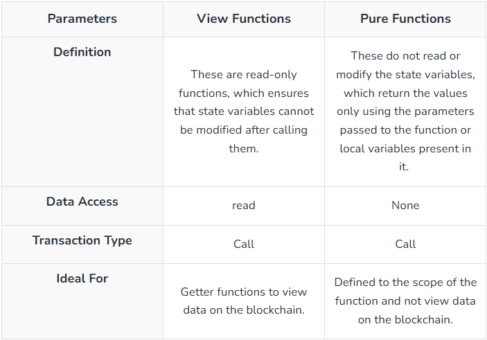
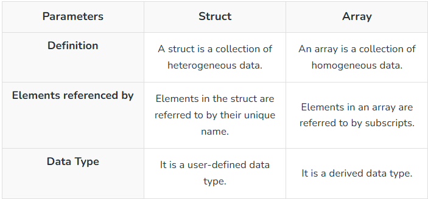
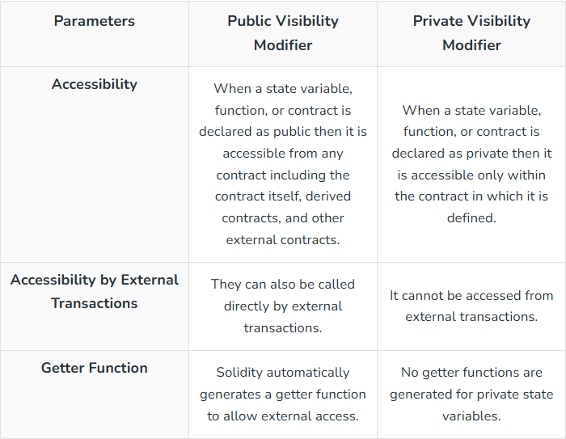
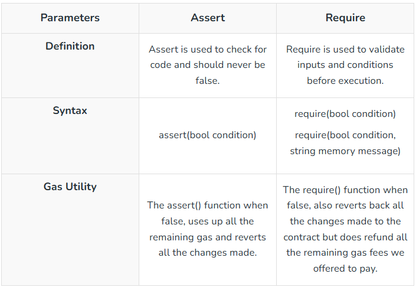

# Solidity Interview Questions & Answers

### Questions

| No. | Questions                                                                                                                                                                                                                        |
| --- | -------------------------------------------------------------------------------------------------------------------------------------------------------------------------------------------------------------------------------- |
|     | **Behavioural Questions**                                                                                                                                                                                                                   
| 1   | [What is Solidity?](#What-is-Solidity)
| 2   | [What are some important features of Solidity?](#What-are-some-important-features-of-Solidity)
| 3   | [What types of applications can be developed using Solidity?](#What-types-of-applications-can-be-developed-using-Solidity)
| 4   | [What are the main differences between Solidity and other programming languages like Python, Java, or C++?](#what-are-the-main-differences-between-solidity-and-other-programming-languages-like-python-java-or-c)
| 5   | [What is machine code in relation to Solidity contracts?](#What-is-machine-code-in-relation-to-Solidity-contracts)
| 6   | [What is an enum? What are the restrictions on their use?](#What-is-an-enum-What-are-the-restrictions-on-their-use)
| 7   | [What is EVM bytecode?](#What-is-EVM-bytecode)
| 8   | [What is a library and how many types are there?](#What-is-a-library-and-how-many-types-are-there)
| 9   | [What is the function of the consensus algorithm?](#What-is-the-function-of-the-consensus-algorithm)
| 10   | [What do you understand about the Ethereum network?](#What-do-you-understand-about-the-Ethereum-network)
| 11   | [What are the differences between Ethereum and blockchain and bitcoin?](#What-are-the-differences-between-Ethereum-and-blockchain-and-bitcoin)
| 12   | [What are the benefits of using smart contracts on Ethereum?](#What-are-the-benefits-of-using-smart-contracts-on-Ethereum)
| 13   | [What tools can be used for testing Solidity codes?](#What-tools-can-be-used-for-testing-Solidity-codes)
| 14   | [Is it possible to use loops in Solidity?](#Is-it-possible-to-use-loops-in-Solidity)
| 15   | [What is a constant function in Solidity?](#What-is-a-constant-function-in-Solidity)
| 16   | [What is the concept of storage variables in Solidity?](#What-is-the-concept-of-storage-variables-in-Solidity)
| 17   | [What is the first thing that needs to be defined when creating a Solidity file?](#What-is-the-first-thing-that-needs-to-be-defined-when-creating-a-Solidity-file)
| 18   | [What is a smart contract’s ABI?](#What-is-a-smart-contracts-ABI)
| 19   | [What type of language is Solidity?](#What-type-of-language-is-Solidity)
| 20   | [What are the two APIs that a smart contract uses to interface with it?](#What-are-the-two-APIs-that-a-smart-contract-uses-to-interface-with-it)
| 21   | [Why is Solidity used in blockchain?](#Why-is-Solidity-used-in-blockchain)
| 22   | [Is Solidity frontend or backend?](#Is-Solidity-frontend-or-backend)
| 23   | [How much do Solidity developers make?](#How-much-do-Solidity-developers-make)
| 24   | [Is Solidity the future?](#Is-Solidity-the-future)
| 25   | [What extension does the source file have in Solidity?](#What-extension-does-the-source-file-have-in-Solidity)
| 26   | [What is a smart contract?](#What-is-a-smart-contract)
| 27   | [What is a gas limit in Solidity?](#What-is-a-gas-limit-in-Solidity)
| 28   | [What is a variable in Solidity?](#What-is-a-variable-in-Solidity)
| 29   | [What is an event in Solidity?](#What-is-an-event-in-Solidity)
| 30   | [What is a library in Solidity?](#What-is-a-library-in-Solidity)
| 31   | [What is the constant function in Solidity?](#What-is-the-constant-function-in-Solidity)
| 32   | [What are hexadecimal literals in Solidity?](#What-are-hexadecimal-literals-in-Solidity)
| 33   | [What are the different Ether units available in Solidity?](#What-are-the-different-Ether-units-available-in-Solidity)
| 34   | [What time units are available in Solidity?](#What-time-units-are-available-in-Solidity)
| 35   | [What are storage variables in Solidity?](#What-are-storage-variables-in-Solidity)
| 36   | [What are source files in Solidity?](#What-are-source-files-in-Solidity)
| 37   | [What are state variables in Solidity?](#What-are-state-variables-in-Solidity)
| 38   | [What are the main components of a Solidity Smart Contract?](#What-are-the-main-components-of-a-Solidity-Smart-Contract)
| 39   | [What is special in smart contracts compared to other programs?](#What-is-special-in-smart-contracts-compared-to-other-programs)
| 40   | [List the difference between unit8 and unit16.](#List-the-difference-between-unit8-and-unit16)
| 41   | [What are private and public variables in Solidity?](#What-are-private-and-public-variables-in-Solidity)
| 42   | [List the differences between view and pure functions.](#List-the-differences-between-view-and-pure-functions)
| 43   | [List the difference between memory and storage in Solidity.](#List-the-difference-between-memory-and-storage-in-Solidity)
| 44   | [List the differences between struct and array.](#List-the-differences-between-struct-and-array)
| 45   | [How much is 1 gwei of Ether?](#How-much-is-1-gwei-of-Ether)
| 46   | [How much is 1 wei of Ether?](#How-much-is-1-wei-of-Ether)
| 47   | [How much is 1 kwei of Ether?](#How-much-is-1-kwei-of-Ether)
| 48   | [What is the difference between Solidity and other programming languages?](#What-is-the-difference-between-Solidity-and-other-programming-languages)
| 49   | [What is the ABI of the contract?](#What-is-the-ABI-of-the-contract)
| 50  | [What are the different types of conversions allowed in Solidity?](#What-are-the-different-types-of-conversions-allowed-in-Solidity)
| 51  | [How does error handling work in Solidity?](#How-does-error-handling-work-in-Solidity)
| 52  | [What do revert() and revert(string reason) do?](#What-do-revert-and-revertstring-reason-do)
| 53  | [What happens if the smart contract does not specify the Solidity version?](#What-happens-if-the-smart-contract-does-not-specify-the-Solidity-version)
| 54  | [Explain the role of the Ethereum Virtual Machine (EVM).](#Explain-the-role-of-the-Ethereum-Virtual-Machine-EVM)
| 55  | [Does EVM understands Solidity?](#Does-EVM-understands-Solidity)
| 56  | [What is a proxy contract in Solidity?](#What-is-a-proxy-contract-in-Solidity)
| 57  | [What is a staking pool in Solidity?](#What-is-a-staking-pool-in-Solidity)
| 58  | [List the difference between public and private visibility modifiers in Solidity?](#List-the-difference-between-public-and-private-visibility-modifiers-in-Solidity)
| 59  | [List different types of libraries in Solidity.](#List-different-types-of-libraries-in-Solidity)
| 60  | [What is Decentralized Exchange (DEX)?](#What-is-Decentralized-Exchange-DEX)
| 61  | [What is assert and require in Solidity?](#What-is-assert-and-require-in-Solidity)
| 62  | [What is the formula to calculate Ethereum gas cost?](#What-is-the-formula-to-calculate-Ethereum-gas-cost)
| 63  | [What is the difference between tx.origin and msg.sender?](#What-is-the-difference-between-txorigin-and-msgsender)
| 64  | [What is the largest value a uint256 can store?](#What-is-the-largest-value-a-uint256-can-store)
| 65  | [What is a sandwich attack?](#What-is-a-sandwich-attack)
| 66  | [What is ERC165 used for?](#What-is-ERC165-used-for)
| 67  | [What is TWAP?](#What-is-TWAP)
| 68  | [What is a bonding curve?](#What-is-a-bonding-curve)
| 69  | [What is a reentrancy attack in Solidity?](#What-is-a-reentrancy-attack-in-Solidity)
| 70  | [Can you explain what Solidity is and its primary use case?](#Can-you-explain-what-Solidity-is-and-its-primary-use-case)
| 71  | [How does Solidity handle contract inheritance?](#How-does-Solidity-handle-contract-inheritance)
| 72  | [What are the key differences between 'memory' and 'storage' in Solidity?](#What-are-the-key-differences-between-memory-and-storage-in-Solidity)
| 73  | [Explain the concept of 'gas' in Ethereum and how it relates to Solidity programming.](#Explain-the-concept-of-gas-in-Ethereum-and-how-it-relates-to-Solidity-programming)
| 74  | [What are events in Solidity and why are they useful?](#What-are-events-in-Solidity-and-why-are-they-useful)
| 75  | [How do you handle errors and exceptions in Solidity?](#How-do-you-handle-errors-and-exceptions-in-Solidity)
| 76  | [What are the main security considerations when developing smart contracts in Solidity?](#What-are-the-main-security-considerations-when-developing-smart-contracts-in-Solidity)
| 77  | [How would you optimize a Solidity contract to reduce gas costs?](#How-would-you-optimize-a-Solidity-contract-to-reduce-gas-costs)
| 78  | [How do you manage state variables in a Solidity contract?](#How-do-you-manage-state-variables-in-a-Solidity-contract)
| 79  | [What is the purpose of the 'constructor' function in Solidity?](#What-is-the-purpose-of-the-constructor-function-in-Solidity)
| 80  | [Can you explain the difference between 'internal' and 'private' functions in Solidity?](#Can-you-explain-the-difference-between-internal-and-private-functions-in-Solidity)
| 81  | [What are the advantages of using 'modifier' in Solidity?](#What-are-the-advantages-of-using-modifier-in-Solidity)
| 82  | [How do you handle contract upgrades in Solidity?](#How-do-you-handle-contract-upgrades-in-Solidity)
| 83  | [What is a 'multi-signature' wallet, and why is it used in Solidity?](#What-is-a-multi-signature-wallet-and-why-is-it-used-in-Solidity)
| 84  | [How do you approach debugging and troubleshooting Solidity contracts?](#How-do-you-approach-debugging-and-troubleshooting-Solidity-contracts)
| 85  | [What is the 'self-destruct' function in Solidity, and when should it be used?](#What-is-the-self-destruct-function-in-Solidity-and-when-should-it-be-used)
| 86  | [How do you handle access control in Solidity contracts?](#How-do-you-handle-access-control-in-Solidity-contracts)
| 87  | [What are the gas optimizations techniques you would use in a Solidity contract?](#What-are-the-gas-optimizations-techniques-you-would-use-in-a-Solidity-contract)
| 88  | [How would you explain the concept of 'gas' in Ethereum to a non-technical stakeholder?](#How-would-you-explain-the-concept-of-gas-in-Ethereum-to-a-non-technical-stakeholder)
| 89  | [Can you describe a situation where you had to optimize a smart contract for gas efficiency?](#Can-you-describe-a-situation-where-you-had-to-optimize-a-smart-contract-for-gas-efficiency)
| 90  | [How would you implement a time-lock feature in a smart contract?](#How-would-you-implement-a-time-lock-feature-in-a-smart-contract)
| 91  | [Explain the concept of 'reentrancy' and how you would prevent it in your smart contracts.](#Explain-the-concept-of-reentrancy-and-how-you-would-prevent-it-in-your-smart-contracts)
| 92  | [How would you design a smart contract system for a decentralized voting application?](#How-would-you-design-a-smart-contract-system-for-a-decentralized-voting-application)
| 93  | [How would you ensure the security of a smart contract in Solidity?](#How-would-you-ensure-the-security-of-a-smart-contract-in-Solidity)
| 94  | [What are common security vulnerabilities in Solidity and how can they be mitigated?](#What-are-common-security-vulnerabilities-in-Solidity-and-how-can-they-be-mitigated)
| 95  | [How do you handle the risks associated with external calls in Solidity?](#How-do-you-handle-the-risks-associated-with-external-calls-in-Solidity)
| 96  | [What steps would you take to avoid denial-of-service (DoS) attacks in Solidity?](#What-steps-would-you-take-to-avoid-denial-of-service-DoS-attacks-in-Solidity)
| 97  | [How would you secure sensitive data within a Solidity contract?](#How-would-you-secure-sensitive-data-within-a-Solidity-contract)
| 98  | [What is the importance of conducting security audits on Solidity smart contracts?](#What-is-the-importance-of-conducting-security-audits-on-Solidity-smart-contracts)
| 99  | [How do you handle private data in Solidity, given that the blockchain is public?](#How-do-you-handle-private-data-in-Solidity-given-that-the-blockchain-is-public)
| 100  | [What are the best practices for writing secure smart contracts in Solidity?](#What-are-the-best-practices-for-writing-secure-smart-contracts-in-Solidity)
| 101  | [How would you design a smart contract system for a decentralized lending platform?](#How-would-you-design-a-smart-contract-system-for-a-decentralized-lending-platform)
| 102  | [Describe a situation where you had to optimize a complex Solidity contract for gas efficiency. What strategies did you employ?](#Describe-a-situation-where-you-had-to-optimize-a-complex-Solidity-contract-for-gas-efficiency-What-strategies-did-you-employ)
| 103  | [How would you implement a voting system in Solidity that ensures one vote per address while maintaining voter privacy?](#How-would-you-implement-a-voting-system-in-Solidity-that-ensures-one-vote-per-address-while-maintaining-voter-privacy)
| 104  | [Explain how you would design a token vesting contract with multiple beneficiaries and varying vesting schedules.](#Explain-how-you-would-design-a-token-vesting-contract-with-multiple-beneficiaries-and-varying-vesting-schedules)
| 105  | [How would you implement a decentralized exchange (DEX) in Solidity, and what key features wouldXou include?](#How-would-you-implement-a-decentralized-exchange-DEX-in-Solidity-and-what-key-features-would-you-include)
| 106  | [Describe how you would implement a multi-signature wallet contract in Solidity.](#Describe-how-you-would-implement-a-multi-signature-wallet-contract-in-Solidity)
| 107  | [How would you design a contract system for a decentralized insurance platform?](#How-would-you-design-a-contract-system-for-a-decentralized-insurance-platform)
| 108  | [Explain how you would implement a yield farming contract in Solidity.](#Explain-how-you-would-implement-a-yield-farming-contract-in-Solidity)
| 109  | [How would you design a contract for a decentralized autonomous organization (DAO) in Solidity?](#How-would-you-design-a-contract-for-a-decentralized-autonomous-organization-DAO-in-Solidity)
| 110  | [Is Solidity statically or dynamically typed?](#Is-Solidity-statically-or-dynamically-typed)
| 111  | [What is the equivalent to the Java "Class" in Solidity?](#What-is-the-equivalent-to-the-Java-Class-in-Solidity)
| 112  | [What is an instance of a contract?](#What-is-an-instance-of-a-contract)
| 113  | [Give me a couple of differences between Java and Solidity.](#Give-me-a-couple-of-differences-between-Java-and-Solidity)
| 114  | [What is the very first thing you must specify in a Solidity file?](#What-is-the-very-first-thing-you-must-specify-in-a-Solidity-file)
| 115  | [What does a contract consist of?](#What-does-a-contract-consist-of)
| 116  | [What types of functions are there?](#What-types-of-functions-are-there)
| 117  | [What error will I get if I put multiple contract definitions into a single Solidity file?](#What-error-will-I-get-if-I-put-multiple-contract-definitions-into-a-single-Solidity-file)
| 118  | [What are some ways in which two contracts can interact?](#What-are-some-ways-in-which-two-contracts-can-interact)
| 119  | [What happens when you try to deploy a file with multiple contracts?](#What-happens-when-you-try-to-deploy-a-file-with-multiple-contracts)
| 120  | [000](#000)
| 121  | [111](#111)
| 122  | [222](#222)
| 123  | [333](#333)
| 124  | [444](#444)
| 125  | [555](#555)
| 126  | [666](#666)
| 127  | [777](#777)
| 128  | [888](#888)
| 129  | [999](#999)

## Answers
1. ### What is Solidity?
   
Solidity is a high-level language used in the blockchain ecosystem for implementing smart contracts. Solidity is an object-oriented programming language developed by Christian Reitwiessner, Alex Beregszaszi, and several former Ethereum core contributors for implementing smart contracts on various blockchain platforms like Ethereum. It is used to implement smart contracts that implement business logic and generates a chain of transaction records in the blockchain system. Designed specifically for targeting the Ethereum Virtual Machine, Solidity was influenced by several programming languages, such as JavaScript, Python, and C++.
    **[⬆ Back to Top](#questions)**
    
2.  ### What are some important features of Solidity?

Solidity has some salient features, which include libraries, contracts, and inheritance support. With Solidity, users can also create custom data types which can be a crucial part of smart contract development.<ui><li>Solidity is a statically-typed object-oriented language.</li><li>It is highly influenced by Python, C++, and JavaScript which runs on EVM.</li><li>It is designed for implementing smart contracts.</li><li>It can be used for implementing contracts for functionalities like Voting, Crowdfunding, Multi-signature wallets, etc.</li><li>Solidity is a primary language for blockchain platforms.</li></ui>
    **[⬆ Back to Top](#questions)**

3. ### What types of applications can be developed using Solidity?
   
Solidity finds its application in creating smart contracts on Ethereum, which is a decentralized platform that is responsible for running smart contracts. Smart contracts function just as programmed and they are not prone to third-party interference. While it is most commonly used for developing smart contracts, you can also develop complex decentralized applications. You can develop various aspects, such as voting systems, crowdfunding platforms, decentralized exchanges, lending platforms, and much more.
    **[⬆ Back to Top](#questions)**

4. ### What are the main differences between Solidity and other programming languages like Python, Java, or C++?

One main difference between Solidity and other programming languages like Python, C++, and Java is their application. While you can create centralized applications using these popular programming languages, Solidity is created to work with the Ethereum Virtual Machine. Therefore, it has certain special features such as creating smart contracts.
    **[⬆ Back to Top](#questions)**

5. ### What is machine code in relation to Solidity contracts?

Machine codes are a compilation of solidity contracts, which are written in a high-level language. And it is the machine code that is executed on the Ethereum blockchain by the computer’s processor. A basic understanding of machine code is needed to understand what Solidity contracts are and how they work.
    **[⬆ Back to Top](#questions)**

6. ### What is an enum? What are the restrictions on their use?

Enums are one of the methods used for creating user-defined types in Solidity. While you can implement an implicit conversion when using enums, they allow explicit conversion both to and from all integer types. Enums require at least one member, and the explicit conversions check the runtime value ranges. When there’s a failure, it results in an exception.
    **[⬆ Back to Top](#questions)**
    
7. ### What is EVM bytecode?

EVM is the abbreviation for Ethereum Virtual Machine, which is a low-level programming language that is compiled from Solidity— a high-level language. EVM helps reduce the operating system dependency by sitting between the application layer and the operating system. Because of EVM, Ethereum contracts can be on almost any computer.
    **[⬆ Back to Top](#questions)**
    
8. ### What is a library and how many types are there?

A library is a reusable piece of code that is used by smart contracts. There are two types of libraries, which are deployed and embedded libraries. While deployed libraries have an address of their own and can be used by several other smart contracts, embedded libraries are used by smart contracts wherein they are used as a part of the code. Additionally, embedded libraries do not have their own address.
    **[⬆ Back to Top](#questions)**
    
9. ### What is the function of the consensus algorithm?

The consensus algorithm is one of the aspects that make decentralization possible for <a herf="https://www.simplilearn.com/promising-uses-of-blockchain-article" target="_blank">blockchain-powered platforms and applications</a>. Consensus algorithms enable a mechanism that ensures a majority of the token holders and stakeholders agree upon and decide the credibility of a transaction while also deciding how to add new blocks of transactions. Consensus helps prevent the chances of any user making unauthorized changes.
    **[⬆ Back to Top](#questions)**

10. ### What do you understand about the Ethereum network?

The Ethereum network is an open-source blockchain platform that leverages <a herf="https://www.simplilearn.com/decoding-the-blockchain-technology-article" target="_blank">blockchain technology</a>. It is most commonly used for creating decentralized applications that do not depend on a single authority or a centralized entity and instead are monitored by all the peers.
    **[⬆ Back to Top](#questions)**
    
11. ### What are the differences between Ethereum and blockchain and bitcoin?

The most basic difference between <a herf="https://www.simplilearn.com/tutorials/blockchain-tutorial/ethereum-vs-bitcoin" target="_blank">bitcoin and Ethereum</a> is that <a herf="https://www.simplilearn.com/bitcoin-digital-currency-article" target="_blank">bitcoin</a> is a <a herf="https://www.simplilearn.com/tutorials/blockchain-tutorial/what-is-cryptocurrency" target="_blank">cryptocurrency</a> and the latter is a ledger technology that is used to create new programs. Bitcoin was created as an alternative to the national currency while the Ethereum platform was created for programmatic contracts and applications which use its own currency— ETH. While bitcoin transactions might take minutes to be completed, it only takes seconds to complete Ethereum transactions.
    **[⬆ Back to Top](#questions)**

12. ### What are the benefits of using smart contracts on Ethereum?

There are several advantages of using smart contracts on Ethereum over traditional contracts, such as a greater degree of security since smart contracts are stored on the blockchain. This makes these contracts immune to tampering. Since smart contracts are designed to automate various tasks including the transfer of funds and verification of identities, they’re more efficient.
    **[⬆ Back to Top](#questions)**

13. ### What tools can be used for testing Solidity codes?

Some of the most popular and commonly used tools for testing Solidity codes are Solium and Truffle. You can find and fix issues in your Solidity codes with Solium, which is a linter. Truffle can be used as a development environment, asset pipeline, and testing framework for Ethereum.
    **[⬆ Back to Top](#questions)**

14. ### Is it possible to use loops in Solidity?

Yes, you can use loops in Solidity. However, this may come with certain restrictions such as not being able to use a for loop for iterating over an array. One thing to remember is to avoid using infinite loops in Solidity. When you create infinite loops, it results in the loss of gas and failure to continue executing your contract.
    **[⬆ Back to Top](#questions)**

15. ### What is a constant function in Solidity?

A constant function is one that does not make any modifications to the state of the contract. Therefore, you can call the function from anywhere without worrying about security concerns.
    **[⬆ Back to Top](#questions)**

16. ### What is the concept of storage variables in Solidity?

The variables stored on the <a herf="https://www.simplilearn.com/tutorials/blockchain-tutorial/what-is-blockchain" target="_blank">blockchain</a> are referred to as storage variables in Solidity. These variables are used for storing important data concerning the contract. Storage variables cannot be changed and are permanent.
    **[⬆ Back to Top](#questions)**

17. ### What is the first thing that needs to be defined when creating a Solidity file?

The first you should define when creating a Solidity file is the class. This helps avoid errors related to compilation that is caused due to incompatibility between various versions of Solidity. Therefore, the version number must be declared.
    **[⬆ Back to Top](#questions)**
    
18. ### What is a smart contract’s ABI?

A smart contract’s ABI specifies its interface and the set of functions accessed from outside the smart contract. The ABI is used only for defining the events of the contract and function signatures, such as names of the function, return types, and argument types. However, it does not define their implementation.
    **[⬆ Back to Top](#questions)**
    
19. ### What type of language is Solidity?

Solidity is a statically-typed high-0level object-oriented programming language designed for developing smart contracts that run on Ethereum Virtual Machine (EVM). 
It makes use of ECMAScript-like syntax. Therefore, existing web developers would be familiar with it.
    **[⬆ Back to Top](#questions)**
    
20. ### What are the two APIs that a smart contract uses to interface with it?

The two APIs used by a smart contract to interface with it are eth_sendTransaction and eth_call. Calls, when compared to gas, as a better option because gas is expensive while calls don’t cost anything. Therefore, while gas can change the blockchain, calls don’t. However, while transactions don’t return a value, that is not the case with calls.
    **[⬆ Back to Top](#questions)**

21. ### Why is Solidity used in blockchain?

Solidity is used in blockchains for creating smart contracts. These smart contracts are responsible for implementing business logic and generating transactional records in the blockchain system. Solidity is used for various blockchain platforms, such as Ethereum, Ethereum Classic, and Binance Smart Chain.<ui><li>It is used to create smart contracts that implement business logic.</li><li>Smart contracts can be used for various purposes like multi-signature wallets, Voting, Bind auctions, Crowdfunding, etc.</li><li>Smart contracts can be used to automate transactions on the blockchain.</li></ui>
    **[⬆ Back to Top](#questions)**

22. ### Is Solidity frontend or backend?

Solidity is a backend language. The reason why blockchain platforms need a different backend language with specific features is that the front end is similar for both centralized and decentralized applications. What makes them different is the backend, which requires a unique high-level programming language such as Solidity.
    **[⬆ Back to Top](#questions)**

23. ### How much do Solidity developers make?

Solidity developers have the scope to earn well with time owing to the demand for professionals who can use the language to create smart contracts for blockchain systems. The current national average salary that Solidity developers can earn is USD 1,20,000 per annum in United States.
    **[⬆ Back to Top](#questions)**

24. ### Is Solidity the future?

Since decentralized applications and programs are gaining more popularity with time and have a greater scope of application for different sectors, it is safe to say that Solidity is the future.
    **[⬆ Back to Top](#questions)**

25. ### What extension does the source file have in Solidity?

The Solidity contract file/ library file has an extension .sol. For example, Geeksforgeeks.sol. The SOL script is a file that is programmed in Solidity programming language in the same way files are created in C++ or any other programming language. The SOL file contains the solidity source code and is used to create smart contracts for the transactions on the blockchain.
    **[⬆ Back to Top](#questions)**

26. ### What is a smart contract?

Smart contracts are computer programs stored on the blockchain that are executed when the predetermined conditions are met.<ui><li>These are used to automate the execution so that all the participants can be immediately certain of the outcome.</li><li>Smart contracts can automatically trigger the next action when the conditions are met.</li><li>They remove the need for intermediaries to handle the transactions.</li><li>Smart contracts don’t require any paperwork to process as they are digital and automated.</li></ui>
    **[⬆ Back to Top](#questions)**

27. ### What is a gas limit in Solidity?

A gas limit in Solidity refers to the maximum amount of gas a user is willing to spend on a transaction. When creating a transaction on the Ethereum Network user must specify the gas limit to ensure that they don’t spend more gas than they intend.<ui><li>If a transaction requires more gas than the specified gas limit, the transaction will be reverted, and the used gas will not be refunded.</li><li>If a transaction requires less than the gas limit, the remaining gas will be returned to the user.</li></ui>
    **[⬆ Back to Top](#questions)**

28. ### What is a variable in Solidity?

A variable in Solidity is a storage location that can contain values. These values can be changed during runtime. Variables are broadly classified as state variables and local variables.<ui><li>State variables are the variables that are declared outside any function in a contract and are permanently stored on the Ethereum blockchain.</li><li>Local variables are the variables that are declared within the function and their scope is limited to that function.</li></ui>
    **[⬆ Back to Top](#questions)**

29. ### What is an event in Solidity?

An event is an inheritable member of the contract, which stores the arguments passed in the transaction logs when emitted.<ui><li>Generally, events are used to inform the calling application about the current state of the contract, with the help of the logging facility of EVM.</li><li>Events notify the applications about the change made to the contracts and applications which can be used to execute the dependent logic.</li></ui>
    **[⬆ Back to Top](#questions)**

30. ### What is a library in Solidity?

Libraries in solidity are similar to contracts that contain reusable codes. A library has functions that can be called by other contracts.<ui><li>Deploying a common code by creating a library reduces the gas cost.</li><li>Functions of the library can be called directly when they do not modify the state variables i.e. only pure and view functions can be called from outside of the library.</li><li>The library does not have state variables, it cannot inherit any element and cannot be inherited.</li></ui>
    **[⬆ Back to Top](#questions)**

31. ### What is the constant function in Solidity?

A constant function does not change the state of the contract. Therefore, the constant function can be called from anywhere without concerning the security issues it will impose as the function will not affect the state of the contract.
    **[⬆ Back to Top](#questions)**
    
32. ### What are hexadecimal literals in Solidity?

Hexadecimal literals are prefixed with hex keyword. These are enclosed in double or single quotes. For example, hex”2AB3F”. Hexadecimal literals have the same convertibility restrictions as string literals.
    **[⬆ Back to Top](#questions)**
    
33. ### What are the different Ether units available in Solidity?

The different ether units available in Solidity are wei, kwei, gwei, mwei, microether, milliether, ether.
    **[⬆ Back to Top](#questions)**
    
34. ### What time units are available in Solidity?

Solidity has time units where the lowest time unit is second and other time units are seconds, minutes, hours, days, and weeks.
    **[⬆ Back to Top](#questions)**

35. ### What are storage variables in Solidity?

Storage variables are the variables that are stored on the blockchain. These variables are permanent and are used for storing important data concerning the contract. They are also known as dynamic variables and are stored in the storage and cannot be changed. They are persistent.
    **[⬆ Back to Top](#questions)**

36. ### What are source files in Solidity?

A solidity source file can contain any number of smart contracts or library definitions in a single file.<ui><li>The source file can contain any number of contract definitions, imports, and pragma.</li><li>It is recommended that a developer maintains different source files for each contract or library definition to have better code maintainability. </li><li>The solidity source file has .sol extension.</li></ui>
    **[⬆ Back to Top](#questions)**

37. ### What are state variables in Solidity?

State variables are stored in the storage. These values are permanently stored in the contract’s storage.<ui><li>They store data directly on the blockchain.</li><li>These are declared inside a contract and outside the function.</li><li>These are expensive as they cost gas.</li><li>These can be assigned one of the access modifiers, public, private, or internal.</li></ui>
    **[⬆ Back to Top](#questions)**

38. ### What are the main components of a Solidity Smart Contract?

The main components of a Solidity smart contract are:<ui><li><b>Pragma statement:</b> This statement specifies the required version of the solidity compiler for the smart contract.</li><li><b>State variables:</b> These are used to store the contract’s state data persistently on the blockchain.</li><li><b>Constructor:</b> This is a special function that is used for initializing state variables and called at once at contract deployment.</li><li><b>Functions:</b> Functions define the logic and behavior of the contract.</li><li><b>Modifiers:</b> These are the reusable code snippets that can be added to functions to modify their behavior.</li><li><b>Events:</b> Events are custom data structures that emit transaction logs for external listeners to monitor contract activity and state changes.</li><li><b>Inheritance:</b> Inheritance allows a contract to inherit properties from a base contract thus enabling code reuse and abstraction.</li></ui>
    **[⬆ Back to Top](#questions)**

39. ### What is special in smart contracts compared to other programs?

'<ui><li><b>Immutable:</b> Once the smart contracts are deployed on the blockchain, their code cannot be altered. This makes the smart contract invulnerable to unauthorized access.</li><li><b>Decentralized execution:</b> The execution of smart contracts does not depend on a single authority but instead on multiple nodes that are spread around the world.</li><li><b>Self-executing:</b> Smart contracts are designed to execute predefined actions automatically when certain conditions specified in the contract are met. This reduces the need for intermediaries thus reducing the potential for human error.</li><li><b>Tokenization:</b> Smart contracts can be used to create and manage digital assets through the use of tokens.</li></ui>
    **[⬆ Back to Top](#questions)**

40. ### List the difference between unit8 and unit16.

uint8 stores a number of up to 2^8-1. It has 8 bits.
uint16 stores number up to 2^16-1. It has 16 bits.
    **[⬆ Back to Top](#questions)**

41. ### What are private and public variables in Solidity?

Private variables can be accessed only within the contract that declares them. These are not accessible by an external entity nor by the contracts derived from the contract in which they are declared.
Public variables can be accessed by any contract, function, or external entity. When these variables are declared in Solidity, the compiler automatically generates a getter function that allows any external entity or contract to read its value.
    **[⬆ Back to Top](#questions)**
    
42. ### List the differences between view and pure functions.

    **[⬆ Back to Top](#questions)**
    
43. ### List the difference between memory and storage in Solidity.

    **[⬆ Back to Top](#questions)**
    
44. ### List the differences between struct and array.

    **[⬆ Back to Top](#questions)**

45. ### How much is 1 gwei of Ether?

1 Gwei equals 0.000000001 or 10e-9 ETH. 1 ETH equals one billion (10e9) Gwei.
    **[⬆ Back to Top](#questions)**

46. ### How much is 1 wei of Ether?

1 wei is equivalent to 10^-18 ETH. 1 ETH is equal to 1,000,000,000,000,000,000 wei/
    **[⬆ Back to Top](#questions)**

47. ### How much is 1 kwei of Ether?

1 kwei is equal to 0.00000000 ETH.
    **[⬆ Back to Top](#questions)**

48. ### What is the difference between Solidity and other programming languages?

Programming languages like Python, C, and C++ are designed to create centralized applications. On the other hand, Solidity is designed to work with Ethereum Virtual Machine and is used to create smart contracts that work in a decentralized environment. 
Solidity differs from the EVM-targeting languages like Serpent and Mutan in the way that Solidity supports complex member variables for the contracts, and supports inheritance.
Solidity is a statically-typed language and Javascript is a dynamically typed language.
    **[⬆ Back to Top](#questions)**

49. ### What is the ABI of the contract?

The Application Binary Interface (ABI) allows anyone writing a smart contract to be able to communicate between a web application written in high-level programming language and the bytecode that is understandable by EVM.<ui><li>ABI defines how the contents of the library are stored inside the file and the program uses the ABI to search through the file and find what it needs.</li><li>These act as function selectors defining the specific methods that can be called to a smart contract for execution.</li></ui>
    **[⬆ Back to Top](#questions)**

50. ### What are the different types of conversions allowed in Solidity?

Solidity allows Implicit and Explicit conversions.<ui><li>Implicit conversion takes place in solidity if it makes sense semantically and no information is lost.</li><li>Explicit conversion can be done in cases when the compiler is not allowing implicit conversion but one is sure of what to do and how to do it. Explicit conversion can be done using casting or constructor-like syntax.</li></ui>
    **[⬆ Back to Top](#questions)**

51. ### How does error handling work in Solidity?

Solidity provides various functions for error handling where the solidity code is compiled to the byte code and the syntax error check happens at the compile time while the runtime errors are difficult to catch and occur while executing the smart contract.<ui><li>When an error occurs the state is reverted back to its original state.</li><li>This undoes all the changes made to the state in the current call to the smart contract.</li></ui>
    **[⬆ Back to Top](#questions)**

52. ### What do revert() and revert(string reason) do?

Both of them are error-handling methods in Solidity.<ui><li><b>revert():</b> This aborts the execution of the smart contract and reverts the state changes.</li><li><b>revert(string reason):</b> This aborts the execution of the smart contract and reverts the state changes and provides the explanatory string.</li>
    **[⬆ Back to Top](#questions)**

53. ### What happens if the smart contract does not specify the Solidity version?

Failure to choose the correct version of Solidity while programming the smart contract might lead to the smart contract compilation failure.<ui><li>A contract can be annotated with version pragma that indicates the version that is supported to make code reuse easier.</li><li>There are two ways to use version pragma:<ui><li>“pragma solidity^version”.</li><li>“pragma solidity version”.</li></ui></li></ui>
    **[⬆ Back to Top](#questions)**

54. ### Explain the role of the Ethereum Virtual Machine (EVM).

Ethereum Virtual Machine (EVM) serves as the runtime environment for smart contracts running on the Ethereum Blockchain and ensures that smart contracts are executed securely across all nodes in the network.<ui><li>The EVM process the EVM bytecode generated from high-level smart contract languages like Solidity.</li><li>EVM is responsible for maintaining the state of the Ethereum blockchain including the contract state. When the contract’s state changes due to the execution of the function then EVM updates the contract’s state.</li><li>EVM uses gas to measure the cost of executing the smart contract. The EVM calculates the total gas used during contract execution.</li>
    **[⬆ Back to Top](#questions)**

55. ### Does EVM understands Solidity?

The EVM does not directly understand Solidity as it understands and executes bytecode. When a transaction is executed EVM reads and processes the corresponding bytecode instructions.
    **[⬆ Back to Top](#questions)**

56. ### What is a proxy contract in Solidity?

A proxy contract in Solidity is a design pattern that employs a secondary contract to act as an intermediary between the users and the main contract. It is often used for storage optimization purposes.
    **[⬆ Back to Top](#questions)**
    
57. ### What is a staking pool in Solidity?

Staking Pool in Solidity is a smart contract that allows users to pool their cryptocurrency holdings together and participate in various blockchain activities like PoS consensus, etc.<ui><li>It helps to maximize potential earnings.</li><li>It also helps to mitigate risks associated with individual staking.</li></ui>
    **[⬆ Back to Top](#questions)**
    
58. ### List the difference between public and private visibility modifiers in Solidity?

    **[⬆ Back to Top](#questions)**
    
59. ### List different types of libraries in Solidity.

Deployed Library: Deployed libraries have their own addresses and several other smart contracts can use them.
Embedded Library: Embedded libraries don’t have their unique address and they are deployed as part of the code of the smart contract that uses them.
    **[⬆ Back to Top](#questions)**

60. ### What is Decentralized Exchange (DEX)?

The Decentralized Exchange (DEX) is a peer-to-peer crypto exchange that operates on a decentralized platform. It does not rely on a single centralized authority to facilitate trade instead it uses several blockchain features like smart contracts and AMM algorithms to enable the trade of crypto assets directly.<ui><li>It uses smart contracts to automate trade execution, manage order books, etc.</li><li>DEXs run on a network of nodes, usually powered by blockchain or distributed ledger technology.</li></ui>
    **[⬆ Back to Top](#questions)**

61. ### What is assert and require in Solidity?

    **[⬆ Back to Top](#questions)**

62. ### What is the formula to calculate Ethereum gas cost?

Gas fees are paid in Ethereum using this formula:

    **[⬆ Back to Top](#questions)**

63. ### What is the difference between tx.origin and msg.sender?

tx.origin is the address of the Externally Owner Account (EOA) that originated the transaction.
msg.sender is the address of the smart contract or EOA that called the currently executing smart contract.
    **[⬆ Back to Top](#questions)**

64. ### What is the largest value a uint256 can store?

uint256 is an unsigned integer that can hold a maximum value of 2^256-1. It requires 32 bytes of storage space.
    **[⬆ Back to Top](#questions)**

65. ### What is a sandwich attack?

The sandwich attack is a form of front-running that targets decentralized finance protocols and services. It leverages the unique characteristics of DeFi to make money by manipulating crypto markets.<ui><li>The attacker identifies a potential victim transaction.</li><li>The attacker moves to send a buy transaction for the same asset pair which will fill before the user’s transaction.</li><li>This attacker transaction shifts the liquidity pool composition, resulting in the available exchange rates for subsequent transactions being different from that which was originally shown to other users whose transactions have not yet been executed.</li><li>Once the victim swap completes at the unfavorable exchange rate, the attacker follows up with a sell transaction for the asset pair which locks in their profit.</li><li>This second transaction �kruns’ the victim, completing the sandwich.</li></ui>
    **[⬆ Back to Top](#questions)**

66. ### What is ERC165 used for?

The ERC165 is a standard to publish and detect what interfaces a smart contract implements.
    **[⬆ Back to Top](#questions)**
    
67. ### What is TWAP?

Time-Wieghted Average Price (TWAP) is an algorithmic strategy that aims to achieve an average execution price close to the time-weighted average price of the user-specified period. TWAP is calculated for executing large trade orders.
    **[⬆ Back to Top](#questions)**
    
68. ### What is a bonding curve?

Bonding curve is a mathematical concept that is used to describe the relationship between price and token supply.<ui><li>Bonding curve contracts sell the tokens to users by calculating the token price in Ether and issuing them after the payment, also buying them and paying with Ether.</li><li>Bonding curve contracts ensure that the price of each token increases as the number of tokens issued increases.</li></ui>
    **[⬆ Back to Top](#questions)**
    
69. ### What is a reentrancy attack in Solidity?

Reentrancy is a type of attack that can occur in smart contracts that allow untrusted external code to be executed within the contract. This can happen when a smart contract calls an external contract, and the external contract then calls back into the original contract, potentially causing an infinite loop.<ui><li>A reentrancy attack is a method of exploiting a vulnerability in a smart contract that allows an attacker to repeatedly call a function in the contract, causing an infinite loop and potentially stealing funds.</li><li>One way to prevent reentrancy attacks is to use a mutex, or mutual exclusion, lock to prevent multiple calls to the same function from occurring at the same time.</li><li>Another way is to use a guard condition, where a flag is set before external function calls and checked after.</li></ui>
    **[⬆ Back to Top](#questions)**

70. ### Can you explain what Solidity is and its primary use case?

Solidity is a high-level, object-oriented programming language designed specifically for writing smart contracts on blockchain platforms, primarily Ethereum. It's statically typed and supports inheritance, libraries, and complex user-defined types.

The primary use case for Solidity is developing smart contracts that run on the Ethereum Virtual Machine (EVM). These contracts can handle tasks like token creation, decentralized applications (DApps), and automating complex business logic on the blockchain.

Look for candidates who can clearly articulate Solidity's purpose and its connection to blockchain technology. Strong answers will mention its role in smart contract development and may touch on its similarities to languages like JavaScript or C++.
    **[⬆ Back to Top](#questions)**

71. ### How does Solidity handle contract inheritance?

Solidity supports multiple inheritance, allowing a contract to inherit properties and functions from one or more parent contracts. This is achieved using the 'is' keyword followed by the name of the parent contract(s).

Inheritance in Solidity follows the C3 linearization algorithm to resolve conflicts when multiple parent contracts are involved. This ensures a deterministic order of resolution for inherited functions and state variables.

Ideal candidates should demonstrate an understanding of how inheritance can be used to create more modular and reusable code in Solidity development. Look for explanations that touch on the benefits of inheritance, such as code reuse and the ability to create more complex contracts through composition.
    **[⬆ Back to Top](#questions)**

72. ### What are the key differences between 'memory' and 'storage' in Solidity?

'Memory' and 'storage' are two important data locations in Solidity that affect how variables are stored and accessed:
- Storage: This is where all state variables are stored. It's persistent between function calls and transactions, but it's also more expensive to use in terms of gas costs.
- Memory: This is used to hold temporary values. It's erased between external function calls and is less expensive to use.
A strong answer should highlight the persistence of storage versus the temporary nature of memory, as well as touch on the gas cost implications. Look for candidates who can provide examples of when to use each, such as using memory for function parameters and local variables, and storage for state that needs to persist.
    **[⬆ Back to Top](#questions)**

73. ### Explain the concept of 'gas' in Ethereum and how it relates to Solidity programming.

Gas is a unit of measurement for the computational work required to execute operations on the Ethereum network. Every operation in a smart contract costs a certain amount of gas, which is paid for in Ether by the person initiating the transaction.

In Solidity programming, gas considerations are crucial for optimizing contract efficiency and cost-effectiveness. Developers need to be aware of gas costs associated with different operations and data structures to write economical contracts.

Look for answers that demonstrate an understanding of the relationship between code complexity and gas costs. Candidates should be able to discuss strategies for gas optimization, such as using appropriate data types, minimizing storage usage, and avoiding unnecessary computations in loops.
    **[⬆ Back to Top](#questions)**

74. ### What are events in Solidity and why are they useful?

Events in Solidity are a way for smart contracts to communicate that something has happened on the blockchain to the front-end application or other listening contracts. They are inheritable members of contracts that, when emitted, cause the arguments to be stored in the transaction's log.

Events are useful for several reasons:

- They provide a cheaper form of storage compared to contract state variables
- They allow external applications to react to changes in the contract
- They can be used for debugging and monitoring contract activity
Strong candidates should be able to explain how to declare and emit events, and discuss real-world use cases. Look for answers that touch on the importance of events in creating responsive and interactive decentralized applications.
    **[⬆ Back to Top](#questions)**

75. ### How do you handle errors and exceptions in Solidity?

Solidity provides several mechanisms for handling errors and exceptions:

1. Require(): Used to check conditions and throw an exception if the condition is not met.
2. Assert(): Used to check for internal errors and invariants.
3. Revert(): Used to flag an error and revert the current call.
4. Try/Catch: Introduced in Solidity 0.6.0 for external function calls and contract creation.
A comprehensive answer should explain the differences between these mechanisms and when to use each. Look for candidates who understand the importance of proper error handling in maintaining contract integrity and providing meaningful feedback to users and other contracts.
    **[⬆ Back to Top](#questions)**

76. ### What are the main security considerations when developing smart contracts in Solidity?

Security is paramount in smart contract development due to the immutable and financial nature of blockchain transactions. Key considerations include:

- Reentrancy attacks: Ensuring functions that make external calls are protected against recursive calls
- Integer overflow/underflow: Using SafeMath libraries or Solidity 0.8.0+ built-in checks
- Access control: Implementing proper authorization checks
- Gas limitations: Avoiding operations that could exceed block gas limits
- Front-running: Mitigating risks of transaction order exploitation
Ideal candidates should demonstrate awareness of common vulnerabilities and best practices for secure smart contract development. Look for answers that emphasize the importance of code audits, testing, and staying updated on the latest security recommendations.
    **[⬆ Back to Top](#questions)**
    
77. ### How would you optimize a Solidity contract to reduce gas costs?

Optimizing gas costs is crucial for creating efficient and cost-effective smart contracts. Some key strategies include:

- Using appropriate data types (e.g., uint8 instead of uint256 for small numbers)
- Minimizing storage usage and preferring memory for temporary data
- Avoiding expensive operations in loops
- Using events instead of storing data when possible
- Optimizing function visibility (external vs public)
- Utilizing libraries for common functions
Look for answers that demonstrate a deep understanding of how different Solidity constructs affect gas consumption. Strong candidates should be able to discuss trade-offs between optimization and readability, and mention tools or techniques they use to analyze and reduce gas costs.
    **[⬆ Back to Top](#questions)**
    
78. ### How do you manage state variables in a Solidity contract?

State variables in Solidity are variables whose values are permanently stored on the blockchain. These variables can be public or private and are declared inside a contract but outside of any function. Public state variables automatically generate a getter function, making it easy to read their values from outside the contract.

When managing state variables, it's crucial to consider their visibility and data type. The values stored in state variables persist between function calls and transactions, so they should be used judiciously to optimize gas consumption.

Look for candidates who understand the importance of managing state variables efficiently and can explain their role in maintaining the contract's data integrity. A strong candidate should also mention best practices for minimizing gas costs related to state variable usage.
    **[⬆ Back to Top](#questions)**
    
79. ### What is the purpose of the 'constructor' function in Solidity?

The constructor function in Solidity is a special function that is executed only once when the contract is deployed. It is typically used to initialize state variables and set up initial contract conditions. After the contract is deployed, the constructor function cannot be called again.

Constructors can take arguments to set up initial values based on dynamic inputs at deployment time. This is useful for passing critical information to the contract that should only be set once.

In a candidate's response, look for a clear understanding of how and when to use constructors. The candidate should also explain the significance of initializing state variables and setting up contract conditions during deployment.
    **[⬆ Back to Top](#questions)**

80. ### Can you explain the difference between 'internal' and 'private' functions in Solidity?

'Internal' and 'private' are two types of function visibility specifiers in Solidity. Internal functions can be called within the same contract or any derived contracts. This makes them useful for creating reusable functions that can be accessed in inherited contracts.

'Private' functions, on the other hand, can only be called within the contract in which they are defined. They are not accessible by any derived contracts, making them more restrictive in scope.

An ideal candidate should demonstrate an understanding of when to use 'internal' versus 'private' functions based on the desired encapsulation and accessibility. They should also explain how these visibility specifiers contribute to the security and maintainability of the contract.
    **[⬆ Back to Top](#questions)**

81. ### What are the advantages of using 'modifier' in Solidity?

Modifiers in Solidity are used to alter the behavior of functions. They can be applied to functions to add preconditions, postconditions, or other checks. This allows for more readable and maintainable code by separating concerns and reducing redundancy.

Modifiers are especially useful for enforcing access control, validating inputs, and ensuring certain conditions are met before executing a function. They can also be combined and reused across multiple functions, making code more modular.

When evaluating a candidate's response, look for an understanding of how modifiers improve code quality and maintainability. The candidate should also provide examples of common use cases, such as access control or input validation, to demonstrate their practical knowledge.
    **[⬆ Back to Top](#questions)**

82. ### How do you handle contract upgrades in Solidity?

Upgrading a smart contract in Solidity can be challenging because the code deployed on the blockchain is immutable. However, there are strategies to manage upgrades, such as the proxy pattern. This involves deploying a proxy contract that delegates calls to an implementation contract. When an upgrade is needed, you deploy a new implementation contract and update the proxy to point to it.

Another approach is to use a modular architecture, where you separate different functionalities into individual contracts. This allows you to upgrade specific modules without affecting the entire system.

Look for candidates who understand the complexities of contract upgrades and can discuss different strategies for managing them. Ideal candidates should demonstrate knowledge of the proxy pattern and modular architecture and explain the trade-offs and benefits of each approach.
    **[⬆ Back to Top](#questions)**

83. ### What is a 'multi-signature' wallet, and why is it used in Solidity?

A multi-signature wallet in Solidity is a type of wallet that requires multiple parties to approve a transaction before it can be executed. This adds an extra layer of security by preventing a single point of failure.

Multi-signature wallets are commonly used in decentralized applications and organizations to manage funds securely. They ensure that no single party can unilaterally control the wallet, reducing the risk of fraud or unauthorized transactions.

An ideal candidate should explain the security benefits of multi-signature wallets and provide practical examples of their use in decentralized applications. They should also discuss how multi-signature wallets contribute to trust and security in blockchain systems.
    **[⬆ Back to Top](#questions)**

84. ### How do you approach debugging and troubleshooting Solidity contracts?

Debugging and troubleshooting Solidity contracts involve various techniques and tools. One common method is using events to log specific actions or values during contract execution. These logs can then be analyzed to identify issues.

Tools like Remix, Truffle, and Hardhat offer debugging functionalities, including breakpoints and stack traces. These tools help developers navigate through the execution flow and pinpoint errors.

When evaluating a candidate's response, look for a comprehensive understanding of different debugging techniques and tools. The candidate should also emphasize the importance of thorough testing and validation to minimize debugging efforts.
    **[⬆ Back to Top](#questions)**

85. ### What is the 'self-destruct' function in Solidity, and when should it be used?

The 'self-destruct' function in Solidity is used to permanently delete a contract from the blockchain, removing its code and freeing up storage space. When a contract is self-destructed, any remaining Ether balance is sent to a specified address.

Self-destruct should be used cautiously, as it is irreversible. Common use cases include emergency shutdowns, contract upgrades, or when the contract has fulfilled its purpose.

A strong candidate should explain the implications of using 'self-destruct' and provide scenarios where it is appropriate. They should also discuss the importance of designing contracts with clear self-destruct conditions and ensuring it aligns with the overall contract logic.
    **[⬆ Back to Top](#questions)**

86. ### How do you handle access control in Solidity contracts?

Access control in Solidity contracts involves restricting who can call certain functions or access specific data. The most common way to handle access control is by using modifiers, such as 'onlyOwner,' to restrict function execution to specific addresses.

Another approach is to use role-based access control, where different roles are assigned to addresses, and each role has specific permissions. Libraries like OpenZeppelin provide ready-to-use access control implementations.

Look for candidates who understand different access control mechanisms and their importance in securing contracts. The candidate should also discuss practical examples and best practices for implementing robust access control.
    **[⬆ Back to Top](#questions)**
    
87. ### What are the gas optimizations techniques you would use in a Solidity contract?

Gas optimization in Solidity is essential to reduce the cost of executing transactions. Techniques include minimizing storage operations, using smaller data types, and avoiding expensive operations like loops and nested calls.

Other strategies involve using libraries and external contracts, optimizing function visibility, and leveraging events instead of state variables for logging purposes.

An ideal candidate should discuss various gas optimization techniques and their impact on contract efficiency. They should also provide examples and explain the trade-offs involved in different optimization strategies.
    **[⬆ Back to Top](#questions)**
    
88. ### How would you explain the concept of 'gas' in Ethereum to a non-technical stakeholder?

A strong answer should include an analogy that makes the concept relatable. For example, a candidate might explain:

Gas in Ethereum is like fuel for a car. Just as you need to put gas in your car to make it run, you need to pay gas fees to execute transactions or run smart contracts on the Ethereum network. The more complex the operation, the more 'gas' it requires, similar to how a longer journey needs more fuel.

Look for candidates who can simplify complex concepts without losing accuracy. They should also mention that gas fees help prevent network spam and compensate miners for their computational work.
    **[⬆ Back to Top](#questions)**
    
89. ### Can you describe a situation where you had to optimize a smart contract for gas efficiency?

An ideal answer should include a specific example from the candidate's experience. They might describe:

- Identifying inefficient loops or redundant storage operations
- Implementing gas-saving techniques like using shorter data types
- Utilizing external functions instead of public ones where possible
- Employing the 'memory' keyword for temporary data storage
- Results achieved, such as percentage reduction in gas costs
Pay attention to the candidate's problem-solving approach and their understanding of Solidity's unique characteristics. A strong candidate will also mention the importance of balancing gas optimization with code readability and maintainability.
    **[⬆ Back to Top](#questions)**

90. ### How would you implement a time-lock feature in a smart contract?

A comprehensive answer should outline the following steps:

1. Use a state variable to store the unlock time
2. Implement a function to set the time lock, usually in the constructor
3. Create a modifier that checks if the current time is past the unlock time
4. Apply this modifier to functions that should be time-locked
Look for candidates who mention potential pitfalls, such as relying solely on block.timestamp, which can be manipulated by miners. Strong candidates might suggest using block numbers instead of timestamps for more predictable results, or implementing a two-step process for critical operations to mitigate risks.
    **[⬆ Back to Top](#questions)**

91. ### Explain the concept of 'reentrancy' and how you would prevent it in your smart contracts.

A solid answer should include:

1. Definition: Reentrancy is a vulnerability where an external contract call can interrupt the execution of the original function and make a recursive call back into it before the first execution is complete.
2. Prevention methods:
  - Using the 'checks-effects-interactions' pattern
  - Implementing a reentrancy guard modifier
  - Avoiding sending Ether or making external calls until all internal work is done
Look for candidates who can provide a clear explanation of the vulnerability and demonstrate understanding of multiple prevention techniques. Strong candidates might also mention the importance of thorough testing and audits to catch potential reentrancy issues.
    **[⬆ Back to Top](#questions)**

92. ### How would you design a smart contract system for a decentralized voting application?

A well-thought-out answer should cover the following aspects:

1. Voter registration and verification
2. Ballot structure and storage
3. Vote casting mechanism
4. Vote counting and result calculation
5. Ensuring vote privacy and preventing double voting
6. Implementing time constraints for the voting period
Evaluate the candidate's ability to consider security, scalability, and user experience. Strong candidates might discuss trade-offs between on-chain and off-chain components, or propose innovative solutions like zk-SNARKs for privacy. Look for answers that demonstrate an understanding of decentralized systems and their unique challenges.
    **[⬆ Back to Top](#questions)**

93. ### How would you ensure the security of a smart contract in Solidity?

To ensure the security of a smart contract, developers must follow a multi-layered approach. This includes using established design patterns like the Checks-Effects-Interactions pattern, writing thorough unit tests, and conducting security audits.

Additionally, developers should keep their Solidity version up to date and use well-vetted libraries. External audits and bug bounty programs can also be crucial in finding vulnerabilities.

Look for candidates who emphasize a holistic approach to security, mention specific patterns and practices, and understand the importance of continuous monitoring and updates.
    **[⬆ Back to Top](#questions)**

94. ### What are common security vulnerabilities in Solidity and how can they be mitigated?

Common security vulnerabilities in Solidity include reentrancy, integer overflow and underflow, and front-running. These can be mitigated by following best practices and using tools like OpenZeppelin for secure contract development.

To prevent reentrancy attacks, the Checks-Effects-Interactions pattern should be followed. For integer overflow/underflow, SafeMath library can be used. Preventing front-running involves using commit-reveal schemes or other encryption methods.

An ideal candidate should be able to identify these vulnerabilities and articulate multiple mitigation strategies. They should also be familiar with using established libraries and frameworks.
    **[⬆ Back to Top](#questions)**

95. ### How do you handle the risks associated with external calls in Solidity?

Handling external calls in Solidity requires caution because they can introduce vulnerabilities like reentrancy. One approach is to follow the Checks-Effects-Interactions pattern, ensuring that state changes are made before making any external calls.

Using limited external calls and employing small, modular contracts can also reduce risk. Developers should also consider using interfaces to clearly define the expected behavior of external contracts.

Look for answers that show an understanding of the inherent risks and demonstrate practical ways to minimize those risks, including following best practices and modular design.
    **[⬆ Back to Top](#questions)**

96. ### What steps would you take to avoid denial-of-service (DoS) attacks in Solidity?

Avoiding DoS attacks in Solidity involves several strategies. One key method is to ensure that loops have a fixed and manageable number of iterations. Contracts should also avoid heavy reliance on external calls and limit the use of gas-intensive operations.

Using pull rather than push patterns for sending funds can also help mitigate DoS risks. Developers should also ensure that critical functions aren't reliant on external data sources that can be manipulated.

Candidates should mention both design patterns and practical coding techniques that minimize the risk of DoS attacks. Look for an understanding of how resource management and careful coding practices can prevent such vulnerabilities.
    **[⬆ Back to Top](#questions)**
    
97. ### How would you secure sensitive data within a Solidity contract?

Securing sensitive data in Solidity involves using encryption and access controls. While Solidity doesn't support encryption natively, developers can use off-chain solutions for encryption and store only the hashed values on-chain.

Implementing role-based access control using modifiers and establishing strong, verifiable authentication mechanisms are also crucial. Additionally, developers should audit their code to ensure there are no vulnerabilities that expose sensitive data.

An ideal answer will mention both on-chain and off-chain strategies for protecting sensitive information. Look for an understanding of encryption methods, access controls, and the importance of regular code audits.
    **[⬆ Back to Top](#questions)**
    
98. ### What is the importance of conducting security audits on Solidity smart contracts?

Security audits are critical for identifying and fixing vulnerabilities in smart contracts before they are deployed. These audits involve a thorough review of the contract code by security experts who look for common issues like reentrancy, overflow/underflow, and unauthorized access.

Audits help ensure that the contract behaves as expected and that there are no loopholes that malicious actors can exploit. They provide an additional layer of security and can greatly increase user trust in the contract.

Candidates should emphasize the importance of third-party audits, mention any standardized audit processes, and understand how audits fit into the overall development lifecycle. Practical experience with audits is a plus.
    **[⬆ Back to Top](#questions)**
    
99. ### How do you handle private data in Solidity, given that the blockchain is public?

Handling private data in Solidity is challenging because the blockchain is inherently public. One approach is to minimize the amount of sensitive data stored on-chain and use off-chain storage solutions for private data.

Developers can also use techniques like hashing, encryption, and zero-knowledge proofs to protect data. Using private blockchain networks where access can be restricted may also be an option.

Look for candidates who understand the limitations of on-chain privacy and can propose practical solutions to protect sensitive information. They should also be aware of the trade-offs involved in different approaches.
    **[⬆ Back to Top](#questions)**

100. ### What are the best practices for writing secure smart contracts in Solidity?

Best practices for writing secure smart contracts in Solidity include adhering to the latest Solidity version, following established design patterns like Checks-Effects-Interactions, and using libraries like OpenZeppelin for secure code.

Writing comprehensive tests, conducting security audits, and using formal verification methods are also important. Developers should also stay updated on known vulnerabilities and best practices through community resources and literature.

An ideal candidate should mention multiple best practices and demonstrate a proactive approach to security. They should also show familiarity with tools and resources that help maintain the security of the smart contract.
    **[⬆ Back to Top](#questions)**

101. ### How would you design a smart contract system for a decentralized lending platform?

A strong candidate should outline a system that includes the following components:

- A main contract to manage the overall lending platform
- Token contracts for handling collateral and loan assets
- Interest rate calculation mechanisms
- Liquidation protocols for defaulted loans
- User account management and balance tracking
- Safety measures like emergency pause functions and upgradability
Look for answers that demonstrate an understanding of DeFi principles, security considerations, and gas optimization techniques. The ideal response should also touch on how the system would handle different scenarios like partial repayments or early loan closures.
    **[⬆ Back to Top](#questions)**

102. ### Describe a situation where you had to optimize a complex Solidity contract for gas efficiency. What strategies did you employ?

An experienced Solidity developer should be able to share a specific example and explain their optimization process. They might mention strategies such as:

- Reducing the number of storage operations
- Using events instead of storing unnecessary data
- Optimizing loop structures
- Employing tight variable packing
- Utilizing libraries for commonly used functions
- Implementing batch operations where possible
Pay attention to how the candidate balances gas efficiency with code readability and maintainability. A strong answer will also include before-and-after comparisons of gas costs and an explanation of how they measured the improvements.
    **[⬆ Back to Top](#questions)**

103. ### How would you implement a voting system in Solidity that ensures one vote per address while maintaining voter privacy?

A well-thought-out answer should include the following elements:

- Use of a mapping to track whether an address has voted
- Implementation of a commit-reveal scheme to maintain privacy
- Time-locked phases for commit, reveal, and tallying
- Consideration of gas costs for large-scale voting
- Measures to prevent double-voting or vote manipulation
Look for candidates who can explain the trade-offs between on-chain and off-chain components, and how they would handle potential issues like front-running or blockchain reorganizations. The ideal response should also touch on how to make the system upgradable for future improvements.
    **[⬆ Back to Top](#questions)**

104. ### Explain how you would design a token vesting contract with multiple beneficiaries and varying vesting schedules.

A comprehensive answer should cover these key points:

- A struct to represent each beneficiary's vesting schedule
- A mapping to store beneficiary data
- Functions to add beneficiaries and their vesting terms
- A claim function that calculates and releases vested tokens
- Consideration of linear vs. cliff vesting options
- Handling of token transfers and balance management
Evaluate the candidate's understanding of time-based logic in Solidity and how they approach potential issues like gas limits for multiple beneficiaries. A strong response will also include thoughts on contract upgradability and handling edge cases like early termination or schedule modifications.
    **[⬆ Back to Top](#questions)**

105. ### How would you implement a decentralized exchange (DEX) in Solidity, and what key features would you include?

A knowledgeable candidate should outline a DEX implementation that includes:

- An order book or automated market maker (AMM) system
- Token pair management and liquidity pools
- Price calculation mechanisms
- Trading functions (market orders, limit orders)
- Fee collection and distribution
- Security measures against common DEX vulnerabilities
Pay attention to how the candidate addresses challenges like front-running, impermanent loss, and efficient order matching. The ideal answer should also touch on gas optimization strategies and considerations for cross-chain compatibility or layer 2 scaling solutions.
    **[⬆ Back to Top](#questions)**

106. ### Describe how you would implement a multi-signature wallet contract in Solidity.

A strong answer should include the following components:

- A struct to represent transaction proposals
- A mapping to track owner addresses and their confirmation status
- Functions for submitting, confirming, and executing transactions
- A mechanism to change ownership or adjust the number of required signatures
- Proper access control and security checks
Look for candidates who can explain how they would handle edge cases, such as owner removal or contract upgrades. The ideal response should also address gas optimization techniques and potential security vulnerabilities specific to multi-sig wallets.
    **[⬆ Back to Top](#questions)**
    
107. ### How would you design a contract system for a decentralized insurance platform?

An experienced Solidity developer should propose a system that includes:

- Contracts for policy management and claims processing
- Integration with oracle services for real-world data
- Premium calculation and payment handling
- Automated claim verification and payout mechanisms
- Staking or collateral systems for insurers
- Governance mechanisms for parameter adjustments
Evaluate the candidate's understanding of decentralized finance principles and their ability to design complex, interacting systems. Look for considerations of scalability, upgradability, and handling of edge cases like disputed claims or policy cancellations.
    **[⬆ Back to Top](#questions)**
    
108. ### Explain how you would implement a yield farming contract in Solidity.

A comprehensive answer should cover the following aspects:

- Staking mechanisms for users to deposit tokens
- Reward distribution calculations based on staking duration and amount
- Functions for claiming rewards and unstaking
- Integration with other DeFi protocols for yield generation
- Consideration of impermanent loss and risk management
- Emergency withdrawal functions and security measures
Look for candidates who can discuss the challenges of implementing fair and gas-efficient reward distribution. The ideal response should also address potential vulnerabilities and how to mitigate them, as well as strategies for contract upgradability.
    **[⬆ Back to Top](#questions)**
    
109. ### How would you design a contract for a decentralized autonomous organization (DAO) in Solidity?

A well-structured answer should include these key components:

- Membership management (token-based or NFT-based)
- Proposal submission and voting mechanisms
- Treasury management and fund allocation
- Execution of approved proposals
- Governance token distribution and management
- Quorum and voting threshold calculations
Evaluate the candidate's understanding of on-chain governance and how they balance decentralization with efficient decision-making. Look for considerations of scalability, gas optimization, and potential attack vectors like vote buying or governance attacks.
    **[⬆ Back to Top](#questions)**

110. ### Is Solidity statically or dynamically typed?

It is statically typed, which means that types are known at compilation.
    **[⬆ Back to Top](#questions)**

111. ### What is the equivalent to the Java "Class" in Solidity?

It's the Contract.
    **[⬆ Back to Top](#questions)**

112. ### What is an instance of a contract?

An instance of a contract is the deployed contract on the blockchain.
    **[⬆ Back to Top](#questions)**

113. ### Give me a couple of differences between Java and Solidity.

Solidity supports multiple inheritance but doesn't support overloading
    **[⬆ Back to Top](#questions)**

114. ### What is the very first thing you must specify in a Solidity file?

The version of Solidity compiler, which is specified as ^0.4.8. It is necessary because it prevents incompatibility errors which can be introduced when compiling with another version.
    **[⬆ Back to Top](#questions)**

115. ### What does a contract consist of?

It consists mainly of storage variables, functions and events.
    **[⬆ Back to Top](#questions)**

116. ### What types of functions are there?

There is a constructor, fallback function, constant functions and functions that modify the contract state.
    **[⬆ Back to Top](#questions)**
    
117. ### What error will I get if I put multiple contract definitions into a single Solidity file?

It is perfectly fine to put multiple contract definitions into a single Solidity file.
    **[⬆ Back to Top](#questions)**
    
118. ### What are some ways in which two contracts can interact?

A contract can invoke, create and inherit from another contract(s).
    **[⬆ Back to Top](#questions)**
    
119. ### What happens when you try to deploy a file with multiple contracts?

The compiler only deploys the last contract in that file and all other contracts are ignored.
    **[⬆ Back to Top](#questions)**

120. ### 000

000
    **[⬆ Back to Top](#questions)**

121. ### 111

111
    **[⬆ Back to Top](#questions)**

122. ### 222

222
    **[⬆ Back to Top](#questions)**

123. ### 333

333
    **[⬆ Back to Top](#questions)**

124. ### 444

444
    **[⬆ Back to Top](#questions)**

125. ### 555

555
    **[⬆ Back to Top](#questions)**

126. ### 666

666
    **[⬆ Back to Top](#questions)**
    
127. ### 777

777
    **[⬆ Back to Top](#questions)**
    
128. ### 888

888
    **[⬆ Back to Top](#questions)**
    
129. ### 999

999
    **[⬆ Back to Top](#questions)**