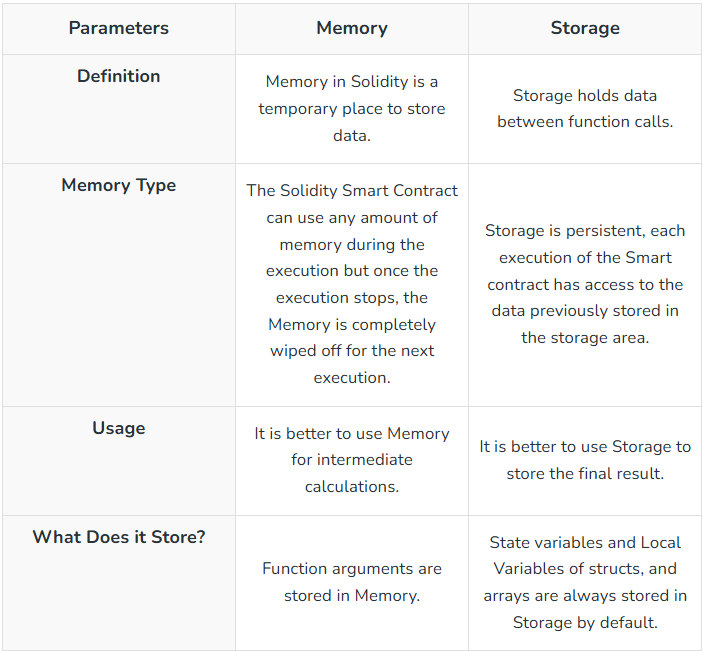

# Solidity Interview Questions & Answers

### Questions

| No. | Questions                                                                                                                                                                                                                        |
| --- | -------------------------------------------------------------------------------------------------------------------------------------------------------------------------------------------------------------------------------- |
|     | **Behavioural Questions**                                                                                                                                                                                                                   
| 1   | [What is Solidity?](#What-is-Solidity)
| 2   | [What are some important features of Solidity?](#What-are-some-important-features-of-Solidity)
| 3   | [What types of applications can be developed using Solidity?](#What-types-of-applications-can-be-developed-using-Solidity)
| 4   | [What are the main differences between Solidity and other programming languages like Python, Java, or C++?](#what-are-the-main-differences-between-solidity-and-other-programming-languages-like-python-java-or-c)
| 5   | [What is machine code in relation to Solidity contracts?](#What-is-machine-code-in-relation-to-Solidity-contracts)
| 6   | [What is an enum? What are the restrictions on their use?](#What-is-an-enum-What-are-the-restrictions-on-their-use)
| 7   | [What is EVM bytecode?](#What-is-EVM-bytecode)
| 8   | [What is a library and how many types are there?](#What-is-a-library-and-how-many-types-are-there)
| 9   | [What is the function of the consensus algorithm?](#What-is-the-function-of-the-consensus-algorithm)
| 10   | [What do you understand about the Ethereum network?](#What-do-you-understand-about-the-Ethereum-network)
| 11   | [What are the differences between Ethereum and blockchain and bitcoin?](#What-are-the-differences-between-Ethereum-and-blockchain-and-bitcoin)
| 12   | [What are the benefits of using smart contracts on Ethereum?](#What-are-the-benefits-of-using-smart-contracts-on-Ethereum)
| 13   | [What tools can be used for testing Solidity codes?](#What-tools-can-be-used-for-testing-Solidity-codes)
| 14   | [Is it possible to use loops in Solidity?](#Is-it-possible-to-use-loops-in-Solidity)
| 15   | [What is a constant function in Solidity?](#What-is-a-constant-function-in-Solidity)
| 16   | [What is the concept of storage variables in Solidity?](#What-is-the-concept-of-storage-variables-in-Solidity)
| 17   | [What is the first thing that needs to be defined when creating a Solidity file?](#What-is-the-first-thing-that-needs-to-be-defined-when-creating-a-Solidity-file)
| 18   | [What is a smart contract’s ABI?](#What-is-a-smart-contracts-ABI)
| 19   | [What type of language is Solidity?](#What-type-of-language-is-Solidity)
| 20   | [What are the two APIs that a smart contract uses to interface with it?](#What-are-the-two-APIs-that-a-smart-contract-uses-to-interface-with-it)
| 21   | [Why is Solidity used in blockchain?](#Why-is-Solidity-used-in-blockchain)
| 22   | [Is Solidity frontend or backend?](#Is-Solidity-frontend-or-backend)
| 23   | [How much do Solidity developers make?](#How-much-do-Solidity-developers-make)
| 24   | [Is Solidity the future?](#Is-Solidity-the-future)
| 25   | [What extension does the source file have in Solidity?](#What-extension-does-the-source-file-have-in-Solidity)
| 26   | [What is a smart contract?](#What-is-a-smart-contract)
| 27   | [What is a gas limit in Solidity?](#What-is-a-gas-limit-in-Solidity)
| 28   | [What is a variable in Solidity?](#What-is-a-variable-in-Solidity)
| 29   | [What is an event in Solidity?](#What-is-an-event-in-Solidity)
| 30   | [What is a library in Solidity?](#What-is-a-library-in-Solidity)
| 31   | [What is the constant function in Solidity?](#What-is-the-constant-function-in-Solidity)
| 32   | [What are hexadecimal literals in Solidity?](#What-are-hexadecimal-literals-in-Solidity)
| 33   | [What are the different Ether units available in Solidity?](#What-are-the-different-Ether-units-available-in-Solidity)
| 34   | [What time units are available in Solidity?](#What-time-units-are-available-in-Solidity)
| 35   | [What are storage variables in Solidity?](#What-are-storage-variables-in-Solidity)
| 36   | [What are source files in Solidity?](#What-are-source-files-in-Solidity)
| 37   | [What are state variables in Solidity?](#What-are-state-variables-in-Solidity)
| 38   | [What are the main components of a Solidity Smart Contract?](#What-are-the-main-components-of-a-Solidity-Smart-Contract)
| 39   | [What is special in smart contracts compared to other programs?](#What-is-special-in-smart-contracts-compared-to-other-programs)
| 40   | [List the difference between unit8 and unit16.](#List-the-difference-between-unit8-and-unit16)
| 41   | [What are private and public variables in Solidity?](#What-are-private-and-public-variables-in-Solidity)
| 42   | [List the differences between view and pure functions.](#List-the-differences-between-view-and-pure-functions)
| 43   | [List the difference between memory and storage in Solidity.](#List-the-difference-between-memory-and-storage-in-Solidity)
| 44   | [List the differences between struct and array.](#List-the-differences-between-struct-and-array)
| 45   | [000](#000)
| 46   | [111](#111)
| 47   | [222](#222)
| 48   | [333](#333)
| 49   | [444](#444)

## Answers
1. ### What is Solidity?
   
Solidity is a high-level language used in the blockchain ecosystem for implementing smart contracts. Solidity is an object-oriented programming language developed by Christian Reitwiessner, Alex Beregszaszi, and several former Ethereum core contributors for implementing smart contracts on various blockchain platforms like Ethereum. It is used to implement smart contracts that implement business logic and generates a chain of transaction records in the blockchain system. Designed specifically for targeting the Ethereum Virtual Machine, Solidity was influenced by several programming languages, such as JavaScript, Python, and C++.
    **[⬆ Back to Top](#questions)**
    
2.  ### What are some important features of Solidity?

Solidity has some salient features, which include libraries, contracts, and inheritance support. With Solidity, users can also create custom data types which can be a crucial part of smart contract development.<ui><li>Solidity is a statically-typed object-oriented language.</li><li>It is highly influenced by Python, C++, and JavaScript which runs on EVM.</li><li>It is designed for implementing smart contracts.</li><li>It can be used for implementing contracts for functionalities like Voting, Crowdfunding, Multi-signature wallets, etc.</li><li>Solidity is a primary language for blockchain platforms.</li></ui>
    **[⬆ Back to Top](#questions)**

3. ### What types of applications can be developed using Solidity?
   
Solidity finds its application in creating smart contracts on Ethereum, which is a decentralized platform that is responsible for running smart contracts. Smart contracts function just as programmed and they are not prone to third-party interference. While it is most commonly used for developing smart contracts, you can also develop complex decentralized applications. You can develop various aspects, such as voting systems, crowdfunding platforms, decentralized exchanges, lending platforms, and much more.
    **[⬆ Back to Top](#questions)**

4. ### What are the main differences between Solidity and other programming languages like Python, Java, or C++?

One main difference between Solidity and other programming languages like Python, C++, and Java is their application. While you can create centralized applications using these popular programming languages, Solidity is created to work with the Ethereum Virtual Machine. Therefore, it has certain special features such as creating smart contracts.
    **[⬆ Back to Top](#questions)**

5. ### What is machine code in relation to Solidity contracts?

Machine codes are a compilation of solidity contracts, which are written in a high-level language. And it is the machine code that is executed on the Ethereum blockchain by the computer’s processor. A basic understanding of machine code is needed to understand what Solidity contracts are and how they work.
    **[⬆ Back to Top](#questions)**

6. ### What is an enum? What are the restrictions on their use?

Enums are one of the methods used for creating user-defined types in Solidity. While you can implement an implicit conversion when using enums, they allow explicit conversion both to and from all integer types. Enums require at least one member, and the explicit conversions check the runtime value ranges. When there’s a failure, it results in an exception.
    **[⬆ Back to Top](#questions)**
    
7. ### What is EVM bytecode?

EVM is the abbreviation for Ethereum Virtual Machine, which is a low-level programming language that is compiled from Solidity— a high-level language. EVM helps reduce the operating system dependency by sitting between the application layer and the operating system. Because of EVM, Ethereum contracts can be on almost any computer.
    **[⬆ Back to Top](#questions)**
    
8. ### What is a library and how many types are there?

A library is a reusable piece of code that is used by smart contracts. There are two types of libraries, which are deployed and embedded libraries. While deployed libraries have an address of their own and can be used by several other smart contracts, embedded libraries are used by smart contracts wherein they are used as a part of the code. Additionally, embedded libraries do not have their own address.
    **[⬆ Back to Top](#questions)**
    
9. ### What is the function of the consensus algorithm?

The consensus algorithm is one of the aspects that make decentralization possible for <a herf="https://www.simplilearn.com/promising-uses-of-blockchain-article" target="_blank">blockchain-powered platforms and applications</a>. Consensus algorithms enable a mechanism that ensures a majority of the token holders and stakeholders agree upon and decide the credibility of a transaction while also deciding how to add new blocks of transactions. Consensus helps prevent the chances of any user making unauthorized changes.
    **[⬆ Back to Top](#questions)**

10. ### What do you understand about the Ethereum network?

The Ethereum network is an open-source blockchain platform that leverages <a herf="https://www.simplilearn.com/decoding-the-blockchain-technology-article" target="_blank">blockchain technology</a>. It is most commonly used for creating decentralized applications that do not depend on a single authority or a centralized entity and instead are monitored by all the peers.
    **[⬆ Back to Top](#questions)**
    
11. ### What are the differences between Ethereum and blockchain and bitcoin?

The most basic difference between <a herf="https://www.simplilearn.com/tutorials/blockchain-tutorial/ethereum-vs-bitcoin" target="_blank">bitcoin and Ethereum</a> is that <a herf="https://www.simplilearn.com/bitcoin-digital-currency-article" target="_blank">bitcoin</a> is a <a herf="https://www.simplilearn.com/tutorials/blockchain-tutorial/what-is-cryptocurrency" target="_blank">cryptocurrency</a> and the latter is a ledger technology that is used to create new programs. Bitcoin was created as an alternative to the national currency while the Ethereum platform was created for programmatic contracts and applications which use its own currency— ETH. While bitcoin transactions might take minutes to be completed, it only takes seconds to complete Ethereum transactions.
    **[⬆ Back to Top](#questions)**

12. ### What are the benefits of using smart contracts on Ethereum?

There are several advantages of using smart contracts on Ethereum over traditional contracts, such as a greater degree of security since smart contracts are stored on the blockchain. This makes these contracts immune to tampering. Since smart contracts are designed to automate various tasks including the transfer of funds and verification of identities, they’re more efficient.
    **[⬆ Back to Top](#questions)**

13. ### What tools can be used for testing Solidity codes?

Some of the most popular and commonly used tools for testing Solidity codes are Solium and Truffle. You can find and fix issues in your Solidity codes with Solium, which is a linter. Truffle can be used as a development environment, asset pipeline, and testing framework for Ethereum.
    **[⬆ Back to Top](#questions)**

14. ### Is it possible to use loops in Solidity?

Yes, you can use loops in Solidity. However, this may come with certain restrictions such as not being able to use a for loop for iterating over an array. One thing to remember is to avoid using infinite loops in Solidity. When you create infinite loops, it results in the loss of gas and failure to continue executing your contract.
    **[⬆ Back to Top](#questions)**

15. ### What is a constant function in Solidity?

A constant function is one that does not make any modifications to the state of the contract. Therefore, you can call the function from anywhere without worrying about security concerns.
    **[⬆ Back to Top](#questions)**

16. ### What is the concept of storage variables in Solidity?

The variables stored on the <a herf="https://www.simplilearn.com/tutorials/blockchain-tutorial/what-is-blockchain" target="_blank">blockchain</a> are referred to as storage variables in Solidity. These variables are used for storing important data concerning the contract. Storage variables cannot be changed and are permanent.
    **[⬆ Back to Top](#questions)**

17. ### What is the first thing that needs to be defined when creating a Solidity file?

The first you should define when creating a Solidity file is the class. This helps avoid errors related to compilation that is caused due to incompatibility between various versions of Solidity. Therefore, the version number must be declared.
    **[⬆ Back to Top](#questions)**
    
18. ### What is a smart contract’s ABI?

A smart contract’s ABI specifies its interface and the set of functions accessed from outside the smart contract. The ABI is used only for defining the events of the contract and function signatures, such as names of the function, return types, and argument types. However, it does not define their implementation.
    **[⬆ Back to Top](#questions)**
    
19. ### What type of language is Solidity?

Solidity is a statically-typed high-0level object-oriented programming language designed for developing smart contracts that run on Ethereum Virtual Machine (EVM). 
It makes use of ECMAScript-like syntax. Therefore, existing web developers would be familiar with it.
    **[⬆ Back to Top](#questions)**
    
20. ### What are the two APIs that a smart contract uses to interface with it?

The two APIs used by a smart contract to interface with it are eth_sendTransaction and eth_call. Calls, when compared to gas, as a better option because gas is expensive while calls don’t cost anything. Therefore, while gas can change the blockchain, calls don’t. However, while transactions don’t return a value, that is not the case with calls.
    **[⬆ Back to Top](#questions)**

21. ### Why is Solidity used in blockchain?

Solidity is used in blockchains for creating smart contracts. These smart contracts are responsible for implementing business logic and generating transactional records in the blockchain system. Solidity is used for various blockchain platforms, such as Ethereum, Ethereum Classic, and Binance Smart Chain.<ui><li>It is used to create smart contracts that implement business logic.</li><li>Smart contracts can be used for various purposes like multi-signature wallets, Voting, Bind auctions, Crowdfunding, etc.</li><li>Smart contracts can be used to automate transactions on the blockchain.</li></ui>
    **[⬆ Back to Top](#questions)**

22. ### Is Solidity frontend or backend?

Solidity is a backend language. The reason why blockchain platforms need a different backend language with specific features is that the front end is similar for both centralized and decentralized applications. What makes them different is the backend, which requires a unique high-level programming language such as Solidity.
    **[⬆ Back to Top](#questions)**

23. ### How much do Solidity developers make?

Solidity developers have the scope to earn well with time owing to the demand for professionals who can use the language to create smart contracts for blockchain systems. The current national average salary that Solidity developers can earn is USD 1,20,000 per annum in United States.
    **[⬆ Back to Top](#questions)**

24. ### Is Solidity the future?

Since decentralized applications and programs are gaining more popularity with time and have a greater scope of application for different sectors, it is safe to say that Solidity is the future.
    **[⬆ Back to Top](#questions)**

25. ### What extension does the source file have in Solidity?

The Solidity contract file/ library file has an extension .sol. For example, Geeksforgeeks.sol. The SOL script is a file that is programmed in Solidity programming language in the same way files are created in C++ or any other programming language. The SOL file contains the solidity source code and is used to create smart contracts for the transactions on the blockchain.
    **[⬆ Back to Top](#questions)**

26. ### What is a smart contract?

Smart contracts are computer programs stored on the blockchain that are executed when the predetermined conditions are met.<ui><li>These are used to automate the execution so that all the participants can be immediately certain of the outcome.</li><li>Smart contracts can automatically trigger the next action when the conditions are met.</li><li>They remove the need for intermediaries to handle the transactions.</li><li>Smart contracts don’t require any paperwork to process as they are digital and automated.</li></ui>
    **[⬆ Back to Top](#questions)**

27. ### What is a gas limit in Solidity?

A gas limit in Solidity refers to the maximum amount of gas a user is willing to spend on a transaction. When creating a transaction on the Ethereum Network user must specify the gas limit to ensure that they don’t spend more gas than they intend.<ui><li>If a transaction requires more gas than the specified gas limit, the transaction will be reverted, and the used gas will not be refunded.</li><li>If a transaction requires less than the gas limit, the remaining gas will be returned to the user.</li></ui>
    **[⬆ Back to Top](#questions)**

28. ### What is a variable in Solidity?

A variable in Solidity is a storage location that can contain values. These values can be changed during runtime. Variables are broadly classified as state variables and local variables.<ui><li>State variables are the variables that are declared outside any function in a contract and are permanently stored on the Ethereum blockchain.</li><li>Local variables are the variables that are declared within the function and their scope is limited to that function.</li></ui>
    **[⬆ Back to Top](#questions)**

29. ### What is an event in Solidity?

An event is an inheritable member of the contract, which stores the arguments passed in the transaction logs when emitted.<ui><li>Generally, events are used to inform the calling application about the current state of the contract, with the help of the logging facility of EVM.</li><li>Events notify the applications about the change made to the contracts and applications which can be used to execute the dependent logic.</li></ui>
    **[⬆ Back to Top](#questions)**

30. ### What is a library in Solidity?

Libraries in solidity are similar to contracts that contain reusable codes. A library has functions that can be called by other contracts.<ui><li>Deploying a common code by creating a library reduces the gas cost.</li><li>Functions of the library can be called directly when they do not modify the state variables i.e. only pure and view functions can be called from outside of the library.</li><li>The library does not have state variables, it cannot inherit any element and cannot be inherited.</li></ui>
    **[⬆ Back to Top](#questions)**

31. ### What is the constant function in Solidity?

A constant function does not change the state of the contract. Therefore, the constant function can be called from anywhere without concerning the security issues it will impose as the function will not affect the state of the contract.
    **[⬆ Back to Top](#questions)**
    
32. ### What are hexadecimal literals in Solidity?

Hexadecimal literals are prefixed with hex keyword. These are enclosed in double or single quotes. For example, hex”2AB3F”. Hexadecimal literals have the same convertibility restrictions as string literals.
    **[⬆ Back to Top](#questions)**
    
33. ### What are the different Ether units available in Solidity?

The different ether units available in Solidity are wei, kwei, gwei, mwei, microether, milliether, ether.
    **[⬆ Back to Top](#questions)**
    
34. ### What time units are available in Solidity?

Solidity has time units where the lowest time unit is second and other time units are seconds, minutes, hours, days, and weeks.
    **[⬆ Back to Top](#questions)**

35. ### What are storage variables in Solidity?

Storage variables are the variables that are stored on the blockchain. These variables are permanent and are used for storing important data concerning the contract. They are also known as dynamic variables and are stored in the storage and cannot be changed. They are persistent.
    **[⬆ Back to Top](#questions)**

36. ### What are source files in Solidity?

A solidity source file can contain any number of smart contracts or library definitions in a single file.<ui><li>The source file can contain any number of contract definitions, imports, and pragma.</li><li>It is recommended that a developer maintains different source files for each contract or library definition to have better code maintainability. </li><li>The solidity source file has .sol extension.</li></ui>
    **[⬆ Back to Top](#questions)**

37. ### What are state variables in Solidity?

State variables are stored in the storage. These values are permanently stored in the contract’s storage.<ui><li>They store data directly on the blockchain.</li><li>These are declared inside a contract and outside the function.</li><li>These are expensive as they cost gas.</li><li>These can be assigned one of the access modifiers, public, private, or internal.</li></ui>
    **[⬆ Back to Top](#questions)**

38. ### What are the main components of a Solidity Smart Contract?

The main components of a Solidity smart contract are:<ui><li><b>Pragma statement:</b> This statement specifies the required version of the solidity compiler for the smart contract.</li><li><b>State variables:</b> These are used to store the contract’s state data persistently on the blockchain.</li><li><b>Constructor:</b> This is a special function that is used for initializing state variables and called at once at contract deployment.</li><li><b>Functions:</b> Functions define the logic and behavior of the contract.</li><li><b>Modifiers:</b> These are the reusable code snippets that can be added to functions to modify their behavior.</li><li><b>Events:</b> Events are custom data structures that emit transaction logs for external listeners to monitor contract activity and state changes.</li><li><b>Inheritance:</b> Inheritance allows a contract to inherit properties from a base contract thus enabling code reuse and abstraction.</li></ui>
    **[⬆ Back to Top](#questions)**

39. ### What is special in smart contracts compared to other programs?

'<ui><li><b>Immutable:</b> Once the smart contracts are deployed on the blockchain, their code cannot be altered. This makes the smart contract invulnerable to unauthorized access.</li><li><b>Decentralized execution:</b> The execution of smart contracts does not depend on a single authority but instead on multiple nodes that are spread around the world.</li><li><b>Self-executing:</b> Smart contracts are designed to execute predefined actions automatically when certain conditions specified in the contract are met. This reduces the need for intermediaries thus reducing the potential for human error.</li><li><b>Tokenization:</b> Smart contracts can be used to create and manage digital assets through the use of tokens.</li></ui>
    **[⬆ Back to Top](#questions)**

40. ### List the difference between unit8 and unit16.

uint8 stores a number of up to 2^8-1. It has 8 bits.
uint16 stores number up to 2^16-1. It has 16 bits.
    **[⬆ Back to Top](#questions)**

41. ### What are private and public variables in Solidity?

Private variables can be accessed only within the contract that declares them. These are not accessible by an external entity nor by the contracts derived from the contract in which they are declared.
Public variables can be accessed by any contract, function, or external entity. When these variables are declared in Solidity, the compiler automatically generates a getter function that allows any external entity or contract to read its value.
    **[⬆ Back to Top](#questions)**
    
42. ### List the differences between view and pure functions.

    **[⬆ Back to Top](#questions)**
    
43. ### List the difference between memory and storage in Solidity.

    **[⬆ Back to Top](#questions)**
    
44. ### List the differences between struct and array.

    **[⬆ Back to Top](#questions)**

45. ### 000

000
    **[⬆ Back to Top](#questions)**

46. ### 111

111
    **[⬆ Back to Top](#questions)**

47. ### 222

222
    **[⬆ Back to Top](#questions)**

48. ### 333

333
    **[⬆ Back to Top](#questions)**

49. ### 444

444
    **[⬆ Back to Top](#questions)**