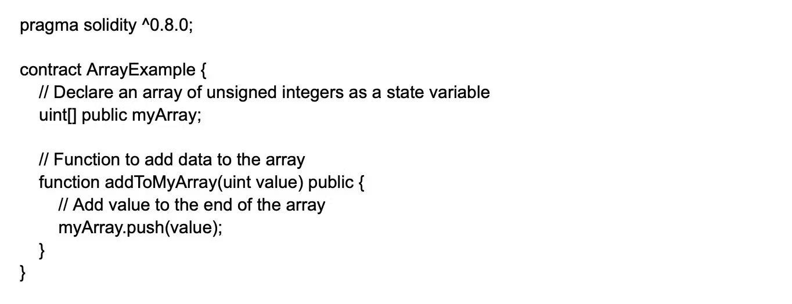
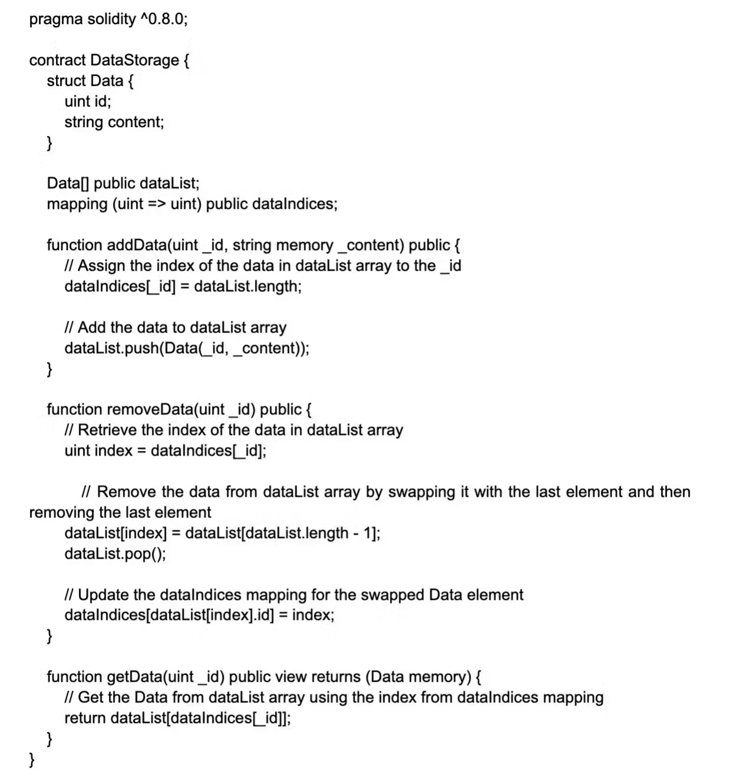
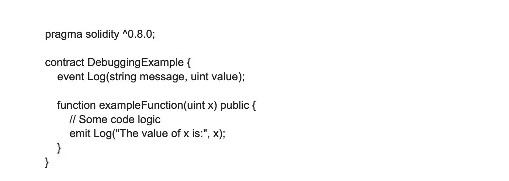
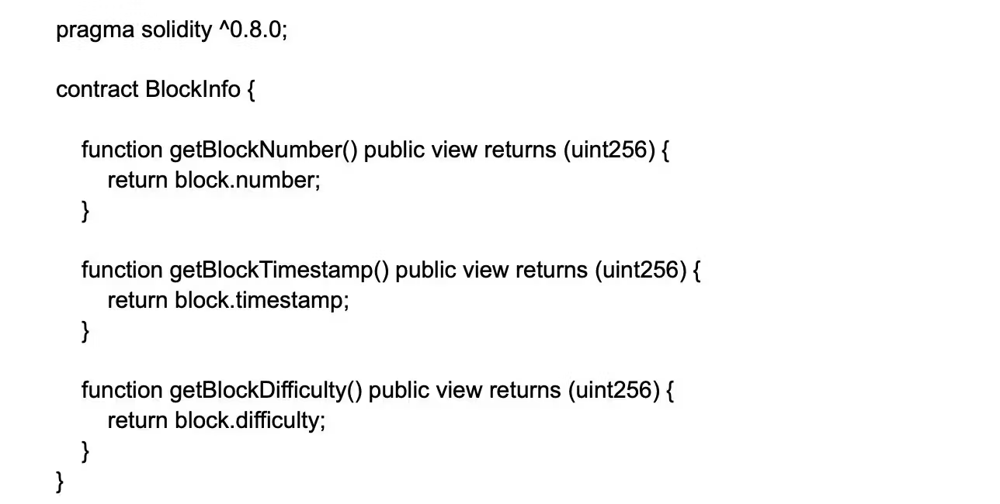
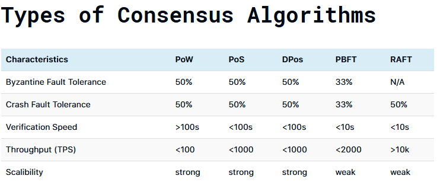
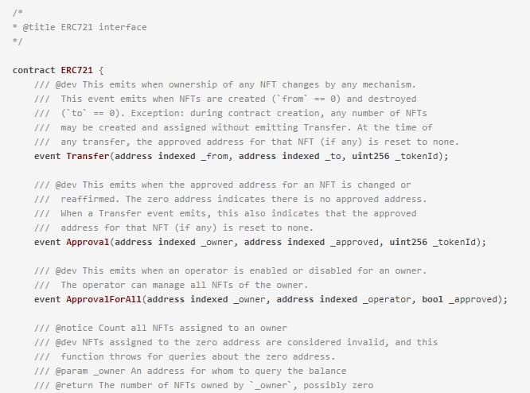
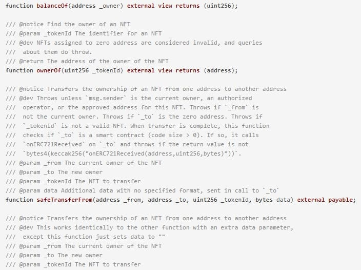
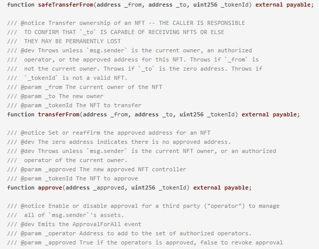
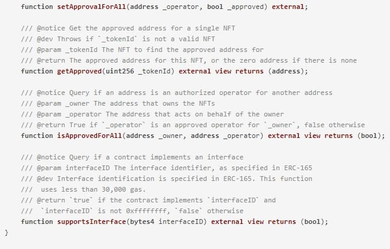

# Solidity Interview Questions & Answers

### Questions

| No. | Questions                                                                                                                                                                                                                        |
| --- | -------------------------------------------------------------------------------------------------------------------------------------------------------------------------------------------------------------------------------- |
|     | **Behavioural Questions**                                                                                                                                                                                                                   
| 1   | [What is Solidity?](#What-is-Solidity)
| 2   | [What are some important features of Solidity?](#What-are-some-important-features-of-Solidity)
| 3   | [What types of applications can be developed using Solidity?](#What-types-of-applications-can-be-developed-using-Solidity)
| 4   | [What are the main differences between Solidity and other programming languages like Python, Java, or C++?](#what-are-the-main-differences-between-solidity-and-other-programming-languages-like-python-java-or-c)
| 5   | [What is machine code in relation to Solidity contracts?](#What-is-machine-code-in-relation-to-Solidity-contracts)
| 6   | [What is an enum? What are the restrictions on their use?](#What-is-an-enum-What-are-the-restrictions-on-their-use)
| 7   | [What is EVM bytecode?](#What-is-EVM-bytecode)
| 8   | [What is a library and how many types are there?](#What-is-a-library-and-how-many-types-are-there)
| 9   | [What is the function of the consensus algorithm?](#What-is-the-function-of-the-consensus-algorithm)
| 10   | [What do you understand about the Ethereum network?](#What-do-you-understand-about-the-Ethereum-network)
| 11   | [What are the differences between Ethereum and blockchain and bitcoin?](#What-are-the-differences-between-Ethereum-and-blockchain-and-bitcoin)
| 12   | [What are the benefits of using smart contracts on Ethereum?](#What-are-the-benefits-of-using-smart-contracts-on-Ethereum)
| 13   | [What tools can be used for testing Solidity codes?](#What-tools-can-be-used-for-testing-Solidity-codes)
| 14   | [Is it possible to use loops in Solidity?](#Is-it-possible-to-use-loops-in-Solidity)
| 15   | [What is a constant function in Solidity?](#What-is-a-constant-function-in-Solidity)
| 16   | [What is the concept of storage variables in Solidity?](#What-is-the-concept-of-storage-variables-in-Solidity)
| 17   | [What is the first thing that needs to be defined when creating a Solidity file?](#What-is-the-first-thing-that-needs-to-be-defined-when-creating-a-Solidity-file)
| 18   | [What is a smart contract's ABI?](#What-is-a-smart-contracts-ABI)
| 19   | [What type of language is Solidity?](#What-type-of-language-is-Solidity)
| 20   | [What are the two APIs that a smart contract uses to interface with it?](#What-are-the-two-APIs-that-a-smart-contract-uses-to-interface-with-it)
| 21   | [Why is Solidity used in blockchain?](#Why-is-Solidity-used-in-blockchain)
| 22   | [Is Solidity frontend or backend?](#Is-Solidity-frontend-or-backend)
| 23   | [How much do Solidity developers make?](#How-much-do-Solidity-developers-make)
| 24   | [Is Solidity the future?](#Is-Solidity-the-future)
| 25   | [What extension does the source file have in Solidity?](#What-extension-does-the-source-file-have-in-Solidity)
| 26   | [What is a smart contract?](#What-is-a-smart-contract)
| 27   | [What is a gas limit in Solidity?](#What-is-a-gas-limit-in-Solidity)
| 28   | [What is a variable in Solidity?](#What-is-a-variable-in-Solidity)
| 29   | [What is an event in Solidity?](#What-is-an-event-in-Solidity)
| 30   | [What is a library in Solidity?](#What-is-a-library-in-Solidity)
| 31   | [How does the 'view' function modifier work with functions?](#How-does-the-view-function-modifier-work-with-functions)
| 32   | [What are hexadecimal literals in Solidity?](#What-are-hexadecimal-literals-in-Solidity)
| 33   | [What are the different Ether units available in Solidity?](#What-are-the-different-Ether-units-available-in-Solidity)
| 34   | [What time units are available in Solidity?](#What-time-units-are-available-in-Solidity)
| 35   | [What are storage variables in Solidity?](#What-are-storage-variables-in-Solidity)
| 36   | [What are source files in Solidity?](#What-are-source-files-in-Solidity)
| 37   | [What are state variables in Solidity?](#What-are-state-variables-in-Solidity)
| 38   | [What are the main components of a Solidity Smart Contract?](#What-are-the-main-components-of-a-Solidity-Smart-Contract)
| 39   | [What is special in smart contracts compared to other programs?](#What-is-special-in-smart-contracts-compared-to-other-programs)
| 40   | [List the difference between unit8 and unit16. Give one difference between a uint8 and a uint16?](#List-the-difference-between-unit8-and-unit16-Give-one-difference-between-a-uint8-and-a-uint16)
| 41   | [What are private and public variables in Solidity?](#What-are-private-and-public-variables-in-Solidity)
| 42   | [List the differences between view and pure functions.](#List-the-differences-between-view-and-pure-functions)
| 43   | [List the difference between memory and storage in Solidity.](#List-the-difference-between-memory-and-storage-in-Solidity)
| 44   | [List the differences between struct and array.](#List-the-differences-between-struct-and-array)
| 45   | [How much is 1 gwei of Ether?](#How-much-is-1-gwei-of-Ether)
| 46   | [How much is 1 wei of Ether?](#How-much-is-1-wei-of-Ether)
| 47   | [How much is 1 kwei of Ether?](#How-much-is-1-kwei-of-Ether)
| 48   | [What is the difference between Solidity and other programming languages?](#What-is-the-difference-between-Solidity-and-other-programming-languages)
| 49   | [What is the ABI of the contract?](#What-is-the-ABI-of-the-contract)
| 50  | [What are the different types of conversions allowed in Solidity?](#What-are-the-different-types-of-conversions-allowed-in-Solidity)
| 51  | [How does error handling work in Solidity?](#How-does-error-handling-work-in-Solidity)
| 52  | [What do revert() and revert(string reason) do?](#What-do-revert-and-revertstring-reason-do)
| 53  | [What happens if the smart contract does not specify the Solidity version?](#What-happens-if-the-smart-contract-does-not-specify-the-Solidity-version)
| 54  | [Explain the role of the Ethereum Virtual Machine (EVM).](#Explain-the-role-of-the-Ethereum-Virtual-Machine-EVM)
| 55  | [How does the Ethereum Virtual Machine (EVM) work?](#How-does-the-Ethereum-Virtual-Machine-EVM-work)
| 56  | [What is a proxy contract in Solidity?](#What-is-a-proxy-contract-in-Solidity)
| 57  | [What is a staking pool in Solidity?](#What-is-a-staking-pool-in-Solidity)
| 58  | [List the difference between public and private visibility modifiers in Solidity?](#List-the-difference-between-public-and-private-visibility-modifiers-in-Solidity)
| 59  | [List different types of libraries in Solidity.](#List-different-types-of-libraries-in-Solidity)
| 60  | [What is Decentralized Exchange (DEX)?](#What-is-Decentralized-Exchange-DEX)
| 61  | [What is assert and require in Solidity?](#What-is-assert-and-require-in-Solidity)
| 62  | [What is the formula to calculate Ethereum gas cost?](#What-is-the-formula-to-calculate-Ethereum-gas-cost)
| 63  | [What is the difference between tx.origin and msg.sender?](#What-is-the-difference-between-txorigin-and-msgsender)
| 64  | [What is the largest value a uint256 can store?](#What-is-the-largest-value-a-uint256-can-store)
| 65  | [What is a sandwich attack?](#What-is-a-sandwich-attack)
| 66  | [What is ERC165 used for?](#What-is-ERC165-used-for)
| 67  | [What is TWAP?](#What-is-TWAP)
| 68  | [What is a bonding curve?](#What-is-a-bonding-curve)
| 69  | [What is a reentrancy attack in Solidity?](#What-is-a-reentrancy-attack-in-Solidity)
| 70  | [Can you explain what Solidity is and its primary use case?](#Can-you-explain-what-Solidity-is-and-its-primary-use-case)
| 71  | [How does Solidity handle contract inheritance?](#How-does-Solidity-handle-contract-inheritance)
| 72  | [What are the key differences between 'memory' and 'storage' in Solidity?](#What-are-the-key-differences-between-memory-and-storage-in-Solidity)
| 73  | [Explain the concept of 'gas' in Ethereum and how it relates to Solidity programming.](#Explain-the-concept-of-gas-in-Ethereum-and-how-it-relates-to-Solidity-programming)
| 74  | [What are events in Solidity and why are they useful?](#What-are-events-in-Solidity-and-why-are-they-useful)
| 75  | [How do you handle errors and exceptions in Solidity?](#How-do-you-handle-errors-and-exceptions-in-Solidity)
| 76  | [What are the main security considerations when developing smart contracts in Solidity?](#What-are-the-main-security-considerations-when-developing-smart-contracts-in-Solidity)
| 77  | [How would you optimize a Solidity contract to reduce gas costs?](#How-would-you-optimize-a-Solidity-contract-to-reduce-gas-costs)
| 78  | [How do you manage state variables in a Solidity contract?](#How-do-you-manage-state-variables-in-a-Solidity-contract)
| 79  | [What is the purpose of the 'constructor' function in Solidity?](#What-is-the-purpose-of-the-constructor-function-in-Solidity)
| 80  | [Can you explain the difference between 'internal' and 'private' functions in Solidity?](#Can-you-explain-the-difference-between-internal-and-private-functions-in-Solidity)
| 81  | [What are the advantages of using 'modifier' in Solidity?](#What-are-the-advantages-of-using-modifier-in-Solidity)
| 82  | [How do you handle contract upgrades in Solidity?](#How-do-you-handle-contract-upgrades-in-Solidity)
| 83  | [What is a 'multi-signature' wallet, and why is it used in Solidity?](#What-is-a-multi-signature-wallet-and-why-is-it-used-in-Solidity)
| 84  | [How do you approach debugging and troubleshooting Solidity contracts?](#How-do-you-approach-debugging-and-troubleshooting-Solidity-contracts)
| 85  | [What is the 'self-destruct' function in Solidity, and when should it be used?](#What-is-the-self-destruct-function-in-Solidity-and-when-should-it-be-used)
| 86  | [How do you handle access control in Solidity contracts?](#How-do-you-handle-access-control-in-Solidity-contracts)
| 87  | [What are the gas optimizations techniques you would use in a Solidity contract?](#What-are-the-gas-optimizations-techniques-you-would-use-in-a-Solidity-contract)
| 88  | [How would you explain the concept of 'gas' in Ethereum to a non-technical stakeholder?](#How-would-you-explain-the-concept-of-gas-in-Ethereum-to-a-non-technical-stakeholder)
| 89  | [Can you describe a situation where you had to optimize a smart contract for gas efficiency?](#Can-you-describe-a-situation-where-you-had-to-optimize-a-smart-contract-for-gas-efficiency)
| 90  | [How would you implement a time-lock feature in a smart contract?](#How-would-you-implement-a-time-lock-feature-in-a-smart-contract)
| 91  | [Explain the concept of 'reentrancy' and how you would prevent it in your smart contracts.](#Explain-the-concept-of-reentrancy-and-how-you-would-prevent-it-in-your-smart-contracts)
| 92  | [How would you design a smart contract system for a decentralized voting application?](#How-would-you-design-a-smart-contract-system-for-a-decentralized-voting-application)
| 93  | [How would you ensure the security of a smart contract in Solidity?](#How-would-you-ensure-the-security-of-a-smart-contract-in-Solidity)
| 94  | [What are common security vulnerabilities in Solidity and how can they be mitigated?](#What-are-common-security-vulnerabilities-in-Solidity-and-how-can-they-be-mitigated)
| 95  | [How do you handle the risks associated with external calls in Solidity?](#How-do-you-handle-the-risks-associated-with-external-calls-in-Solidity)
| 96  | [What steps would you take to avoid denial-of-service (DoS) attacks in Solidity?](#What-steps-would-you-take-to-avoid-denial-of-service-DoS-attacks-in-Solidity)
| 97  | [How would you secure sensitive data within a Solidity contract?](#How-would-you-secure-sensitive-data-within-a-Solidity-contract)
| 98  | [What is the importance of conducting security audits on Solidity smart contracts?](#What-is-the-importance-of-conducting-security-audits-on-Solidity-smart-contracts)
| 99  | [How do you handle private data in Solidity, given that the blockchain is public?](#How-do-you-handle-private-data-in-Solidity-given-that-the-blockchain-is-public)
| 100  | [What are the best practices for writing secure smart contracts in Solidity?](#What-are-the-best-practices-for-writing-secure-smart-contracts-in-Solidity)
| 101  | [How would you design a smart contract system for a decentralized lending platform?](#How-would-you-design-a-smart-contract-system-for-a-decentralized-lending-platform)
| 102  | [Describe a situation where you had to optimize a complex Solidity contract for gas efficiency. What strategies did you employ?](#Describe-a-situation-where-you-had-to-optimize-a-complex-Solidity-contract-for-gas-efficiency-What-strategies-did-you-employ)
| 103  | [How would you implement a voting system in Solidity that ensures one vote per address while maintaining voter privacy?](#How-would-you-implement-a-voting-system-in-Solidity-that-ensures-one-vote-per-address-while-maintaining-voter-privacy)
| 104  | [Explain how you would design a token vesting contract with multiple beneficiaries and varying vesting schedules.](#Explain-how-you-would-design-a-token-vesting-contract-with-multiple-beneficiaries-and-varying-vesting-schedules)
| 105  | [How would you implement a decentralized exchange (DEX) in Solidity, and what key features wouldXou include?](#How-would-you-implement-a-decentralized-exchange-DEX-in-Solidity-and-what-key-features-would-you-include)
| 106  | [Describe how you would implement a multi-signature wallet contract in Solidity.](#Describe-how-you-would-implement-a-multi-signature-wallet-contract-in-Solidity)
| 107  | [How would you design a contract system for a decentralized insurance platform?](#How-would-you-design-a-contract-system-for-a-decentralized-insurance-platform)
| 108  | [Explain how you would implement a yield farming contract in Solidity.](#Explain-how-you-would-implement-a-yield-farming-contract-in-Solidity)
| 109  | [How would you design a contract for a decentralized autonomous organization (DAO) in Solidity?](#How-would-you-design-a-contract-for-a-decentralized-autonomous-organization-DAO-in-Solidity)
| 110  | [Is Solidity statically or dynamically typed?](#Is-Solidity-statically-or-dynamically-typed)
| 111  | [What is the equivalent to the Java "Class" in Solidity?](#What-is-the-equivalent-to-the-Java-Class-in-Solidity)
| 112  | [What is an instance of a contract?](#What-is-an-instance-of-a-contract)
| 113  | [Give me a couple of differences between Java and Solidity.](#Give-me-a-couple-of-differences-between-Java-and-Solidity)
| 114  | [What is the very first thing you must specify in a Solidity file?](#What-is-the-very-first-thing-you-must-specify-in-a-Solidity-file)
| 115  | [What does a contract consist of?](#What-does-a-contract-consist-of)
| 116  | [What types of functions are there?](#What-types-of-functions-are-there)
| 117  | [What error will I get if I put multiple contract definitions into a single Solidity file?](#What-error-will-I-get-if-I-put-multiple-contract-definitions-into-a-single-Solidity-file)
| 118  | [What are some ways in which two contracts can interact?](#What-are-some-ways-in-which-two-contracts-can-interact)
| 119  | [What happens when you try to deploy a file with multiple contracts?](#What-happens-when-you-try-to-deploy-a-file-with-multiple-contracts)
| 120  | [What if I have a huge project, do I need to keep all my related contracts into a single file?](#What-if-I-have-a-huge-project-do-I-need-to-keep-all-my-related-contracts-into-a-single-file)
| 121  | [Can I only import local files?](#Can-I-only-import-local-files)
| 122  | [What parts is the memory of an EVM divided into?](#What-parts-is-the-memory-of-an-EVM-divided-into)
| 123  | [Explain Storage](#Explain-Storage)
| 124  | [Explain Memory](#Explain-Memory)
| 125  | [Explain Calldata](#Explain-Calldata)
| 126  | [What variables are stored in the Storage and Memory areas respectively? Give one difference between the state variable and the local variable?](#What-variables-are-stored-in-the-Storage-and-Memory-areas-respectively-Give-one-difference-between-the-state-variable-and-the-local-variable)
| 127  | [Take a look at the following code and explain which part of the code corresponds to wich memory area:](#Take-a-look-at-the-following-code-and-explain-which-part-of-the-code-corresponds-to-wich-memory-area)
| 128  | [Can I do this: function doSomething(uint[] storage args) internal returns(uint[] storage data) {...}](#Can-I-do-this)
| 129  | [Define Ethereum smart contract.](#Define-Ethereum-smart-contract)
| 130  | [Why is the Ethereum smart contract so special compared to other programs?](#Why-is-the-Ethereum-smart-contract-so-special-compared-to-other-programs)
| 131  | [Define Ethereum networks.](#Define-Ethereum-networks)
| 132  | [Explain enum.](#Explain-enum)
| 133  | [What is the method of payment for gas?](#What-is-the-method-of-payment-for-gas)
| 134  | [Who can read private and public variables?](#Who-can-read-private-and-public-variables)
| 135  | [Does the EVM understand Solidity?](#Does-the-EVM-understand-Solidity)
| 136  | [What is a function of Solidity?](#What-is-a-function-of-Solidity)
| 137  | [Describe an event in Solidity.](#Describe-an-event-in-Solidity)
| 138  | [What is the difference between public and private visibility in Solidity?](#What-is-the-difference-between-public-and-private-visibility-in-Solidity)
| 139  | [In Solidity, explain the constructor?](#In-Solidity-explain-the-constructor)
| 140  | [Explain delegatecall here in Solidity.](#Explain-delegatecall-here-in-Solidity)
| 141  | [What is a library?](#What-is-a-library)
| 142  | [How many types of libraries are there in Solidity?](#How-many-types-of-libraries-are-there-in-Solidity)
| 143  | [Mention two famous smart contract frameworks for Solidity.](#Mention-two-famous-smart-contract-frameworks-for-Solidity)
| 144  | [Mention two networks where you can deploy a Solidity smart contract.](#Mention-two-networks-where-you-can-deploy-a-Solidity-smart-contract)
| 145  | [Can you list some distinctions between view and pure functions?](#Can-you-list-some-distinctions-between-view-and-pure-functions)
| 146  | [Please outline some differences between the Ethereum blockchain and Bitcoin.](#Please-outline-some-differences-between-the-Ethereum-blockchain-and-Bitcoin)
| 147  | [Outline some differences between a struct and an array?](#Outline-some-differences-between-a-struct-and-an-array)
| 148  | [What do you need to do to deploy a smart contract to the Ethereum network?](#What-do-you-need-to-do-to-deploy-a-smart-contract-to-the-Ethereum-network)
| 149  | [Show the Solidity smart contract layout.](#Show-the-Solidity-smart-contract-layout)
| 150  | [Are private variables really private?](#Are-private-variables-really-private)
| 151  | [Explain when you would use an array versus a mapping.](#Explain-when-you-would-use-an-array-versus-a-mapping)
| 152  | [Give one difference between memory and storage in Solidity.](#Give-one-difference-between-memory-and-storage-in-Solidity)
| 153  | [What are Solidity modifiers?](#What-are-Solidity-modifiers)
| 154  | [What is a fallback function in Solidity?](#What-is-a-fallback-function-in-Solidity)
| 155  | [Define decentralized exchange (DEX)?](#Define-decentralized-exchange-DEX)
| 156  | [What is the difference between assert and require in Solidity?](#What-is-the-difference-between-assert-and-require-in-Solidity)
| 157  | [Give the name of 3 data types that you use often?](#Give-the-name-of-3-data-types-that-you-use-often)
| 158  | [In Solidity, how can you declare an array of integers?](#In-Solidity-how-can-you-declare-an-array-of-integers)
| 159  | [How can you map addresses to booleans in Solidity?](#How-can-you-map-addresses-to-booleans-in-Solidity)
| 160  | [Write the code to add data to an array that has been declared as a state variable?](#Write-the-code-to-add-data-to-an-array-that-has-been-declared-as-a-state-variable)
| 161  | [How can you add data to a mapping which is declared as a state variable?](#How-can-you-add-data-to-a-mapping-which-is-declared-as-a-state-variable)
| 162  | [Give some reasons why you need a private variable in your code?](#Give-some-reasons-why-you-need-a-private-variable-in-your-code)
| 163  | [Write the 2 APIs used to interact with a smart contract?](#Write-the-2-APIs-used-to-interact-with-a-smart-contract)
| 164  | [List 4 famous Ethereum wallets](#List-4-famous-Ethereum-wallets)
| 165  | [List some ways you can instantiate a struct?](#List-some-ways-you-can-instantiate-a-struct)
| 166  | [How can you instantiate a struct with inner mapping?](#How-can-you-instantiate-a-struct-with-inner-mapping)
| 167  | [How can you join array and mapping to allow iteration and struct lookup?](#How-can-you-join-array-and-mapping-to-allow-iteration-and-struct-lookup)
| 168  | [For an in-memory array, how to add a value?](#For-an-in-memory-array-how-to-add-a-value)
| 169  | [What is the difference between an ERC-20 and ERC-721 token?](#What-is-the-difference-between-an-ERC-20-and-ERC-721-token)
| 170  | [Explain reentrancy attack?](#Explain-reentrancy-attack)
| 171  | [What is a hard fork in Solidity?](#What-is-a-hard-fork-in-Solidity)
| 172  | [What is the difference between a requirement and a revert statement in Solidity?](#What-is-the-difference-between-a-requirement-and-a-revert-statement-in-Solidity)
| 173  | [What is a token standard in Solidity?](#What-is-a-token-standard-in-Solidity)
| 174  | [What is a privacy token in Solidity?](#What-is-a-privacy-token-in-Solidity)
| 175  | [What is a governance token in Solidity?](#What-is-a-governance-token-in-Solidity)
| 176  | [What is a wrapped token in Solidity?](#What-is-a-wrapped-token-in-Solidity)
| 177  | [What is a rollup?](#What-is-a-rollup)
| 178  | [What is a soft fork in Solidity?](#What-is-a-soft-fork-in-Solidity)
| 179  | [What is a decentralized application (dApp) in Solidity?](#What-is-a-decentralized-application-dApp-in-Solidity)
| 180  | [Give one difference between an event and a function in Solidity.](#Give-one-difference-between-an-event-and-a-function-in-Solidity)
| 181  | [How to get the list of all keys in a mapping (like object.keys() in Javascript)?](#How-to-get-the-list-of-all-keys-in-a-mapping-like-objectkeys-in-Javascript)
| 182  | [List 3 mechanisms for code reuse here.](#List-3-mechanisms-for-code-reuse-here)
| 183  | [How can you make one contract inherit from the other?](#How-can-you-make-one-contract-inherit-from-the-other)
| 184  | [Is it compulsory to make an address “address payable” to transfer ERC20 tokens?](#Is-it-compulsory-to-make-an-address-address-payable-to-transfer-ERC20-tokens)
| 185  | [What’s new with Solidity 0.5.x vs. 0.4.x?](#Whats-new-with-Solidity-05x-vs-04x)
| 186  | [Give three ways to save gas.](#Give-three-ways-to-save-gas)
| 187  | [Write in an order uint128, bytes32, and another uint128 to save gas.](#Write-in-an-order-uint128-bytes32-and-another-uint128-to-save-gas)
| 188  | [What do you know about the ABIEncoderV2 pragma statement?](#What-do-you-know-about-the-ABIEncoderV2-pragma-statement)
| 189  | [What is a decentralized identifier (DID) in Solidity?](#What-is-a-decentralized-identifier-DID-in-Solidity)
| 190  | [Write two kinds of assembly?](#Write-two-kinds-of-assembly)
| 191  | [How to protect against a reentrancy attack?](#How-to-protect-against-a-reentrancy-attack)
| 192  | [Is it feasible to send a transaction without having to charge customers for gas?](#Is-it-feasible-to-send-a-transaction-without-having-to-charge-customers-for-gas)
| 193  | [What is the use of the payable keyword in Solidity?](#What-is-the-use-of-the-payable-keyword-in-Solidity)
| 194  | [What is the equivalent of a Javascript console.log in Solidity for debugging?](#What-is-the-equivalent-of-a-Javascript-consolelog-in-Solidity-for-debugging)
| 195  | [What do you understand by PoW consensus?](#What-do-you-understand-by-PoW-consensus)
| 196  | [Explain consensus algorithm’s function?](#Explain-consensus-algorithms-function)
| 197  | [An abstract contract is preferable over an interface in Solidity. Why?](#An-abstract-contract-is-preferable-over-an-interface-in-Solidity-Why)
| 198  | [Mention some restrictions on enumeration use?](#Mention-some-restrictions-on-enumeration-use)
| 199  | [What is the indexed keyword in the event definition?](#What-is-the-indexed-keyword-in-the-event-definition)
| 200  | [What is a Merkle tree in Solidity?](#What-is-a-Merkle-tree-in-Solidity)
| 201  | [What is a sidechain in Solidity?](#What-is-a-sidechain-in-Solidity)
| 202  | [What is a state channel in Solidity?](#What-is-a-state-channel-in-Solidity)
| 203  | [What is a cross-chain bridge in Solidity?](#What-is-a-cross-chain-bridge-in-Solidity)
| 204  | [What is a flash mint in Solidity?](#What-is-a-flash-mint-in-Solidity)
| 205  | [What do you know about smart contract wallet?](#What-do-you-know-about-smart-contract-wallet)
| 206  | [What is a multi-signature wallet in Solidity?](#What-is-a-multi-signature-wallet-in-Solidity)
| 207  | [How can you prevent overflow and underflow issues while working with uint in Solidity?](#How-can-you-prevent-overflow-and-underflow-issues-while-working-with-uint-in-Solidity)
| 208  | [How can you implement a simple contract that accesses the block information in Solidity?](#How-can-you-implement-a-simple-contract-that-accesses-the-block-information-in-Solidity)
| 209  | [How can you implement a simple ERC20 token in Solidity?](#How-can-you-implement-a-simple-ERC20-token-in-Solidity)
| 210  | [How can you implement a time lock or delay on function execution in a Solidity contract?](#How-can-you-implement-a-time-lock-or-delay-on-function-execution-in-a-Solidity-contract)
| 211  | [How can you implement an upgradable smart contract in Solidity?](#How-can-you-implement-an-upgradable-smart-contract-in-Solidity)
| 212  | [What are function modifiers and provide an example of usage in Solidity?](#What-are-function-modifiers-and-provide-an-example-of-usage-in-Solidity)
| 213  | [How can you implement a simple Owned contract pattern in Solidity?](#How-can-you-implement-a-simple-Owned-contract-pattern-in-Solidity)
| 214  | [Explain how you can send Ether to other addresses from within a smart contract.](#Explain-how-you-can-send-Ether-to-other-addresses-from-within-a-smart-contract)
| 215  | [How can you implement an emergency stop in a Solidity contract?](#How-can-you-implement-an-emergency-stop-in-a-Solidity-contract)
| 216  | [How can you access the balance of a contract?](#How-can-you-access-the-balance-of-a-contract)
| 217  | [Explain how to implement simple access control tiering using function modifiers.](#Explain-how-to-implement-simple-access-control-tiering-using-function-modifiers)
| 218  | [Can a user send a transaction without being required to pay for gas? If yes, then how?](#Can-a-user-send-a-transaction-without-being-required-to-pay-for-gas-If-yes-then-how)
| 219  | [Can you explain what a smart contract is?](#Can-you-explain-what-a-smart-contract-is)
| 220  | [What is a contract in Solidity?](#What-is-a-contract-in-Solidity)
| 221  | [Explain 'msg.sender'.](#Explain-msgsender)
| 222  | [What is the purpose of 'require' in Solidity?](#What-is-the-purpose-of-require-in-Solidity)
| 223  | [How are Ethereum addresses formatted?](#How-are-Ethereum-addresses-formatted)
| 224  | [Can Solidity functions accept multiple parameters?](#Can-Solidity-functions-accept-multiple-parameters)
| 225  | [Describe the process of creating a new contract from another contract in Solidity.](#Describe-the-process-of-creating-a-new-contract-from-another-contract-in-Solidity)
| 226  | [Describe what "gas" is in the context of Ethereum.](#Describe-what-gas-is-in-the-context-of-Ethereum)
| 227  | [What is an ERC-20 token?](#What-is-an-ERC-20-token)
| 228  | [How does a decentralized exchange (DEX) work?](#How-does-a-decentralized-exchange-DEX-work)
| 229  | [What are some challenges faced when developing on the Ethereum platform?](#What-are-some-challenges-faced-when-developing-on-the-Ethereum-platform)
| 230  | [Explain "sharding" in the Ethereum context.](#Explain-sharding-in-the-Ethereum-context)
| 231  | [What is the Metropolis phase in Ethereum's development?](#What-is-the-Metropolis-phase-in-Ethereums-development)
| 232  | [What is typically needed to interact with a smart contract?](#What-is-typically-needed-to-interact-with-a-smart-contract)
| 233  | [Describe function keywords and data structures specific to Solidity.](#Describe-function-keywords-and-data-structures-specific-to-Solidity)
| 234  | [Define interfaces, abstract contracts, and libraries.](#Define-interfaces-abstract-contracts-and-libraries)
| 235  | [Name common EIPs and briefly describe their purpose and functionality.](#Name-common-EIPs-and-briefly-describe-their-purpose-and-functionality)
| 236  | [How do proxy patterns work? Describe the common patterns.](#How-do-proxy-patterns-work-Describe-the-common-patterns)
| 237  | [Describe the lifecycle of a smart contract deployed on an EVM-compatible L1, from compilation to user interactions.](#Describe-the-lifecycle-of-a-smart-contract-deployed-on-an-EVM-compatible-L1-from-compilation-to-user-interactions)
| 238  | [What is fuzzing and formal verification? Write a basic stateful fuzzing test.](#What-is-fuzzing-and-formal-verification-Write-a-basic-stateful-fuzzing-test)
| 239  | [How are contract addresses and function selectors produced? Where are function selectors placed in calldata?](#How-are-contract-addresses-and-function-selectors-produced-Where-are-function-selectors-placed-in-calldata)
| 240  | [Define Yul and describe a simple token transfer or gas optimization in assembly. Describe the free memory pointer.](#Define-Yul-and-describe-a-simple-token-transfer-or-gas-optimization-in-assembly-Describe-the-free-memory-pointer)
| 241  | [List common Solidity vulnerabilities and techniques to combat them.](#List-common-Solidity-vulnerabilities-and-techniques-to-combat-them)
| 242  | [What is the difference between private, internal, public, and external functions?](#What-is-the-difference-between-private-internal-public-and-external-functions)
| 243  | [Approximately, how large can a smart contract be?](#Approximately-how-large-can-a-smart-contract-be)
| 244  | [What is the difference between create and create2?](#What-is-the-difference-between-create-and-create2)
| 245  | [What major change with arithmetic happened with Solidity 0.8.0?](#What-major-change-with-arithmetic-happened-with-Solidity-080)
| 246  | [What special CALL is required for proxies to work?](#What-special-CALL-is-required-for-proxies-to-work)
| 247  | [Prior to EIP-1559, how do you calculate the dollar cost of an Ethereum transaction?](#Prior-to-EIP-1559-how-do-you-calculate-the-dollar-cost-of-an-Ethereum-transaction)
| 248  | [What are the challenges of creating a random number on the blockchain?](#What-are-the-challenges-of-creating-a-random-number-on-the-blockchain)
| 249  | [What is the difference between a Dutch Auction and an English Auction?](#What-is-the-difference-between-a-Dutch-Auction-and-an-English-Auction)
| 250  | [What is the difference between transfer and transferFrom in ERC20?](#What-is-the-difference-between-transfer-and-transferFrom-in-ERC20)
| 251  | [Which is better to use for an address allowlist: a mapping or an array? Why?](#Which-is-better-to-use-for-an-address-allowlist-a-mapping-or-an-array-Why)
| 252  | [Why shouldn’t tx.origin be used for authentication?](#Why-shouldnt-txorigin-be-used-for-authentication)
| 253  | [What hash function does Ethereum primarily use?](#What-hash-function-does-Ethereum-primarily-use)
| 254  | [What is a flash loan?](#What-is-a-flash-loan)
| 255  | [What is the check-effects pattern?](#What-is-the-check-effects-pattern)
| 256  | [What is the minimum amount of Ether required to run a solo staking node?](#What-is-the-minimum-amount-of-Ether-required-to-run-a-solo-staking-node)
| 257  | [What is the difference between fallback and receive?](#What-is-the-difference-between-fallback-and-receive)
| 258  | [As of the Shanghai upgrade, what is the gas limit per block?](#As-of-the-Shanghai-upgrade-what-is-the-gas-limit-per-block)
| 259  | [What prevents infinite loops from running forever?](#What-prevents-infinite-loops-from-running-forever)
| 260  | [How do you send Ether to a contract that does not have payable functions, or a receive or fallback?](#How-do-you-send-Ether-to-a-contract-that-does-not-have-payable-functions-or-a-receive-or-fallback)
| 261  | [What is the difference between transferFrom and safeTransferFrom in ERC721?](#What-is-the-difference-between-transferFrom-and-safeTransferFrom-in-ERC721)
| 262  | [How can an ERC1155 token be made into a non-fungible token?](#How-can-an-ERC1155-token-be-made-into-a-non-fungible-token)
| 263  | [What is access control and why is it important?](#What-is-access-control-and-why-is-it-important)
| 264  | [What does a modifier do?](#What-does-a-modifier-do)
| 265  | [What is variable and fixed interest rate?](#What-is-variable-and-fixed-interest-rate)
| 266  | [In Ethereum, what are the typical block size and block time?](#In-Ethereum-what-are-the-typical-block-size-and-block-time)
| 267  | [Do Smart Contracts have any legal standards?](#Do-Smart-Contracts-have-any-legal-standards)
| 268  | [What more do you know about Ether?](#What-more-do-you-know-about-Ether)
| 269  | [What do you understand about Ethereum nodes?](#What-do-you-understand-about-Ethereum-nodes)
| 270  | [How does the Ethereum course differ from Ripple?](#How-does-the-Ethereum-course-differ-from-Ripple)
| 271  | [What is the location of transactions in Ethereum?](#What-is-the-location-of-transactions-in-Ethereum)
| 272  | [What is Ethereum?](#What-is-Ethereum)
| 273  | [What are Ethereum smart contracts?](#What-are-Ethereum-smart-contracts)
| 274  | [What is EVM?](#What-is-EVM)
| 275  | [What is the value token for Ethereum?](#What-is-the-value-token-for-Ethereum)
| 276  | [What is Ether?](#What-is-Ether)
| 277  | [Can you explain the basic syntax and structure of a Solidity contract?](#Can-you-explain-the-basic-syntax-and-structure-of-a-Solidity-contract)
| 278  | [How does Ethereum differ from Bitcoin?](#How-does-Ethereum-differ-from-Bitcoin)
| 279  | [How does Ethereum handle scalability, security, and privacy issues?](#How-does-Ethereum-handle-scalability-security-and-privacy-issues)
| 280  | [Can you discuss the differences between the Ethereum and EOS blockchain platforms?](#Can-you-discuss-the-differences-between-the-Ethereum-and-EOS-blockchain-platforms)
| 281  | [What are some common use cases for Ethereum and smart contracts?](#What-are-some-common-use-cases-for-Ethereum-and-smart-contracts)
| 282  | [How do smart contracts handle errors, unexpected events, and exceptions?](#How-do-smart-contracts-handle-errors-unexpected-events-and-exceptions)
| 283  | [What is the role of gas in the Ethereum network?](#What-is-the-role-of-gas-in-the-Ethereum-network)
| 284  | [What are some of the most significant challenges faced by Ethereum and its ecosystem today?](#What-are-some-of-the-most-significant-challenges-faced-by-Ethereum-and-its-ecosystem-today)
| 285  | [Can you discuss the advantages of using smart contracts for businesses?](#Can-you-discuss-the-advantages-of-using-smart-contracts-for-businesses)
| 286  | [What is a decentralized application (dApp), and how does it work?](#What-is-a-decentralized-application-dApp-and-how-does-it-work)
| 287  | [Can you discuss the role of tokens in Ethereum and smart contracts?](#Can-you-discuss-the-role-of-tokens-in-Ethereum-and-smart-contracts)
| 288  | [Can you discuss the concept of token standardization in Ethereum?](#Can-you-discuss-the-concept-of-token-standardization-in-Ethereum)
| 289  | [Can you discuss the concept of decentralized autonomous organizations (DAOs) in Ethereum?](#Can-you-discuss-the-concept-of-decentralized-autonomous-organizations-DAOs-in-Ethereum)
| 290  | [Can you explain what Solidity is and what it is used for?](#Can-you-explain-what-Solidity-is-and-what-it-is-used-for)
| 291  | [How would you describe the main differences between Solidity and other languages like JavaScript or Python?](#How-would-you-describe-the-main-differences-between-Solidity-and-other-languages-like-JavaScript-or-Python)
| 292  | [Could you explain the concept of "Gas" in Ethereum? How does it impact your programming decisions in Solidity?](#Could-you-explain-the-concept-of-Gas-in-Ethereum-How-does-it-impact-your-programming-decisions-in-Solidity)
| 293  | [Can you tell me about the most complex smart contract you've written? What problems did it solve, and what challenges did you face?](#Can-you-tell-me-about-the-most-complex-smart-contract-youve-written-What-problems-did-it-solve-and-what-challenges-did-you-face)
| 294  | [Can you explain the difference between require and assert in Solidity? When would you use one over the other?](#Can-you-explain-the-difference-between-require-and-assert-in-Solidity-When-would-you-use-one-over-the-other)
| 295  | [What is a modifier in Solidity? Can you give an example of how you would use it in your code?](#What-is-a-modifier-in-Solidity-Can-you-give-an-example-of-how-you-would-use-it-in-your-code)
| 296  | [Can you explain the importance of "events" in Solidity? What is their purpose in a smart contract?](#Can-you-explain-the-importance-of-events-in-Solidity-What-is-their-purpose-in-a-smart-contract)
| 297  | [How do you handle security concerns when writing smart contracts in Solidity?](#How-do-you-handle-security-concerns-when-writing-smart-contracts-in-Solidity)
| 298  | [How do you ensure that your contracts are immune to re-entrancy attacks?](#How-do-you-ensure-that-your-contracts-are-immune-to-re-entrancy-attacks)
| 299  | [Could you discuss how data is stored on the blockchain and how you access this data using Solidity?](#Could-you-discuss-how-data-is-stored-on-the-blockchain-and-how-you-access-this-data-using-Solidity)
| 300  | [How do you manage the upgradability of a smart contract? How do you mitigate the risks associated with it?](#How-do-you-manage-the-upgradability-of-a-smart-contract-How-do-you-mitigate-the-risks-associated-with-it)
| 301  | [What is an ERC-20 token and how would you create one using Solidity?](#What-is-an-ERC-20-token-and-how-would-you-create-one-using-Solidity)
| 302  | [What is the function and importance of the fallback function in Solidity?](#What-is-the-function-and-importance-of-the-fallback-function-in-Solidity)
| 303  | [How would you prevent overflows and underflows in Solidity?](#How-would-you-prevent-overflows-and-underflows-in-Solidity)
| 304  | [What is the difference between external, public, internal, and private function visibility specifiers in Solidity?](#What-is-the-difference-between-external-public-internal-and-private-function-visibility-specifiers-in-Solidity)
| 305  | [Could you clarify the privacy status of private variables in Solidity and discuss whether they are absolutely private?](#Could-you-clarify-the-privacy-status-of-private-variables-in-Solidity-and-discuss-whether-they-are-absolutely-private)
| 306  | [Can you describe what an Application Binary Interface (ABI) is in the context of a smart contract and elaborate on its role and significance?](#Can-you-describe-what-an-Application-Binary-Interface-ABI-is-in-the-context-of-a-smart-contract-and-elaborate-on-its-role-and-significance)
| 307  | [How do you accomplish the equivalent of a console.log operation for debugging purposes in Solidity, akin to its usage in JavaScript?](#How-do-you-accomplish-the-equivalent-of-a-consolelog-operation-for-debugging-purposes-in-Solidity-akin-to-its-usage-in-JavaScript)
| 308  | [In terms of Solidity and smart contract development, what strategies can you adopt to safeguard your contracts from re-entrancy attacks?](#In-terms-of-Solidity-and-smart-contract-development-what-strategies-can-you-adopt-to-safeguard-your-contracts-from-re-entrancy-attacks)
| 309  | [Can you identify the two APIs utilized by a smart contract for interaction and elaborate on their roles?](#Can-you-identify-the-two-APIs-utilized-by-a-smart-contract-for-interaction-and-elaborate-on-their-roles)
| 310  | [What is the mechanism employed to pay for gas in the Ethereum network, and can you discuss its relevance in the context of Solidity development?](#What-is-the-mechanism-employed-to-pay-for-gas-in-the-Ethereum-network-and-can-you-discuss-its-relevance-in-the-context-of-Solidity-development)
| 311  | [Could you enumerate the prerequisites for deploying a smart contract onto the Ethereum network, and discuss any challenges that might arise during the process?](#Could-you-enumerate-the-prerequisites-for-deploying-a-smart-contract-onto-the-Ethereum-network-and-discuss-any-challenges-that-might-arise-during-the-process)
| 312  | [Would you explain what EVM bytecode is, and describe its role and significance in the Ethereum network?](#Would-you-explain-what-EVM-bytecode-is-and-describe-its-role-and-significance-in-the-Ethereum-network)
| 313  | [Is it plausible to execute a transaction in such a manner that gas fees are not levied on the user? Could you elaborate on any strategies or methods to achieve this?](#Is-it-plausible-to-execute-a-transaction-in-such-a-manner-that-gas-fees-are-not-levied-on-the-user-Could-you-elaborate-on-any-strategies-or-methods-to-achieve-this)
| 314  | [Simple Storage Contract](#Simple-Storage-Contract)
| 315  | [Creating an ERC20 Token](#Creating-an-ERC20-Token)
| 316  | [Decentralized Voting System](#Decentralized-Voting-System)
| 317  | [Escrow Contract](#Escrow-Contract)
| 318  | [Decentralized Token Exchange](#Decentralized-Token-Exchange)
| 319  | [Multi-Signature Wallet](#Multi-Signature-Wallet)
| 320  | [How did you get into smart contract (SC) development?](#How-did-you-get-into-smart-contract-SC-development)
| 321  | [Can you describe the main steps of Smart Contract development?](#Can-you-describe-the-main-steps-of-Smart-Contract-development)
| 322  | [What is the blockchain consensus algo?](#What-is-the-blockchain-consensus-algo)
| 323  | [What is Wei, and how does it differ from Ether?](#What-is-Wei-and-how-does-it-differ-from-Ether)
| 324  | [What is Web3.js?](#What-is-Web3js)
| 325  | [How do gas limit and gas price influence the mining of transactions?](#How-do-gas-limit-and-gas-price-influence-the-mining-of-transactions)
| 326  | [What are the existing access modifiers, and how are they different?](#What-are-the-existing-access-modifiers-and-how-are-they-different)
| 327  | [What is a fallback method?](#What-is-a-fallback-method)
| 328  | [What are the Ethereum network types? What are the differences between them?](#What-are-the-Ethereum-network-types-What-are-the-differences-between-them)
| 329  | [How are libraries different from contracts?](#How-are-libraries-different-from-contracts)
| 330  | [Please describe specific contract interaction features: DELEGATECALL, STATICCALL, library differences, use cases, and gas costs.](#Please-describe-specific-contract-interaction-features-DELEGATECALL-STATICCALL-library-differences-use-cases-and-gas-costs)
| 331  | [What is the Ecrecover function? Provide an example, please.](#What-is-the-Ecrecover-function-Provide-an-example-please)
| 332  | [Talk about storage vs memory.](#Talk-about-storage-vs-memory)
| 333  | [What is the ERC20 interface?](#What-is-the-ERC20-interface)
| 334  | [What is the ERC721 interface?](#What-is-the-ERC721-interface)
| 335  | [What are the most common Smart Contract vulnerabilities?](#What-are-the-most-common-Smart-Contract-vulnerabilities)
| 336  | [How would you introduce Solidity?](#How-would-you-introduce-Solidity)
| 337  | [What role do smart contracts play in Ethereum?](#What-role-do-smart-contracts-play-in-Ethereum)
| 338  | [What are Solidity’s key characteristics?](#What-are-Soliditys-key-characteristics)
| 339  | [How does Solidity relate to use cases in the actual world?](#How-does-Solidity-relate-to-use-cases-in-the-actual-world)
| 340  | [In Solidity, what is machine code?](#In-Solidity-what-is-machine-code)
| 341  | [What distinguishes Solidity from Python, C++, and Java?](#What-distinguishes-Solidity-from-Python-C-and-Java)
| 342  | [Which compiler does Solidity use?](#Which-compiler-does-Solidity-use)
| 343  | [In Solidity, what is the Pragma directive?](#In-Solidity-what-is-the-Pragma-directive)
| 344  | [What exactly is a Solidity Contract?](#What-exactly-is-a-Solidity-Contract)
| 345  | [What keywords in Solidity are reserved?](#What-keywords-in-Solidity-are-reserved)
| 346  | [What are the differences between Ethereum blockchain and Bitcoin?](#What-are-the-differences-between-Ethereum-blockchain-and-Bitcoin)
| 347  | [How do you establish a connection to a node?](#How-do-you-establish-a-connection-to-a-node)
| 348  | [Can users hide a transaction?](#Can-users-hide-a-transaction)
| 349  | [What is the consensus algorithm’s function?](#What-is-the-consensus-algorithms-function)
| 350  | [Explain how PoW consensus works in detail.](#Explain-how-PoW-consensus-works-in-detail)
| 351  | [In the Ethereum platform, what is the significance of the account nonce?](#In-the-Ethereum-platform-what-is-the-significance-of-the-account-nonce)
| 352  | [What is the best way to get Ethers?](#What-is-the-best-way-to-get-Ethers)
| 353  | [What programming language is best for creating smart contracts and decentralized applications?](#What-programming-language-is-best-for-creating-smart-contracts-and-decentralized-applications)
| 354  | [What is the meaning of dApps?](#What-is-the-meaning-of-dApps)
| 355  | [Which consensus does the Ethereum platform use?](#Which-consensus-does-the-Ethereum-platform-use)
| 356  | [Describe the truffle.](#Describe-the-truffle)
| 357  | [Explain what is PoS.](#Explain-what-is-PoS)
| 358  | [What are Ethereum blockchain wallets, and how do I get one?](#What-are-Ethereum-blockchain-wallets-and-how-do-I-get-one)
| 359  | [Can you name any known wallet to hold ETH?](#Can-you-name-any-known-wallet-to-hold-ETH)
| 360  | [How well versed are you in Ethereum blockchain hardware wallets?](#How-well-versed-are-you-in-Ethereum-blockchain-hardware-wallets)
| 361  | [How to classify Ethereum networks?](#How-to-classify-Ethereum-networks)
| 362  | [What are some of the Blockchain-based smart contracts?](#What-are-some-of-the-Blockchain-based-smart-contracts)
| 363  | [When creating a Solidity file, name the first thing you need to define?](#When-creating-a-Solidity-file-name-the-first-thing-you-need-to-define)
| 364  | [What is the relation between wei and Ether?](#What-is-the-relation-between-wei-and-Ether)
| 365  | [What variables influence the amount of gas in use during a transaction?](#What-variables-influence-the-amount-of-gas-in-use-during-a-transaction)
| 366  | [What is the difference between public, private, internal, and external visibility in Solidity?](#What-is-the-difference-between-public-private-internal-and-external-visibility-in-Solidity)
| 367  | [What are events in Solidity, and why are they important?](#What-are-events-in-Solidity-and-why-are-they-important)
| 368  | [What is the difference between view and pure functions in Solidity?](#What-is-the-difference-between-view-and-pure-functions-in-Solidity)
| 369  | [What is a fallback function in Solidity, and when is it triggered?](#What-is-a-fallback-function-in-Solidity-and-when-is-it-triggered)
| 370  | [How does inheritance work in Solidity?](#How-does-inheritance-work-in-Solidity)
| 371  | [What is a constructor in Solidity, and how is it used?](#What-is-a-constructor-in-Solidity-and-how-is-it-used)
| 372  | [What is Gas in Solidity, and how does it impact smart contract execution?](#What-is-Gas-in-Solidity-and-how-does-it-impact-smart-contract-execution)
| 373  | [What is the purpose of require, assert, and revert statements in Solidity?](#What-is-the-purpose-of-require-assert-and-revert-statements-in-Solidity)
| 374  | [What is the difference between delegatecall and call?](#What-is-the-difference-between-delegatecall-and-call)
| 375  | [What are modifiers in Solidity, and how do you use them?](#What-are-modifiers-in-Solidity-and-how-do-you-use-them)
| 376  | [What is the purpose of the selfdestruct function in Solidity?](#What-is-the-purpose-of-the-selfdestruct-function-in-Solidity)
| 377  | [How does Solidity handle function overloading?](#How-does-Solidity-handle-function-overloading)
| 378  | [How would you implement a contract upgrade in Solidity?](#How-would-you-implement-a-contract-upgrade-in-Solidity)
| 379  | [What are libraries in Solidity, and how do they differ from contracts?](#What-are-libraries-in-Solidity-and-how-do-they-differ-from-contracts)
| 380  | [What are interfaces in Solidity, and why are they used?](#What-are-interfaces-in-Solidity-and-why-are-they-used)
| 381  | [What are structs in Solidity, and how are they used?](#What-are-structs-in-Solidity-and-how-are-they-used)
| 382  | [What is a re-entrancy attack, and how can it be mitigated in Solidity?](#What-is-a-re-entrancy-attack-and-how-can-it-be-mitigated-in-Solidity)
| 383  | [What is the Checks-Effects-Interactions pattern, and why is it important?](#What-is-the-Checks-Effects-Interactions-pattern-and-why-is-it-important)
| 384  | [What is a front-running attack in Ethereum, and how can it be prevented in Solidity?](#What-is-a-front-running-attack-in-Ethereum-and-how-can-it-be-prevented-in-Solidity)
| 385  | [What are integer overflows/underflows, and how can you prevent them?](#What-are-integer-overflowsunderflows-and-how-can-you-prevent-them)
| 386  | [How can you protect smart contracts against Denial of Service (DoS) attacks?](#How-can-you-protect-smart-contracts-against-Denial-of-Service-DoS-attacks)
| 387  | [What are some best practices for ensuring the security of Solidity smart contracts?](#What-are-some-best-practices-for-ensuring-the-security-of-Solidity-smart-contracts)
| 388  | [What are ERC-20 tokens, and what are the key functions in an ERC-20 contract?](#What-are-ERC-20-tokens-and-what-are-the-key-functions-in-an-ERC-20-contract)
| 389  | [What is the difference between ERC-20 and ERC-721?](#What-is-the-difference-between-ERC-20-and-ERC-721)
| 390  | [How do you test Solidity smart contracts?](#How-do-you-test-Solidity-smart-contracts)
| 391  | [What is OpenZeppelin, and why is it important in Solidity development?](#What-is-OpenZeppelin-and-why-is-it-important-in-Solidity-development)
| 392  | [What is the CREATE2 opcode, and how does it differ from CREATE?](#What-is-the-CREATE2-opcode-and-how-does-it-differ-from-CREATE)
| 393  | [How does abi.encode, abi.encodePacked, abi.encodeWithSelector and abi.encodeWithSignature differ in Solidity, and when would you use each?](#How-does-abiencode-abiencodePacked-abiencodeWithSelector-and-abiencodeWithSignature-differ-in-Solidity-and-when-would-you-use-each)
| 394  | [What is the difference between keccak256 and sha256 in Solidity, and when would you use each?](#What-is-the-difference-between-keccak256-and-sha256-in-Solidity-and-when-would-you-use-each)
| 395  | [How would you create a minimal proxy contract using the CREATE2 opcode in Solidity?](#How-would-you-create-a-minimal-proxy-contract-using-the-CREATE2-opcode-in-Solidity)
| 396  | [How does Solidity handle fixed-size and dynamic-size arrays differently in terms of gas usage and storage?](#How-does-Solidity-handle-fixed-size-and-dynamic-size-arrays-differently-in-terms-of-gas-usage-and-storage)
| 397  | [What is extcodesize, and how can it be used to check if a contract has been deployed?](#What-is-extcodesize-and-how-can-it-be-used-to-check-if-a-contract-has-been-deployed)
| 398  | [What is the log opcode, and how are Solidity events translated into EVM logs?](#What-is-the-log-opcode-and-how-are-Solidity-events-translated-into-EVM-logs)
| 399  | [What are low-level call, delegatecall, and staticcall, and when should you use each?](#What-are-low-level-call-delegatecall-and-staticcall-and-when-should-you-use-each)
| 400  | [How does the Solidity receive function differ from the fallback function, and when would you implement each?](#How-does-the-Solidity-receive-function-differ-from-the-fallback-function-and-when-would-you-implement-each)
| 401  | [What is assembly in Solidity, and when would you use inline assembly (Yul)?](#What-is-assembly-in-Solidity-and-when-would-you-use-inline-assembly-Yul)
| 402  | [What are the gas optimizations you would apply when writing Solidity code, and what trade-offs do they introduce?](#What-are-the-gas-optimizations-you-would-apply-when-writing-Solidity-code-and-what-trade-offs-do-they-introduce)
| 403  | [What are the challenges of using the selfdestruct function for contract upgrades or termination?](#What-are-the-challenges-of-using-the-selfdestruct-function-for-contract-upgrades-or-termination)
| 404  | [What are storage collision attacks, and how do you prevent them when using delegatecall in Solidity?](#What-are-storage-collision-attacks-and-how-do-you-prevent-them-when-using-delegatecall-in-Solidity)
| 405  | [How would you implement a time-lock mechanism in a smart contract, and what are its potential pitfalls?](#How-would-you-implement-a-time-lock-mechanism-in-a-smart-contract-and-what-are-its-potential-pitfalls)
| 406  | [What is Solidity’s immutable keyword, and how does it compare with constant?](#What-is-Soliditys-immutable-keyword-and-how-does-it-compare-with-constant)
| 407  | [How do you secure a multi-signature contract, and what are the potential vulnerabilities?](#How-do-you-secure-a-multi-signature-contract-and-what-are-the-potential-vulnerabilities)
| 408  | [Why prefer Use call over send, transfer?](#Why-prefer-Use-call-over-send-transfer)
| 409  | [Explain the purpose of ERC-2612 and how it enhances the ERC-20 standard.](#Explain-the-purpose-of-ERC-2612-and-how-it-enhances-the-ERC-20-standard)
| 410  | [How does the permit function work in ERC-2612, and what are its key parameters?](#How-does-the-permit-function-work-in-ERC-2612-and-what-are-its-key-parameters)
| 411  | [What is EIP-712, and why is it important for structured data hashing and signing in Solidity?](#What-is-EIP-712-and-why-is-it-important-for-structured-data-hashing-and-signing-in-Solidity)
| 412  | [Describe the steps involved in generating an EIP-712 compliant signature in Solidity.](#Describe-the-steps-involved-in-generating-an-EIP-712-compliant-signature-in-Solidity)
| 413  | [What is the DOMAIN_SEPARATOR in EIP-712, and how is it constructed?](#What-is-the-DOMAIN_SEPARATOR-in-EIP-712-and-how-is-it-constructed)
| 414  | [Why is the DOMAIN_SEPARATOR necessary in contracts using EIP-712?](#Why-is-the-DOMAIN_SEPARATOR-necessary-in-contracts-using-EIP-712)
| 415  | [How do nonces and deadlines protect against replay attacks in smart contracts?](#How-do-nonces-and-deadlines-protect-against-replay-attacks-in-smart-contracts)
| 416  | [Write a Solidity snippet that verifies a permit using a nonce and deadline. Explain each step.](#Write-a-Solidity-snippet-that-verifies-a-permit-using-a-nonce-and-deadline-Explain-each-step)
| 417  | [What is calldata in Solidity, and when should it be used over memory or storage?](#What-is-calldata-in-Solidity-and-when-should-it-be-used-over-memory-or-storage)
| 418  | [What are the trade-offs of using calldata for function parameters in Solidity?](#What-are-the-trade-offs-of-using-calldata-for-function-parameters-in-Solidity)
| 419  | [Explain the process of recovering a signer’s address from a hashed message and signature in Solidity.](#Explain-the-process-of-recovering-a-signers-address-from-a-hashed-message-and-signature-in-Solidity)
| 420  | [What are the potential security pitfalls of using ecrecover in Solidity? How can these be mitigated?](#What-are-the-potential-security-pitfalls-of-using-ecrecover-in-Solidity-How-can-these-be-mitigated)

## Answers
1. ### What is Solidity?
   
Solidity is a high-level language used in the blockchain ecosystem for implementing smart contracts. Solidity is an object-oriented programming language developed by Christian Reitwiessner, Alex Beregszaszi, and several former Ethereum core contributors for implementing smart contracts on various blockchain platforms like Ethereum. It is used to implement smart contracts that implement business logic and generates a chain of transaction records in the blockchain system. Designed specifically for targeting the Ethereum Virtual Machine, Solidity was influenced by several programming languages, such as JavaScript, Python, and C++.
    **[⬆ Back to Top](#questions)**
    
2.  ### What are some important features of Solidity?

Solidity has some salient features, which include libraries, contracts, and inheritance support. With Solidity, users can also create custom data types which can be a crucial part of smart contract development.<ui><li>Solidity is a statically-typed object-oriented language.</li><li>It is highly influenced by Python, C++, and JavaScript which runs on EVM.</li><li>It is designed for implementing smart contracts.</li><li>It can be used for implementing contracts for functionalities like Voting, Crowdfunding, Multi-signature wallets, etc.</li><li>Solidity is a primary language for blockchain platforms.</li></ui>
    **[⬆ Back to Top](#questions)**

3. ### What types of applications can be developed using Solidity?
   
Solidity finds its application in creating smart contracts on Ethereum, which is a decentralized platform that is responsible for running smart contracts. Smart contracts function just as programmed and they are not prone to third-party interference. While it is most commonly used for developing smart contracts, you can also develop complex decentralized applications. You can develop various aspects, such as voting systems, crowdfunding platforms, decentralized exchanges, lending platforms, and much more.
    **[⬆ Back to Top](#questions)**

4. ### What are the main differences between Solidity and other programming languages like Python, Java, or C++?

One main difference between Solidity and other programming languages like Python, C++, and Java is their application. While you can create centralized applications using these popular programming languages, Solidity is created to work with the Ethereum Virtual Machine. Therefore, it has certain special features such as creating smart contracts.
    **[⬆ Back to Top](#questions)**

5. ### What is machine code in relation to Solidity contracts?

Machine codes are a compilation of solidity contracts, which are written in a high-level language. And it is the machine code that is executed on the Ethereum blockchain by the computer's processor. A basic understanding of machine code is needed to understand what Solidity contracts are and how they work.
    **[⬆ Back to Top](#questions)**

6. ### What is an enum? What are the restrictions on their use?

Enums are one of the methods used for creating user-defined types in Solidity. While you can implement an implicit conversion when using enums, they allow explicit conversion both to and from all integer types. Enums require at least one member, and the explicit conversions check the runtime value ranges. When there's a failure, it results in an exception.
    **[⬆ Back to Top](#questions)**
    
7. ### What is EVM bytecode?

EVM is the abbreviation for Ethereum Virtual Machine, which is a low-level programming language that is compiled from Solidity— a high-level language. EVM helps reduce the operating system dependency by sitting between the application layer and the operating system. Because of EVM, Ethereum contracts can be on almost any computer.
    **[⬆ Back to Top](#questions)**
    
8. ### What is a library and how many types are there?

A library is a reusable piece of code that is used by smart contracts. There are two types of libraries, which are deployed and embedded libraries. While deployed libraries have an address of their own and can be used by several other smart contracts, embedded libraries are used by smart contracts wherein they are used as a part of the code. Additionally, embedded libraries do not have their own address.
    **[⬆ Back to Top](#questions)**
    
9. ### What is the function of the consensus algorithm?

The consensus algorithm is one of the aspects that make decentralization possible for <a herf="https://www.simplilearn.com/promising-uses-of-blockchain-article" target="_blank">blockchain-powered platforms and applications</a>. Consensus algorithms enable a mechanism that ensures a majority of the token holders and stakeholders agree upon and decide the credibility of a transaction while also deciding how to add new blocks of transactions. Consensus helps prevent the chances of any user making unauthorized changes.
    **[⬆ Back to Top](#questions)**

10. ### What do you understand about the Ethereum network?

The Ethereum network is an open-source blockchain platform that leverages <a herf="https://www.simplilearn.com/decoding-the-blockchain-technology-article" target="_blank">blockchain technology</a>. It is most commonly used for creating decentralized applications that do not depend on a single authority or a centralized entity and instead are monitored by all the peers.
    **[⬆ Back to Top](#questions)**
    
11. ### What are the differences between Ethereum and blockchain and bitcoin?

The most basic difference between <a herf="https://www.simplilearn.com/tutorials/blockchain-tutorial/ethereum-vs-bitcoin" target="_blank">bitcoin and Ethereum</a> is that <a herf="https://www.simplilearn.com/bitcoin-digital-currency-article" target="_blank">bitcoin</a> is a <a herf="https://www.simplilearn.com/tutorials/blockchain-tutorial/what-is-cryptocurrency" target="_blank">cryptocurrency</a> and the latter is a ledger technology that is used to create new programs. Bitcoin was created as an alternative to the national currency while the Ethereum platform was created for programmatic contracts and applications which use its own currency— ETH. While bitcoin transactions might take minutes to be completed, it only takes seconds to complete Ethereum transactions.
    **[⬆ Back to Top](#questions)**

12. ### What are the benefits of using smart contracts on Ethereum?

There are several advantages of using smart contracts on Ethereum over traditional contracts, such as a greater degree of security since smart contracts are stored on the blockchain. This makes these contracts immune to tampering. Since smart contracts are designed to automate various tasks including the transfer of funds and verification of identities, they're more efficient.
    **[⬆ Back to Top](#questions)**

13. ### What tools can be used for testing Solidity codes?

Some of the most popular and commonly used tools for testing Solidity codes are Solium and Truffle. You can find and fix issues in your Solidity codes with Solium, which is a linter. Truffle can be used as a development environment, asset pipeline, and testing framework for Ethereum.
    **[⬆ Back to Top](#questions)**

14. ### Is it possible to use loops in Solidity?

Yes, you can use loops in Solidity. However, this may come with certain restrictions such as not being able to use a for loop for iterating over an array. One thing to remember is to avoid using infinite loops in Solidity. When you create infinite loops, it results in the loss of gas and failure to continue executing your contract.
    **[⬆ Back to Top](#questions)**

15. ### What is a constant function in Solidity?

A constant function is one that does not make any modifications to the state of the contract. Therefore, you can call the function from anywhere without worrying about security concerns.
    **[⬆ Back to Top](#questions)**

16. ### What is the concept of storage variables in Solidity?

The variables stored on the <a herf="https://www.simplilearn.com/tutorials/blockchain-tutorial/what-is-blockchain" target="_blank">blockchain</a> are referred to as storage variables in Solidity. These variables are used for storing important data concerning the contract. Storage variables cannot be changed and are permanent.
    **[⬆ Back to Top](#questions)**

17. ### What is the first thing that needs to be defined when creating a Solidity file?

The first you should define when creating a Solidity file is the class. This helps avoid errors related to compilation that is caused due to incompatibility between various versions of Solidity. Therefore, the version number must be declared.
    **[⬆ Back to Top](#questions)**
    
18. ### What is a smart contract's ABI?

A smart contract's ABI, or Application Binary Interface, is a JSON representation of the contract's methods and events. It serves as an interface between the Ethereum blockchain and client-side applications (like web3.js or Ethers.js) by providing useful information about the smart contract.

The ABI includes:

- Function names
- Function input and output types
- Function modifiers (like payable, view, or pure)
- Event names
- Event input types and indices
With the help of the ABI, a client-side application can construct correct data types, encoding, and decoding of function calls and events when interacting with a smart contract on the Ethereum blockchain.
    **[⬆ Back to Top](#questions)**
    
19. ### What type of language is Solidity?

Solidity is a statically-typed high-0level object-oriented programming language designed for developing smart contracts that run on Ethereum Virtual Machine (EVM). 
It makes use of ECMAScript-like syntax. Therefore, existing web developers would be familiar with it.
    **[⬆ Back to Top](#questions)**
    
20. ### What are the two APIs that a smart contract uses to interface with it?

The two APIs used by a smart contract to interface with it are eth_sendTransaction and eth_call. Calls, when compared to gas, as a better option because gas is expensive while calls don't cost anything. Therefore, while gas can change the blockchain, calls don't. However, while transactions don't return a value, that is not the case with calls.
    **[⬆ Back to Top](#questions)**

21. ### Why is Solidity used in blockchain?

Solidity is used in blockchains for creating smart contracts. These smart contracts are responsible for implementing business logic and generating transactional records in the blockchain system. Solidity is used for various blockchain platforms, such as Ethereum, Ethereum Classic, and Binance Smart Chain.<ui><li>It is used to create smart contracts that implement business logic.</li><li>Smart contracts can be used for various purposes like multi-signature wallets, Voting, Bind auctions, Crowdfunding, etc.</li><li>Smart contracts can be used to automate transactions on the blockchain.</li></ui>
    **[⬆ Back to Top](#questions)**

22. ### Is Solidity frontend or backend?

Solidity is a backend language. The reason why blockchain platforms need a different backend language with specific features is that the front end is similar for both centralized and decentralized applications. What makes them different is the backend, which requires a unique high-level programming language such as Solidity.
    **[⬆ Back to Top](#questions)**

23. ### How much do Solidity developers make?

Solidity developers have the scope to earn well with time owing to the demand for professionals who can use the language to create smart contracts for blockchain systems. The current national average salary that Solidity developers can earn is USD 1,20,000 per annum in United States.
    **[⬆ Back to Top](#questions)**

24. ### Is Solidity the future?

Since decentralized applications and programs are gaining more popularity with time and have a greater scope of application for different sectors, it is safe to say that Solidity is the future.
    **[⬆ Back to Top](#questions)**

25. ### What extension does the source file have in Solidity?

The Solidity contract file/ library file has an extension .sol. For example, Geeksforgeeks.sol. The SOL script is a file that is programmed in Solidity programming language in the same way files are created in C++ or any other programming language. The SOL file contains the solidity source code and is used to create smart contracts for the transactions on the blockchain.
    **[⬆ Back to Top](#questions)**

26. ### What is a smart contract?

Smart contracts are computer programs stored on the blockchain that are executed when the predetermined conditions are met.<ui><li>These are used to automate the execution so that all the participants can be immediately certain of the outcome.</li><li>Smart contracts can automatically trigger the next action when the conditions are met.</li><li>They remove the need for intermediaries to handle the transactions.</li><li>Smart contracts don't require any paperwork to process as they are digital and automated.</li></ui>
    **[⬆ Back to Top](#questions)**

27. ### What is a gas limit in Solidity?

A gas limit in Solidity refers to the maximum amount of gas a user is willing to spend on a transaction. When creating a transaction on the Ethereum Network user must specify the gas limit to ensure that they don't spend more gas than they intend.<ui><li>If a transaction requires more gas than the specified gas limit, the transaction will be reverted, and the used gas will not be refunded.</li><li>If a transaction requires less than the gas limit, the remaining gas will be returned to the user.</li></ui>
    **[⬆ Back to Top](#questions)**

28. ### What is a variable in Solidity?

A variable in Solidity is a storage location that can contain values. These values can be changed during runtime. Variables are broadly classified as state variables and local variables.<ui><li>State variables are the variables that are declared outside any function in a contract and are permanently stored on the Ethereum blockchain.</li><li>Local variables are the variables that are declared within the function and their scope is limited to that function.</li></ui>
Variables in Solidity also have data types, such as uint, int, address, bool, bytes, or string. Additionally, Solidity supports complex data structures like arrays, structs, and mappings.
    **[⬆ Back to Top](#questions)**

29. ### What is an event in Solidity?

An event is an inheritable member of the contract, which stores the arguments passed in the transaction logs when emitted.<ui><li>Generally, events are used to inform the calling application about the current state of the contract, with the help of the logging facility of EVM.</li><li>Events notify the applications about the change made to the contracts and applications which can be used to execute the dependent logic.</li></ui>
    **[⬆ Back to Top](#questions)**

30. ### What is a library in Solidity?

Libraries in solidity are similar to contracts that contain reusable codes. A library has functions that can be called by other contracts.<ui><li>Deploying a common code by creating a library reduces the gas cost.</li><li>Functions of the library can be called directly when they do not modify the state variables i.e. only pure and view functions can be called from outside of the library.</li><li>The library does not have state variables, it cannot inherit any element and cannot be inherited.</li></ui>
    **[⬆ Back to Top](#questions)**

31. ### How does the 'view' function modifier work with functions?

A 'view' function declares that no state will be changed. This means the function is only viewing the data but not modifying it.
    **[⬆ Back to Top](#questions)**
    
32. ### What are hexadecimal literals in Solidity?

Hexadecimal literals are prefixed with hex keyword. These are enclosed in double or single quotes. For example, hex”2AB3F”. Hexadecimal literals have the same convertibility restrictions as string literals.
    **[⬆ Back to Top](#questions)**
    
33. ### What are the different Ether units available in Solidity?

The different ether units available in Solidity are wei, kwei, gwei, mwei, microether, milliether, ether.
    **[⬆ Back to Top](#questions)**
    
34. ### What time units are available in Solidity?

Solidity has time units where the lowest time unit is second and other time units are seconds, minutes, hours, days, and weeks.
    **[⬆ Back to Top](#questions)**

35. ### What are storage variables in Solidity?

Storage variables are the variables that are stored on the blockchain. These variables are permanent and are used for storing important data concerning the contract. They are also known as dynamic variables and are stored in the storage and cannot be changed. They are persistent.
    **[⬆ Back to Top](#questions)**

36. ### What are source files in Solidity?

A solidity source file can contain any number of smart contracts or library definitions in a single file.<ui><li>The source file can contain any number of contract definitions, imports, and pragma.</li><li>It is recommended that a developer maintains different source files for each contract or library definition to have better code maintainability. </li><li>The solidity source file has .sol extension.</li></ui>
    **[⬆ Back to Top](#questions)**

37. ### What are state variables in Solidity?

State variables are stored in the storage. These values are permanently stored in the contract's storage.<ui><li>They store data directly on the blockchain.</li><li>These are declared inside a contract and outside the function.</li><li>These are expensive as they cost gas.</li><li>These can be assigned one of the access modifiers, public, private, or internal.</li></ui>
    **[⬆ Back to Top](#questions)**

38. ### What are the main components of a Solidity Smart Contract?

The main components of a Solidity smart contract are:<ui><li><b>Pragma statement:</b> This statement specifies the required version of the solidity compiler for the smart contract.</li><li><b>State variables:</b> These are used to store the contract's state data persistently on the blockchain.</li><li><b>Constructor:</b> This is a special function that is used for initializing state variables and called at once at contract deployment.</li><li><b>Functions:</b> Functions define the logic and behavior of the contract.</li><li><b>Modifiers:</b> These are the reusable code snippets that can be added to functions to modify their behavior.</li><li><b>Events:</b> Events are custom data structures that emit transaction logs for external listeners to monitor contract activity and state changes.</li><li><b>Inheritance:</b> Inheritance allows a contract to inherit properties from a base contract thus enabling code reuse and abstraction.</li></ui>
    **[⬆ Back to Top](#questions)**

39. ### What is special in smart contracts compared to other programs?

'<ui><li><b>Immutable:</b> Once the smart contracts are deployed on the blockchain, their code cannot be altered. This makes the smart contract invulnerable to unauthorized access.</li><li><b>Decentralized execution:</b> The execution of smart contracts does not depend on a single authority but instead on multiple nodes that are spread around the world.</li><li><b>Self-executing:</b> Smart contracts are designed to execute predefined actions automatically when certain conditions specified in the contract are met. This reduces the need for intermediaries thus reducing the potential for human error.</li><li><b>Tokenization:</b> Smart contracts can be used to create and manage digital assets through the use of tokens.</li></ui>
    **[⬆ Back to Top](#questions)**

40. ### List the difference between unit8 and unit16. Give one difference between a uint8 and a uint16?

uint8 stores a number of up to 2^8-1. It has 8 bits.
uint16 stores number up to 2^16-1. It has 16 bits.
    **[⬆ Back to Top](#questions)**

41. ### What are private and public variables in Solidity?

Private variables can be accessed only within the contract that declares them. These are not accessible by an external entity nor by the contracts derived from the contract in which they are declared.
Public variables can be accessed by any contract, function, or external entity. When these variables are declared in Solidity, the compiler automatically generates a getter function that allows any external entity or contract to read its value.
    **[⬆ Back to Top](#questions)**
    
42. ### List the differences between view and pure functions.

    **[⬆ Back to Top](#questions)**
    
43. ### List the difference between memory and storage in Solidity.

    **[⬆ Back to Top](#questions)**
    
44. ### List the differences between struct and array.

    **[⬆ Back to Top](#questions)**

45. ### How much is 1 gwei of Ether?

1 Gwei equals 0.000000001 or 10e-9 ETH. 1 ETH equals one billion (10e9) Gwei.
    **[⬆ Back to Top](#questions)**

46. ### How much is 1 wei of Ether?

1 wei is equivalent to 10^-18 ETH. 1 ETH is equal to 1,000,000,000,000,000,000 wei/
    **[⬆ Back to Top](#questions)**

47. ### How much is 1 kwei of Ether?

1 kwei is equal to 0.00000000 ETH.
    **[⬆ Back to Top](#questions)**

48. ### What is the difference between Solidity and other programming languages?

Programming languages like Python, C, and C++ are designed to create centralized applications. On the other hand, Solidity is designed to work with Ethereum Virtual Machine and is used to create smart contracts that work in a decentralized environment. 
Solidity differs from the EVM-targeting languages like Serpent and Mutan in the way that Solidity supports complex member variables for the contracts, and supports inheritance.
Solidity is a statically-typed language and Javascript is a dynamically typed language.
    **[⬆ Back to Top](#questions)**

49. ### What is the ABI of the contract?

The Application Binary Interface (ABI) allows anyone writing a smart contract to be able to communicate between a web application written in high-level programming language and the bytecode that is understandable by EVM.<ui><li>ABI defines how the contents of the library are stored inside the file and the program uses the ABI to search through the file and find what it needs.</li><li>These act as function selectors defining the specific methods that can be called to a smart contract for execution.</li></ui>
    **[⬆ Back to Top](#questions)**

50. ### What are the different types of conversions allowed in Solidity?

Solidity allows Implicit and Explicit conversions.<ui><li>Implicit conversion takes place in solidity if it makes sense semantically and no information is lost.</li><li>Explicit conversion can be done in cases when the compiler is not allowing implicit conversion but one is sure of what to do and how to do it. Explicit conversion can be done using casting or constructor-like syntax.</li></ui>
    **[⬆ Back to Top](#questions)**

51. ### How does error handling work in Solidity?

Solidity provides various functions for error handling where the solidity code is compiled to the byte code and the syntax error check happens at the compile time while the runtime errors are difficult to catch and occur while executing the smart contract.<ui><li>When an error occurs the state is reverted back to its original state.</li><li>This undoes all the changes made to the state in the current call to the smart contract.</li></ui>
    **[⬆ Back to Top](#questions)**

52. ### What do revert() and revert(string reason) do?

Both of them are error-handling methods in Solidity.<ui><li><b>revert():</b> This aborts the execution of the smart contract and reverts the state changes.</li><li><b>revert(string reason):</b> This aborts the execution of the smart contract and reverts the state changes and provides the explanatory string.</li>
    **[⬆ Back to Top](#questions)**

53. ### What happens if the smart contract does not specify the Solidity version?

Failure to choose the correct version of Solidity while programming the smart contract might lead to the smart contract compilation failure.<ui><li>A contract can be annotated with version pragma that indicates the version that is supported to make code reuse easier.</li><li>There are two ways to use version pragma:<ui><li>“pragma solidity^version”.</li><li>“pragma solidity version”.</li></ui></li></ui>
    **[⬆ Back to Top](#questions)**

54. ### Explain the role of the Ethereum Virtual Machine (EVM).

Ethereum Virtual Machine (EVM) serves as the runtime environment for smart contracts running on the Ethereum Blockchain and ensures that smart contracts are executed securely across all nodes in the network.<ui><li>The EVM process the EVM bytecode generated from high-level smart contract languages like Solidity.</li><li>EVM is responsible for maintaining the state of the Ethereum blockchain including the contract state. When the contract's state changes due to the execution of the function then EVM updates the contract's state.</li><li>EVM uses gas to measure the cost of executing the smart contract. The EVM calculates the total gas used during contract execution.</li>
    **[⬆ Back to Top](#questions)**

55. ### How does the Ethereum Virtual Machine (EVM) work?

The EVM is the runtime environment for smart contracts on Ethereum. It ensures that contracts run in isolation, execute code, and interact with the Ethereum state.
    **[⬆ Back to Top](#questions)**

56. ### What is a proxy contract in Solidity?

A proxy contract in Solidity is a design pattern that employs a secondary contract to act as an intermediary between the users and the main contract, which houses the core business logic. Proxy contracts are often used for upgradeability and storage optimization purposes.

The proxy contract maintains a reference to the main contract (often called the logic or implementation contract) and delegates calls from users to the main contract, effectively forwarding function calls and data to the appropriate methods in it. This allows developers to maintain the proxy contract's state, while the main contract's code can be replaced or updated without affecting the data.
    **[⬆ Back to Top](#questions)**
    
57. ### What is a staking pool in Solidity?

A staking pool in the context of Solidity is a smart contract that allows users to pool their cryptocurrency holdings (e.g., Ether or tokens) together and participate in various blockchain activities, like Proof-of-Stake (PoS) consensus mechanisms, liquidity provision on decentralized exchanges, or revenue-generating platforms like yield farming.

A staking pool is typically designed to provide users with proportional rewards based on their stake, maximize potential earnings, and mitigate risks associated with individual staking. The staking pool smart contract would define how users can add and withdraw their funds, how the rewards are calculated, and how they are distributed among the participants.
    **[⬆ Back to Top](#questions)**
    
58. ### List the difference between public and private visibility modifiers in Solidity?

    **[⬆ Back to Top](#questions)**
    
59. ### List different types of libraries in Solidity.

Deployed Library: Deployed libraries have their own addresses and several other smart contracts can use them.
Embedded Library: Embedded libraries don't have their unique address and they are deployed as part of the code of the smart contract that uses them.
    **[⬆ Back to Top](#questions)**

60. ### What is Decentralized Exchange (DEX)?

The Decentralized Exchange (DEX) is a peer-to-peer crypto exchange that operates on a decentralized platform. It does not rely on a single centralized authority to facilitate trade instead it uses several blockchain features like smart contracts and AMM algorithms to enable the trade of crypto assets directly.<ui><li>It uses smart contracts to automate trade execution, manage order books, etc.</li><li>DEXs run on a network of nodes, usually powered by blockchain or distributed ledger technology.</li></ui>
    **[⬆ Back to Top](#questions)**

61. ### What is assert and require in Solidity?

    **[⬆ Back to Top](#questions)**

62. ### What is the formula to calculate Ethereum gas cost?

Gas is the price of gas in Ether that a user is willing to pay to execute a transaction on the network. Transactions with higher gas prices are prioritized by miners, as they receive a higher reward for including them in a block.

Gas fees are paid in Ethereum using this formula:

    **[⬆ Back to Top](#questions)**

63. ### What is the difference between tx.origin and msg.sender?

tx.origin is the address of the Externally Owner Account (EOA) that originated the transaction.
msg.sender is the address of the smart contract or EOA that called the currently executing smart contract.
    **[⬆ Back to Top](#questions)**

64. ### What is the largest value a uint256 can store?

uint256 is an unsigned integer that can hold a maximum value of 2^256-1. It requires 32 bytes of storage space.
    **[⬆ Back to Top](#questions)**

65. ### What is a sandwich attack?

The sandwich attack is a form of front-running that targets decentralized finance protocols and services. It leverages the unique characteristics of DeFi to make money by manipulating crypto markets.<ui><li>The attacker identifies a potential victim transaction.</li><li>The attacker moves to send a buy transaction for the same asset pair which will fill before the user's transaction.</li><li>This attacker transaction shifts the liquidity pool composition, resulting in the available exchange rates for subsequent transactions being different from that which was originally shown to other users whose transactions have not yet been executed.</li><li>Once the victim swap completes at the unfavorable exchange rate, the attacker follows up with a sell transaction for the asset pair which locks in their profit.</li><li>This second transaction �kruns' the victim, completing the sandwich.</li></ui>
    **[⬆ Back to Top](#questions)**

66. ### What is ERC165 used for?

The ERC165 is a standard to publish and detect what interfaces a smart contract implements.
    **[⬆ Back to Top](#questions)**
    
67. ### What is TWAP?

Time-Wieghted Average Price (TWAP) is an algorithmic strategy that aims to achieve an average execution price close to the time-weighted average price of the user-specified period. TWAP is calculated for executing large trade orders.
    **[⬆ Back to Top](#questions)**
    
68. ### What is a bonding curve?

Bonding curve is a mathematical concept that is used to describe the relationship between price and token supply.<ui><li>Bonding curve contracts sell the tokens to users by calculating the token price in Ether and issuing them after the payment, also buying them and paying with Ether.</li><li>Bonding curve contracts ensure that the price of each token increases as the number of tokens issued increases.</li></ui>
    **[⬆ Back to Top](#questions)**
    
69. ### What is a reentrancy attack in Solidity?

Reentrancy is a type of attack that can occur in smart contracts that allow untrusted external code to be executed within the contract. This can happen when a smart contract calls an external contract, and the external contract then calls back into the original contract, potentially causing an infinite loop.<ui><li>A reentrancy attack is a method of exploiting a vulnerability in a smart contract that allows an attacker to repeatedly call a function in the contract, causing an infinite loop and potentially stealing funds.</li><li>One way to prevent reentrancy attacks is to use a mutex, or mutual exclusion, lock to prevent multiple calls to the same function from occurring at the same time.</li><li>Another way is to use a guard condition, where a flag is set before external function calls and checked after.</li></ui>
    **[⬆ Back to Top](#questions)**

70. ### Can you explain what Solidity is and its primary use case?

Solidity is a high-level, object-oriented programming language designed specifically for writing smart contracts on blockchain platforms, primarily Ethereum. It's statically typed and supports inheritance, libraries, and complex user-defined types.

The primary use case for Solidity is developing smart contracts that run on the Ethereum Virtual Machine (EVM). These contracts can handle tasks like token creation, decentralized applications (DApps), and automating complex business logic on the blockchain.

Look for candidates who can clearly articulate Solidity's purpose and its connection to blockchain technology. Strong answers will mention its role in smart contract development and may touch on its similarities to languages like JavaScript or C++.
    **[⬆ Back to Top](#questions)**

71. ### How does Solidity handle contract inheritance?

Solidity supports multiple inheritance, allowing a contract to inherit properties and functions from one or more parent contracts. This is achieved using the 'is' keyword followed by the name of the parent contract(s).

Inheritance in Solidity follows the C3 linearization algorithm to resolve conflicts when multiple parent contracts are involved. This ensures a deterministic order of resolution for inherited functions and state variables.

Ideal candidates should demonstrate an understanding of how inheritance can be used to create more modular and reusable code in Solidity development. Look for explanations that touch on the benefits of inheritance, such as code reuse and the ability to create more complex contracts through composition.
    **[⬆ Back to Top](#questions)**

72. ### What are the key differences between 'memory' and 'storage' in Solidity?

'Memory' and 'storage' are two important data locations in Solidity that affect how variables are stored and accessed:
- Storage: This is where all state variables are stored. It's persistent between function calls and transactions, but it's also more expensive to use in terms of gas costs.
- Memory: This is used to hold temporary values. It's erased between external function calls and is less expensive to use.
A strong answer should highlight the persistence of storage versus the temporary nature of memory, as well as touch on the gas cost implications. Look for candidates who can provide examples of when to use each, such as using memory for function parameters and local variables, and storage for state that needs to persist.
    **[⬆ Back to Top](#questions)**

73. ### Explain the concept of 'gas' in Ethereum and how it relates to Solidity programming.

Gas is a unit of measurement for the computational work required to execute operations on the Ethereum network. Every operation in a smart contract costs a certain amount of gas, which is paid for in Ether by the person initiating the transaction.

In Solidity programming, gas considerations are crucial for optimizing contract efficiency and cost-effectiveness. Developers need to be aware of gas costs associated with different operations and data structures to write economical contracts.

Look for answers that demonstrate an understanding of the relationship between code complexity and gas costs. Candidates should be able to discuss strategies for gas optimization, such as using appropriate data types, minimizing storage usage, and avoiding unnecessary computations in loops.
    **[⬆ Back to Top](#questions)**

74. ### What are events in Solidity and why are they useful?

Events in Solidity are a way for smart contracts to communicate that something has happened on the blockchain to the front-end application or other listening contracts. They are inheritable members of contracts that, when emitted, cause the arguments to be stored in the transaction's log.

Events are useful for several reasons:

- They provide a cheaper form of storage compared to contract state variables
- They allow external applications to react to changes in the contract
- They can be used for debugging and monitoring contract activity
Strong candidates should be able to explain how to declare and emit events, and discuss real-world use cases. Look for answers that touch on the importance of events in creating responsive and interactive decentralized applications.
    **[⬆ Back to Top](#questions)**

75. ### How do you handle errors and exceptions in Solidity?

Solidity provides several mechanisms for handling errors and exceptions:

1. Require(): Used to check conditions and throw an exception if the condition is not met.
2. Assert(): Used to check for internal errors and invariants.
3. Revert(): Used to flag an error and revert the current call.
4. Try/Catch: Introduced in Solidity 0.6.0 for external function calls and contract creation.
A comprehensive answer should explain the differences between these mechanisms and when to use each. Look for candidates who understand the importance of proper error handling in maintaining contract integrity and providing meaningful feedback to users and other contracts.
    **[⬆ Back to Top](#questions)**

76. ### What are the main security considerations when developing smart contracts in Solidity?

Security is paramount in smart contract development due to the immutable and financial nature of blockchain transactions. Key considerations include:

- Reentrancy attacks: Ensuring functions that make external calls are protected against recursive calls
- Integer overflow/underflow: Using SafeMath libraries or Solidity 0.8.0+ built-in checks
- Access control: Implementing proper authorization checks
- Gas limitations: Avoiding operations that could exceed block gas limits
- Front-running: Mitigating risks of transaction order exploitation
Ideal candidates should demonstrate awareness of common vulnerabilities and best practices for secure smart contract development. Look for answers that emphasize the importance of code audits, testing, and staying updated on the latest security recommendations.
    **[⬆ Back to Top](#questions)**
    
77. ### How would you optimize a Solidity contract to reduce gas costs?

Optimizing gas costs is crucial for creating efficient and cost-effective smart contracts. Some key strategies include:

- Using appropriate data types (e.g., uint8 instead of uint256 for small numbers)
- Minimizing storage usage and preferring memory for temporary data
- Avoiding expensive operations in loops
- Using events instead of storing data when possible
- Optimizing function visibility (external vs public)
- Utilizing libraries for common functions
Look for answers that demonstrate a deep understanding of how different Solidity constructs affect gas consumption. Strong candidates should be able to discuss trade-offs between optimization and readability, and mention tools or techniques they use to analyze and reduce gas costs.
    **[⬆ Back to Top](#questions)**
    
78. ### How do you manage state variables in a Solidity contract?

State variables in Solidity are variables whose values are permanently stored on the blockchain. These variables can be public or private and are declared inside a contract but outside of any function. Public state variables automatically generate a getter function, making it easy to read their values from outside the contract.

When managing state variables, it's crucial to consider their visibility and data type. The values stored in state variables persist between function calls and transactions, so they should be used judiciously to optimize gas consumption.

Look for candidates who understand the importance of managing state variables efficiently and can explain their role in maintaining the contract's data integrity. A strong candidate should also mention best practices for minimizing gas costs related to state variable usage.
    **[⬆ Back to Top](#questions)**
    
79. ### What is the purpose of the 'constructor' function in Solidity?

The constructor function in Solidity is a special function that is executed only once when the contract is deployed. It is typically used to initialize state variables and set up initial contract conditions. After the contract is deployed, the constructor function cannot be called again.

Constructors can take arguments to set up initial values based on dynamic inputs at deployment time. This is useful for passing critical information to the contract that should only be set once.

In a candidate's response, look for a clear understanding of how and when to use constructors. The candidate should also explain the significance of initializing state variables and setting up contract conditions during deployment.
    **[⬆ Back to Top](#questions)**

80. ### Can you explain the difference between 'internal' and 'private' functions in Solidity?

'Internal' and 'private' are two types of function visibility specifiers in Solidity. Internal functions can be called within the same contract or any derived contracts. This makes them useful for creating reusable functions that can be accessed in inherited contracts.

'Private' functions, on the other hand, can only be called within the contract in which they are defined. They are not accessible by any derived contracts, making them more restrictive in scope.

An ideal candidate should demonstrate an understanding of when to use 'internal' versus 'private' functions based on the desired encapsulation and accessibility. They should also explain how these visibility specifiers contribute to the security and maintainability of the contract.
    **[⬆ Back to Top](#questions)**

81. ### What are the advantages of using 'modifier' in Solidity?

Modifiers in Solidity are used to alter the behavior of functions. They can be applied to functions to add preconditions, postconditions, or other checks. This allows for more readable and maintainable code by separating concerns and reducing redundancy.

Modifiers are especially useful for enforcing access control, validating inputs, and ensuring certain conditions are met before executing a function. They can also be combined and reused across multiple functions, making code more modular.

When evaluating a candidate's response, look for an understanding of how modifiers improve code quality and maintainability. The candidate should also provide examples of common use cases, such as access control or input validation, to demonstrate their practical knowledge.
    **[⬆ Back to Top](#questions)**

82. ### How do you handle contract upgrades in Solidity?

Upgrading a smart contract in Solidity can be challenging because the code deployed on the blockchain is immutable. However, there are strategies to manage upgrades, such as the proxy pattern. This involves deploying a proxy contract that delegates calls to an implementation contract. When an upgrade is needed, you deploy a new implementation contract and update the proxy to point to it.

Another approach is to use a modular architecture, where you separate different functionalities into individual contracts. This allows you to upgrade specific modules without affecting the entire system.

Look for candidates who understand the complexities of contract upgrades and can discuss different strategies for managing them. Ideal candidates should demonstrate knowledge of the proxy pattern and modular architecture and explain the trade-offs and benefits of each approach.
    **[⬆ Back to Top](#questions)**

83. ### What is a 'multi-signature' wallet, and why is it used in Solidity?

A multi-signature wallet in Solidity is a type of wallet that requires multiple parties to approve a transaction before it can be executed. This adds an extra layer of security by preventing a single point of failure.

Multi-signature wallets are commonly used in decentralized applications and organizations to manage funds securely. They ensure that no single party can unilaterally control the wallet, reducing the risk of fraud or unauthorized transactions.

An ideal candidate should explain the security benefits of multi-signature wallets and provide practical examples of their use in decentralized applications. They should also discuss how multi-signature wallets contribute to trust and security in blockchain systems.
    **[⬆ Back to Top](#questions)**

84. ### How do you approach debugging and troubleshooting Solidity contracts?

Debugging and troubleshooting Solidity contracts involve various techniques and tools. One common method is using events to log specific actions or values during contract execution. These logs can then be analyzed to identify issues.

Tools like Remix, Truffle, and Hardhat offer debugging functionalities, including breakpoints and stack traces. These tools help developers navigate through the execution flow and pinpoint errors.

When evaluating a candidate's response, look for a comprehensive understanding of different debugging techniques and tools. The candidate should also emphasize the importance of thorough testing and validation to minimize debugging efforts.
    **[⬆ Back to Top](#questions)**

85. ### What is the 'self-destruct' function in Solidity, and when should it be used?

The 'self-destruct' function in Solidity is used to permanently delete a contract from the blockchain, removing its code and freeing up storage space. When a contract is self-destructed, any remaining Ether balance is sent to a specified address.

Self-destruct should be used cautiously, as it is irreversible. Common use cases include emergency shutdowns, contract upgrades, or when the contract has fulfilled its purpose.

A strong candidate should explain the implications of using 'self-destruct' and provide scenarios where it is appropriate. They should also discuss the importance of designing contracts with clear self-destruct conditions and ensuring it aligns with the overall contract logic.
    **[⬆ Back to Top](#questions)**

86. ### How do you handle access control in Solidity contracts?

Access control in Solidity contracts involves restricting who can call certain functions or access specific data. The most common way to handle access control is by using modifiers, such as 'onlyOwner,' to restrict function execution to specific addresses.

Another approach is to use role-based access control, where different roles are assigned to addresses, and each role has specific permissions. Libraries like OpenZeppelin provide ready-to-use access control implementations.

Look for candidates who understand different access control mechanisms and their importance in securing contracts. The candidate should also discuss practical examples and best practices for implementing robust access control.
    **[⬆ Back to Top](#questions)**
    
87. ### What are the gas optimizations techniques you would use in a Solidity contract?

Gas optimization in Solidity is essential to reduce the cost of executing transactions. Techniques include minimizing storage operations, using smaller data types, and avoiding expensive operations like loops and nested calls.

Other strategies involve using libraries and external contracts, optimizing function visibility, and leveraging events instead of state variables for logging purposes.

An ideal candidate should discuss various gas optimization techniques and their impact on contract efficiency. They should also provide examples and explain the trade-offs involved in different optimization strategies.
    **[⬆ Back to Top](#questions)**
    
88. ### How would you explain the concept of 'gas' in Ethereum to a non-technical stakeholder?

A strong answer should include an analogy that makes the concept relatable. For example, a candidate might explain:

Gas in Ethereum is like fuel for a car. Just as you need to put gas in your car to make it run, you need to pay gas fees to execute transactions or run smart contracts on the Ethereum network. The more complex the operation, the more 'gas' it requires, similar to how a longer journey needs more fuel.

Look for candidates who can simplify complex concepts without losing accuracy. They should also mention that gas fees help prevent network spam and compensate miners for their computational work.
    **[⬆ Back to Top](#questions)**
    
89. ### Can you describe a situation where you had to optimize a smart contract for gas efficiency?

An ideal answer should include a specific example from the candidate's experience. They might describe:

- Identifying inefficient loops or redundant storage operations
- Implementing gas-saving techniques like using shorter data types
- Utilizing external functions instead of public ones where possible
- Employing the 'memory' keyword for temporary data storage
- Results achieved, such as percentage reduction in gas costs
Pay attention to the candidate's problem-solving approach and their understanding of Solidity's unique characteristics. A strong candidate will also mention the importance of balancing gas optimization with code readability and maintainability.
    **[⬆ Back to Top](#questions)**

90. ### How would you implement a time-lock feature in a smart contract?

A comprehensive answer should outline the following steps:

1. Use a state variable to store the unlock time
2. Implement a function to set the time lock, usually in the constructor
3. Create a modifier that checks if the current time is past the unlock time
4. Apply this modifier to functions that should be time-locked
Look for candidates who mention potential pitfalls, such as relying solely on block.timestamp, which can be manipulated by miners. Strong candidates might suggest using block numbers instead of timestamps for more predictable results, or implementing a two-step process for critical operations to mitigate risks.
    **[⬆ Back to Top](#questions)**

91. ### Explain the concept of 'reentrancy' and how you would prevent it in your smart contracts.

A solid answer should include:

1. Definition: Reentrancy is a vulnerability where an external contract call can interrupt the execution of the original function and make a recursive call back into it before the first execution is complete.
2. Prevention methods:
  - Using the 'checks-effects-interactions' pattern
  - Implementing a reentrancy guard modifier
  - Avoiding sending Ether or making external calls until all internal work is done
Look for candidates who can provide a clear explanation of the vulnerability and demonstrate understanding of multiple prevention techniques. Strong candidates might also mention the importance of thorough testing and audits to catch potential reentrancy issues.
    **[⬆ Back to Top](#questions)**

92. ### How would you design a smart contract system for a decentralized voting application?

A well-thought-out answer should cover the following aspects:

1. Voter registration and verification
2. Ballot structure and storage
3. Vote casting mechanism
4. Vote counting and result calculation
5. Ensuring vote privacy and preventing double voting
6. Implementing time constraints for the voting period
Evaluate the candidate's ability to consider security, scalability, and user experience. Strong candidates might discuss trade-offs between on-chain and off-chain components, or propose innovative solutions like zk-SNARKs for privacy. Look for answers that demonstrate an understanding of decentralized systems and their unique challenges.
    **[⬆ Back to Top](#questions)**

93. ### How would you ensure the security of a smart contract in Solidity?

To ensure the security of a smart contract, developers must follow a multi-layered approach. This includes using established design patterns like the Checks-Effects-Interactions pattern, writing thorough unit tests, and conducting security audits.

Additionally, developers should keep their Solidity version up to date and use well-vetted libraries. External audits and bug bounty programs can also be crucial in finding vulnerabilities.

Look for candidates who emphasize a holistic approach to security, mention specific patterns and practices, and understand the importance of continuous monitoring and updates.
    **[⬆ Back to Top](#questions)**

94. ### What are common security vulnerabilities in Solidity and how can they be mitigated?

Common security vulnerabilities in Solidity include reentrancy, integer overflow and underflow, and front-running. These can be mitigated by following best practices and using tools like OpenZeppelin for secure contract development.

To prevent reentrancy attacks, the Checks-Effects-Interactions pattern should be followed. For integer overflow/underflow, SafeMath library can be used. Preventing front-running involves using commit-reveal schemes or other encryption methods.

An ideal candidate should be able to identify these vulnerabilities and articulate multiple mitigation strategies. They should also be familiar with using established libraries and frameworks.
    **[⬆ Back to Top](#questions)**

95. ### How do you handle the risks associated with external calls in Solidity?

Handling external calls in Solidity requires caution because they can introduce vulnerabilities like reentrancy. One approach is to follow the Checks-Effects-Interactions pattern, ensuring that state changes are made before making any external calls.

Using limited external calls and employing small, modular contracts can also reduce risk. Developers should also consider using interfaces to clearly define the expected behavior of external contracts.

Look for answers that show an understanding of the inherent risks and demonstrate practical ways to minimize those risks, including following best practices and modular design.
    **[⬆ Back to Top](#questions)**

96. ### What steps would you take to avoid denial-of-service (DoS) attacks in Solidity?

Avoiding DoS attacks in Solidity involves several strategies. One key method is to ensure that loops have a fixed and manageable number of iterations. Contracts should also avoid heavy reliance on external calls and limit the use of gas-intensive operations.

Using pull rather than push patterns for sending funds can also help mitigate DoS risks. Developers should also ensure that critical functions aren't reliant on external data sources that can be manipulated.

Candidates should mention both design patterns and practical coding techniques that minimize the risk of DoS attacks. Look for an understanding of how resource management and careful coding practices can prevent such vulnerabilities.
    **[⬆ Back to Top](#questions)**
    
97. ### How would you secure sensitive data within a Solidity contract?

Securing sensitive data in Solidity involves using encryption and access controls. While Solidity doesn't support encryption natively, developers can use off-chain solutions for encryption and store only the hashed values on-chain.

Implementing role-based access control using modifiers and establishing strong, verifiable authentication mechanisms are also crucial. Additionally, developers should audit their code to ensure there are no vulnerabilities that expose sensitive data.

An ideal answer will mention both on-chain and off-chain strategies for protecting sensitive information. Look for an understanding of encryption methods, access controls, and the importance of regular code audits.
    **[⬆ Back to Top](#questions)**
    
98. ### What is the importance of conducting security audits on Solidity smart contracts?

Security audits are critical for identifying and fixing vulnerabilities in smart contracts before they are deployed. These audits involve a thorough review of the contract code by security experts who look for common issues like reentrancy, overflow/underflow, and unauthorized access.

Audits help ensure that the contract behaves as expected and that there are no loopholes that malicious actors can exploit. They provide an additional layer of security and can greatly increase user trust in the contract.

Candidates should emphasize the importance of third-party audits, mention any standardized audit processes, and understand how audits fit into the overall development lifecycle. Practical experience with audits is a plus.
    **[⬆ Back to Top](#questions)**
    
99. ### How do you handle private data in Solidity, given that the blockchain is public?

Handling private data in Solidity is challenging because the blockchain is inherently public. One approach is to minimize the amount of sensitive data stored on-chain and use off-chain storage solutions for private data.

Developers can also use techniques like hashing, encryption, and zero-knowledge proofs to protect data. Using private blockchain networks where access can be restricted may also be an option.

Look for candidates who understand the limitations of on-chain privacy and can propose practical solutions to protect sensitive information. They should also be aware of the trade-offs involved in different approaches.
    **[⬆ Back to Top](#questions)**

100. ### What are the best practices for writing secure smart contracts in Solidity?

Best practices for writing secure smart contracts in Solidity include adhering to the latest Solidity version, following established design patterns like Checks-Effects-Interactions, and using libraries like OpenZeppelin for secure code.

Writing comprehensive tests, conducting security audits, and using formal verification methods are also important. Developers should also stay updated on known vulnerabilities and best practices through community resources and literature.

An ideal candidate should mention multiple best practices and demonstrate a proactive approach to security. They should also show familiarity with tools and resources that help maintain the security of the smart contract.
    **[⬆ Back to Top](#questions)**

101. ### How would you design a smart contract system for a decentralized lending platform?

A strong candidate should outline a system that includes the following components:

- A main contract to manage the overall lending platform
- Token contracts for handling collateral and loan assets
- Interest rate calculation mechanisms
- Liquidation protocols for defaulted loans
- User account management and balance tracking
- Safety measures like emergency pause functions and upgradability
Look for answers that demonstrate an understanding of DeFi principles, security considerations, and gas optimization techniques. The ideal response should also touch on how the system would handle different scenarios like partial repayments or early loan closures.
    **[⬆ Back to Top](#questions)**

102. ### Describe a situation where you had to optimize a complex Solidity contract for gas efficiency. What strategies did you employ?

An experienced Solidity developer should be able to share a specific example and explain their optimization process. They might mention strategies such as:

- Reducing the number of storage operations
- Using events instead of storing unnecessary data
- Optimizing loop structures
- Employing tight variable packing
- Utilizing libraries for commonly used functions
- Implementing batch operations where possible
Pay attention to how the candidate balances gas efficiency with code readability and maintainability. A strong answer will also include before-and-after comparisons of gas costs and an explanation of how they measured the improvements.
    **[⬆ Back to Top](#questions)**

103. ### How would you implement a voting system in Solidity that ensures one vote per address while maintaining voter privacy?

A well-thought-out answer should include the following elements:

- Use of a mapping to track whether an address has voted
- Implementation of a commit-reveal scheme to maintain privacy
- Time-locked phases for commit, reveal, and tallying
- Consideration of gas costs for large-scale voting
- Measures to prevent double-voting or vote manipulation
Look for candidates who can explain the trade-offs between on-chain and off-chain components, and how they would handle potential issues like front-running or blockchain reorganizations. The ideal response should also touch on how to make the system upgradable for future improvements.
    **[⬆ Back to Top](#questions)**

104. ### Explain how you would design a token vesting contract with multiple beneficiaries and varying vesting schedules.

A comprehensive answer should cover these key points:

- A struct to represent each beneficiary's vesting schedule
- A mapping to store beneficiary data
- Functions to add beneficiaries and their vesting terms
- A claim function that calculates and releases vested tokens
- Consideration of linear vs. cliff vesting options
- Handling of token transfers and balance management
Evaluate the candidate's understanding of time-based logic in Solidity and how they approach potential issues like gas limits for multiple beneficiaries. A strong response will also include thoughts on contract upgradability and handling edge cases like early termination or schedule modifications.
    **[⬆ Back to Top](#questions)**

105. ### How would you implement a decentralized exchange (DEX) in Solidity, and what key features would you include?

A knowledgeable candidate should outline a DEX implementation that includes:

- An order book or automated market maker (AMM) system
- Token pair management and liquidity pools
- Price calculation mechanisms
- Trading functions (market orders, limit orders)
- Fee collection and distribution
- Security measures against common DEX vulnerabilities
Pay attention to how the candidate addresses challenges like front-running, impermanent loss, and efficient order matching. The ideal answer should also touch on gas optimization strategies and considerations for cross-chain compatibility or layer 2 scaling solutions.
    **[⬆ Back to Top](#questions)**

106. ### Describe how you would implement a multi-signature wallet contract in Solidity.

A strong answer should include the following components:

- A struct to represent transaction proposals
- A mapping to track owner addresses and their confirmation status
- Functions for submitting, confirming, and executing transactions
- A mechanism to change ownership or adjust the number of required signatures
- Proper access control and security checks
Look for candidates who can explain how they would handle edge cases, such as owner removal or contract upgrades. The ideal response should also address gas optimization techniques and potential security vulnerabilities specific to multi-sig wallets.
    **[⬆ Back to Top](#questions)**
    
107. ### How would you design a contract system for a decentralized insurance platform?

An experienced Solidity developer should propose a system that includes:

- Contracts for policy management and claims processing
- Integration with oracle services for real-world data
- Premium calculation and payment handling
- Automated claim verification and payout mechanisms
- Staking or collateral systems for insurers
- Governance mechanisms for parameter adjustments
Evaluate the candidate's understanding of decentralized finance principles and their ability to design complex, interacting systems. Look for considerations of scalability, upgradability, and handling of edge cases like disputed claims or policy cancellations.
    **[⬆ Back to Top](#questions)**
    
108. ### Explain how you would implement a yield farming contract in Solidity.

A comprehensive answer should cover the following aspects:

- Staking mechanisms for users to deposit tokens
- Reward distribution calculations based on staking duration and amount
- Functions for claiming rewards and unstaking
- Integration with other DeFi protocols for yield generation
- Consideration of impermanent loss and risk management
- Emergency withdrawal functions and security measures
Look for candidates who can discuss the challenges of implementing fair and gas-efficient reward distribution. The ideal response should also address potential vulnerabilities and how to mitigate them, as well as strategies for contract upgradability.
    **[⬆ Back to Top](#questions)**
    
109. ### How would you design a contract for a decentralized autonomous organization (DAO) in Solidity?

A well-structured answer should include these key components:

- Membership management (token-based or NFT-based)
- Proposal submission and voting mechanisms
- Treasury management and fund allocation
- Execution of approved proposals
- Governance token distribution and management
- Quorum and voting threshold calculations
Evaluate the candidate's understanding of on-chain governance and how they balance decentralization with efficient decision-making. Look for considerations of scalability, gas optimization, and potential attack vectors like vote buying or governance attacks.
    **[⬆ Back to Top](#questions)**

110. ### Is Solidity statically or dynamically typed?

It is statically typed, which means that types are known at compilation.
    **[⬆ Back to Top](#questions)**

111. ### What is the equivalent to the Java "Class" in Solidity?

It's the Contract.
    **[⬆ Back to Top](#questions)**

112. ### What is an instance of a contract?

An instance of a contract is the deployed contract on the blockchain.
    **[⬆ Back to Top](#questions)**

113. ### Give me a couple of differences between Java and Solidity.

Solidity supports multiple inheritance but doesn't support overloading
    **[⬆ Back to Top](#questions)**

114. ### What is the very first thing you must specify in a Solidity file?

The version of Solidity compiler, which is specified as ^0.4.8. It is necessary because it prevents incompatibility errors which can be introduced when compiling with another version.
    **[⬆ Back to Top](#questions)**

115. ### What does a contract consist of?

It consists mainly of storage variables, functions and events.
    **[⬆ Back to Top](#questions)**

116. ### What types of functions are there?

There is a constructor, fallback function, constant functions and functions that modify the contract state.
    **[⬆ Back to Top](#questions)**
    
117. ### What error will I get if I put multiple contract definitions into a single Solidity file?

It is perfectly fine to put multiple contract definitions into a single Solidity file.
    **[⬆ Back to Top](#questions)**
    
118. ### What are some ways in which two contracts can interact?

A contract can invoke, create and inherit from another contract(s).
    **[⬆ Back to Top](#questions)**
    
119. ### What happens when you try to deploy a file with multiple contracts?

The compiler only deploys the last contract in that file and all other contracts are ignored.
    **[⬆ Back to Top](#questions)**

120. ### What if I have a huge project, do I need to keep all my related contracts into a single file?

You can use import statement to import a file,
              import "./MyOtherContracts.sol"
    **[⬆ Back to Top](#questions)**

121. ### Can I only import local files?

You can also import files using HTTP (even from Github),
              import "http://github.com/{owner}/{repo}/{path to the file}"
    **[⬆ Back to Top](#questions)**

122. ### What parts is the memory of an EVM divided into?

It is divided into Storage, Memory and Calldata
    **[⬆ Back to Top](#questions)**

123. ### Explain Storage

Think of it as a database. Each contract manages its own Storage variables. It is a key-value datastore (256 bit key & value). The read and write are more costly in terms of gas used per execution.
    **[⬆ Back to Top](#questions)**

124. ### Explain Memory

It is a temporary storage. The data is lost once the execution terminates. You can allocate complext datatypes like arrays and structs.
    **[⬆ Back to Top](#questions)**

125. ### Explain Calldata

It can be tought of as the callstack. It is temporary, non-modifiable, and it stores EVM execution data.
    **[⬆ Back to Top](#questions)**

126. ### What variables are stored in the Storage and Memory areas respectively? Give one difference between the state variable and the local variable?

State variables and local variables (wich are references to the state variables) are stored in Storage. Function arguments are located in Memory area.

State variable= State variable values permanently stored in contract storage.
Local variable= Local variables values are present till functions are executed.
    **[⬆ Back to Top](#questions)**
    
127. ### Take a look at the following code and explain which part of the code corresponds to wich memory area:

Part 1 - Storage. Part 2 - Storage (array size points to the same location as counter). Part 3 - Memory. Part 4 - Reference to Storage.
    **[⬆ Back to Top](#questions)**
    
128. ### Can I do this:
    function doSomething(uint[] storage args) internal returns(uint[] storage data) {...}

Yes, you can force the arguments of a function to be of type storage. In this case if you do not pass a storage reference, the compiler will complain.
    **[⬆ Back to Top](#questions)**
    
129. ### Define Ethereum smart contract.

An Ethereum smart contracts is a self-executing, autonomous piece of code that runs on the Ethereum blockchain. It contains the terms of an agreement between parties, and it is enforced automatically by the Ethereum Virtual Machine (EVM) when certain predetermined conditions are met.

Smart contracts can store and manage data, transfer digital assets, execute functions, and interact with other contracts on the Ethereum network, enabling decentralized applications (DApps) to be built and executed without intermediaries. Smart contracts are typically written in a high-level programming language like Solidity and then compiled into bytecode for execution on the EVM.
    **[⬆ Back to Top](#questions)**

130. ### Why is the Ethereum smart contract so special compared to other programs?

Ethereum smart contracts are special compared to other programs due to the following reasons:

<b>Decentralized execution:</b> Smart contracts run on the Ethereum blockchain, which is a decentralized network. This means that the execution of a smart contract doesn't rely on a single authority or server, but rather on multiple nodes spread around the world. This increases the reliability and fault tolerance of the smart contract.

<b>Immutable and tamper-proof:</b> Once a smart contract is deployed on the Ethereum blockchain, its code cannot be altered. This makes smart contracts invulnerable to hacking or unauthorized changes, ensuring that the rules established in the contract remain unchanged.

<b>Transparent and verifiable:</b> All transactions and state changes in a smart contract are recorded on the Ethereum blockchain, and this information is publicly visible. This helps establish trust among the participants, as they can audit and verify that the smart contract is functioning as intended.

<b>Self-executing:</b> Smart contracts are designed to execute predefined actions automatically when certain conditions specified in the contract are met. This eliminates the need for intermediaries and manual intervention to enforce the terms of an agreement, reducing the potential for human error or fraud.

<b>Tokenization:</b> Ethereum smart contracts can be used to create and manage digital assets through the use of tokens. This has led to various use cases in finance, gaming, collectibles, and more, that leverage tokenization as a way to represent unique assets or value.
    **[⬆ Back to Top](#questions)**

131. ### Define Ethereum networks.

Ethereum networks are blockchain ecosystems that are built using the Ethereum protocol. They are decentralized platforms that facilitate the execution of smart contracts and transactions using the Ether (ETH) cryptocurrency. There are primarily two types of Ethereum networks:

Mainnet: The mainnet is the primary and original Ethereum network. It is a public, decentralized, and permissionless network where Ether holds real-world value, and transactions and contract executions are performed using real Ether. The mainnet is used for deploying production-level smart contracts and applications, and all nodes maintain the network's security, validate transactions, and reach consensus following the Ethereum protocol.

Testnets: Testnets are alternative Ethereum networks used for testing and development purposes. They provide a sandbox environment where developers can deploy and interact with smart contracts without risking real Ether. Testnet Ether has no real-world value, and testnets are isolated from the mainnet to avoid any impact on the mainnet's security or stability. Some of the commonly used Ethereum testnets are Ropsten, Rinkeby, and Goerli.
    **[⬆ Back to Top](#questions)**

132. ### Explain enum.

An enum, short for "enumerated type," is a user-defined data type in Solidity that represents a set of named values called elements or members. Enums provide a convenient way to work with a collection of distinct values, often used to model a set of states or modes that a system or contract might be in.

Enums improve code readability by using descriptive names for states instead of using direct integer values, thus making the code easier to understand and maintain. In Solidity, enums are declared using the enum keyword followed by a descriptive name for the enumeration and a set of values enclosed in curly braces {}.
    **[⬆ Back to Top](#questions)**

133. ### What is the method of payment for gas?

Gas is paid in ether using the formula: ether cost = gasPrice * gas. In this formula, the gas represents the gas cost of executing a transaction. gasPrice is in wei / gas, usually expressed in Gwei. A transaction also shows a gasLimit parameter- it specifies the maximum number of gas that a transaction can pay. A transaction without this could potentially deplete an account's Ether.
    **[⬆ Back to Top](#questions)**

134. ### Who can read private and public variables?

In Solidity, the visibility of variables determines who can access those variables.

<b>Public variables:</b> They can be accessed by any contract, function, or external entity. When a public state variable is declared in Solidity, the compiler automatically generates a getter function for that variable, which allows any external entity or other contracts to read its value. However, modifying the value of a public variable is still limited to the contract or derived contracts themselves.

<b>Private variables:</b> They can be accessed only within the contract that declares them. Private variables are not accessible by any external entity, nor by contracts derived from the contract in which they are declared. They provide encapsulation and help maintain the contract's internal state securely.

It's important to note that although private variables cannot be directly accessed by external entities, their values may still be read indirectly through transaction data on the blockchain, since all data is public on the Ethereum network. To ensure confidentiality, consider alternative approaches such as encrypting sensitive information off-chain.
    **[⬆ Back to Top](#questions)**

135. ### Does the EVM understand Solidity?

No. The Ethereum Virtual Machine (EVM) does not directly understand Solidity. Instead, it understands and executes bytecode, a lower-level language.

When you write a smart contract in Solidity, the code must go through a couple of steps before it can be executed on the EVM:

<b>Compilation:</b> The Solidity code is compiled into an intermediate representation called Ethereum bytecode using a compiler like solc. This bytecode is a sequence of low-level instructions that the EVM can understand.

<b>Deployment:</b> The compiled bytecode is then deployed to the Ethereum network, where it resides on the blockchain as part of a contract's data.

When a function or transaction is executed for a smart contract, the EVM reads and processes the corresponding bytecode instructions. Since EVM bytecode is a lower-level language, it is closer to machine code and more efficient for the EVM to execute, allowing for better performance and resource utilization.
    **[⬆ Back to Top](#questions)**

136. ### What is a function of Solidity?

A function is a group of instructions that perform a specific task. And it can be reused anywhere in the program, which saves the unreasonable use of memory and decreases the runtime of the program; by creating a function, users do not need to write the same code repeatedly.
    **[⬆ Back to Top](#questions)**
    
137. ### Describe an event in Solidity.

An event in Solidity is a custom data structure used to log information and notify external consumers, such as off-chain applications or services, about specific occurrences within a contract. Events serve as a convenient way to emit data that can be easily observed and monitored by external entities without reading the entire contract state.

Events are declared in contracts using the event keyword and usually contain parameters that define the data to be logged. When an event is triggered, the EVM emits a log that includes the event data, making it searchable and accessible via blockchain explorers or APIs.
    **[⬆ Back to Top](#questions)**
    
138. ### What is the difference between public and private visibility in Solidity?

In Solidity, visibility modifiers like public and private determine the accessibility of state variables, functions, and contracts. The difference between public and private visibility in Solidity is as follows:

Public: When a state variable, function, or contract is marked public, it is accessible from any contract (including the contract itself, derived contracts, and other external contracts) and can also be called directly by external transactions. For state variables, Solidity automatically generates a getter function to allow external access.

Private: When a state variable, function, or contract is marked private, it is accessible only within the contract in which it is defined. It cannot be accessed from derived contracts or other external contracts. No getter functions are generated for private state variables.
    **[⬆ Back to Top](#questions)**
    
139. ### In Solidity, explain the constructor?

In Solidity, a constructor is a special function within a contract that is called only once, at the time of contract deployment. The constructor is used to initialize the contract's state variables and set the initial state of the contract. It can be identified by the keyword constructor.

A Solidity constructor may have one or more arguments, allowing users to pass values during the contract deployment. Additionally, it can have visibility modifiers like public or internal. However, private and external modifiers are not allowed for constructors.
    **[⬆ Back to Top](#questions)**

140. ### Explain delegatecall here in Solidity.

delegatecall is a low-level function in Solidity used to call a function in another contract, while preserving the context (storage and caller address) of the calling contract. It allows the called function to access and modify the calling contract's storage, effectively enabling code reuse or upgradable contracts.

When delegatecall is used, the called function runs in the context of the calling contract, making it possible to modify state variables and access other functions of the calling contract as if they are in the same contract. This functionality should be used with caution due to potential security concerns and risks associated with giving another contract direct control over the calling contract's storage.
    **[⬆ Back to Top](#questions)**

141. ### What is a library?

A library in Solidity is a reusable and deployable piece of code that can be shared by multiple smart contracts, allowing for reduced code redundancy, optimized gas usage, and enhanced modularity. Libraries are similar to contracts, but they cannot have state variables, nor can they inherit or be inherited from other contracts.

Functions in a library can be viewed as pure functions without knowledge of the contract's state. When a library function is called, the context of the calling contract remains unchanged, allowing library functions to operate on the calling contract's state variables through the use of the using keyword. This allows for efficient code reuse and helps contract developers modularize their smart contract implementation.
    **[⬆ Back to Top](#questions)**

142. ### How many types of libraries are there in Solidity?

Deployed- They have their own address, and several other smart contracts can use them.

Embedded- They don't have their own unique address. They are deployed as part of the code of the smart contract that uses them.
    **[⬆ Back to Top](#questions)**

143. ### Mention two famous smart contract frameworks for Solidity.

- Truffle: Truffle is an Ethereum development framework that provides tools for building and testing smart contracts in Solidity. It simplifies the entire development process by offering a built-in testing environment, deployment management with migrations, and a powerful command-line interface. Truffle also supports popular Ethereum libraries such as Web3.js and provides access to Ganache, a personal blockchain for development and testing.

- Hardhat: Hardhat is another leading smart contract development framework that focuses on developer experience and productivity. It offers a range of features, including an Ethereum development environment, a testing framework, and a task runner. Hardhat is well-known for Hardhat Network, an Ethereum node designed for local development, which supports advanced debugging and console.log() functionality directly from your Solidity contract. Additionally, Hardhat integrates with popular Ethereum libraries and testing tools, such as Ethers.js, Waffle, and TypeChain.
    **[⬆ Back to Top](#questions)**

144. ### Mention two networks where you can deploy a Solidity smart contract.

Two networks where you can deploy a Solidity smart contract are:

- Ethereum Mainnet: The Ethereum Mainnet is the primary, public blockchain network where Ether has real-world value and smart contracts can interact with real users and decentralized applications.

- Ropsten Testnet: Ropsten is a widely-used Ethereum test network that allows developers to deploy and test their smart contracts without incurring any real-world costs. It uses Proof of Work consensus mechanism and offers test Ether to simulate real-world conditions.
    **[⬆ Back to Top](#questions)**

145. ### Can you list some distinctions between view and pure functions?

View function declares that no state will be changed. Pure function declares that no state variable will be changed or read.

Here are some distinctions between view and pure functions in Solidity:

- State reading: view functions allow reading data from the contract's state, while pure functions do not access the contract's state at all.

- State modification: Neither view nor pure functions modify the contract's state.

- Gas consumption: Since view functions can access the contract's state, their gas consumption is dependent on the operations and data read from the state. On the other hand, pure functions do not access the state, so their gas consumption is more predictable as it depends only on the function's execution, not the state interactions.

- Use cases: View functions are often used for retrieving information about the contract and its state, like checking a user's balance or getting some specific details from the contract. pure functions, in contrast, are used for computations that depend only on the function's input, like calculating a hash or performing a mathematical operation.

- Function calls: Both view and pure functions can be called from within the contract or from other contracts. However, they are not supposed to change the contract's state or affect any transactions, making them suitable for off-chain or local calls that simulate a transaction without actually sending it to the blockchain.
    **[⬆ Back to Top](#questions)**

146. ### Please outline some differences between the Ethereum blockchain and Bitcoin.

    **[⬆ Back to Top](#questions)**
    
147. ### Outline some differences between a struct and an array?

    **[⬆ Back to Top](#questions)**
    
148. ### What do you need to do to deploy a smart contract to the Ethereum network?

To deploy a smart contract to the Ethereum network, follow these steps:

- Write the smart contract: Create a Solidity smart contract, following best practices and conforming with the required standards, such as ERC-20 for tokens.

- Test the smart contract: Thoroughly test the smart contract using tools like Remix IDE, Truffle, or Hardhat. Write unit tests and ensure your contract behaves as expected.

- Compile the contract: Compile the smart contract using a Solidity compiler, such as solc, to generate bytecode and Application Binary Interface (ABI).

- Choose a network: Determine the appropriate Ethereum network for deployment, such as the Ropsten or Rinkeby Testnets (for testing) or Mainnet (for production).

- Fund your account: Ensure you have Ether in the account used for deployment. If using a testnet, request Ether from a faucet.

- Prepare the deployment script: Create a deployment script or use a tool like Truffle or Hardhat to simplify the deployment process. Include the contract bytecode, ABI, constructor arguments (if any), and gas price in the script.

- Unlock your wallet: Unlock your Ethereum wallet (private key), which is used for signing the deployment transaction.

- Deploy the contract: Execute the deployment script or command. This will send a deployment transaction to the network, signed by your wallet.

- Wait for transaction confirmation: Monitor the transaction hash for confirmation. Once the transaction is mined and confirmed, the smart contract address will be available.

- Verify and publish the contract source code (optional): Upload the contract source code on a platform like Etherscan to publicly verify the contract's authenticity and function. This step helps garner trust from potential users.
    **[⬆ Back to Top](#questions)**
    
149. ### Show the Solidity smart contract layout.

    **[⬆ Back to Top](#questions)**

150. ### Are private variables really private?

In Solidity, private variables are "private" within the context of the contract. This means that a private variable cannot be accessed or modified directly by other contracts or external entities.

However, it's important to note that all data stored on the Ethereum blockchain is ultimately public. While private variables are not directly accessible by other contracts, any user with access to the blockchain data can analyze it and potentially reconstruct the values of private variables. In other words, while private variables provide protection against unauthorized access within the contract code itself, they do not guarantee complete privacy from a determined observer.
    **[⬆ Back to Top](#questions)**

151. ### Explain when you would use an array versus a mapping.

When deciding whether to use an array or a mapping in Solidity, consider the following factors:

<b>Use an Array when:</b>

- You need to maintain a specific order of elements.
- You want to store a collection of elements that can be iterated over.
- You require a fixed or dynamic length data structure and need to know the total number of elements.
- You need to access elements using a numerical index.
<b>Use a Mapping when:</b>

- You need a key-value structure for associating one data type with another.
- You want fast and constant-time lookups of elements irrespective of the mapping size.
- You don't need to know the total number of elements or maintain their order.
- You want to avoid duplicate keys, as each key in a mapping can have only one associated value.
- You want a data structure that doesn't necessarily have a predefined or fixed size.
In summary, choose an array when you need a collection of data that preserves the order and allows iteration. Opt for a mapping when you need an efficient key-value store that avoids duplicates and maintains a constant-time lookup.
    **[⬆ Back to Top](#questions)**

152. ### Give one difference between memory and storage in Solidity.

In Solidity, memory and storage are two different types of data locations. The key difference between them is as follows:

memory: A temporary storage location that exists only for the duration of a function call. Data stored in memory is not persisted between function calls and is much cheaper, in terms of gas costs, than storage.

storage: A permanent storage location that exists on the Ethereum blockchain, where contract state variables are stored. Data stored in storage persists across function calls and is more expensive, in terms of gas costs, compared to memory.
    **[⬆ Back to Top](#questions)**

153. ### What are Solidity modifiers?

Solidity modifiers are reusable pieces of code that can be added to functions to modify their behavior. They typically serve the purpose of validating conditions or adding access control restrictions to functions. Modifiers can be attached to a function using an annotation-like syntax, and their code is executed before the main function code.

Modifiers can make code more readable, maintainable, and concise by abstracting away repetitive logic. When a function with a modifier is called, the modifier's code is executed first, and upon satisfying the required conditions, the original function's code is executed.
    **[⬆ Back to Top](#questions)**

154. ### What is a fallback function in Solidity?

A fallback function in Solidity is a special, unnamed function that gets executed whenever a contract receives Ether without any data or when a function call is made without specifying any function. It serves as the default function for a contract when no other function matches the given input. It must be marked external and payable if the contract is intended to receive Ether directly.
    **[⬆ Back to Top](#questions)**

155. ### Define decentralized exchange (DEX)?

A decentralized exchange (DEX) is a cryptocurrency exchange that operates without relying on a centralized authority or intermediary, such as a traditional exchange or a bank, to facilitate and manage trades. Instead, DEXs run on a network of nodes, usually powered by blockchain or distributed ledger technology, allowing traders to retain control over their funds and private keys.

DEXs utilize smart contracts, often developed in Solidity, to automate trade execution, manage order books, and enable various trading pairs. Users trade directly from their wallets, removing the need to deposit funds into a centralized platform. This contrasts with centralized exchanges that require users to deposit funds into their platform's wallets, exposing users to potential hacks or loss of funds.
    **[⬆ Back to Top](#questions)**

156. ### What is the difference between assert and require in Solidity?

    **[⬆ Back to Top](#questions)**
    
157. ### Give the name of 3 data types that you use often?

- bool (Boolean): The bool (Boolean) data type is another commonly used data type in Solidity. It represents a binary value and can have only two possible values: true and false. Booleans are often used as flags or decision-making indicators in conditional statements and control structures, such as if statements and loops.

- address: This data type is used to store Ethereum addresses. It is often used when working with account addresses and contract instances, as well as for performing Ether transfers and contract calls.

- string: A dynamic array of characters, mainly used for storing and manipulating text data or any arbitrary-length sequence of bytes. It is useful for storing information like user names, descriptions, or any other textual data.
    **[⬆ Back to Top](#questions)**
    
158. ### In Solidity, how can you declare an array of integers?

In Solidity, you can declare an array of integers by specifying the data type followed by square brackets []. For example, to declare an array of unsigned integers, you would use the uint[] data type. You can initialize the array while declaring it or create an empty array.

Here are two examples of how to declare an array of integers in Solidity:

Declare and initialize an array of unsigned integers:

Declare an empty array of unsigned integers

:
    **[⬆ Back to Top](#questions)**
    
159. ### How can you map addresses to booleans in Solidity?

In Solidity, you can use a mapping data structure to map addresses to booleans. A mapping allows you to store key-value pairs, where each key points to a corresponding value. Here's an example of how you can create a mapping that maps addresses to booleans in Solidity:

    **[⬆ Back to Top](#questions)**

160. ### Write the code to add data to an array that has been declared as a state variable?

Here's an example of a Solidity contract where we declare an array of unsigned integers as a state variable and define a function to add data to the array:

In this example, we have a state variable myArray which is an array of unsigned integers. To add data to this array, we define a function addToMyArray that accepts an unsigned integer (value) as a parameter. The function uses the push method to add the value to the end of the myArray. The push method modifies the state of the contract, thus persisting the array's data changes on the blockchain.
    **[⬆ Back to Top](#questions)**

161. ### How can you add data to a mapping which is declared as a state variable?

In Solidity, a mapping declared as a state variable is a key-value storage type that allows you to map keys to corresponding values. Here's an example of how you can declare a mapping as a state variable and then add data to it within a contract:

In this example, the identification mapping is declared as a state variable, mapping uint keys to string values. The setIdentifier function takes an id (uint) and a name (string) as input, and assigns the name to the id in the identification mapping. This adds the key-value pair to the mapping.
    **[⬆ Back to Top](#questions)**

162. ### Give some reasons why you need a private variable in your code?

There are several reasons why you might want to use private variables in your Solidity code:

- Encapsulation: Private variables help maintain a clear separation between internal state and external interactions. By keeping the internal workings of a contract hidden, you can prevent external manipulation or unintended access to sensitive information.

- Security: Private variables can prevent unauthorized access to contract data, which is particularly important when handling sensitive or valuable information like user balances, ownership details, or internal contract state.

- Upgradability: When contract state variables are kept private, you can more easily introduce logic updates or bug fixes without affecting external interfaces, maintaining backward compatibility.

- Code maintainability: Private variables limit the visibility and accessibility of your contract's state, which helps to identify unintended external dependencies and ensures that any potential modifications to the contract's state are done through the provided contract functions.

- Resource optimization: Limited access to private variables can prevent unnecessary reads and writes to the contract's storage, which can help reduce gas consumption and optimize resource usage.
    **[⬆ Back to Top](#questions)**

163. ### Write the 2 APIs used to interact with a smart contract?

- eth_sendTransaction (transaction): eth_sendTransaction is a JSON-RPC API method provided by Ethereum nodes to create and broadcast transactions. JSON-RPC (Remote Procedure Call) is an API protocol that enables client-server communication over HTTP or WebSocket connections. Ethereum implements JSON-RPC to allow developers to interact with the Ethereum network and its nodes, including sending transactions and querying blockchain data.

- eth_call (call): eth_call is an API method provided by Ethereum nodes. It is part of the JSON-RPC API suite, which allows developers to interact with the Ethereum blockchain over HTTP or WebSocket connections.

eth_call is an API method provided by Ethereum nodes. It is part of the JSON-RPC API suite, which allows developers to interact with the Ethereum blockchain over HTTP or WebSocket connections.
    **[⬆ Back to Top](#questions)**

164. ### List 4 famous Ethereum wallets

Here are four popular Ethereum wallets:

- Metamask: A browser extension and mobile wallet that supports Ethereum and Ethereum-based tokens (such as ERC-20 and ERC-721). Metamask enables users to interact with decentralized applications (dApps) straight from their web browser or smartphone.

- MyEtherWallet (MEW): An open-source, client-side wallet that allows users to create new Ethereum wallets, manage existing ones, and interact with smart contracts. MEW is accessible through a variety of platforms, including web browsers and mobile apps.

- Ledger: A hardware wallet that provides offline storage and enhanced security for cryptocurrencies, including Ethereum and Ethereum-based tokens. Ledger wallets, such as the Ledger Nano S and Ledger Nano X, support interaction with dApps and smart contracts through integrations with wallet software like Metamask and MyEtherWallet.

- Trezor: Another hardware wallet that offers securely storing Ethereum and other cryptocurrencies offline. Trezor wallets, such as Trezor One and Trezor Model T, can also connect with Ethereum dApps and smart contracts through integrated wallet software like Metamask and MyEtherWallet.
    **[⬆ Back to Top](#questions)**

165. ### List some ways you can instantiate a struct?

In Solidity, you can instantiate a struct in several ways. Here are a few of them:

- Declare a new instance using the StructName and initialize it by assigning values to all its properties inside parentheses:
StructName memory instanceName = StructName({property1: value1, property2: value2});
- Declare a new instance using the StructName and initialize it by assigning values in the same order as defined in the struct declaration:
StructName memory instanceName = StructName(value1, value2);
- When creating a nested struct, you can use the same approaches mentioned above:
ParentStructName memory instanceName = ParentStructName({
property1: value1,
nestedStruct: StructName({property1: value1, property2: value2})
});

Remember that if you want to create a struct within a function, you need to use the memory keyword when declaring it. On the other hand, if you need to create a struct instance as a state variable, you don't need to use memory.
    **[⬆ Back to Top](#questions)**

166. ### How can you instantiate a struct with inner mapping?

In Solidity, you cannot directly instantiate a struct with an inner mapping because mappings cannot be copied or initialized. However, you can work around this limitation by defining a separate function that adds or updates values in the inner mapping.

Here's an example:

    **[⬆ Back to Top](#questions)**
    
167. ### How can you join array and mapping to allow iteration and struct lookup?

In Solidity, arrays and mappings cannot be directly connected. However, you can achieve iteration and struct lookup by using a combination of an array, mapping, and a struct. Here's an example to demonstrate this:

In this example, we store the data in a struct called Data. To allow iteration and struct lookup, we use an array dataList to store the Data structs, and a mapping dataIndices to link the id to the index of the data in the dataList array. By doing this, you can iterate through the dataList array, and also use the dataIndices mapping to quickly find the index of a specific Data struct in the dataList array.
    **[⬆ Back to Top](#questions)**

168. ### For an in-memory array, how to add a value?

In Solidity, to add a value to an in-memory array, you need to make sure the array size is large enough to hold the new value. Unfortunately, memory arrays do not have built-in .push() methods to increase the size dynamically. You can work around this by either declaring the array with a fixed size and populating the values, or by copying the data into a new array with a larger size.

Here's an example that demonstrates how to add a value to an in-memory array by copying the data into a new array:

    **[⬆ Back to Top](#questions)**
    
169. ### What is the difference between an ERC-20 and ERC-721 token?

    **[⬆ Back to Top](#questions)**

170. ### Explain reentrancy attack?

A reentrancy attack is a security vulnerability in smart contracts, where an attacker can repeatedly call a function within the same transaction before the previous call is finished. It often takes advantage of the contract's functions that make external calls to untrusted contracts while still having control over the state variables.

In a reentrancy attack, the malicious contract hijacks the control flow and can potentially drain the funds or exploit other vulnerabilities in the targeted contract.
    **[⬆ Back to Top](#questions)**

171. ### What is a hard fork in Solidity?

A hard fork is a change to the underlying consensus rules or protocol that results in the creation of a new, independent blockchain branch. The term "hard fork" is used to refer to the permanent divergence in the blockchain network due to incompatibilities between the old rules and the new rules.

In the context of Ethereum, a hard fork may occur when there is a change to the Ethereum protocol that requires all participants in the network (miners, nodes, and clients) to update their software. Participants who do not upgrade will remain on the old chain, while those who do will create a new chain with the updated rules.
    **[⬆ Back to Top](#questions)**

172. ### What is the difference between a requirement and a revert statement in Solidity?

In Solidity, both require() and revert() statements are used to handle errors and exceptions by checking for conditions and reverting the transaction if the conditions are not met. However, there are differences in their use cases and behavior, as detailed below:

require() function: require() is mainly used to validate input parameters and preconditions before executing functions or contracts. It checks if a specified condition is true and, if not, reverts the transaction along with a custom or default error message, allowing the user to understand why the transaction failed. Any unused gas is returned to the sender.

revert() function: revert() explicitly aborts the execution of a transaction, rolling back any state changes made during the execution. revert() is typically used to indicate that an error or exception has occurred while executing the contract, or a specific condition that should not have been reached has been encountered.
    **[⬆ Back to Top](#questions)**

173. ### What is a token standard in Solidity?

A token standard in Solidity is a set of rules and guidelines, including a predefined interface, that governs how tokens should be implemented on the Ethereum blockchain. By following a token standard, developers create tokens that are compatible with different wallets, contracts, and other services within the Ethereum ecosystem. These standards define the methods and events that a token contract should include, enabling the interoperability of different tokens throughout the network.
    **[⬆ Back to Top](#questions)**

174. ### What is a privacy token in Solidity?

A privacy token in Solidity refers to a token/asset implemented in a smart contract on the Ethereum blockchain with enhanced privacy features. Privacy tokens aim to protect the identity of token holders and keep transaction details confidential when compared to standard tokens, such as ERC20 or ERC721.

The primary objective of privacy tokens is to enable private transactions, enhanced security, and reduced traceability while still ensuring compliance with decentralized networks and ecosystems.
    **[⬆ Back to Top](#questions)**

175. ### What is a governance token in Solidity?

A governance token in Solidity is a token that represents the voting rights and decision-making power within a decentralized network or platform. Governance tokens enable a decentralized, community-driven approach to decision-making regarding the development, management, and future direction of the associated protocol or platform. Token holders can participate in governance through proposals, voting, or delegation of their voting power to other addresses.
    **[⬆ Back to Top](#questions)**

176. ### What is a wrapped token in Solidity?

A wrapped token in Solidity is a tokenized version of a digital asset, typically implemented as a smart contract on the Ethereum blockchain. Wrapped tokens are created to represent the value of various cryptocurrencies or assets while enabling compatibility with the Ethereum network, enhancing functionality and interoperability within the Ethereum ecosystem.

Probably the most well-known example of a wrapped token is the Wrapped Bitcoin (WBTC) - an ERC20 token that represents Bitcoin on the Ethereum blockchain. Each WBTC token has the same value as one Bitcoin and is backed by actual Bitcoin held in a custodial wallet. This allows users to interact with Bitcoin within the Ethereum DeFi ecosystem while maintaining the value of the native asset.
    **[⬆ Back to Top](#questions)**
    
177. ### What is a rollup?

A rollup is a Layer-2 scaling solution built on top of existing blockchain networks, such as Ethereum, to improve the throughput and reduce the transaction costs. Rollups function by bundling or "rolling up" multiple transactions off-chain into a single transaction using a cryptographic proof, hence the name "rollup." This proof is then submitted and verified on the base blockchain, which reduces the number of on-chain transactions while maintaining the security guarantees provided by the underlying blockchain.
    **[⬆ Back to Top](#questions)**
    
178. ### What is a soft fork in Solidity?

A soft fork occurs when a blockchain undergoes a backward-compatible update to the protocol or rules. Soft forks tighten the existing rules or introduce new ones but maintain compatibility with the previous set of rules. To be more precise, the term "soft fork" is not specific to Solidity but applies to any blockchain system, including Ethereum, which Solidity is built upon.

For instance, a change in the Ethereum network's consensus algorithm, applied through a soft fork, would still allow nodes that have not upgraded to the new version to validate and accept blocks generated by nodes using the updated rules. However, the nodes that have not upgraded might still produce blocks that may be considered invalid by up-to-date nodes.
    **[⬆ Back to Top](#questions)**
    
179. ### What is a decentralized application (dApp) in Solidity?

A decentralized application (dApp) is a distributed application built on top of a blockchain network, like Ethereum. The term "in Solidity" refers to decentralized applications whose smart contracts are written in the Solidity programming language.

dApps leverage smart contracts, which are self-executing contracts with the terms directly written into code, to create a transparent and trustless environment. The main features of decentralized applications are:

- Open source: dApps have their source code available to everybody, promoting transparency.

- Decentralized: dApps are built on top of blockchain networks that store data on multiple nodes, reducing the risk of a single point of failure and central control.

- Consensus-driven: dApps use cryptographic techniques and consensus mechanisms that incentivize participants to behave honestly and fairly.

- No central authority: dApps operate autonomously without intermediaries, providing censorship resistance and reducing dependency on third parties.
    **[⬆ Back to Top](#questions)**

180. ### Give one difference between an event and a function in Solidity.

An event in Solidity is a custom data structure used to log information on the blockchain. Events emit data from smart contracts to external consumers or clients, allowing them to monitor and react to contract events. They do not affect the contract's state and are typically used for notifying external components about state changes or important occurrences within the contract.

On the other hand, a function is a piece of code that can be called by external components or other functions within the contract to manipulate data or execute some logic. Functions are the core building blocks of a contract and can read from or write to the contract's state, transfer ether, interact with other contracts, and perform various other actions.

In summary, a key difference between an event and a function in Solidity is that an event is used for logging and broadcasting information whereas a function is used for executing logic and manipulating data within the contract.
    **[⬆ Back to Top](#questions)**

181. ### How to get the list of all keys in a mapping (like object.keys() in Javascript)?

Using object.keys(), you can get all the keys of an object. It takes an argument and returns an array for all the keys. It gives the object's own enumerable string-keyed property names.
    **[⬆ Back to Top](#questions)**

182. ### List 3 mechanisms for code reuse here.

In Solidity, three mechanisms for code reuse are:

- Functions: Functions are reusable units of code within a single contract. You can define functions that perform specific tasks or calculations and call these functions from other parts of the contract whenever needed. Functions help make the code manageable and modular.

- Inheritance: Solidity allows contracts to inherit properties (state variables, functions, events, and modifiers) from other contracts using inheritance. Inheritance promotes the reuse of existing, well-defined code and prevents the need to define similar functionalities in multiple contracts. Inherited contracts are often termed parent or base contracts, while the contracts that inherit their properties are referred to as child or derived contracts.

Example:

- Libraries: Solidity libraries are reusable pieces of code that can be deployed separately and then linked to contracts. Libraries can define reusable functions and utilize their own internal state, but they cannot hold any state data or interact with Ether. Contracts can call the functions defined within a library, allowing for code reuse and optimization. Solidity also supports using the using keyword, which allows the library's functions to be called as if they were contract methods.

Example:

    **[⬆ Back to Top](#questions)**

183. ### How can you make one contract inherit from the other?

In Solidity, you can make one contract inherit from another by using the is keyword. The inheriting contract, known as the derived contract, will inherit state variables, functions, events, and modifiers from the base contract. Inheritance can be used to create more modular, reusable, and organized code.

Here's an example to demonstrate contract inheritance in Solidity:

In this example, Derived contract inherits from Base contract using the is keyword. As a result, the Derived contract can access and use the x state variable, setX() function, and getX() function from the Base contract. The Derived contract also has its own state variable y and functions setY() and getY() for additional functionality.
    **[⬆ Back to Top](#questions)**

184. ### Is it compulsory to make an address “address payable” to transfer ERC20 tokens?

No, it is not compulsory to make an address "address payable" to transfer ERC20 tokens. An "address payable" is required only when you want to transfer Ether directly between addresses. In the case of ERC20 tokens, transfer and approval functions are provided in the ERC20 standard itself, which handle the transfer of tokens between addresses without requiring "address payable".

To transfer ERC20 tokens, you will need to interact with the respective ERC20 token contract using the provided transfer() or transferFrom() (combined with approve()) functions, which work with regular non-payable addresses.
    **[⬆ Back to Top](#questions)**

185. ### What’s new with Solidity 0.5.x vs. 0.4.x?

- Add memory storage keywords to private, public, and internal complex parameters that don't have predefined storage locations.
- For fallback functions “add function” visibility of external
- Change function contractName to constructor
- Change constant function state mutability modifier to view
    **[⬆ Back to Top](#questions)**

186. ### Give three ways to save gas.

To make transactions more efficient and save gas in Solidity, developers can use different optimization techniques. Here are three common ways to save gas:

<b>Use less expensive operations:</b> Some operations in Solidity consume less gas than others, so it is important to select the right operations whenever possible. For example, use +=, -= instead of repeated + and - operations, and use ++ and -- increment/decrement operators to modify values. Additionally, using bitwise operations (&, |, ^) whenever possible instead of arithmetic operations can lead to gas savings.

<b>Optimize storage:</b> Setting a storage value costs more gas if it changes from zero to non-zero and less for a non-zero to non-zero change. To optimize, you can implement two approaches:

- Use storage efficiently by combining multiple smaller data types into single storage slots when possible.
- Make the most of Solidity's struct packing. Solidity automatically packs smaller data types within struct efficiently to minimize the gas cost. Thus, organizing state variables within struct can save gas.  <b>Reuse code with libraries:</b> Extensive usage of functions, loops, and conditions can increase gas consumption. Using libraries for frequently used functions can help you to reduce the amount of bytecode and save gas. Also, consider using internal functions that are inlined when called, earlier in the contract to reduce the overall size of compiled bytecode.
    **[⬆ Back to Top](#questions)**
    
187. ### Write in an order uint128, bytes32, and another uint128 to save gas.

When organizing the order of data types in a Solidity contract to save gas, you should consider the concept of packing variables. This is especially relevant when storing multiple smaller data types. By placing smaller data types next to each other, you can utilize the available space within a single storage slot, which is 32 bytes wide, and save gas. The example below demonstrates how to organize uint128, bytes32, and another uint128 in an efficient order:

In the above example, variableA and variableC are both uint128, which effectively occupy 16 bytes each. Since a storage slot is 32 bytes wide, these two variables combined total 32 bytes, which fit into a single storage slot. variableB is a bytes32, occupying a full storage slot as well. Following this structure, the contract efficiently utilizes storage space and saves gas during computation.
    **[⬆ Back to Top](#questions)**
    
188. ### What do you know about the ABIEncoderV2 pragma statement?

The ABIEncoderV2 pragma statement is an experimental feature in Solidity that enables the more advanced ABI (Application Binary Interface) encoder and decoder functionalities, extending the capabilities of the Standard ABI Encoder (ABIEncoderV1). In particular, ABIEncoderV2 supports struct types and nested arrays as function parameters and return values.

To enable the use of ABIEncoderV2, you need to include the following pragma statement in your Solidity file:

pragma experimental ABIEncoderV2;
    **[⬆ Back to Top](#questions)**
    
189. ### What is a decentralized identifier (DID) in Solidity?

A Decentralized Identifier (DID) is not specific to Solidity; it is a general concept that can be implemented in any smart contract or blockchain platform. A DID is a new type of global identifier that enables self-sovereign identity by being generated and controlled by the identity owner, rather than relying on a centralized authority. DIDs are typically associated with verifiable credentials and decentralized identity systems like Decentralized Public Key Infrastructure (DPKI).

In the context of Solidity, a DID can be implemented by creating a smart contract that handles the registration, storage, and management of these identifiers on the Ethereum blockchain. For example, using Ethereum-based standards such as ERC725 (identity) and ERC735 (claims) to create a decentralized identity contract.
    **[⬆ Back to Top](#questions)**

190. ### Write two kinds of assembly?

There are two kinds of assembly in Solidity: Inline Assembly and Stand-Alone Assembly.

Inline Assembly

Inline Assembly is a low-level, EVM-specific assembly language used within Solidity smart contracts to optimize the execution of specific code sections or access low-level EVM operations that are not directly available in Solidity. It is encapsulated within Solidity code using the assembly keyword.

Example of Inline Assembly in Solidity:

In this example, the getAddition() function uses Inline Assembly to perform addition with the low-level add opcode of the EVM.

Stand-Alone Assembly (Yul):

Stand-Alone Assembly, also known as Yul or JULIA (intermediate language), is an intermediate language used by the Solidity compiler as an intermediate step between the high-level code and the actual bytecode produced for the EVM. Yul is designed to be simple, efficient, and easy to optimize. It is intended to serve as a common base for higher-level high-level languages and is usable as an intermediate language for various compilation targets, including the EVM, Ethereum Flavoured WebAssembly (eWASM) and others.

Example of Yul code:

This Yul code snippet takes in two 256-bit values from the calldata, adds them, and returns the result. Note that this code cannot be used directly inside a Solidity contract, but illustrates the syntax and simplicity of a Stand-Alone Assembly.
    **[⬆ Back to Top](#questions)**

191. ### How to protect against a reentrancy attack?

To protect against a reentrancy attack, follow these best practices:

Use the Checks-Effects-Interactions pattern: Arrange your contract's code in the following order - perform input checks, update state variables, and lastly, interact with other contracts. This ensures that the state variables are up-to-date before any external calls.

Use function modifiers: Create a function modifier that prevents the reentrancy attack by not allowing the function to be called again until the previous execution is completed.

Use the transfer() function: The transfer() function is a safer method for sending ether because it only forwards a limited amount of gas to the recipient. This is usually not enough gas for the recipient to execute arbitrary code, thus preventing reentrancy attacks. However, this method is now discouraged in favor of call{value: amount} due to new gas mechanics introduced by EIP-1884.

Use Pull Payment (i.e., Withdraw Pattern): Instead of pushing payments from the contract to the recipients, allow recipients to withdraw their funds from the contract. This method separates the accounting logic from the actual transfer of funds, reducing the attack surface for reentrancy attacks.

    **[⬆ Back to Top](#questions)**

192. ### Is it feasible to send a transaction without having to charge customers for gas?

You’ll often find this question among the Solidity developer interview questions, and the answer is Yes. You'd have people sign a message on the front end first. The message and signature would then be routed to a centralized backend (off-chain) that would establish a transaction and include the payload (message + signature).

This means that instead of the user's wallet, the app's wallet will cover gas costs. A smart contract will validate the signature's validity and perform an activity on behalf of the user on the blockchain.
    **[⬆ Back to Top](#questions)**

193. ### What is the use of the payable keyword in Solidity?

The payable keyword in Solidity is used as a modifier for a function or a fallback method to indicate that the function can receive Ether directly. When a function is marked as payable, it enables the contract to accept Ether directly as part of the transaction calling the function.

If a function is not declared as payable, sending Ether to the function will result in a runtime error, causing the transaction to revert.

In this example, the sendEther function is marked as payable, allowing it to accept Ether payments and increment the totalReceived counter.
    **[⬆ Back to Top](#questions)**

194. ### What is the equivalent of a Javascript console.log in Solidity for debugging?

This question is often a part of the Solidity developer interview questions. In Solidity, there isn't a direct equivalent to console.log in JavaScript. Instead, you can use events for debugging purposes. You can define an event and emit it with the values you want to log. External clients or applications can then watch for this event and process the logged data.

Here's an example:

In this example, you would watch the Log event in your client application to observe the emitted message and value. Keep in mind that using events for debugging consumes gas and their data will be stored permanently on the blockchain.
    **[⬆ Back to Top](#questions)**

195. ### What do you understand by PoW consensus?

PoW, or Proof of Work, is a consensus mechanism used in blockchain technology to validate and confirm new transactions and create new blocks. It requires participants, known as miners, to perform complex and resource-intensive calculations to solve a cryptographic puzzle. When a miner solves the puzzle, they can propose the next block to be added to the blockchain.

The PoW consensus mechanism helps to ensure that the blockchain remains secure and decentralized, as it makes it difficult for any single participant to monopolize the computational resources or perpetrate malicious actions. Networks such as Bitcoin and Ethereum use PoW as their primary consensus mechanism. However, concerns regarding energy consumption and environmental impact have led to the development of alternative consensus mechanisms such as Proof of Stake (PoS) and Delegated Proof of Stake (DPoS).
    **[⬆ Back to Top](#questions)**

196. ### Explain consensus algorithm’s function?

A consensus algorithm is a fundamental component of a blockchain network that enables its nodes or participants to reach an agreement on the validity and authenticity of transactions and data. The main functions of a consensus algorithm include:

Transaction validation: Consensus algorithms ensure that only valid and legitimate transactions are added to the blockchain. By validating each transaction, the algorithm helps to maintain the integrity and security of the network.

Agreement on the state of the blockchain: Consensus algorithms facilitate agreement among nodes on the current state of the blockchain, which is necessary to maintain a consistent and up-to-date ledger.

Appending new blocks: The algorithms provide a mechanism for proposing and appending new blocks to the blockchain. These blocks contain recent transactions that have been validated and agreed upon by the participants.

Fault tolerance: Consensus algorithms help provide fault tolerance to the network, ensuring that even if some nodes are offline or have faulty data, the network can continue to function correctly. This contributes to a blockchain network's resilience and reliability.

Security: Consensus algorithms are designed to prevent malicious activities such as double-spending and other attacks on the network. They make it difficult for any single participant or a group of participants to take control of the network or compromise its integrity.
    **[⬆ Back to Top](#questions)**
    
197. ### An abstract contract is preferable over an interface in Solidity. Why?

Actually, it's not accurate to say that an abstract contract is always preferable over an interface in Solidity. Both abstract contracts and interfaces serve different purposes, and whether to use one over the other depends on the specific use case.

<b>Interface:</b>

- Interfaces are used to define the external functions that a contract is required to implement, enabling a consistent way to interact with other contracts.
- Interfaces can only contain function signatures without implementation (no function bodies).
- Interfaces cannot have state variables or constructors.
- Interfaces support multiple inheritance, letting a contract inherit from multiple interfaces.
<b>Abstract Contract:</b>

- Abstract contracts are used as a base for other contracts to inherit from, but they can't be deployed on their own because they contain at least one unimplemented function.
- Abstract contracts can have implemented functions, state variables, constructors, and events.
- Abstract contracts also support inheritance, yet unlike interfaces, they can have constructors and state variables.
- Abstract contracts can contain partially implemented functions, which can be helpful in sharing common functionality between several contracts.
If your goal is to define a standard set of external functions for a contract to interact with other contracts, then an interface is the better choice. However, if you need a base contract that can include common functionality, state variables, and constructor logic that other contracts can inherit from, then an abstract contract would be more suitable.
    **[⬆ Back to Top](#questions)**
    
198. ### Mention some restrictions on enumeration use?

Enumerations in Solidity are a convenient way to work with a fixed set of constant values. Despite their usefulness, they also come with some restrictions:

- Integer conversion: Enumeration values are automatically assigned integer values starting from 0, but you cannot directly convert or assign numbers to enumeration types. An explicit cast is necessary to convert from integer values to the enumeration type.

- Limited scope: Enumerations can only be declared at the contract level, and they cannot be defined inside a function or struct. This may limit their usability in certain situations.

- Limited comparison operators: Enumerations support only basic comparison operators (== and !=). They do not support the greater-than (>), less-than (<), greater-than-or-equal-to (>=), or less-than-or-equal-to (<=) comparison operators. However, their underlying integer values can be compared using these operators after explicitly casting the enumeration value to an integer.

- No dynamic enumeration: Enumerations in Solidity are static and require a predefined set of constants. They cannot be created or modified dynamically during runtime.

- No arithmetic operations: Enumerations do not support arithmetic operations such as addition or subtraction. To perform arithmetic operations, you need to explicitly cast the enumeration value to an integer type and then perform the operations on the integer values.
    **[⬆ Back to Top](#questions)**
    
199. ### What is the indexed keyword in the event definition?

In Solidity, the indexed keyword is used in event definitions to mark specific event parameters for more efficient and optimized filtering and searching. When an event parameter is marked as indexed, it becomes a part of the indexed log's data structure known as "topics".

There can be up to three indexed parameters in an event, and these parameters will be stored as separate topics alongside the event signature in the log. Non-indexed parameters, on the other hand, are stored together in the log's data section.

With indexed parameters, clients like external applications or blockchain explorers can easily and efficiently search, filter, or listen to specific events based on specified indexed values. This is particularly useful when monitoring a large number of logs or looking for specific information within a blockchain.
    **[⬆ Back to Top](#questions)**

200. ### What is a Merkle tree in Solidity?

A Merkle tree, or binary hash tree, is a data structure used in computer science and cryptography for efficiently verifying the contents of large data sets. Although Merkle trees are not a part of Solidity as a language, they play a significant role in Ethereum, the blockchain platform where Solidity contracts are predominantly deployed.

In Ethereum, a Merkle tree is used to store the data of transactions (Trie), state (State Trie), and storage (Storage Trie) efficiently and securely. The tree consists of leaves and nodes, where the leaves contain the actual data (e.g., transactions or storage), and each non-leaf node stores the hash of its child nodes. The root of the tree, known as the Merkle root, represents the hash of all the tree's elements and is included in each block header to verify the block's transactions.
    **[⬆ Back to Top](#questions)**

201. ### What is a sidechain in Solidity?

A sidechain is not directly related to Solidity as a language; however, it is a concept used in blockchain technology. Sidechains are separate, individual blockchain networks connected to a primary blockchain (such as Ethereum, where Solidity contracts are commonly used) through a two-way pegging mechanism. Sidechains enable assets and tokens to be transferred between the primary blockchain and the sidechain securely and efficiently.

The purpose of using a sidechain is to address issues like network congestion, performance, and scalability on the main blockchain. The sidechain can process transactions and execute smart contracts independently from the main chain, thus distributing the workload and reducing the transaction processing burden on the primary blockchain. This can lead to faster transaction confirmations and reduced fees.
    **[⬆ Back to Top](#questions)**

202. ### What is a state channel in Solidity?

A state channel is a scalability solution for blockchain networks such as Ethereum, where Solidity is commonly used to write smart contracts. State channels provide a way for blockchain users to execute transactions and interact with smart contracts off-chain, improving scalability and efficiency while reducing fees.

A state channel functions by opening an off-chain channel between participants, through which multiple transactions, contractual interactions, or other off-chain computations can occur privately and securely. The initial state is locked on-chain with a smart contract, and the participants then update the state off-chain by signing transactions or agreements between them.
    **[⬆ Back to Top](#questions)**

203. ### What is a cross-chain bridge in Solidity?

A cross-chain bridge, although unrelated to Solidity as a language, is a solution in blockchain technology that enables communication and asset transfers between different blockchain networks, such as Ethereum (which uses Solidity for smart contracts) and Binance Smart Chain or other blockchains.

Cross-chain bridges work by connecting multiple blockchain platforms through the use of smart contracts, oracles, validators, and other components. These bridges facilitate the secure transfer of assets, including tokens and crypto-currencies, from one chain to another, often achieved by locking the original asset on the source chain and minting an equivalent representation on the destination chain. This linking of distinct blockchain networks creates interoperability, allowing for cross-chain services and dApps.
    **[⬆ Back to Top](#questions)**

204. ### What is a flash mint in Solidity?

A flash mint is a specific feature available in some DeFi (Decentralized Finance) tokens, usually implemented using Solidity smart contracts. Flash minting allows users to mint a large amount of tokens instantly, with one critical condition - they must repay the minted tokens (plus any applicable fees) within the same block or transaction. This is done using a function built into the contract, such as flashMint().

Flash minting relies on the concept of flash loans, which enables users to borrow large amounts of tokens without providing collateral. The primary use case for flash mints includes arbitrage opportunities and executing complex financial interactions in DeFi platforms.
    **[⬆ Back to Top](#questions)**

205. ### What do you know about smart contract wallet?

A smart contract wallet is a type of cryptocurrency wallet that is built using smart contracts, commonly developed in languages like Solidity. It offers more advanced functionality and improved security compared to traditional wallets. These wallets operate on decentralized platforms, usually Ethereum, and allow users to store, manage, and interact with digital assets such as tokens, cryptocurrencies, and NFTs (Non-Fungible Tokens).
    **[⬆ Back to Top](#questions)**

206. ### What is a multi-signature wallet in Solidity?

A multi-signature (multisig) wallet in Solidity is a type of smart contract wallet that requires approval from multiple parties (or keys) before a transaction can be executed. The multisig wallet is developed using Solidity and deployed on the Ethereum blockchain (or any other compatible EVM-based blockchain). It offers enhanced security and better access control features compared to a traditional single-key wallet.

The multisig wallet typically works by specifying a required number of approvals (known as the threshold) for any operation. For example, if a multisig wallet is set up with a 2-of-3 threshold, it means that at least two out of the three authorized users must sign and approve the transaction before it can be executed.
    **[⬆ Back to Top](#questions)**
    
207. ### How can you prevent overflow and underflow issues while working with uint in Solidity?

To prevent overflow and underflow issues, the SafeMath library provided by OpenZeppelin can be used. The library performs arithmetic operations with an added check for overflows and underflows, and will revert transactions if issues arise. Below is an example of its usage:

    **[⬆ Back to Top](#questions)**
    
208. ### How can you implement a simple contract that accesses the block information in Solidity?

You can access block information from within a Solidity contract using the block global variable. Here's an example:

This example demonstrates a simple contract that retrieves some of the most common block information: the current block number, the current block timestamp, and the block difficulty.
    **[⬆ Back to Top](#questions)**
    
209. ### How can you implement a simple ERC20 token in Solidity?

To create an ERC20 token, you must implement the ERC20 interface as defined in the EIP20 standard. As a developer, you can use the OpenZeppelin library, which provides tested and community-reviewed implementations of ERC20 tokens. Here's a simple example:

In the example, the MyToken contract inherits the ERC20 contract from the OpenZeppelin library, which implements the required functions and behavior for an ERC20 token. The constructor sets the token's name, symbol, and mint the initial supply.
    **[⬆ Back to Top](#questions)**

210. ### How can you implement a time lock or delay on function execution in a Solidity contract?

A time lock or delay can be introduced by using block.timestamp to set a time limit before a function is executed. Here's a simple example:

This example demonstrates a simple smart contract with a time lock on the executeRestrictedFunction function. The function can only be executed when the unlocked modifier's condition is met.
    **[⬆ Back to Top](#questions)**

211. ### How can you implement an upgradable smart contract in Solidity?

Upgradable contracts use a proxy pattern to separate the contract logic from the data storage, allowing developers to replace the contract logic while retaining the original data. The two most common patterns are the ‘unstructured storage’ and ‘eternal storage’ patterns.

A simple example using the ‘unstructured storage’ pattern:

This example demonstrates a basic upgradable contract using the Proxy contract to delegate calls to the implementation contract. Developers can replace the implementation without affecting the deployed MyContract data.

Keep in mind, this example is simplified and not recommended for production deployments. For a more robust upgradable contract system, refer to the OpenZeppelin library's proxy implementation, such as the TransparentUpgradeableProxy contract.
    **[⬆ Back to Top](#questions)**

212. ### What are function modifiers and provide an example of usage in Solidity?

Function modifiers are a feature in Solidity that allows you to alter the behavior of a function. They can be used to add common requirements, such as access restrictions, preconditions, and state validation checks.

Example:

In this example, the onlyOwner modifier restricts access to the restrictedFunction so that only the contract owner can execute it. The modifier checks the msg.sender and reverts the transaction if the sender is not the owner.
    **[⬆ Back to Top](#questions)**

213. ### How can you implement a simple Owned contract pattern in Solidity?

The Owned contract pattern uses an access control mechanism to restrict the access to certain functions to the contract creator. Below is an example:

    **[⬆ Back to Top](#questions)**

214. ### Explain how you can send Ether to other addresses from within a smart contract.

To send Ether from a smart contract, you can use the transfer, send, or call functions. The transfer and send functions are not recommended due to their limited gas stipend, which may cause issues with the receiving contracts. The call function is recommended for sending Ether. Here's an example:

This contract contains a sendEther function which takes a payable recipient address and an amount and transfers the specified amount of Ether to the recipient.
    **[⬆ Back to Top](#questions)**

215. ### How can you implement an emergency stop in a Solidity contract?

To implement an emergency stop, you can use a contract that sets a "stopped" state, and then use a function modifier to enforce that state. Below is an example:

In this example, the EmergencyStop contract has a stopped state variable and a stopInEmergency modifier that restricts the execution of the restrictedFunction when the stopped state is true. The contract creator (owner) can toggle the emergency stop state using the toggleEmergencyStop function.
    **[⬆ Back to Top](#questions)**

216. ### How can you access the balance of a contract?

Accessing the balance of a contract can be done using the balance property of the contract address. Here's an example:

This example demonstrates a simple contract where you can retrieve the balance using the getContractBalance function. Using address(this).balance, you can get the current Ether balance of the contract.
    **[⬆ Back to Top](#questions)**
    
217. ### Explain how to implement simple access control tiering using function modifiers.

To implement an access control tiering system, define multiple privileged roles with distinct permissions within a contract. Then, use function modifiers to enforce role-based access to functions. Here's an example:

In this example, the RoleBasedAccessControl contract uses the onlyAdmin and onlyModerator modifiers to restrict access to certain functions. The adminFunction can only be called by the admin, and the moderatorFunction can only be called by the moderator. The userFunction can be called by anyone.
    **[⬆ Back to Top](#questions)**
    
218. ### Can a user send a transaction without being required to pay for gas? If yes, then how?

In Ethereum, it's not possible for users to send transactions without paying for gas, as gas fees are required to compensate the miners for processing and validating transactions on the network. However, there are a few workarounds that can be utilized to let users interact with contracts without the need to pay gas fees directly, and instead, have another party cover their fees:

- Gas Station Network (GSN): GSN is a decentralized system that enables users to interact with contracts without ETH for gas fees. Instead, the gas fees are paid by a third party known as a "paymaster." A contract willing to accept "meta-transactions" must implement the GSN's relay recipient interface. When a user wants to execute a transaction, they create a "meta-transaction" and send it to a relay server instead of the Ethereum network directly. The relay server forwards the transaction to the contract while paying the gas fee. The paymaster (or the contract itself) will later compensate the relay server.

- Flash bots: Flash bots can help users have their transaction included in a block without paying a direct gas fee. To achieve this, the user includes the payment in the transaction and sends it to a flash bot-enabled miner. The miner benefits from the payment while also circumventing the regular "first-price auction" model for gas. However, this approach is complex and primarily used for more advanced use cases such as arbitrage or liquidations.

- EIP-3074 (Authenticator): EIP-3074 is a proposed protocol upgrade that introduces a new opcode (AUTH) allowing users to delegate transaction processing to a third party (known as an "Authenticator") who will pay the gas fees. Users sign a message that permits specific operations, and the Authenticator creates and sends the transaction, paying the fees themselves. Once EIP-3074 is implemented, this approach can be a viable solution for enabling users to send transactions without directly paying gas fees.
    **[⬆ Back to Top](#questions)**
    
219. ### Can you explain what a smart contract is?

A smart contract is a self-executing contract with the terms of the agreement between buyer and seller being directly written into lines of code. The code and the agreements contained therein exist across a distributed, decentralized blockchain network.
    **[⬆ Back to Top](#questions)**

220. ### What is a contract in Solidity?

In Solidity, a contract is a collection of code (its functions) and data (its state) that resides at a specific address on the Ethereum blockchain.
    **[⬆ Back to Top](#questions)**

221. ### Explain 'msg.sender'.

msg.sender is a predefined variable that refers to the address of the person (or contract) who called the current function.
    **[⬆ Back to Top](#questions)**

222. ### What is the purpose of 'require' in Solidity?

'require' is used to ensure that certain conditions are met. If the condition is not met, the operation is reverted.
    **[⬆ Back to Top](#questions)**

223. ### How are Ethereum addresses formatted?

Ethereum addresses are typically presented as 42-character hexadecimal strings prefixed with '0x'.
    **[⬆ Back to Top](#questions)**

224. ### Can Solidity functions accept multiple parameters?

Yes, Solidity functions can accept multiple parameters separated by commas.
    **[⬆ Back to Top](#questions)**

225. ### Describe the process of creating a new contract from another contract in Solidity.

This can be achieved by using the new keyword followed by the contract name with parameters, if any are needed for the constructor.
    **[⬆ Back to Top](#questions)**

226. ### Describe what "gas" is in the context of Ethereum.

Gas refers to the unit that measures the amount of computational effort required to execute operations, like making transactions or running smart contracts on Ethereum.
    **[⬆ Back to Top](#questions)**
    
227. ### What is an ERC-20 token?

ERC-20 is a standard interface for Ethereum tokens, ensuring interoperability between tokens. Most tokens on Ethereum follow the ERC-20 standard.
    **[⬆ Back to Top](#questions)**
    
228. ### How does a decentralized exchange (DEX) work?

A DEX allows users to trade cryptocurrencies directly with one another without a centralized authority, typically using smart contracts to automate the process.
    **[⬆ Back to Top](#questions)**
    
229. ### What are some challenges faced when developing on the Ethereum platform?

Challenges include scalability issues, fluctuating gas prices, interoperability with other systems, and ensuring smart contract security.
    **[⬆ Back to Top](#questions)**

230. ### Explain "sharding" in the Ethereum context.

Sharding is a scalability solution for Ethereum, splitting the network into smaller pieces or "shards", allowing transactions to be processed in parallel.
    **[⬆ Back to Top](#questions)**

231. ### What is the Metropolis phase in Ethereum's development?

Metropolis is one of Ethereum's development phases aimed at making the network lighter, faster, and more private, introducing mechanisms like zk-SNARKs.
    **[⬆ Back to Top](#questions)**

232. ### What is typically needed to interact with a smart contract?

The deployed contract address.
The contract's ABI (Application binary interface).*
A provider for read-only interactions. A signer for state-changing interactions.
*Technically speaking, if you can read the EVM opcodes then you don’t need an ABI. You can manually create the calldata with tools like Foundry’s cast.
    **[⬆ Back to Top](#questions)**

233. ### Describe function keywords and data structures specific to Solidity.

<b>Visibility keywords</b>

- Public: Callable from anywhere.
- Private: Callable only within the contract.
- Internal: Callable within the contract and inheriting contracts.
- External: Callable only from outside the contract.
<b>Mutability & Modifier keywords</b>

- View: Prohibited from writing to state; may only read state variables.
- Pure: Prohibited from reading or writing to state.
- Payable: Allows the native gas token to be received directly via msg.value in the function call.
- Virtual: Declares a function as overridable (changeable in child contracts). 
- Override: Declares a function is an override of a virtual function.
<b>Custom Modifiers</b>

Code that is executed before, after, or even during a function body. Often used as a preliminary security check.
<b>Data structures</b>

- State variable: On chain storage, unless labeled a constant or immutable.
- Address: A smart contract address or user’s externally owned account (EOA). Can be typecast to uint160 or bytes20.
- Enum: Custom exhaustible types that compile into integers.
- Struct: Structured blueprint for similar data.
- Mapping: Key-value storage similar to a hash table. Values for all keys default as the zero value for their type.
- Events/Errors: Readable information exposed on chain to easily parse transactions.
    **[⬆ Back to Top](#questions)**

234. ### Define interfaces, abstract contracts, and libraries.

- An interface defines functions without implementation so they adhere to a specific structure. They are not deployable contracts.
- An abstract contract is a base contract that has at least one function without an implementation. It's used as a template for other contracts to inherit. It cannot be deployed.
- A library is useful for recurrent code and may be deployed if it contains external functions. Contracts use delegatecall to call the libraries external functions. A library that contains only internal functions is not deployed and does not need to use delegatecall due to the absence of state interactions.
- Solidity is unlike other languages due to its immutable nature. It must be written in a concise, clear manner with focus on minimizing contracts, state variables, functions, and interactions. Bugs arise exponentially as a codebase grows. 
    **[⬆ Back to Top](#questions)**

235. ### Name common EIPs and briefly describe their purpose and functionality.

- EIP-20: Standardized the structure for many identical tokens (fungible).
- EIP-721: Standardized the structure for unique tokens (NFTs).
- EIP-1155: Standardized the structure for the multi-token solution (NFT and ERC-20 features combined).
- EIP-777: Token with hooks.
- EIP-1559: Restructured fee mechanics with a burned base fee, priority fee, and max fee.
- EIP-4626: Standardized vaults for deposits and withdrawals.
- EIP-137: Ethereum Name Service (ENS), mapping readable names to underlying addresses.
- EIP-165: Standard interface detection.
- EIP-712: Structured signature data.
- EIP-1967: Standardized proxy storage slots.
- EIP-2535: Multi-Facet Proxy / Diamond Proxy pattern.
- EIP-2612: Permit functionality providing single actor gasless approvals.
    **[⬆ Back to Top](#questions)**

236. ### How do proxy patterns work? Describe the common patterns.

Smart contracts are immutable unless they leverage a proxy pattern. Proxy patterns unlock the ability to change an implementation contract address and make the contract upgradable. All patterns use delegatecall to call the implementation while maintaining state in the centralized proxy. Implementations use initializers instead of constructors. An admin is needed to execute the change of an implementation address.

- UUPS (Universal Upgradeable Proxy Standard): The upgrade and admin logic is in the implementation contract.
- Transparent Proxy: The upgrade logic is in the proxy contract with a clear separation between the proxy and implementation. 
- Diamond Pattern: Allows for the creation of multiple implementation contracts in the form of facets. The diamond is the proxy.
- Beacon: Uses a central beacon to track the implementation for multiple proxies. Efficient for multiple proxy upgrades but rarely used in practice.
    **[⬆ Back to Top](#questions)**
    
237. ### Describe the lifecycle of a smart contract deployed on an EVM-compatible L1, from compilation to user interactions.

- An EVM language such as Solidity, Yul, Vyper, or Huff can be locally compiled to produce the raw bytecode and ABI for the contract. After compilation, a contract's bytecode can be deployed via a signer and RPC provider. The signer's private key is required to execute transactions on behalf of its public key, while the RPC provider broadcasts the transaction to the network of validators. 
- The consensus agents in proof of stake networks are called validators. Validators are nodes running full blockchain client software that includes an EVM implementation. They require staked tokens to operate. Validators maintain the chain's current state, propose and validate new blocks, and execute received transactions. 
- During deployment, a transaction containing the contract's bytecode and constructor parameters is broadcast to the network and enters the mempool. Validators select transactions from the mempool for inclusion in new blocks. The mempool transparently shows pending transactions which facilitates MEV opportunities. The CREATE opcode is used to generate an address which points to the contract's bytecode and storage.
- After deployment, any EOA or smart contract can interact with the exposed functions of the contract to view and update the on-chain state. ABIs generated during compilation are often used for frontend interactions with contracts.
    **[⬆ Back to Top](#questions)**
    
238. ### What is fuzzing and formal verification? Write a basic stateful fuzzing test.

Fuzzing is feeding random or semi-random data to a system in an attempt to find detrimental inputs that break invariants. Invariants are properties of the system that must always remain true. Formal verification is the method that deconstructs the underlying logic into a mathematical proof, to prove or disprove that an invariant will hold.

A stateful fuzzing test randomly calls state changing functions in order to travel through unique states in the system, which are then checked through invariant_ or statefulFuzz_ labeled functions to ensure the declared properties and invariants hold.

Below is a mock example using the modified Counter contract of an initialized Foundry project.

    **[⬆ Back to Top](#questions)**
    
239. ### How are contract addresses and function selectors produced? Where are function selectors placed in calldata?

- Function selectors are defined as the first 4 bytes from the Keccak256 hash of the function signature. A selector is placed at the beginning of the calldata. Notably, we can easily use Foundry’s cast sig command to produce the function selector from a function signature. Running cast sig "transfer(address,uint256)" will successfully produce the correct function selector 0xa9059cbb.
- CREATE: The default method for contract address creation. The address is produced by taking the last 20 bytes from the resulting hash of the encoded sender and their current nonce.
- CREATE2: Enables pre-computation of contract address. The address is produced by taking the last 20 bytes from the resulting hash of the sender address, a 32 byte salt, and hash of initialization code. The salt allows for crafting a precomputed desired address.
    **[⬆ Back to Top](#questions)**

240. ### Define Yul and describe a simple token transfer or gas optimization in assembly. Describe the free memory pointer.

Yul is an intermediary language that is syntactically closer to opcode instructions than Solidity. 

- A token transfer would sload sender and receiver balances, use lt comparator to determine if the sender has enough tokens, update balances based on the amount via sstore, emit an event using log3 for the two addresses and amount, and return true on success using an mstore and return.
- A straightforward gas saving technique uses an unchecked assembly block for calculations where the result cannot overflow.
- The free memory pointer (FMP) keeps track of where new data can go by pointing to the next available space in memory. It's always located in memory at 0x40, after the scratch space and before the zero slot. It initially points to 0x80 as the first available location. Because Solidity doesn't free memory, the FMP automatically moves in 32 byte chunks every time new data needs to be stored in memory.
- The FMP needs to be restored when you've manually adjusted it during a function to ensure that future operations don’t overwrite important data.
    **[⬆ Back to Top](#questions)**

241. ### List common Solidity vulnerabilities and techniques to combat them.

- MEV attacks
- Re-entrancy
- Gas griefing
- Signature replay
- Multi-chain deployment issues
- Parallel data structure exploits
- Rounding/overflow/precision errors
- Accounting/business logic errors
- DoS
- Weird tokens (FoT, Rebase, ERC-777 hooks, blacklists)
- Vault inflation attack
- Proxy storage collisions
- Flash loans
- and many many more...
    **[⬆ Back to Top](#questions)**

242. ### What is the difference between private, internal, public, and external functions?

- private: Private functions can only be used internally and not even by derived contracts.

- internal: Internal functions can only be used internally or by derived contracts.

- public: Public functions can be used both externally and internally. For public state variable, Solidity automatically creates a getter function.

- external: External functions are meant to be called by other contracts. They cannot be used for internal call. To call external function within contract this.function_name() call is required. State variables cannot be marked as external.
    **[⬆ Back to Top](#questions)**

243. ### Approximately, how large can a smart contract be?

24,576 bytes - approximately, 24KB
    **[⬆ Back to Top](#questions)**

244. ### What is the difference between create and create2?

The CREATE and CREATE2 opcodes differ in the parameters used to calculate the new contract’s address. The CREATE opcode computes the new address by taking the keccak256 hash of the sender’s address and a nonce. The CREATE2 opcode computes the new address by taking the keccak256 hash of the constant 0xFF (to avoid collision with the CREATE opcode), the sender’s address, a salt (arbitrary value provided by the sender) and the new contract’s init code. Since CREATE2 uses a user defined parameter in it’s calculation, the new contract’s address is able to be (more reliably and flexibly) predetermined.
    **[⬆ Back to Top](#questions)**

245. ### What major change with arithmetic happened with Solidity 0.8.0?

Solidity 0.8.0 came with a built-in feature that automatically includes checks for arithmetic underflows and overflows. Before 0.8.0, integer underflows and overflows were allowed and would not cause an error. Since version 0.8.0, Solidity will revert if an expression causes an integer underflow or overflow. In cases where the developer is confident that there will be no arithmetic underflow or overflow, the "unchecked { your_code }" syntax allows code in curly brackets to escape this built-in check.
    **[⬆ Back to Top](#questions)**

246. ### What special CALL is required for proxies to work?

DELEGATECALL is required for proxy contracts to work because this type of call will preserve the msg (msg.sender, msg.value, etc…) and run in the context of the calling contract instead of the called contract. This enables the proxy contract to call an implementation contract to modify the proxy contract’s state. By using DELEGATECALL, the implementation contract can be upgraded without the smart contract system losing any information or having to change the address of the proxy.
    **[⬆ Back to Top](#questions)**
    
247. ### Prior to EIP-1559, how do you calculate the dollar cost of an Ethereum transaction?

Prior to EIP-1559, the dollar cost calculation of an Ethereum transaction was ((GAS USED * GAS PRICE / 10^-9) * CURRENT ETHER PRICE. In this era, the miner received 100% of the gas cost. After EIP-1559, the dollar cost calculation of an Ethereum transaction is (((BASEFEE + PRIORITY FEE) * GAS USED)) / 10^-9) * CURRENT ETHER PRICE. Now, the miner receives a portion of the gas cost (PRIORITY FEE) and the other portion, the protocol fee (BASEFEE), is burned.
    **[⬆ Back to Top](#questions)**
    
248. ### What are the challenges of creating a random number on the blockchain?

Random number generation on the blockchain is difficult because of its deterministic and public nature. The Ethereum Virtual Machine (EVM) must produce the same output given the same input, and all data on the blockchain is public. Therefore, it is possible to determine the “random number” by copying its generation formula and reading the inputs from the blockchain.
    **[⬆ Back to Top](#questions)**
    
249. ### What is the difference between a Dutch Auction and an English Auction?

In a Dutch Auction, the auction price starts high and continuously decreases over time until a bidder submits a bid that meets or exceeds the current price, which wins the auction. In an English auction, the auction price starts low and increases over time as bidders outbid one another until the auction ends, where the highest bidder wins.
    **[⬆ Back to Top](#questions)**

250. ### What is the difference between transfer and transferFrom in ERC20?

In ERC20, the transfer function is called to transfer a token amount from msg.sender to a destination address. The transferFrom function is called to transfer a token amount from a specified source address to a destination address. For the transferFrom call to be successful, the source address must first give an allowance for msg.sender to be able to spend (at least) the transfer amount.
    **[⬆ Back to Top](#questions)**

251. ### Which is better to use for an address allowlist: a mapping or an array? Why?

A mapping is better for an address allowlist because it is more gas efficient. With a mapping, it is possible to check if an address is on the allowlist by directly accessing its value. Using an array, verifying an address could be costly because it would require looping through each element.
    **[⬆ Back to Top](#questions)**

252. ### Why shouldn’t tx.origin be used for authentication?

tx.origin shouldn’t be used for authentication because an attacker could execute a phishing attack and authenticate as tx.origin. Since tx.origin is the address that initiated the transaction, an attacker could influence a user to execute a malicious transaction on the attacker’s contract and then call a function to authenticate on the target contract. In this scenario, tx.origin is the victim’s address and the target contract would authenticate the request and allow the attacker to execute transactions as if the attacker were tx.origin.
    **[⬆ Back to Top](#questions)**

253. ### What hash function does Ethereum primarily use?

Ethereum primarily uses the Keccak-256 hash function. This function is used for various purposes in the Ethereum network including generating addresses, forming block hashes, creating Merkle trees, generating transaction receipts, hashing within smart contracts, hashing event signatures, signature generation and verification, etc…
    **[⬆ Back to Top](#questions)**

254. ### What is a flash loan?

Flash Loans allow you to borrow any available amount of assets without putting up any collateral, as long as the liquidity is returned to the protocol within one block transaction. To do a Flash Loan, you will need to build a contract that requests a Flash Loan. The contract will then need to execute the instructed steps and pay back the loan + interest and fees all within the same transaction.
    **[⬆ Back to Top](#questions)**

255. ### What is the check-effects pattern?

Checks Effects Interaction Pattern is a basic coding pattern that prevents an unexpected execution of a contract. This is a programming pattern that checks all the prerequisites before executing a feature in a certain function.
    **[⬆ Back to Top](#questions)**

256. ### What is the minimum amount of Ether required to run a solo staking node?

32 ETH.
    **[⬆ Back to Top](#questions)**
    
257. ### What is the difference between fallback and receive?

The key distinction between fallback and receive functions in Solidity lies in their purpose and trigger conditions. The fallback function, present in Solidity versions prior to 0.6.0, served as a catch-all function to handle Ether transactions if a contract received Ether without matching any function signature or payable fallback function. On the other hand, the receive function, introduced in Solidity 0.6.0, specifically handles Ether sent to a contract without data. It is triggered when a contract receives a plain Ether transfer, offering a more explicit and dedicated way to manage Ether transactions without ambiguity, enhancing readability and control over the contract's behavior.
    **[⬆ Back to Top](#questions)**
    
258. ### As of the Shanghai upgrade, what is the gas limit per block?

30 million gas.
    **[⬆ Back to Top](#questions)**
    
259. ### What prevents infinite loops from running forever?

Loops in Solidity have a gas cost associated with each iteration, and if the gas limit is exceeded, the loop stops executing.
    **[⬆ Back to Top](#questions)**

260. ### How do you send Ether to a contract that does not have payable functions, or a receive or fallback?

An attacker can forcibly send ether to any account and this cannot be prevented. The attacker can do this by creating a contract, funding it with 1 wei, and invoking selfdestruct(victimAddress).
    **[⬆ Back to Top](#questions)**

261. ### What is the difference between transferFrom and safeTransferFrom in ERC721?

- transferFrom: This function is used to transfer tokens from one address to another. It is a basic transfer mechanism that moves tokens from the owner's address to another specified address. However, it does not include any additional checks or validation during the transfer process. If the receiving address is a contract that doesn't support ERC721, the tokens could be lost.

- safeTransferFrom: In contrast, safeTransferFrom is an enhanced version of transferFrom that includes additional safety checks. It first checks if the receiving address is a contract and whether that contract supports ERC721 (ERC721Receiver). If the receiving contract doesn’t implement the required ERC721 interface, the transfer fails, preventing potential token loss. This function aims to prevent accidental transfers to contracts that are not compatible with ERC721 tokens.
    **[⬆ Back to Top](#questions)**

262. ### How can an ERC1155 token be made into a non-fungible token?

By limiting the supply of token ID to only one. In ERC1155, tokens are identified by their ID and amount. By restricting the amount of a specific token ID to 1, you effectively make it a non-fungible token as there's only one instance of it.
    **[⬆ Back to Top](#questions)**

263. ### What is access control and why is it important?

Access control ensures that only authorized users can execute specific functions or access sensitive parts of the contract. It prevents unauthorized users from manipulating critical parts of the contract's logic, thereby enhancing security and reducing the risk of attacks or exploits.
    **[⬆ Back to Top](#questions)**

264. ### What does a modifier do?

Modifiers are special functions that modify the behavior of other functions. They allow developers to add extra conditions or functionality without having to rewrite the entire function.
    **[⬆ Back to Top](#questions)**

265. ### What is variable and fixed interest rate?

Fixed-rate financing means the interest rate on your loan does not change over the life of your loan. Variable-rate financing is where the interest rate on your loan can change, based on the prime rate or another rate called an “index".
    **[⬆ Back to Top](#questions)**

266. ### In Ethereum, what are the typical block size and block time?

Ethereum takes around 10-15 seconds for forming a new block, which has a block size of roughly 30-50 kb. 
    **[⬆ Back to Top](#questions)**
    
267. ### Do Smart Contracts have any legal standards?

Smart contracts lack legal standards that enable government agencies for testing and verifying their accuracy. However, the parties to the contract do not need to have faith in one another as users can not manipulate smart contracts. If the conditions aren’t met, it discards transaction requests automatically. 
    **[⬆ Back to Top](#questions)**
    
268. ### What more do you know about Ether?

In terms of popularity, Ethereum blockchain’s native cryptocurrency, Ether (ETH), is the 2nd most widely known crypto after bitcoin (BTC). To put it another way, Ether serves as a substantial power source that runs Ethereum distributed application platforms.
    **[⬆ Back to Top](#questions)**
    
269. ### What do you understand about Ethereum nodes?

Ethereum nodes interact with one another with the help of Ethereum blockchain protocol. For the outside world, they use JSON-RPC interface to interact. 
    **[⬆ Back to Top](#questions)**

270. ### How does the Ethereum course differ from Ripple?

Ripple’s major goal is to eliminate the customary friction caused by currency rates for real-time global payments. However, the Ethereum course aspires to expand the use of blockchain technology via the use of intelligent contracts. Hence, decentralized apps and smart contracts can develop and operate without interruption, fraud, or outside influence. In contrast to Ethereum’s Proof-of-State (PoS) consensus mechanism, Ripple makes use of a mechanism called Federated Byzantine Agreement (FBA).
    **[⬆ Back to Top](#questions)**

271. ### What is the location of transactions in Ethereum?

What is the location of transactions in Ethereum?
    **[⬆ Back to Top](#questions)**

272. ### What is Ethereum?

Ethereum is a decentralized, open-source blockchain with smart contract functionality. Ethereum came right after the evolution of Bitcoin and is one of the popular public platforms for building Blockchain-based applications.

Ethereum has become the most popular blockchain platform among developers as it allows building decentralized applications(dApps) and smart contracts.

Smart contracts on the Ethereum network are written in high-level developer-friendly programming languages like Solidity and Vyper.
    **[⬆ Back to Top](#questions)**

273. ### What are Ethereum smart contracts?

Smart contracts are the small programs that run on the Ethereum blockchain. Smart contracts are like software applications, and it’s used for digital agreements and deals.

Smart contracts are transparent and automated. They enforce rules and perform actions, agreed upon by their participants. Smart reduces the requirement of central authority as it offers a conflict-free solution as it can not be stopped or modified by anyone.

Smart contracts automate the negotiation and fulfillment of a contract. A smart contract runs on a blockchain network and can be used for a wide range of applications, including financial transactions, supply chain management, and voting systems.
    **[⬆ Back to Top](#questions)**

274. ### What is EVM?

The Ethereum Virtual Machine(EVM) is the software platform that developers can use to create decentralized applications (DApps) on Ethereum. This virtual machine is where all Ethereum accounts and smart contracts live. The EVM handles smart contract deployment and execution.

EVM operates in a sandboxed environment that is isolated from the external network. It is also Turing complete and utilizes Gas as an internal pricing mechanism.
    **[⬆ Back to Top](#questions)**

275. ### What is the value token for Ethereum?

Ether(ETH) is the value token for Ethereum.
    **[⬆ Back to Top](#questions)**

276. ### What is Ether?

Ether(ETH) is the native currency of the Ethereum network. It is the second largest cryptocurrency after Bitcoin(BTC).

Ether is the transactional token that facilitates operations on the Ethereum network. It is like fuel to the Ethereum network. Ethereum rewards Ether to all the participants of the Ethereum network for providing the computation power.
    **[⬆ Back to Top](#questions)**
    
277. ### Can you explain the basic syntax and structure of a Solidity contract?

A Solidity contract consists of a contract definition, state variables, and functions. The contract definition starts with the keyword “contract” followed by the name of the contract. State variables are used to store data on the blockchain, and functions are used to interact with the contract and modify its state. The basic structure of a Solidity contract is as follows:

pragma solidity ^0.8.0;

contract ExampleContract {
    // state variables
    uint256 public balance;
    
    // functions
    function deposit() public {
        balance += 1;
    }

    function withdraw() public {
        balance -= 1;
    }
}
    **[⬆ Back to Top](#questions)**
    
278. ### How does Ethereum differ from Bitcoin?

Unlike Bitcoin, which was created primarily as a digital currency, Ethereum was designed to be a platform for creating decentralized applications and smart contracts. Ethereum provides developers with a toolkit for building decentralized applications and executing smart contracts on its blockchain.
    **[⬆ Back to Top](#questions)**
    
279. ### How does Ethereum handle scalability, security, and privacy issues?

Ethereum is working on several scalability solutions, including sharding and layer 2 scaling solutions. The Ethereum network also employs various security measures, such as secure cryptographic algorithms and consensus mechanisms, to prevent tampering and ensure the integrity of the blockchain.

Regarding privacy, Ethereum has been working on implementing privacy-enhancing technologies, such as zero-knowledge proofs, to improve the privacy of transactions on its network.
    **[⬆ Back to Top](#questions)**

280. ### Can you discuss the differences between the Ethereum and EOS blockchain platforms?

Ethereum and EOS are both decentralized platforms for building decentralized applications and smart contracts. However, there are some differences between the two platforms.

- Programming languages: Ethereum uses its own programming language, Solidity, while EOS uses C++.
- Scalability: EOS is designed to handle a large number of transactions per second, while Ethereum has been working on scalability solutions to increase its transaction processing capacity.
- Consensus mechanism: Additionally, Ethereum is a proof-of-work (PoW) blockchain, while EOS uses a Delegated Proof of Stake (DPoS) consensus mechanism.
    **[⬆ Back to Top](#questions)**

281. ### What are some common use cases for Ethereum and smart contracts?

Ethereum and smart contracts can be used for a wide range of applications, including:

- Decentralized finance (DeFi) applications, such as decentralized exchanges (DEXs), lending platforms, and stablecoins
- Supply chain management and traceability
- Digital identity management
- Voting systems
- Predictive markets
- Gaming and collectibles
- Real estate and property management
    **[⬆ Back to Top](#questions)**

282. ### How do smart contracts handle errors, unexpected events, and exceptions?

Smart contracts can handle errors, unexpected events, and exceptions by defining exception handling mechanisms and incorporating them into the contract code. This can be done through the use of try-catch statements, require statements, and revert statements.
    **[⬆ Back to Top](#questions)**

283. ### What is the role of gas in the Ethereum network?

Gas is the unit of computational effort required to execute a transaction or smart contract on the Ethereum network. Gas is used to incentivize network participants to validate and process transactions and ensure the security and reliability of the network.
    **[⬆ Back to Top](#questions)**

284. ### What are some of the most significant challenges faced by Ethereum and its ecosystem today?

Some of the most significant challenges faced by Ethereum and its ecosystem include scalability, security, and regulatory concerns. Additionally, the Ethereum ecosystem is constantly evolving, and new challenges may arise as the technology and its use cases continue to develop.
    **[⬆ Back to Top](#questions)**

285. ### Can you discuss the advantages of using smart contracts for businesses?

Smart contracts offer several advantages for businesses, including increased transparency, reduced costs and intermediaries, improved security, and automatic execution. They also help to increase efficiency, reduce the risk of fraud, and provide a tamper-proof and auditable system for transactions.
    **[⬆ Back to Top](#questions)**

286. ### What is a decentralized application (dApp), and how does it work?

A decentralized application (dApp) is a software application built on a decentralized network, typically using blockchain technology. A dApp operates on a peer-to-peer network, rather than relying on a central server, and utilizes smart contracts to execute transactions and manage data.
    **[⬆ Back to Top](#questions)**
    
287. ### Can you discuss the role of tokens in Ethereum and smart contracts?

Tokens are digital assets that can be used to represent a variety of things, including digital currencies, assets, and utility.

In Ethereum, tokens can be created and managed using smart contracts, allowing for the creation of decentralized exchanges, fundraising platforms, and other applications.

Tokens can also be used to incentivize network participants and reward contributors to the network.
    **[⬆ Back to Top](#questions)**
    
288. ### Can you discuss the concept of token standardization in Ethereum?

Token standardization refers to the creation of common standards for the creation and management of tokens in Ethereum.

This standardization enables the interoperability of tokens and makes it easier for developers to create and deploy tokens with a common set of features and functionality.

Common token standards in Ethereum include ERC-20 and ERC-721.
    **[⬆ Back to Top](#questions)**
    
289. ### Can you discuss the concept of decentralized autonomous organizations (DAOs) in Ethereum?

A decentralized autonomous organization (DAO) is a type of organization that operates using smart contracts on a blockchain network.

DAOs are decentralized, meaning they operate without a central authority, and are governed by rules encoded as smart contracts. This allows for decentralized decision-making, increased transparency, and improved security.
    **[⬆ Back to Top](#questions)**

290. ### Can you explain what Solidity is and what it is used for?

Solidity is a statically-typed programming language primarily designed for implementing smart contracts on blockchain platforms like Ethereum. Smart contracts are autonomous scripts that run on the blockchain and can handle tasks like managing cryptographic tokens, decentralized applications (DApps), and more complex decentralized financial systems. Solidity allows developers to write high-level code, which is then compiled to bytecode that is executed on the Ethereum Virtual Machine (EVM).
    **[⬆ Back to Top](#questions)**

291. ### How would you describe the main differences between Solidity and other languages like JavaScript or Python?

While Solidity shares some syntactical similarities with JavaScript and Python, it has several unique characteristics due to its purpose for blockchain development. Solidity is designed for creating and managing smart contracts on the Ethereum blockchain, making it fundamentally different from general-purpose languages. Some major differences include the concept of "Gas" for computational expense, special global variables related to blockchain attributes, and specific structures like smart contracts and events. Moreover, Solidity is statically typed and supports state variables and inheritance, features which are handled differently in languages like JavaScript and Python.
    **[⬆ Back to Top](#questions)**

292. ### Could you explain the concept of "Gas" in Ethereum? How does it impact your programming decisions in Solidity?

"Gas" in Ethereum is a measure of computational effort. Every operation in the EVM consumes a certain amount of gas, which is paid for in Ether. The gas system prevents abuse of resources on the Ethereum network. When writing Solidity code, developers need to optimize their functions to minimize gas usage, otherwise users may be deterred by high transaction costs. It's important to avoid excessive loop iterations, optimize storage usage, and keep functions' complexity as low as possible.
    **[⬆ Back to Top](#questions)**

293. ### Can you tell me about the most complex smart contract you've written? What problems did it solve, and what challenges did you face?

This question is more personal and would depend on the interviewee's experience. An answer could describe a particular project where the developer created a complex DeFi protocol, handled multiple tokens, incorporated governance systems, or implemented upgradeable smart contracts. The challenges could range from handling security vulnerabilities, managing gas optimization, or dealing with complexities of blockchain logic and business requirements.
    **[⬆ Back to Top](#questions)**

294. ### Can you explain the difference between require and assert in Solidity? When would you use one over the other?

In Solidity, require and assert are used for error handling and conditional checking. require is used to validate inputs and conditions before execution. If a require statement fails, the operation is reverted and the remaining gas is returned. On the other hand, assert is used for invariants, conditions that must hold true always, and is typically used for internal error checking. If an assert fails, all the gas is consumed. In general, require is used more commonly, while assert is used for debugging and finding code internal issues.
    **[⬆ Back to Top](#questions)**

295. ### What is a modifier in Solidity? Can you give an example of how you would use it in your code?

Modifiers in Solidity are used to change the behavior of functions in a declarative way. They are typically used for condition checking before function execution, reducing the amount of duplicated code. A common example is the onlyOwner modifier, which restricts function access only to the contract owner. The onlyOwner modifier could be written as follows:

modifier onlyOwner {
    require(msg.sender == owner);
    _;
}
This modifier can then be appended to a function to add the ownership restriction.
    **[⬆ Back to Top](#questions)**

296. ### Can you explain the importance of "events" in Solidity? What is their purpose in a smart contract?

Events in Solidity provide a way for smart contracts to produce logging information that is stored in the transaction logs. They are an essential part of interacting with DApps as they allow the frontend of a DApp to react to specific state changes in a smart contract on the blockchain. They can also be used as a cheaper form of storage by retrieving data from logs instead of contract storage. Events are commonly used to indicate when specific actions have occurred, such as the transfer of tokens from one address to another.
    **[⬆ Back to Top](#questions)**
    
297. ### How do you handle security concerns when writing smart contracts in Solidity?

Security is a major concern in Solidity and blockchain development due to the immutable nature of the blockchain. Some practices include: writing simple and clear code, following established design patterns, avoiding common pitfalls, using tools for static code analysis like Slither or Securify, writing comprehensive unit and integration tests, and conducting regular audits, especially before deploying to mainnet. Moreover, handling private keys securely, ensuring contract upgradability, and guarding against reentrancy attacks are also crucial considerations.
    **[⬆ Back to Top](#questions)**
    
298. ### How do you ensure that your contracts are immune to re-entrancy attacks?

Re-entrancy attacks occur when a called contract is able to call back into the calling contract before the first call is finished, causing unexpected behavior. To prevent these, certain coding patterns are recommended. One is the "checks-effects-interactions" pattern, where you perform checks (e.g., require statements) first, make changes to the state, and then interact with other contracts. Another approach is to use a re-entrancy guard, a modifier that prevents recursive calls by locking the contract in a certain state.
    **[⬆ Back to Top](#questions)**
    
299. ### Could you discuss how data is stored on the blockchain and how you access this data using Solidity?

Data on the Ethereum blockchain is stored in a large, globally accessible data structure known as the "state". In Solidity, this data is accessed using state variables, which are permanently stored in contract storage. There are also more temporary ways to store data, such as in memory or on the stack. The data type, how frequently the data is accessed or modified, and the structure of the data can impact where and how it should be stored.
    **[⬆ Back to Top](#questions)**

300. ### How do you manage the upgradability of a smart contract? How do you mitigate the risks associated with it?

Smart contracts on the blockchain are immutable by nature, but there are methods to introduce upgradability, mostly by using a proxy pattern. The basic idea is to separate the contract logic and the data storage, allowing the logic to be replaced while the data remains untouched. However, upgradeability introduces its own risks, such as increased complexity, potential for admin abuse, and risks of errors during upgrade. These risks can be mitigated by good governance mechanisms, thorough testing, clear documentation, and careful access control.
    **[⬆ Back to Top](#questions)**

301. ### What is an ERC-20 token and how would you create one using Solidity?

ERC-20 is a standard interface for tokens on the Ethereum blockchain. It includes a predefined set of functions that the token contract must implement, allowing them to be easily interoperable with other contracts and wallets. Creating an ERC-20 token in Solidity involves writing a smart contract that implements these functions, including transfer, balanceOf, allowance, approve, and transferFrom, along with a couple of events.
    **[⬆ Back to Top](#questions)**

302. ### What is the function and importance of the fallback function in Solidity?

The fallback function is a special function in Solidity that is executed when a contract is called with no other function matching the function identifier, or if no data is supplied at all. This function is important as it allows a smart contract to react when it receives Ether directly (without a function being called). However, it's important to handle this function with care due to potential security vulnerabilities, such as re-entrancy attacks.
    **[⬆ Back to Top](#questions)**

303. ### How would you prevent overflows and underflows in Solidity?

Preventing integer overflows and underflows in Solidity is crucial because such issues could potentially be exploited, leading to unexpected behavior and security vulnerabilities. Solidity doesn't automatically handle these, so you must implement checks manually. A common way is to use the SafeMath library, which is a set of functions designed to throw errors when conditions for overflows or underflows are met. The functions in SafeMath perform arithmetic operations with checks for overflow, and if such a condition is met, they revert the transaction. Starting from Solidity 0.8.0, these checks are built into the language by default, causing a revert if an overflow or underflow occurs.
    **[⬆ Back to Top](#questions)**

304. ### What is the difference between external, public, internal, and private function visibility specifiers in Solidity?

In Solidity, function visibility is specified using one of external, public, internal, or private. These specifiers determine where the function can be called from.

External functions can only be called from outside the current contract and cannot be called internally (except with this.functionName()). They can also receive data directly from the call data, which can be more efficient when dealing with large arrays.

Public functions can be called from anywhere, both from within the contract and from other contracts.

Internal functions can only be called from within the contract where they are defined or from contracts that inherit from that contract. They cannot be accessed from unrelated contracts.

Private functions, like internal functions, can only be called from the contract they are defined in, but they are not accessible from derived contracts.

Understanding these specifiers is important for contract security and efficient use of gas.
    **[⬆ Back to Top](#questions)**

305. ### Could you clarify the privacy status of private variables in Solidity and discuss whether they are absolutely private?

In Solidity, private variables are private in the sense that they can only be accessed directly from within the same contract or contracts derived from it. However, it's crucial to understand that the concept of privacy is not absolute in the context of a public blockchain. All data on the Ethereum blockchain, including the state of all contracts, is public. This means that while a contract cannot read a private variable from another contract, any data stored in the blockchain can be viewed by anyone who examines the blockchain data directly.
    **[⬆ Back to Top](#questions)**

306. ### Can you describe what an Application Binary Interface (ABI) is in the context of a smart contract and elaborate on its role and significance?

The Application Binary Interface (ABI) is essentially a specification detailing how to interact with a contract. It describes the contract's functions, their input and output parameters, the types of these parameters, and event declarations. ABIs are fundamental in the interaction between contracts and the outside world, including other contracts and off-chain services. For example, when a DApp interacts with a smart contract, it will use the ABI to encode the function call and its data before it's sent and then decode the data returned.
    **[⬆ Back to Top](#questions)**
    
307. ### How do you accomplish the equivalent of a console.log operation for debugging purposes in Solidity, akin to its usage in JavaScript?

In Solidity, direct console logging like in JavaScript is not available due to the deterministic and resource-constrained nature of the Ethereum Virtual Machine (EVM). However, developers often use "Events" for a similar purpose. Events allow you to log information that gets stored with the transaction logs. This logged information can then be accessed off-chain for debugging purposes. Therefore, events are the closest equivalent to console.log in Solidity.
    **[⬆ Back to Top](#questions)**
    
308. ### In terms of Solidity and smart contract development, what strategies can you adopt to safeguard your contracts from re-entrancy attacks?

To safeguard contracts from re-entrancy attacks, the "checks-effects-interactions" pattern should be followed, which recommends performing any interactions with external contracts last, after making any changes to the state. Using a re-entrancy guard is another common practice, which helps to prevent recursive calls by locking a contract while a function is being executed. It's also good practice to minimize the number of external function calls whenever possible.
    **[⬆ Back to Top](#questions)**
    
309. ### Can you identify the two APIs utilized by a smart contract for interaction and elaborate on their roles?

Smart contracts mainly interact with the external world through two APIs: the blockchain data API and the smart contract ABI. The blockchain data API allows contracts to access data from the blockchain, such as the timestamp of the latest block (block.timestamp), the sender of the current transaction (msg.sender), and the amount of Ether sent with the transaction (msg.value). The smart contract ABI, as mentioned earlier, is the interface that allows a contract to interact with other contracts and with off-chain applications.
    **[⬆ Back to Top](#questions)**

310. ### What is the mechanism employed to pay for gas in the Ethereum network, and can you discuss its relevance in the context of Solidity development?

The mechanism employed to pay for gas in the Ethereum network is Ether, the native cryptocurrency of Ethereum. When a transaction is executed, the total gas used by the computation is multiplied by the gas price specified by the sender. The result is the amount of Ether that the sender must pay to the miner for executing the transaction. Understanding gas costs is essential in Solidity development because inefficient code can lead to higher gas costs, making your smart contracts expensive to interact with.
    **[⬆ Back to Top](#questions)**

311. ### Could you enumerate the prerequisites for deploying a smart contract onto the Ethereum network, and discuss any challenges that might arise during the process?

To deploy a smart contract onto the Ethereum network, you need the compiled bytecode of the contract, the ABI of the contract, a funded Ethereum account to deploy the contract from, and a connection to the Ethereum network through a node. You must also set an appropriate gas price for the deployment transaction. Challenges during deployment can include insufficient funds for the deployment account, improperly compiled bytecode, or network congestion that leads to slow transaction confirmation times.
    **[⬆ Back to Top](#questions)**

312. ### Would you explain what EVM bytecode is, and describe its role and significance in the Ethereum network?

Ethereum Virtual Machine (EVM) bytecode is the compiled version of a Solidity smart contract. This bytecode is what gets executed on the Ethereum blockchain. The EVM interprets and executes this bytecode in a sandboxed environment, isolated from the network, filesystem, and other processes of the host computer. The role and significance of the EVM bytecode are paramount, as it ensures that smart contracts run exactly as programmed without any possibility of censorship, downtime, fraud, or third-party interference.
    **[⬆ Back to Top](#questions)**

313. ### Is it plausible to execute a transaction in such a manner that gas fees are not levied on the user? Could you elaborate on any strategies or methods to achieve this?

Yes, it is plausible to execute transactions without the end user paying for gas through a pattern called a "gas station" or "meta transaction". In this pattern, a user signs a transaction but does not broadcast it to the Ethereum network. Instead, they send it to a third party called a relayer. The relayer then submits the transaction to the network, paying the gas fee. The transaction is crafted in such a way that it can reimburse the relayer in some form, such as tokens within the system, or it could be free as part of a system incentive. This allows users to interact with contracts without needing to hold Ether for gas.
    **[⬆ Back to Top](#questions)**

314. ### Simple Storage Contract

Problem: Write a simple smart contract in Solidity that can store and retrieve an unsigned integer. The contract should have two functions: one for setting the integer and one for getting the integer.
Solution:

// SPDX-License-Identifier: MIT
pragma solidity ^0.8.0;

contract SimpleStorage {
    uint private data;

    function set(uint x) public {
        data = x;
    }

    function get() public view returns (uint) {
        return data;
    }
}
Explanation: This is a basic contract in Solidity that stores an unsigned integer in the data state variable. The set function allows a user to set this value, and the get function allows anyone to read this value.
    **[⬆ Back to Top](#questions)**

315. ### Creating an ERC20 Token

Problem: Create a basic implementation of an ERC20 token. The contract should include a way to mint tokens, check the balance of an account, and transfer tokens from one account to another.
Solution:

// SPDX-License-Identifier: MIT
pragma solidity ^0.8.0;

contract MyToken {
    mapping (address => uint256) private _balances;
    uint256 private _totalSupply;
    string private _name;
    string private _symbol;

    constructor(string memory name_, string memory symbol_) {
        _name = name_;
        _symbol = symbol_;
    }

    function name() public view returns (string memory) {
        return _name;
    }

    function symbol() public view returns (string memory) {
        return _symbol;
    }

    function totalSupply() public view returns (uint256) {
        return _totalSupply;
    }

    function balanceOf(address account) public view returns (uint256) {
        return _balances[account];
    }

    function mint(address to, uint256 amount) public {
        _balances[to] += amount;
        _totalSupply += amount;
    }

    function transfer(address from, address to, uint256 amount) public {
        require(_balances[from] >= amount, "Insufficient balance");
        _balances[from] -= amount;
        _balances[to] += amount;
    }
}
Explanation: This contract implements the basic functionality of an ERC20 token. It includes a name, a symbol, and a total supply count. It allows minting new tokens to an address, checking the balance of an address, and transferring tokens from one address to another. Note that this code is quite simplified and does not include all features of a complete ERC20 token, such as allowances and events.
    **[⬆ Back to Top](#questions)**

316. ### Decentralized Voting System

Problem: Implement a smart contract in Solidity for a decentralized voting system. The contract should allow users to register as voters, submit their votes, and retrieve the vote count for each candidate.

Solution:

pragma solidity ^0.8.0;

contract VotingSystem {
    mapping(address => bool) private _voters;
    mapping(string => uint256) private _voteCount;

    function registerVoter() public {
        require(!_voters[msg.sender], "Already registered as a voter");
        _voters[msg.sender] = true;
    }

    function vote(string memory candidate) public {
        require(_voters[msg.sender], "Not registered as a voter");
        _voteCount[candidate] += 1;
    }

    function getVoteCount(string memory candidate) public view returns (uint256) {
        return _voteCount[candidate];
    }
}
This contract enables users to register as voters using the registerVoter function. Once registered, they can submit their votes for a specific candidate using the vote function. The vote count for each candidate is stored in the _voteCount mapping and can be retrieved using the getVoteCount function.
    **[⬆ Back to Top](#questions)**
    
317. ### Escrow Contract

Problem: Implement an escrow contract in Solidity that holds funds until certain conditions are met. The contract should allow a buyer to deposit funds, a seller to confirm the delivery of goods or services, and the release of funds to the seller once the conditions are met.

Solution:

pragma solidity ^0.8.0;

contract Escrow {
    address private _buyer;
    address private _seller;
    uint256 private _amount;
    bool private _delivered;

    constructor(address buyer, address seller, uint256 amount) {
        _buyer = buyer;
        _seller = seller;
        _amount = amount;
    }

    function confirmDelivery() public {
        require(msg.sender == _seller, "Only the seller can confirm delivery");
        _delivered = true;
    }

    function releaseFunds() public {
        require(msg.sender == _buyer, "Only the buyer can release funds");
        require(_delivered, "Goods or services not delivered yet");
        payable(_seller).transfer(_amount);
    }
}
This contract serves as an escrow system where a buyer can deposit funds by creating an instance of the contract with the buyer's address, seller's address, and the amount of funds. The seller can then confirm the delivery of goods or services using the confirmDelivery function.

Once confirmed, the buyer can release the funds to the seller using the releaseFunds function, which transfers the funds to the seller's address.
    **[⬆ Back to Top](#questions)**
    
318. ### Decentralized Token Exchange

Problem: Develop a decentralized token exchange smart contract in Solidity. The contract should enable users to deposit, withdraw, and trade ERC20 tokens with each other.

Solution:

pragma solidity ^0.8.0;

import "./IERC20.sol";

contract TokenExchange {
    mapping(address => mapping(address => uint256)) private _balances;

    function deposit(address token, uint256 amount) public {
        IERC20(token).transferFrom(msg.sender, address(this), amount);
        _balances[token][msg.sender] += amount;
    }

    function withdraw(address token, uint256 amount) public {
        require(_balances[token][msg.sender] >= amount, "Insufficient balance");
        _balances[token][msg.sender] -= amount;
        IERC20(token).transfer(msg.sender, amount);
    }

    function trade(address tokenA, uint256 amountA, address tokenB, uint256 amountB) public {
        require(_balances[tokenA][msg.sender] >= amountA, "Insufficient balance of Token A");
        require(_balances[tokenB][msg.sender] >= amountB, "Insufficient balance of Token B");
        _balances[tokenA][msg.sender] -= amountA;
        _balances[tokenB][msg.sender] -= amountB;
        _balances[tokenA][msg.sender] += amountB;
        _balances[tokenB][msg.sender] += amountA;
    }

    function getBalance(address token, address user) public view returns (uint256) {
        return _balances[token][user];
    }
}
This contract allows users to deposit ERC20 tokens using the deposit function. The tokens are stored in the contract and can be later withdrawn using the withdraw function. The trade function enables users to exchange one token for another by swapping the specified amounts. The getBalance function retrieves the balance of a specific token for a given user.
    **[⬆ Back to Top](#questions)**
    
319. ### Multi-Signature Wallet

Problem: Implement a multi-signature wallet contract in Solidity that requires multiple signatures to approve a transaction before it can be executed.

Solution:

pragma solidity ^0.8.0;

contract MultiSigWallet {
    uint256 private _transactionCount;
    mapping(uint256 => Transaction) private _transactions;
    mapping(uint256 => mapping(address => bool)) private _approvals;

    struct Transaction {
        address payable to;
        uint256 value;
        bool executed;
        uint256 approvals;
    }

    modifier onlyValidTransaction(uint256 transactionId) {
        require(transactionId <= _transactionCount, "Invalid transaction ID");
        require(!_transactions[transactionId].executed, "Transaction already executed");
        _;
    }

    function submitTransaction(address payable to, uint256 value) public returns (uint256) {
        uint256 transactionId = _transactionCount + 1;
        _transactions[transactionId] = Transaction(to, value, false, 0);
        _transactionCount++;
        return transactionId;
    }

    function approveTransaction(uint256 transactionId) public {
        require(!_approvals[transactionId][msg.sender], "Already approved");
        require(!_transactions[transactionId].executed, "Transaction already executed");
        _approvals[transactionId][msg.sender] = true;
        _transactions[transactionId].approvals++;

        if (_transactions[transactionId].approvals >= 2) {
            executeTransaction(transactionId);
        }
    }

    function executeTransaction(uint256 transactionId) public onlyValidTransaction(transactionId) {
        require(_transactions[transactionId].approvals >= 2, "Insufficient approvals");
        Transaction storage transaction = _transactions[transactionId];
        transaction.executed = true;
        transaction.to.transfer(transaction.value);
    }

    function getTransactionStatus(uint256 transactionId) public view returns (bool) {
        return _transactions[transactionId].executed;
    }
}
Explanation: This contract allows users to submit transactions using the submitTransaction function. Each transaction requires approval from two different addresses before it can be executed. The approveTransaction function is used to approve a transaction. Once a transaction receives the required number of approvals, it can be executed using the executeTransaction function. The getTransactionStatus function retrieves the status of a transaction.
    **[⬆ Back to Top](#questions)**

320. ### How did you get into smart contract (SC) development?

With the extreme hype around blockchain technologies, the demand for smart-contract and blockchain developers is rising. With knowledge and experience in IT technologies and computer language coding, it is possible to learn the Solidity programming language for smart-contract development in a pretty short amount of time. In addition, from a technical point of view, blockchain developer requirements aren’t more complicated or challenging than other coding languages. Of course, this isn’t an easy task, but considering the major blockchain benefits and interest in innovation, I decided to commit myself to learning SС development.
    **[⬆ Back to Top](#questions)**

321. ### Can you describe the main steps of Smart Contract development?

When all the requirements are clearly set, like ERC standards and patterns, coding can be started. First of all, one should choose the language (Solidity being the most popular).

The next step is to write or reuse the contract in some of the IDE. It is good practice to use a framework (Truffle) as a development environment.

Testing is one of the most important steps in SC development. There are several types of testing: functional, integration, manual. Also, there are some packages that help check code style, small security issues, and test coverage (Solhint, Solium, Solidity coverage).

The contract can be deployed to the Ethereum main network when all of these steps have been finished.
    **[⬆ Back to Top](#questions)**

322. ### What is the blockchain consensus algo?

Consensus algorithms are processes in computing that reach agreements on single-data value in blockchain processes. The algorithms are meant to provide network reliability involving numerous unreliable nodes for double-spending prevention.

There are different types of algorithms, like PoW, PoS, DPoS, PoA, PoWeight, BFT or DAGs. Here are some examples and their characteristics:

    **[⬆ Back to Top](#questions)**

323. ### What is Wei, and how does it differ from Ether?

Wei is considered to be an Ether unit or the lowest denomination of Ether, like pennies to pounds or cents to dollars, for instance. Here is the chart of unit values:

    **[⬆ Back to Top](#questions)**

324. ### What is Web3.js?

Web3 for Javascript is a collection of libraries that allow interaction with local/remote nodes on the Ethereum blockchain where HTTP/IPC connection can be used.

These libraries provide Web3 objects that allow applications to run on Ethereum and conduct blockchain interactions. Web3 provides a large number of functions to keep track of block data, see transaction number/balance, and additional features. Read insights on Solidity #3 meetup to find out more about the peculiarities of Web3.js functions.
    **[⬆ Back to Top](#questions)**

325. ### How do gas limit and gas price influence the mining of transactions?

As Ethereum transactions run on gas instead of Ethers, the execution of certain commands and transactions costs gas. This type of execution is presented by the amount of gas you send (gas price) and a total block gas limit. The gas limit is modified by the user who sends the transaction; it is the amount of gas sent along. The gas price is the actual transaction cost, which combines the cost of the transaction and the cost of execution. The transaction price equals gas used multiplied by gas price.

The gas limit of a transaction can put the time of mining into a block. Transactions with high gas limits can be less prioritized and take more time to get into the block.
    **[⬆ Back to Top](#questions)**

326. ### What are the existing access modifiers, and how are they different?

There are a number of Solidity function modifiers that are used to change the behaviour of various functions. They can check function conditions automatically, before the execution. Access modifiers are contract inheritable properties. Functions can be divided into:

- external
- private
- public
- internal
These functions differ one from another according to call method, either externally, from other contracts, or publicly, via messages. They may provide only internal, private access.
    **[⬆ Back to Top](#questions)**
    
327. ### What is a fallback method?

It is a process of triggering fallback functions when the function signature does not match any other function specified in the identifier, or if specific data isn’t supplied. Functions can also be executed when plain Ether is received (without any data provided).
    **[⬆ Back to Top](#questions)**
    
328. ### What are the Ethereum network types? What are the differences between them?

As of today, most Ethereum projects are run on the Ethereum public blockchain, which provides access to a number of participants, nodes, currencies, and markets. Depending on permitted access, there are three main types of Ethereum network: public, private, and consortium blockchains.

    **[⬆ Back to Top](#questions)**
    
329. ### How are libraries different from contracts?

Though libraries and contracts are somewhat similar, libraries can be deployed once at a particular address. Thus, the library code can be reused via the DELEGATECALL EVM feature. When one calls library functions, the code executes itself in the contract. Visually, library call functions are the same as base-contract call functions, but libraries won’t be visible in the hierarchy of inheritance. Compared to contracts, library restrictions include: no state variables, the inability to inherit or be inherited, and the inability to receive the Ether.
    **[⬆ Back to Top](#questions)**

330. ### Please describe specific contract interaction features: DELEGATECALL, STATICCALL, library differences, use cases, and gas costs.

DELEGATECALL allows the user (delegates the right) to perform various actions with storage. It is a security risk that provides trust in the sending and receiving of contracts, and ensures the storage safety.

STATICCALL is a new opcode used to increase security in smart contracts. It can also call another contract, but disables any modifications or state changes during the call.

Libraries act as key players. They don’t have a storage option, and don’t hold an Ether. That is why libraries have to undergo an audit before being put into production (with DELEGATECALL, for instance).

Library types include the following:

- static
- dynamic
- shared
- remote
A library is defined as static when its code can be accessed during the invoking program process. A dynamic library is distinctive, as it can be loaded at run time and linked by a dynamic linker when the program is prepared for execution. A shared library (object) is a file that is possible to share by further executable/shared files. Remote libraries are used to separate executables over the web to another computer.
    **[⬆ Back to Top](#questions)**

331. ### What is the Ecrecover function? Provide an example, please.

Ecrecover recovers public key addresses from an elliptic curved signature, and returns zero errors.
Here is an example of a function:

    **[⬆ Back to Top](#questions)**

332. ### Talk about storage vs memory.

Storage and memory are keywords used in coding to store or save certain types of data, like arrays or structs. They are two of three areas where EVM stores items.

Storage resides in contract-state variables. Each of these contracts has an individual storage that is persistent, but a bit expensive to use. Storage can map up to 256-bit words within itself, but can’t read or write to any other storage.

Memory, on the other hand, holds temporary items and can be erased between function calls. It is linear, and has the ability to address at the byte level, also limited to 256 bit-width. In addition, memory is more expensive, depending upon expansion size and quadratic scalability.
    **[⬆ Back to Top](#questions)**

333. ### What is the ERC20 interface?

ERC20 is a token standard that describes different functions and events that must be implemented in an Ethereum token contract. In order to meet ERC20 standards, an interface contract declares a set of necessary functions and events. Here is an interface example:

    **[⬆ Back to Top](#questions)**

334. ### What is the ERC721 interface?

ERC721 is an open, free standard describing how to build tokens on Ethereum. Its main distinctive feature is that all ERC721 tokens are unique. An interface has to allow these tokens to be managed/owned/traded. Here is an interface example:

    **[⬆ Back to Top](#questions)**

335. ### What are the most common Smart Contract vulnerabilities?

Given that smart contracts are immutable, it is extremely important to deploy intelligent code without any pitfalls. It has to be secure and resistant to possible attacks. This is why the developer has to evaluate the principal risks and vulnerabilities that are likely to occur. Among the major ones:

    **[⬆ Back to Top](#questions)**

336. ### How would you introduce Solidity?

The Ethereum Foundation developed Solidity, a high-level contract-oriented programming language, to be used in the creation of smart contracts. In the Ethereum blockchain ecosystem, it is the most popular programming language for deploying smart contracts. To further target EVM-based development, the Solidity programming language integrates aspects from well-known languages like C++, JavaScript, and Python.
    **[⬆ Back to Top](#questions)**
    
337. ### What role do smart contracts play in Ethereum?

Smart contracts are digital representations of two-party physical contracts. Smart contracts in the case of Ethereum can provide the foundation for autonomous transaction completion on the network without middlemen. For the examination of your fundamental understanding of Solidity use cases, you can anticipate inquiries on such essential principles in Solidity engineer interview questions. Ethereum needs smart contracts because of the advantages of quick, immutable, and inexpensive transactions. In fact, smart contracts are fundamental building pieces of the web3 ecosystem, which is continuously growing.
    **[⬆ Back to Top](#questions)**
    
338. ### What are Solidity’s key characteristics?

Solidity’s support for contracts, libraries, and inheritance are some of its key features. To test your understanding of the fundamentals of Solidity, you can find Solidity developer interview questions that are centred on Solidity’s capabilities. The ability to create custom data types is another crucial Solidity feature that plays a crucial part in the creation of smart contracts.
    **[⬆ Back to Top](#questions)**
    
339. ### How does Solidity relate to use cases in the actual world?

Solidity’s smart contract construction capabilities strongly indicate its applicability to real-world use cases. The ability to understand use cases is a prerequisite for all Solidity responsibilities. Smart contracts using Solidity wouldn’t be susceptible to fraud or outside meddling. You may create a variety of apps with the programming language, from straightforward smart contracts to intricate decentralised applications or dApps. Solidity could have notable applications in things like voting systems and crowdfunding websites. Solidity, on the other side, can support the creation of decentralised exchanges, lending platforms, and token systems.
    **[⬆ Back to Top](#questions)**

340. ### In Solidity, what is machine code?

The essential exam of your knowledge includes some crucial questions about fundamental Solidity programming. Only those who have a working knowledge of machine code and its capabilities can understand Solidity contracts. The smart contract code running on the processor is referred to as machine code. The EVM cannot understand Solidity smart contracts since they are written in the human-readable language and must be converted into machine code. EVM bytecode is the popular name for machine code in Solidity. It lacks abstract grammar, and its straightforward commands make execution simpler.
    **[⬆ Back to Top](#questions)**

341. ### What distinguishes Solidity from Python, C++, and Java?

The differences between Solidity and other programming languages would also be a major topic of interview questions. The application method is one of the key distinctions between Solidity and other programming languages. Python, C++, and Java have been designed specifically for creating centralised applications. On the other hand, Solidity uses the Ethereum Virtual Machine to create and use smart contracts.
    **[⬆ Back to Top](#questions)**

342. ### Which compiler does Solidity use?

References to the selection of compiler for Solidity smart contracts would be included in the collection of fundamental Solidity interview questions. Solidity does not currently have a formal reference compiler and is not yet fully standardised. However, Solidity code can be compiled by smart contract developers using the Ethereum Foundation’s Solidity Compiler. Developers have access to Solidity Compiler via a command-line tool and a web-based compiler. Backward compatibility with earlier Solidity versions is not a feature of the Solidity Compiler.
    **[⬆ Back to Top](#questions)**

343. ### In Solidity, what is the Pragma directive?

The first line of the Solidity code is the Pragma directive, which specifies the version for which the source code is being produced. For instance, it would state that the new versions of Solidity, which are functionally equivalent to version 0.4.0, have been developed alongside the old versions. Such Solidity engineer interview questions can be answered by mentioning that the pragma directive is local to a certain source file. The pragma directive of the incoming file would not apply to the importing file if another file were to be imported.
    **[⬆ Back to Top](#questions)**

344. ### What exactly is a Solidity Contract?

The Solidity language is built around contracts. It is the group of files and information stored at a specific Ethereum blockchain address. The data and the code in the Solidity contract correspond to the smart contract’s functionalities and state, respectively. The declaration of a state variable depends heavily on the various smart contract components. Function modifiers are another feature of the contract components that aid in retrieving variable values.
    **[⬆ Back to Top](#questions)**

345. ### What keywords in Solidity are reserved?

The core Solidity programming questions also clarified reserved keywords in the smart contract programming language. Reserved keywords are crucial tools for beginners to employ while they learn how to use Solidity. The reserved keywords can be used to precisely and correctly identify the conditions that are necessary for creating Solidity code. Abstract, apply, after, auto, switch, typedef, macro, inline, sizeof, unchecked, and many other words are instances of reserved keywords.
    **[⬆ Back to Top](#questions)**

346. ### What are the differences between Ethereum blockchain and Bitcoin?

The goal of Bitcoin’s creation was to provide a national currency alternative. The Ethereum platform, on the other hand, was introduced to promote programmatic, immutable contracts and applications through the use of its very own currency, ETH. Furthermore, Ethereum transactions are completed in seconds, but Bitcoin transactions take minutes. Also, the Ethereum platform is a ledger technology that corporations are using to construct new programs and decentralized apps, while Bitcoin is just a cryptocurrency. Hence, the Ethereum blockchain is also the more durable of the two technologies.
    **[⬆ Back to Top](#questions)**
    
347. ### How do you establish a connection to a node?

Nodes are computers that are part of a network and are in charge of carrying out transactional tasks. Hence, a node may be accessed via WS-RPC, JSON-RPC, or IPC-RPC. 
    **[⬆ Back to Top](#questions)**
    
348. ### Can users hide a transaction?

No. Users can not hide a transaction, in fact all transactions are publicly viewable.
    **[⬆ Back to Top](#questions)**
    
349. ### What is the consensus algorithm’s function?

The consensus mechanism of a blockchain guarantees that the numerous parties agree upon credibility of provided transactional data and decides who may add new blocks of transactions. Also, it prevents any unauthorized changes by users. 
    **[⬆ Back to Top](#questions)**

350. ### Explain how PoW consensus works in detail.

PoW consensus focuses on solving complicated mathematical problems and making as many predictions at the earliest. Hence, this requires a large amount of computing power, and a miner may increase profitability by adopting more efficient mining equipment. Furthermore, mining pools compete with each other to see who can estimate the maximum number of possible hashes for a given block first using this form of the consensus process. Hence, when a miner discovers a solution, they share it with the rest of the network and receives rewards with cryptocurrency. 
    **[⬆ Back to Top](#questions)**

351. ### In the Ethereum platform, what is the significance of the account nonce?

An account nonce determines each account’s transaction counter. It can eliminate replay assaults. 
    **[⬆ Back to Top](#questions)**

352. ### What is the best way to get Ethers?

There are two methods: by mining them or by exchanging them for other digital coins. 
    **[⬆ Back to Top](#questions)**

353. ### What programming language is best for creating smart contracts and decentralized applications?

Solidity is widely in use for writing smart contracts and decentralized applications (dApps) as the preferred programming language. 

( If you want to become a smart contract developer then Solidity is a must language to learn. You should join a smart contract developer course).
    **[⬆ Back to Top](#questions)**

354. ### What is the meaning of dApps?

There are digital applications called “dApps” that run on a peer-to-peer(P2P) network of computers rather than one central server. 
    **[⬆ Back to Top](#questions)**

355. ### Which consensus does the Ethereum platform use?

The Ethereum consensus method has changed from Proof of Work (PoW) to Proof of State (PoS). 
    **[⬆ Back to Top](#questions)**

356. ### Describe the truffle.

It is a free and open-source platform for developing and managing dApps and smart contracts. Hence, it is widely known as the best framework for the Ethereum developer professionals.
    **[⬆ Back to Top](#questions)**
    
357. ### Explain what is PoS.

PoS is a consensus method that addresses the primary flaws of the PoW protocol. Using this method, the network verifies each new block before adding it to the blockchain. In contrast to PoW, in PoS, miners may participate in the mining process by staking their coins. Using the very minimum of gear and software, users may mine for rewards. Therefore, the more coins a miner has, the more likely they are to be able to influence the consensus. This means that only the wealthiest people will be able to govern the network. 
    **[⬆ Back to Top](#questions)**
    
358. ### What are Ethereum blockchain wallets, and how do I get one?

Users may connect with their Ethereum account via the usage of Ethereum wallets. Hence, you need a wallet to hold Ether before you can begin trading. 
    **[⬆ Back to Top](#questions)**
    
359. ### Can you name any known wallet to hold ETH?

Meta mask is one of the best Ethereum wallets. It facilitates storage, sending, receiving ETH and ERC20. 
    **[⬆ Back to Top](#questions)**

360. ### How well versed are you in Ethereum blockchain hardware wallets?

Consider this wallet if you’re looking for a high degree of security. It stores private keys on a physical chip, hence they are more secure. Furthermore, to protect your cryptocurrency from cyber-attacks and hackers, these wallets do not need an internet connection.
    **[⬆ Back to Top](#questions)**

361. ### How to classify Ethereum networks?

Here are all three kinds:

- A blockchain network that is not publicly accessible,
- Ethereum’s test network, or “TestNet,”
- One of the primary networks.
    **[⬆ Back to Top](#questions)**

362. ### What are some of the Blockchain-based smart contracts?

- Ethereum
- EOSIO
- NEM
- RSK
- Hyperledger
    **[⬆ Back to Top](#questions)**

363. ### When creating a Solidity file, name the first thing you need to define?

When creating a Solidity file, the first thing you need to do is define a class. In order to avoid compilation errors caused by incompatibilities between different versions of Solidity, you must first declare their version number. 
    **[⬆ Back to Top](#questions)**

364. ### What is the relation between wei and Ether?

One Ether makes 1018 Wie. 
    **[⬆ Back to Top](#questions)**

365. ### What variables influence the amount of gas in use during a transaction?

The quantity of storage and the Smart Contract instructions determine the value of how much gas should be in use to perform a transaction. 
    **[⬆ Back to Top](#questions)**

366. ### What is the difference between public, private, internal, and external visibility in Solidity?

- Public: Accessible both inside and outside the contract.
- Private: Only accessible within the contract that defines it.
- Internal: Accessible within the contract and derived contracts.
- External: Only callable from outside the contract; more gas-efficient than public when called externally.
    **[⬆ Back to Top](#questions)**
    
367. ### What are events in Solidity, and why are they important?

Events are logs on the Ethereum blockchain that notify external applications about contract activity. They are useful for triggering actions in off-chain applications like dApps.
    **[⬆ Back to Top](#questions)**
    
368. ### What is the difference between view and pure functions in Solidity?

View: Read-only functions that don’t modify the state.
Pure: Functions that neither modify nor read the state; they only operate on input arguments.
    **[⬆ Back to Top](#questions)**
    
369. ### What is a fallback function in Solidity, and when is it triggered?

The fallback function is executed when a contract receives Ether but no data (or an unknown function call). It is used to handle such cases gracefully.

fallback() external payable { }
    **[⬆ Back to Top](#questions)**

370. ### How does inheritance work in Solidity?

Solidity supports single and multiple inheritance, allowing contracts to inherit properties and functions from parent contracts. Derived contracts can override parent functions using the override keyword.
    **[⬆ Back to Top](#questions)**

371. ### What is a constructor in Solidity, and how is it used?

A constructor is a special function that initializes a contract when it is deployed. It is only executed once during the contract's creation.
    **[⬆ Back to Top](#questions)**

372. ### What is Gas in Solidity, and how does it impact smart contract execution?

Gas is a unit that measures the amount of computational effort required to execute operations in Ethereum. It prevents infinite loops and incentivizes efficient coding.
    **[⬆ Back to Top](#questions)**

373. ### What is the purpose of require, assert, and revert statements in Solidity?

- require: Validates inputs and conditions. If the condition fails, the transaction is reverted.
- assert: Used to check for internal errors and conditions that should never happen. It’s more expensive in terms of gas.
- revert: Used to manually stop execution and revert the contract state.
    **[⬆ Back to Top](#questions)**

374. ### What is the difference between delegatecall and call?

- call: Calls a function of another contract, changing the context to that of the called contract.
- delegatecall: Calls a function but keeps the context of the calling contract. It’s used in proxy patterns for contract upgrades.
    **[⬆ Back to Top](#questions)**

375. ### What are modifiers in Solidity, and how do you use them?

Modifiers are used to change the behavior of functions. They allow for preconditions before the execution of a function.
Example:

modifier onlyOwner() {
    require(msg.sender == owner);
    _;
}
    **[⬆ Back to Top](#questions)**

376. ### What is the purpose of the selfdestruct function in Solidity?

selfdestruct is used to delete a contract from the blockchain, sending any remaining Ether to a specified address. It’s typically used for contract upgrades or when a contract is no longer needed.
    **[⬆ Back to Top](#questions)**
    
377. ### How does Solidity handle function overloading?

Solidity allows multiple functions with the same name but different parameters. The compiler differentiates them based on the parameter types and count.
    **[⬆ Back to Top](#questions)**
    
378. ### How would you implement a contract upgrade in Solidity?

Contract upgrades can be implemented using proxy patterns, where the proxy contract delegates calls to the implementation contract. This allows changes to the logic without altering the contract's storage.
    **[⬆ Back to Top](#questions)**
    
379. ### What are libraries in Solidity, and how do they differ from contracts?

Libraries are similar to contracts but they cannot store state and cannot receive Ether. They are reusable and their code can be called from contracts without redeploying.
    **[⬆ Back to Top](#questions)**

380. ### What are interfaces in Solidity, and why are they used?

Interfaces define a contract’s external functions without including their implementation. They allow for interoperability between contracts. Example:

interface Token {
    function transfer(address _to, uint256 _value) external;
}    **[⬆ Back to Top](#questions)**

381. ### What are structs in Solidity, and how are they used?

Structs are custom data types that group multiple variables together. Example:
struct Person {
    string name;
    uint age;
}
    **[⬆ Back to Top](#questions)**

382. ### What is a re-entrancy attack, and how can it be mitigated in Solidity?

A re-entrancy attack-  occurs when a malicious contract calls a vulnerable contract multiple times before the initial execution is completed, often draining funds. Mitigation techniques include:
- Using the Checks-Effects-Interactions pattern.
- Using the reentrancyGuard modifier from libraries like OpenZeppelin.
    **[⬆ Back to Top](#questions)**

383. ### What is the Checks-Effects-Interactions pattern, and why is it important?

It is a Solidity best practice to first check conditions (Checks), then update the contract’s state (Effects), and finally interact with other contracts (Interactions). This minimizes vulnerabilities such as re-entrancy.
    **[⬆ Back to Top](#questions)**

384. ### What is a front-running attack in Ethereum, and how can it be prevented in Solidity?

Front-running occurs when someone exploits the visibility of pending transactions by submitting their own transaction with a higher gas fee to get processed first. Mitigation strategies include using commit-reveal schemes or adjusting transaction gas fees dynamically.
    **[⬆ Back to Top](#questions)**

385. ### What are integer overflows/underflows, and how can you prevent them?

Integer overflow happens when an arithmetic operation exceeds the storage limit of a variable. This can be prevented by using libraries like OpenZeppelin’s SafeMath, which checks for overflows and underflows (Solidity 0.8.0 upwards natively supports this).
    **[⬆ Back to Top](#questions)**

386. ### How can you protect smart contracts against Denial of Service (DoS) attacks?

To prevent DoS attacks, avoid gas-heavy loops, use pull over push patterns for funds withdrawal, and limit external calls within functions.
    **[⬆ Back to Top](#questions)**
    
387. ### What are some best practices for ensuring the security of Solidity smart contracts?

- Use known libraries (e.g., OpenZeppelin).
- Implement proper access control (e.g., owner checks).
- Avoid state changes before external calls.
- Limit the complexity of contracts.
- Conduct thorough audits and testing (including fuzzing).
    **[⬆ Back to Top](#questions)**
    
388. ### What are ERC-20 tokens, and what are the key functions in an ERC-20 contract?

ERC-20 is a standard for fungible tokens on Ethereum. Key functions include:
- balanceOf
- transfer
- approve
- transferFrom
- allowance
    **[⬆ Back to Top](#questions)**
    
389. ### What is the difference between ERC-20 and ERC-721?

- ERC-20: A standard for fungible tokens, where each token is identical.
- ERC-721: A standard for non-fungible tokens (NFTs), where each token is unique.
    **[⬆ Back to Top](#questions)**

390. ### How do you test Solidity smart contracts?

Testing can be done using frameworks like Truffle, Hardhat, or Brownie. Contracts can be tested locally on simulated blockchains (e.g., Ganache) or on testnets before mainnet deployment. Tools like Chai or Mocha are often used for writing unit tests.
    **[⬆ Back to Top](#questions)**

391. ### What is OpenZeppelin, and why is it important in Solidity development?

OpenZeppelin is a popular framework that provides secure, reusable libraries and contracts for Solidity. It includes implementations of standard token contracts (ERC-20, ERC-721), access control patterns, and more.
    **[⬆ Back to Top](#questions)**

392. ### What is the CREATE2 opcode, and how does it differ from CREATE?

CREATE2 allows contracts to be deployed to a deterministic address based on the contract bytecode, deployer's address, and a salt value.
- Pros:
Enables pre-calculation of contract addresses before deployment.
Useful for factory contracts, ensuring the same contract address across networks.
- Cons:
Contracts cannot be deployed twice with the same bytecode and salt combination.

Example:
pair = address(uint(keccak256(abi.encodePacked(
     hex'ff',
     factory,
     keccak256(abi.encodePacked(token0, token1)), hex'ced7c507bf75a9c4a42a9c14d582db9f48b2de7a90ccc86d338a41f541fe4f53' // INIT_CODE_PAIR_HASH of Pancake Factory
))));

Ex2
address contractAddress = address(uint160(uint256(keccak256(abi.encodePacked(
    bytes1(0xff), 
    deployer, 
    salt, 
    keccak256(bytecode)
)))));
    **[⬆ Back to Top](#questions)**

393. ### How does abi.encode, abi.encodePacked, abi.encodeWithSelector and abi.encodeWithSignature differ in Solidity, and when would you use each?

- abi.encode: Encodes values into tightly packed binary form, used for general-purpose encoding.
- abi.encodePacked: Encodes data in a packed format (no padding), useful for hash generation but can cause collisions with dynamic types.
- abi.encodeWithSelector: Encodes the function selector (i.e., the first 4 bytes of the function's keccak256 hash) and arguments needed to call, used for low-level call or delegatecall. This method is typically used when you know the exact function you want to call and its selector.
- abi.encodeWithSignature: Similar to abi.encodeWithSelector but encodes function call with a specific signature (i.e., the function name and its arguments). This method is typically convenient when the function signature is a string and the selector is not precomputed.

Use cases:
abi.encode for data storage or passing arguments.
abi.encodePacked for hash-based operations.
abi.encodeWithSelector for calling other contracts without ABI, it is is slightly more gas-efficient than abi.encodeWithSignature because it avoids recalculating the selector.
abi.encodeWithSignature for simplicity when you only have the signature string.

Example: abi.encode

DOMAIN_SEPARATOR = keccak256(
   abi.encode(
       keccak256('EIP712Domain(string name,string version,uint256 chainId,address verifyingContract)'),
       keccak256(bytes(name)),
       keccak256(bytes('1')),
       chainId,
       address(this)
   )
);

abi.encodePacked

messageHash = keccak256(abi.encodePacked(...));

abi.encodeWithSelector

// This extracts the first 4 bytes of the 32-byte keccak256 hash. These first 4 bytes form the function selector for the transfer function.
// The function selector is essentially the "address" of the function within the smart contract. When an external call is made to the contract, the EVM uses the function selector to determine which function to execute.
bytes4 private constant SELECTOR = bytes4(keccak256(bytes('transfer(address,uint256)'))))
(bool success, bytes memory data) = token.call(abi.encodeWithSelector(SELECTOR, to, value));

// Some ERC-20 tokens don’t follow the standard perfectly. For example, some older tokens don’t return a boolean from their transfer function. 
// Using a low-level call with this flexible checking mechanism allows the function to work with both types of tokens (those that return a boolean and those that don’t).
require(success && (data.length == 0 || abi.decode(data, (bool))), 'Pancake: TRANSFER_FAILED');

abi.encodeWithSignature

bytes memory encoded = abi.encodeWithSignature("transfer(address,uint256)", recipient, amount);
    **[⬆ Back to Top](#questions)**

394. ### What is the difference between keccak256 and sha256 in Solidity, and when would you use each?

- keccak256: Ethereum’s primary hashing algorithm, based on SHA-3, used for signatures, address generation, and storing hashed data.
- sha256: Standard SHA-2 hashing algorithm, often used for interoperability with external systems.

Use cases:
Use keccak256 for Ethereum-specific functions like signature verification.
Use sha256 for off-chain integrations or systems using SHA-2 standards.

Example: keccak256

bytes32 digest = keccak256(
 abi.encodePacked(
       '\x19\x01',
       DOMAIN_SEPARATOR,
       keccak256(abi.encode(
           PERMIT_TYPEHASH, 
           owner, 
           spender, 
           value, 
           nonces[owner]++, 
           deadline
       ))
   )
);

sha256: External systems can hash payment details (sha256) and pass the hash (expectedHash) to the smart contract.

// The contract verifies that the provided payment data matches the expected hash, ensuring data integrity across systems.
contract PaymentProcessor {
   function verifyPayment(bytes32 expectedHash, string memory paymentData) public pure returns (bool) {
       // Recalculate hash of payment data
       bytes32 computedHash = sha256(abi.encodePacked(paymentData));
       // Compare with the expected hash (e.g., received from an external system)
       return computedHash == expectedHash;
   }
}
    **[⬆ Back to Top](#questions)**

395. ### How would you create a minimal proxy contract using the CREATE2 opcode in Solidity?

- A minimal proxy (also known as an EIP-1167 clone factory) is a contract that delegates all calls to a master implementation contract using delegatecall. You can combine this with CREATE2 to deploy proxies at predictable addresses.
- Steps:
    Compute the address using keccak256.
    Deploy the proxy contract using CREATE2 with a minimal bytecode proxy.
    Example minimal proxy:

 bytes memory bytecode = abi.encodePacked(
     hex"363d3d373d3d3d363d73", masterContractAddress, hex"5af43d82803e903d91602b57fd5bf3"
 );
 address proxyAddress;
 assembly {
     proxyAddress := create2(0, add(bytecode, 0x20), mload(bytecode), salt)
 }
    **[⬆ Back to Top](#questions)**

396. ### How does Solidity handle fixed-size and dynamic-size arrays differently in terms of gas usage and storage?

- Fixed-size arrays have predefined storage slots allocated for each element at compile time, making them cheaper and faster for storage and access.
- Dynamic-size arrays can grow or shrink, so additional storage and pointer management are required, resulting in higher gas costs for operations like adding or removing elements.
- Trade-offs:
    Use fixed-size arrays when array size is known in advance and performance is critical.
    Use dynamic-size arrays when flexibility is needed.
    **[⬆ Back to Top](#questions)**
    
397. ### What is extcodesize, and how can it be used to check if a contract has been deployed?

- extcodesize is an EVM opcode that returns the size of the bytecode at a given address. It’s used to determine whether an address is a contract.
- Example:
 function isContract(address account) internal view returns (bool) {
     uint256 size;
     assembly {
         size := extcodesize(account)
     }
     return size > 0;
 }
- Use case:
    Helps to prevent sending Ether to externally owned accounts (EOAs) when a contract address is expected.
    Cons: Can’t differentiate between contracts in construction or destroyed contracts (selfdestructed contracts will return zero size).
    **[⬆ Back to Top](#questions)**
    
398. ### What is the log opcode, and how are Solidity events translated into EVM logs?

- log opcodes (log0, log1, up to log4) represent events in Solidity. They generate EVM logs that are stored on-chain but are not accessible within smart contracts themselves.
- Use cases: - Used for emitting events, which are critical for off-chain dApps to monitor contract state changes.
    Example of event emission:

   event Transfer(address indexed from, address indexed to, uint256 value);
   emit Transfer(msg.sender, recipient, amount);
- Gas considerations: Storing data in logs is cheaper than in storage, but still requires gas.
    **[⬆ Back to Top](#questions)**
    
399. ### What are low-level call, delegatecall, and staticcall, and when should you use each?

- call: Executes code in another contract, allows Ether transfer, and changes context to the called contract.
- delegatecall: Executes code in the context of the calling contract (proxy pattern).
- staticcall: Similar to call, but ensures no state changes, useful for read-only external calls.
Use cases:
    call for interacting with other contracts, transferring Ether, or fallback functions.
    delegatecall for proxies and contract upgrades.
    staticcall for ensuring no state modifications in read-only external calls.
    **[⬆ Back to Top](#questions)**

400. ### How does the Solidity receive function differ from the fallback function, and when would you implement each?

- receive: A specific function triggered when the contract receives Ether without data.
- fallback: Triggered when a function is called that does not exist in the contract or when the contract receives Ether with data (if receive is not defined).
Use cases:
    Implement receive for contracts that should accept Ether without any accompanying data.
    Use fallback for advanced behavior like proxy contract routing or handling unexpected function calls.
    Example:

receive() external payable { }
fallback() external payable { }
    **[⬆ Back to Top](#questions)**

401. ### What is assembly in Solidity, and when would you use inline assembly (Yul)?

- Assembly (Yul) allows for low-level manipulation of the EVM using opcodes directly. It's used for optimizations, gas savings, or accessing functionality not directly available in Solidity.
- Use cases:
    Gas optimization for complex arithmetic or loops.
    Direct access to low-level EVM opcodes (e.g., mstore, mload).
- Example:
assembly {
    chainId := chainid
}

Ex2

function add(uint x, uint y) public pure returns (uint) {
    assembly {
        let result := add(x, y)
        return(result, 32)
    }
}

- Trade-offs:
    Can significantly reduce gas costs.
    Harder to read, maintain, and secure compared to high-level Solidity code.
    **[⬆ Back to Top](#questions)**

402. ### What are the gas optimizations you would apply when writing Solidity code, and what trade-offs do they introduce?

Gas optimizations include reducing storage writes, using memory instead of storage, minimizing contract size, and packing variables.
- Pros:
    Reduces transaction costs, making your contract more efficient.
    Improves the performance of decentralized applications (dApps).
- Cons:
    Over-optimizing can make code harder to read and maintain.
    Optimizations like variable packing might introduce bugs if improperly handled (e.g., overflow issues).
    **[⬆ Back to Top](#questions)**

403. ### What are the challenges of using the selfdestruct function for contract upgrades or termination?

The selfdestruct function deletes a contract from the blockchain and transfers any remaining Ether to a specified address.
- Pros:
    Removes the contract, freeing up storage space on the blockchain.
    Can be used to return funds in emergency situations.
- Cons:
    Leaves orphaned contract calls, which may cause other contracts interacting with it to fail.
    There’s no way to undo a selfdestruct once executed.
    **[⬆ Back to Top](#questions)**

404. ### What are storage collision attacks, and how do you prevent them when using delegatecall in Solidity?

Storage collisions occur when the storage layout between the proxy contract and the implementation contract differs, potentially causing state corruption.
- Pros of preventing it:
    Ensures the integrity of contract storage and logic.
- Cons:
    Requires careful design and auditing of storage layout across contract upgrades.
    Incorrect handling can still lead to subtle, hard-to-detect bugs.
    **[⬆ Back to Top](#questions)**

405. ### How would you implement a time-lock mechanism in a smart contract, and what are its potential pitfalls?

A time-lock restricts access to certain functions or assets for a predetermined time period, typically used for vesting or governance delays.
- Pros:
    Improves security by allowing a delay between action and execution, giving time for review.
    Can prevent impulse or malicious actions.
- Cons:
    May lead to unintended delays or freezing of assets if poorly implemented.
    Increases complexity, potentially making the system harder to interact with.
    **[⬆ Back to Top](#questions)**

406. ### What is Solidity’s immutable keyword, and how does it compare with constant?

The immutable keyword defines a variable that is set during contract deployment and cannot be changed after that, but is not stored in storage.
- Pros:
    Reduces gas costs since immutable variables are stored in contract bytecode rather than storage.
    Allows flexibility compared to constant, which must be known at compile-time.
- Cons:
    Once set, it cannot be changed, leading to potential limitations if the contract requires dynamic behavior later.
    **[⬆ Back to Top](#questions)**
    
407. ### How do you secure a multi-signature contract, and what are the potential vulnerabilities?

Multi-signature contracts require multiple parties to sign off on a transaction before it is executed, adding a layer of security.
- Pros:
    Reduces the risk of a single point of failure or malicious control.
    Offers decentralized governance and enhanced security for high-value assets.
- Cons:
    Introduces coordination challenges among signers, leading to delays.
    Vulnerable to denial-of-service (DoS) attacks if some signers become inactive or maliciously refuse to sign.
    **[⬆ Back to Top](#questions)**
    
408. ### Why prefer Use call over send, transfer?

The reason for using call instead of the other alternatives like transfer or send is mostly due to certain limitations and flexibility:

- transfer: Transfers a fixed amount of gas (2300 gas) to the recipient, which is usually enough for basic Ether receipt but may fail if the receiving contract has more complex logic.
- send: Similar to transfer but returns a boolean indicating success or failure.
- call: Allows specifying the exact amount of gas and sending data. Since Solidity 0.6.x, call has become the recommended way to send Ether due to gas limitations imposed on transfer.
    **[⬆ Back to Top](#questions)**
    
409. ### Explain the purpose of ERC-2612 and how it enhances the ERC-20 standard.

ERC-2612 introduces the permit function, enabling gasless approvals for ERC-20 tokens. Users can approve token transfers via cryptographic signatures off-chain, avoiding the need to perform an on-chain transaction. This is especially useful for DeFi applications as it reduces transaction costs and allows for meta-transactions where the approval and transfer are bundled.
    **[⬆ Back to Top](#questions)**

410. ### How does the permit function work in ERC-2612, and what are its key parameters?

The permit function allows an owner to authorize a spender to spend tokens without requiring an on-chain transaction from the owner.

Key Parameters:
- owner: The address authorizing the permit.
- spender: The address allowed to spend the tokens.
- value: The token amount allowed for spending.
- deadline: A timestamp after which the permit is no longer valid.
- (v, r, s): The components of the owner's ECDSA signature.
Example flow:
- The owner signs a message off-chain using EIP-712.
- The spender submits the permit function with the signature to the smart contract.
- The contract verifies the signature and updates the allowance accordingly.
    **[⬆ Back to Top](#questions)**

411. ### What is EIP-712, and why is it important for structured data hashing and signing in Solidity?

EIP-712 is a standard for encoding structured data into a message for signing, ensuring the signature cannot be reused across other contracts or domains. It improves security and usability by providing type-safe and domain-specific data signing. This is particularly critical for applications like permit, where signatures are used to authorize specific operations on a given chain and contract.
    **[⬆ Back to Top](#questions)**

412. ### Describe the steps involved in generating an EIP-712 compliant signature in Solidity.

- Define Types: Create a type structure for the data to be signed.
- Hash the Data: Use abi.encode and keccak256 to hash the type and its fields.
- Construct the DOMAIN_SEPARATOR: Combine contract-specific information like name, version, and chainId to hash the domain.
- Combine the Domain and Data Hash: Use keccak256(abi.encodePacked("\x19\x01", domainSeparator, structHash)) to create the final message hash.
- Sign the Hash: Use an off-chain wallet to generate the signature (via eth_signTypedData).
- Recover Signer: On-chain, verify the signature using ecrecover.
    **[⬆ Back to Top](#questions)**

413. ### What is the DOMAIN_SEPARATOR in EIP-712, and how is it constructed?

The DOMAIN_SEPARATOR is a hashed structure that uniquely identifies a contract, preventing signature reuse across different domains or chains. Construction:

DOMAIN_SEPARATOR = keccak256(
    abi.encode(
        keccak256("EIP712Domain(string name,string version,uint256 chainId,address verifyingContract)"),
        keccak256(bytes(name)),
        keccak256(bytes(version)),
        chainId,
        address(this)
    )
);
Fields include:

- name: Contract name.
- version: Contract version.
- chainId: Blockchain ID.
- verifyingContract: Contract address.
    **[⬆ Back to Top](#questions)**

414. ### Why is the DOMAIN_SEPARATOR necessary in contracts using EIP-712?

It ensures signatures are valid only for a specific contract and chain, mitigating cross-contract replay attacks. Without a domain separator, a signature valid on one contract could be reused on another, compromising security.
    **[⬆ Back to Top](#questions)**

415. ### How do nonces and deadlines protect against replay attacks in smart contracts?

- Nonces: Each signature is tied to a unique incrementing number (nonce). Once used, the nonce is incremented, invalidating the signature for subsequent reuse.
- Deadlines: The deadline specifies the validity period for a signature, ensuring it cannot be used indefinitely.
    **[⬆ Back to Top](#questions)**

416. ### Write a Solidity snippet that verifies a permit using a nonce and deadline. Explain each step.

function permit(
    address owner,
    address spender,
    uint256 value,
    uint256 deadline,
    uint8 v,
    bytes32 r,
    bytes32 s
) external {
    require(deadline >= block.timestamp, "Expired deadline");
    bytes32 structHash = keccak256(
        abi.encode(
            PERMIT_TYPEHASH,
            owner,
            spender,
            value,
            nonces[owner]++,
            deadline
        )
    );
    bytes32 hash = keccak256(abi.encodePacked("\x19\x01", DOMAIN_SEPARATOR, structHash));
    address signer = ecrecover(hash, v, r, s);
    require(signer == owner, "Invalid signature");
    _approve(owner, spender, value);
}

- Step 1: Check the deadline for expiration.
- Step 2: Increment and encode the nonce.
- Step 3: Hash the permit data and domain for signature verification.
- Step 4: Verify the signer using ecrecover.
    **[⬆ Back to Top](#questions)**
    
417. ### What is calldata in Solidity, and when should it be used over memory or storage?

- calldata is a read-only data location for function parameters in external functions.
- It is gas-efficient since it does not involve copying or modifying data.
- Use it when passing immutable data to an external function, especially arrays or strings, where gas savings are critical.
    **[⬆ Back to Top](#questions)**
    
418. ### What are the trade-offs of using calldata for function parameters in Solidity?

- Pros: Gas-efficient, immutable, secure.
- Cons: Cannot modify data, requiring additional memory allocation if modifications are necessary.
    **[⬆ Back to Top](#questions)**
    
419. ### Explain the process of recovering a signer’s address from a hashed message and signature in Solidity.

- Use keccak256 to hash the message.
- Prefix the hash with "\x19Ethereum Signed Message:\n32" to match the eth_sign format.
- Use ecrecover with (v, r, s) to recover the signer’s address. Example:
function recoverSigner(bytes32 hash, uint8 v, bytes32 r, bytes32 s) public pure returns (address) {
    return ecrecover(hash, v, r, s);
}
    **[⬆ Back to Top](#questions)**

420. ### What are the potential security pitfalls of using ecrecover in Solidity? How can these be mitigated?

- Pitfalls:
    Malformed signatures may lead to unexpected results.
    Lack of proper hashing allows replay attacks.
- Mitigations:
    Always hash messages with keccak256 and use EIP-712 standards for structured data.
    Add domain-specific information to hashes to prevent reuse across chains/contracts.
    **[⬆ Back to Top](#questions)**